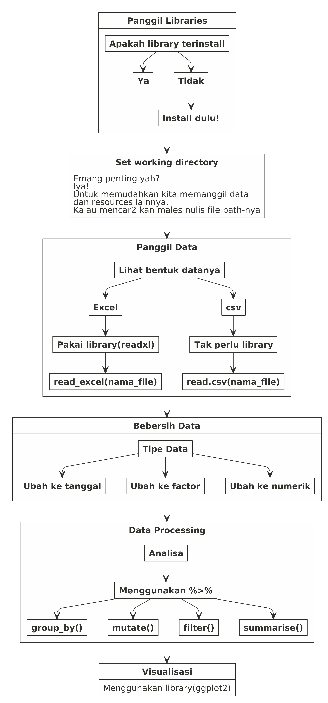

Materi Hari Pertama dan Kedua
================

# PENTING\!

Ada banyak cara dalam mengolah data di **R**. Teman-teman bisa
menggunakan prinsip `tidyverse`, `data.table`, dan lainnya. Kali ini
saya akan memodifikasi materi training `Sigit` dengan menggunakan `%>%`
sehingga memberikan gambaran bagaimana *pipe* **sangat amat powerful**
digunakan untuk memanipulasi *rows* dan *columns* dari suatu data.

# Langkah Pengerjaan

<!-- -->
