Materi Hari Pertama
================

# PENTING\!

Ada banyak cara dalam mengolah data di **R**. Teman-teman bisa
menggunakan prinsip `tidyverse`, `data.table`, dan lainnya. Kali ini
saya akan memodifikasi materi training `Sigit` dengan menggunakan `%>%`
sehingga memberikan gambaran bagaimana *pipe* **sangat amat powerful**
digunakan untuk memanipulasi *rows* dan *columns* dari suatu data.

# Memanggil *libraries*

``` r
options(scipen = 99) 

# membersihkan global environment
rm(list = ls())

# set working directory
# perhatikan bahwa working directory rekan-rekan akan berbeda dengan saya
# tolong disesuaikan terlebih dahulu
setwd("~/Documents/Training-R---Data-Viz/Data Viz")

# pastikan semua libraries dipanggil
# for data reshaping
library(dplyr)
library(tidyr)
# for working with dates
library(lubridate)
# for visualization
library(ggplot2)
library(plotly)
library(glue)
```

# Memanggil *Dataset*

Langkah pertama yang harus dilakukan adalah memanggil *dataset* dan
memastikan *dataset* tersebut sudah masuk ke dalam *Global Environment*.

Ingat kembali bahwa *file* dataset **sudah ada di WORKING DIRECTORY**.

**Ingat yah\!**

Banyak *trainees* yang sering *error* sejak awal ini soalnya.

``` r
# membaca file csv
vids = read.csv("USvideos.csv")

# melihat seluruh nama variabel dalam dataset vids
names(vids)
```

    ##  [1] "trending_date"          "title"                  "channel_title"         
    ##  [4] "category_id"            "publish_time"           "views"                 
    ##  [7] "likes"                  "dislikes"               "comment_count"         
    ## [10] "comments_disabled"      "ratings_disabled"       "video_error_or_removed"

### Tujuan kita hari ini adalah:

Mendapatkan *insights* menggunakan visualisasi `ggplot`:

1.  Does the video publishing time affect its popularity? If so, when is
    the best time to publish a video?
2.  Does user engagement relate to video’s popularity? If so, does it
    tend to has a positive or negative engagement?
3.  Who were the most prolific producers of trending videos in recent
    weeks?

We will use two plotting systems for our task:

  - Base plot for a quick and simple exploratory visualization
  - `ggplot2` for uncovering more complex pattern & for producing
    explanatory visualization

## Mengecek struktur data

Langkah berikutnya adalah mengecek struktur dari data. Hal ini wajib
dilakukan untuk mengetahui apakah variabel dalam data tersebut sudah
memiliki tipe yang tepat atau belum.

``` r
# melihat struktur data
str(vids)
```

    ## 'data.frame':    13400 obs. of  12 variables:
    ##  $ trending_date         : chr  "17.14.11" "17.14.11" "17.14.11" "17.14.11" ...
    ##  $ title                 : chr  "WE WANT TO TALK ABOUT OUR MARRIAGE" "The Trump Presidency: Last Week Tonight with John Oliver (HBO)" "Racist Superman | Rudy Mancuso, King Bach & Lele Pons" "Nickelback Lyrics: Real or Fake?" ...
    ##  $ channel_title         : chr  "CaseyNeistat" "LastWeekTonight" "Rudy Mancuso" "Good Mythical Morning" ...
    ##  $ category_id           : int  22 24 23 24 24 28 24 28 1 25 ...
    ##  $ publish_time          : chr  "2017-11-13T17:13:01.000Z" "2017-11-13T07:30:00.000Z" "2017-11-12T19:05:24.000Z" "2017-11-13T11:00:04.000Z" ...
    ##  $ views                 : int  748374 2418783 3191434 343168 2095731 119180 2103417 817732 826059 256426 ...
    ##  $ likes                 : int  57527 97185 146033 10172 132235 9763 15993 23663 3543 12654 ...
    ##  $ dislikes              : int  2966 6146 5339 666 1989 511 2445 778 119 1363 ...
    ##  $ comment_count         : int  15954 12703 8181 2146 17518 1434 1970 3432 340 2368 ...
    ##  $ comments_disabled     : logi  FALSE FALSE FALSE FALSE FALSE FALSE ...
    ##  $ ratings_disabled      : logi  FALSE FALSE FALSE FALSE FALSE FALSE ...
    ##  $ video_error_or_removed: logi  FALSE FALSE FALSE FALSE FALSE FALSE ...

Do the column `trending_date` & `publish_time` have stored in the
correct class?

-----

# Data Pre-Processing

## Working with date/time

### Date-Time Conversion

In order to answer our first question (*Does the video publishing time
affect its popularity?*), we need to explore our datetime data more.
Looking back to the structure of our dataset, there are two variables in
our dataset which related to datetime data; `trending_date` and
`publish_date`.

Previously we’ve learned base R method to convert our column to date
with `as.Date()` function, followed with your data time formatting (if
your date data wasn’t stored in ISO format;YYYY-MM-DD):

YEAR  
%Y = YYYY  
%y = YY

MONTH  
%B = month name e.g. March  
%b = month name(abbreviation) e.g. Mar  
%m = 2 digits mo e.g. 03  
%M = 1 digit mo e.g. 3

DAY  
%A = weekday e.g. Friday  
%d = weekday digit.

Let’s start with `trending_date`. Previously, we learnt to convert a
date variable with: `as.Date(vids$trending_date, "%y.%d.%m")`

But now, we’ll use an easier alternative to work with date-time data,
and that is through the use of `lubridate`. `lubridate` provides tools
that make it easier to parse and manipulate dates:

Ada `2` cara mengkonversi data tipe `character` menjadi bentuk waktu
(tanggal dan jam), yakni dengan:

1.  `base` **R** dengan *function* `as.Date()`
2.  `library(lubridate)`

<!-- end list -->

``` r
# Contoh:
a <- "08/03/19"
b <- "8-March-2019"
c <- "Thursday, 09-05-2019"
d <- "2019/05/09, 1:42PM"

# convert date using as.Date:
a <- as.Date(a, "%d/%m/%y")
a
```

    ## [1] "2019-03-08"

``` r
# convert date using lubridate:
b <- dmy(b)
c <- dmy(c)
d <- ymd_hm(d)

b
```

    ## [1] "2019-03-08"

``` r
c
```

    ## [1] "2019-05-09"

``` r
d
```

    ## [1] "2019-05-09 13:42:00 UTC"

[Time-zone
reference](https://en.wikipedia.org/wiki/List_of_tz_database_time_zones#List)

Sekarang kita akan melakukan konversi terhadap dua variabel yang ada,
yakni `trending_date` dan `publish_time` menggunakan fungsi dari
`library(lubridate)` dengan memanfaatkan prinsip *pipe* ( `%>%` )
sebagai berikut:

``` r
vids = 
  vids %>% 
  mutate(trending_date = ydm(trending_date), # convert trending date
         publish_time = ymd_hms(publish_time,tz = "America/New_York") # convert publish time
         )

# melihat hasil konversi
# 5 data pertama
head(vids)
```

    ##   trending_date                                                          title
    ## 1    2017-11-14                             WE WANT TO TALK ABOUT OUR MARRIAGE
    ## 2    2017-11-14 The Trump Presidency: Last Week Tonight with John Oliver (HBO)
    ## 3    2017-11-14          Racist Superman | Rudy Mancuso, King Bach & Lele Pons
    ## 4    2017-11-14                               Nickelback Lyrics: Real or Fake?
    ## 5    2017-11-14                                       I Dare You: GOING BALD!?
    ## 6    2017-11-14                                          2 Weeks with iPhone X
    ##           channel_title category_id        publish_time   views  likes dislikes
    ## 1          CaseyNeistat          22 2017-11-13 12:13:01  748374  57527     2966
    ## 2       LastWeekTonight          24 2017-11-13 02:30:00 2418783  97185     6146
    ## 3          Rudy Mancuso          23 2017-11-12 14:05:24 3191434 146033     5339
    ## 4 Good Mythical Morning          24 2017-11-13 06:00:04  343168  10172      666
    ## 5              nigahiga          24 2017-11-12 13:01:41 2095731 132235     1989
    ## 6              iJustine          28 2017-11-13 14:07:23  119180   9763      511
    ##   comment_count comments_disabled ratings_disabled video_error_or_removed
    ## 1         15954             FALSE            FALSE                  FALSE
    ## 2         12703             FALSE            FALSE                  FALSE
    ## 3          8181             FALSE            FALSE                  FALSE
    ## 4          2146             FALSE            FALSE                  FALSE
    ## 5         17518             FALSE            FALSE                  FALSE
    ## 6          1434             FALSE            FALSE                  FALSE

### Date-Time Extraction

Sekarang kita akan lanjutkan ekstraksi informasi tanggal dan waktu
dengan memanfaatkan prinsip *pipe* ( `%>%` ) sebagai berikut:

``` r
vids = 
  vids %>% 
  mutate(
    # get time components from trending date
    trending_dow = wday(trending_date,label = T,abbr = T, week_start = 1), # day of week
    trending_month = month(trending_date,label=T), # month
    
    # get time components from publish time
    publish_wday = wday(publish_time,label = T,abbr = F,week_start = 1),
    publish_hour = hour(publish_time)
        ) 

# melihat hasil konversi
# 5 data terakhir
tail(vids,5)
```

    ##       trending_date                                                    title
    ## 13396    2018-01-21      Mandisa - Bleed The Same ft. TobyMac, Kirk Franklin
    ## 13397    2018-01-21 I said Gucci Gang 1000000 Times. Here are the last 1000.
    ## 13398    2018-01-21                                The Top Dan Memes of 2017
    ## 13399    2018-01-21                Bannon Arrives to Testify on Capitol Hill
    ## 13400    2018-01-21                                Wallaby on Harbour Bridge
    ##              channel_title category_id        publish_time   views  likes
    ## 13396          MandisaVEVO          10 2018-01-15 00:00:01  234583   6129
    ## 13397 Graham The Christian          23 2018-01-14 01:22:22 2242992  64942
    ## 13398        Daniel Howell          22 2018-01-14 18:15:00 1885785 226887
    ## 13399     Associated Press          25 2018-01-16 10:16:11     835      9
    ## 13400   Business InsiderAu           2 2018-01-15 16:19:55   13458     38
    ##       dislikes comment_count comments_disabled ratings_disabled
    ## 13396      113           402             FALSE            FALSE
    ## 13397     7903         15515             FALSE            FALSE
    ## 13398      978         38888             FALSE            FALSE
    ## 13399        5             0              TRUE            FALSE
    ## 13400       14             0              TRUE            FALSE
    ##       video_error_or_removed trending_dow trending_month publish_wday
    ## 13396                  FALSE          Min            Jan        Senin
    ## 13397                  FALSE          Min            Jan       Minggu
    ## 13398                  FALSE          Min            Jan       Minggu
    ## 13399                  FALSE          Min            Jan       Selasa
    ## 13400                  FALSE          Min            Jan        Senin
    ##       publish_hour
    ## 13396            0
    ## 13397            1
    ## 13398           18
    ## 13399           10
    ## 13400           16

### Categorizing hour

Sekarang kita akan membuat kategori dari variabel `publish_hour`.
Pertama-tama, kita perhatikan ada data apa saja dari variabel tersebut:

``` r
sort(unique(vids$publish_hour))
```

    ##  [1]  0  1  2  3  4  5  6  7  8  9 10 11 12 13 14 15 16 17 18 19 20 21 22 23

Masih ingat terkait materi *function* ?

Kita sekarang akan membuat *function* yang bertujuan untuk
mengkategorikan `publish_hour` ke tiga kelompok:

1.  `12AM to 7AM`
2.  `8AM to 3PM`
3.  `4PM to 11PM`

<!-- end list -->

``` r
# membuat function untuk melakukan kategorisasi
pw = function(x){
    if(x < 8){
      x <- "12AM to 7AM"
    }else if(x >= 8 & x < 16){
      x <- "8AM to 3PM"
    }else{
      x <- "4PM to 11PM"
    }  
}
```

Setelah itu, kita akan aplikasikan *function* tersebut ke dataframe yang
ada dengan menggunakan:

`sapply(x, FUN)`

Arguments:

  - `x`: A vector or an object
  - `FUN`: Function applied to each element of x

<!-- end list -->

``` r
# apply function
vids$publish_when = as.factor(sapply(vids$publish_hour,pw))
# see unique data in column publish_when
unique(vids$publish_when)
```

    ## [1] 8AM to 3PM  12AM to 7AM 4PM to 11PM
    ## Levels: 12AM to 7AM 4PM to 11PM 8AM to 3PM

``` r
head(vids)
```

    ##   trending_date                                                          title
    ## 1    2017-11-14                             WE WANT TO TALK ABOUT OUR MARRIAGE
    ## 2    2017-11-14 The Trump Presidency: Last Week Tonight with John Oliver (HBO)
    ## 3    2017-11-14          Racist Superman | Rudy Mancuso, King Bach & Lele Pons
    ## 4    2017-11-14                               Nickelback Lyrics: Real or Fake?
    ## 5    2017-11-14                                       I Dare You: GOING BALD!?
    ## 6    2017-11-14                                          2 Weeks with iPhone X
    ##           channel_title category_id        publish_time   views  likes dislikes
    ## 1          CaseyNeistat          22 2017-11-13 12:13:01  748374  57527     2966
    ## 2       LastWeekTonight          24 2017-11-13 02:30:00 2418783  97185     6146
    ## 3          Rudy Mancuso          23 2017-11-12 14:05:24 3191434 146033     5339
    ## 4 Good Mythical Morning          24 2017-11-13 06:00:04  343168  10172      666
    ## 5              nigahiga          24 2017-11-12 13:01:41 2095731 132235     1989
    ## 6              iJustine          28 2017-11-13 14:07:23  119180   9763      511
    ##   comment_count comments_disabled ratings_disabled video_error_or_removed
    ## 1         15954             FALSE            FALSE                  FALSE
    ## 2         12703             FALSE            FALSE                  FALSE
    ## 3          8181             FALSE            FALSE                  FALSE
    ## 4          2146             FALSE            FALSE                  FALSE
    ## 5         17518             FALSE            FALSE                  FALSE
    ## 6          1434             FALSE            FALSE                  FALSE
    ##   trending_dow trending_month publish_wday publish_hour publish_when
    ## 1          Sel            Nov        Senin           12   8AM to 3PM
    ## 2          Sel            Nov        Senin            2  12AM to 7AM
    ## 3          Sel            Nov       Minggu           14   8AM to 3PM
    ## 4          Sel            Nov        Senin            6  12AM to 7AM
    ## 5          Sel            Nov       Minggu           13   8AM to 3PM
    ## 6          Sel            Nov        Senin           14   8AM to 3PM

Variabel `publish_when` memiliki tipe `factor` dan masih tidak
berurutan. Oleh karena itu, kita akan urutkan sesuai dengan waktu
sebagai berikut:

``` r
# mengurutkan kategory dengan level
vids$publish_when = ordered(vids$publish_when,
                            levels=c("12AM to 7AM",
                                     "8AM to 3PM",
                                     "4PM to 11PM"))
# see 5 first data of publish_when
head(vids$publish_when)
```

    ## [1] 8AM to 3PM  12AM to 7AM 8AM to 3PM  12AM to 7AM 8AM to 3PM  8AM to 3PM 
    ## Levels: 12AM to 7AM < 8AM to 3PM < 4PM to 11PM

## Working with category

``` r
# e.g. 1
#switch number to words
switch(1,
       "1" = "Low",
       "2" = "Medium",
       "3" = "High")
```

    ## [1] "Low"

``` r
# e.g. 2
data <- 1:3
# wrong answer
# will throw error:
# switch(data,
#        "1" = "Low",
#        "2" = "Medium",
#        "3" = "High")

#right answer
sapply(data,switch,
       "1" = "Low",
        "2" = "Medium",
        "3" = "High")
```

    ## [1] "Low"    "Medium" "High"

``` r
#replacing number codes with words
vids$category_id <- sapply(as.character(vids$category_id), switch, 
                           "1" = "Film and Animation",
                           "2" = "Autos and Vehicles", 
                           "10" = "Music", 
                           "15" = "Pets and Animals", 
                           "17" = "Sports",
                           "19" = "Travel and Events", 
                           "20" = "Gaming", 
                           "22" = "People and Blogs", 
                           "23" = "Comedy",
                           "24" = "Entertainment", 
                           "25" = "News and Politics",
                           "26" = "Howto and Style", 
                           "27" = "Education",
                           "28" = "Science and Technology", 
                           "29" = "Nonprofit and Activism",
                           "43" = "Shows")

vids$category_id <- as.factor(vids$category_id)

head(vids,5)
```

    ##   trending_date                                                          title
    ## 1    2017-11-14                             WE WANT TO TALK ABOUT OUR MARRIAGE
    ## 2    2017-11-14 The Trump Presidency: Last Week Tonight with John Oliver (HBO)
    ## 3    2017-11-14          Racist Superman | Rudy Mancuso, King Bach & Lele Pons
    ## 4    2017-11-14                               Nickelback Lyrics: Real or Fake?
    ## 5    2017-11-14                                       I Dare You: GOING BALD!?
    ##           channel_title      category_id        publish_time   views  likes
    ## 1          CaseyNeistat People and Blogs 2017-11-13 12:13:01  748374  57527
    ## 2       LastWeekTonight    Entertainment 2017-11-13 02:30:00 2418783  97185
    ## 3          Rudy Mancuso           Comedy 2017-11-12 14:05:24 3191434 146033
    ## 4 Good Mythical Morning    Entertainment 2017-11-13 06:00:04  343168  10172
    ## 5              nigahiga    Entertainment 2017-11-12 13:01:41 2095731 132235
    ##   dislikes comment_count comments_disabled ratings_disabled
    ## 1     2966         15954             FALSE            FALSE
    ## 2     6146         12703             FALSE            FALSE
    ## 3     5339          8181             FALSE            FALSE
    ## 4      666          2146             FALSE            FALSE
    ## 5     1989         17518             FALSE            FALSE
    ##   video_error_or_removed trending_dow trending_month publish_wday publish_hour
    ## 1                  FALSE          Sel            Nov        Senin           12
    ## 2                  FALSE          Sel            Nov        Senin            2
    ## 3                  FALSE          Sel            Nov       Minggu           14
    ## 4                  FALSE          Sel            Nov        Senin            6
    ## 5                  FALSE          Sel            Nov       Minggu           13
    ##   publish_when
    ## 1   8AM to 3PM
    ## 2  12AM to 7AM
    ## 3   8AM to 3PM
    ## 4  12AM to 7AM
    ## 5   8AM to 3PM

## Select unique videos

Perhatikan data sebagai berikut:

``` r
# see total of title
length(vids$title)
```

    ## [1] 13400

``` r
# see total of title without any duplicates
length(unique(vids$title))
```

    ## [1] 2986

Kalau kita perhatikan bersama, ada beberapa `title` yang berulang muncul
pada dataset `vids`. Pembedanya adalah `trending_date`. Oleh karena itu,
kita hanya akan mengambil data dari masing-masing `title` dari
`trending_date` terbaru.

``` r
# eliminate all duplicates of title in vids data
vids.u =
  vids %>% 
  group_by(title) %>% 
  filter(trending_date == max(trending_date)) %>% 
  ungroup()

head(vids.u)
```

    ## # A tibble: 6 x 17
    ##   trending_date title channel_title category_id publish_time         views likes
    ##   <date>        <chr> <chr>         <fct>       <dttm>               <int> <int>
    ## 1 2017-11-14    Dion… NFL           Sports      2017-11-12 21:05:26 8.14e4   655
    ## 2 2017-11-14    TL;D… Screen Junki… Film and A… 2017-11-12 13:00:03 2.89e5  7515
    ## 3 2017-11-14    Iraq… BBC News      News and P… 2017-11-12 16:16:40 3.48e4   308
    ## 4 2017-11-14    AFFA… Shawn Johnso… People and… 2017-11-11 10:00:03 3.21e5  4451
    ## 5 2017-11-14    Peop… People are A… Entertainm… 2017-11-13 08:00:06 6.98e4  3417
    ## 6 2017-11-14    Jaso… The Graham N… Entertainm… 2017-11-10 14:06:23 1.50e6 16116
    ## # … with 10 more variables: dislikes <int>, comment_count <int>,
    ## #   comments_disabled <lgl>, ratings_disabled <lgl>,
    ## #   video_error_or_removed <lgl>, trending_dow <ord>, trending_month <ord>,
    ## #   publish_wday <ord>, publish_hour <int>, publish_when <ord>

## How Popular is Your Video?

Mari kita buat analisa mengenai seberapa populer video tersebut di
Youtube\! Setidaknya, kita akan menghitung `3` **parameter** baru,
yakni:

1.  `likesratio`: seberapa banyak orang yang *hit* `likes` dari total
    `views`.
2.  `dislikesratio`: seberapa banyak orang yang *hit* `dislikes` dari
    total `views`.
3.  `commentratio`: seberapa banyak orang yang menulis `comment` dari
    total `views`.

<!-- end list -->

``` r
vids.u = 
  vids.u %>% 
  mutate(
    likesratio = likes/views * 100,
    dislikeratio = dislikes/views * 100,
    commentratio = comment_count/views * 100
  )

head(vids.u,5)
```

    ## # A tibble: 5 x 20
    ##   trending_date title channel_title category_id publish_time         views likes
    ##   <date>        <chr> <chr>         <fct>       <dttm>               <int> <int>
    ## 1 2017-11-14    Dion… NFL           Sports      2017-11-12 21:05:26  81377   655
    ## 2 2017-11-14    TL;D… Screen Junki… Film and A… 2017-11-12 13:00:03 288922  7515
    ## 3 2017-11-14    Iraq… BBC News      News and P… 2017-11-12 16:16:40  34785   308
    ## 4 2017-11-14    AFFA… Shawn Johnso… People and… 2017-11-11 10:00:03 321053  4451
    ## 5 2017-11-14    Peop… People are A… Entertainm… 2017-11-13 08:00:06  69844  3417
    ## # … with 13 more variables: dislikes <int>, comment_count <int>,
    ## #   comments_disabled <lgl>, ratings_disabled <lgl>,
    ## #   video_error_or_removed <lgl>, trending_dow <ord>, trending_month <ord>,
    ## #   publish_wday <ord>, publish_hour <int>, publish_when <ord>,
    ## #   likesratio <dbl>, dislikeratio <dbl>, commentratio <dbl>

## How High is the Engagement?

Misalkan kita hendak melakukan analisa terhadap kategori video:

1.  “Autos and Vehicles”,
2.  “Gaming”,
3.  “Travel and Events”

Mari kita *subset* datanya dengan prinsip *pipe* (`%>%`) sebagai
berikut:

``` r
# kita buat dulu target campaign yang akan menjadi filter
campaign = c("Autos and Vehicles", "Gaming","Travel and Events")

# extract data only in 'campaign' group
vids.camp = 
  vids.u %>% 
  filter(category_id %in% campaign)

head(vids.camp,5)
```

    ## # A tibble: 5 x 20
    ##   trending_date title channel_title category_id publish_time         views likes
    ##   <date>        <chr> <chr>         <fct>       <dttm>               <int> <int>
    ## 1 2017-11-14    Cate… Caterham Cars Autos and … 2017-11-09 04:59:31 4.85e3    22
    ## 2 2017-11-14    Insi… WIRED         Autos and … 2017-11-08 10:00:27 7.04e5 16352
    ## 3 2017-11-15    L.A.… Nintendo      Gaming      2017-11-09 14:59:48 1.61e5  7803
    ## 4 2017-11-16    'Lig… Valk Aviation Travel and… 2017-11-13 04:21:27 1.04e6   716
    ## 5 2017-11-16    Trai… ViralHog      Autos and … 2017-11-12 19:46:11 1.00e5   154
    ## # … with 13 more variables: dislikes <int>, comment_count <int>,
    ## #   comments_disabled <lgl>, ratings_disabled <lgl>,
    ## #   video_error_or_removed <lgl>, trending_dow <ord>, trending_month <ord>,
    ## #   publish_wday <ord>, publish_hour <int>, publish_when <ord>,
    ## #   likesratio <dbl>, dislikeratio <dbl>, commentratio <dbl>

``` r
# Pertanyaan tambahan
# sorting berdasarkan rules tertentu
# urutannya: Gaming, Travel, Auto
vids_new = 
  vids.camp %>% 
  mutate(category_id = factor(category_id,
                              levels = c('Gaming',
                                         'Travel and Events',
                                         'Autos and Vehicles'))
         ) %>% 
  arrange(category_id)
```

-----

# Membuat Grafik Menggunakan `base` **R**

Sebelum kita membahas mengenai `library(ggplot2)`, sebenarnya **R**
memiliki `base` untuk membuat grafik yang sederhana dan mudah.

Jenis plot yang dihasilkan juga berubah sesuai tipe data yang
dimasukkan, jika:  
\* 1 variabel, x kategori: **bar chart**  
\* 1 variabel, x numerik: **scatter plot**  
\* 2 variabel, x dan y adalah numerik: **scatter plot**  
\* 2 variabel, x kategori, y numerik: **boxplot**

## Contoh grafik *Scatterplot*

*Scatterplot* digunakan untuk membandingkan/melihat hubungan dua
variabel numerik. Kemudian biasanya analisa lanjutan yang sering
digunakan adalah korelasi.

*Scatterplot* dari `base`:

``` r
plot(vids.camp$comment_count,
     vids.camp$views,
     col = vids.camp$category_id,
     pch = 12)
```

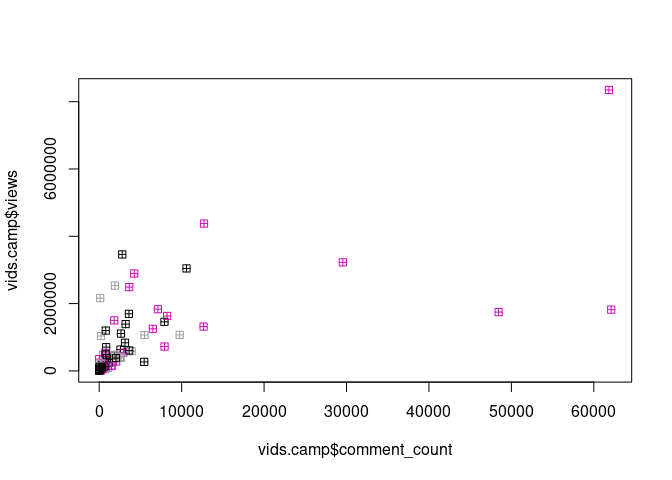<!-- -->

### QUIZ:

Apa fungsi dari `col =` dan `pch =`?

## Fitur Lain pada *Scatterplot* Memanfaatkan `base`

Kita bisa menambahkan *trendline*, dengan membuat rumus regresi dari:
\(views = a*comment + C\)

``` r
plot(vids.camp$comment_count,
     vids.camp$views,
     col = vids.camp$category_id,
     pch = 2)
abline(lm(vids.camp$views ~ vids.camp$comment_count))
legend("topright",legend=levels(vids.camp$category_id),fill=1:6)
```

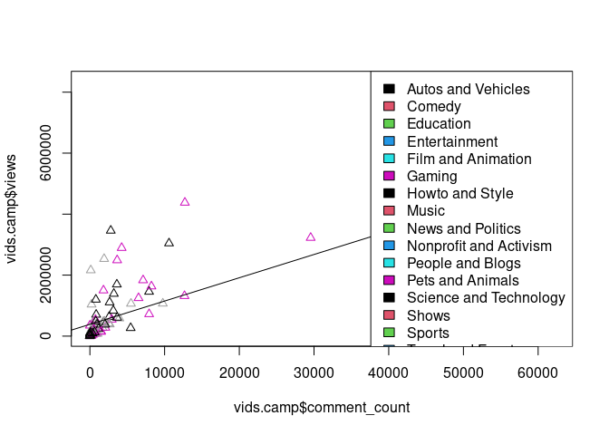<!-- -->

  - Semakin tinggi jumlah `views` pada sebuah video, semakin tinggi juga
    jumlah `comment_count` pada video tersebut
  - Kategori “Gaming” memiliki `views` dan `comment_count` tertinggi  
  - Dari kategori Gaming, ada beberapa video dangan `views` yang tinggi
    namun `comment_count` yang sedikit, dan sebaliknya

-----

# `library(ggplot2)`

## Simple Exploratory

### Pre-Campaign Analysis

Problem statements: 1. Amongst Automotive, Gaming & Travel, which
category shows highest likeability (likesperviews)? 2. Does the publish
time affect likeability?

Untuk menjawab ini mari kita buat grafik berbentuk *boxplot* dengan
bantuan `library(ggplot2)`

Bagaimana cara kerja `ggplot`?

1.  Buat kanvas.
2.  Masukkan jenis plot yang diinginkan. Berikan fitur (*aesthetic*)
    untuk masing-masing plot.
3.  Tambah fitur pada plot seperti *title*, *subtitle*, *label*,
    *caption*, dll
4.  Berikan tema (jika mau).

<!-- end list -->

``` r
# 1. create the base canvas
vids.camp %>% 
  ggplot(aes(x = publish_when,
             y = likesratio))
```

<!-- -->

``` r
# 2. add the geom element / jenis plot
vids.camp %>% 
  ggplot(aes(x = publish_when,
             y = likesratio)) +
  geom_boxplot()
```

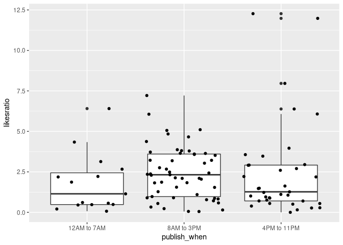<!-- -->

``` r
# add another geom element
vids.camp %>% 
  ggplot(aes(x = publish_when,
             y = likesratio)) +
  geom_boxplot() +
  geom_jitter()
```

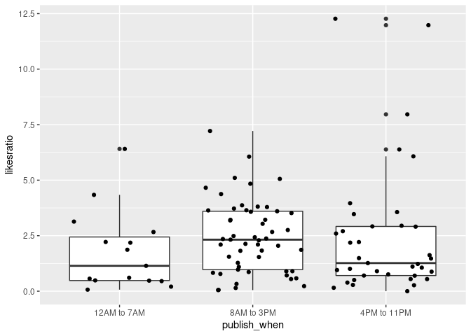<!-- -->

``` r
# add more visual cues
vids.camp %>% 
  ggplot(aes(x = publish_when,
             y = likesratio)) +
  geom_boxplot(color = 'magenta',size = .75,fill = 'cyan')+
  geom_jitter(aes(color=category_id,size=comment_count),alpha=0.75)+
  labs(title = "Pre-Campaign Analysis: Automotive, Gaming & Travel",
       subtitle = "Gaming shows higher user engagement",
       x = "Publish Time",
       y = "Likes per Views Ratio",
       size = "Comment Count",
       color = "Category",
       caption = "Training Data Viz @nutrifood")
```

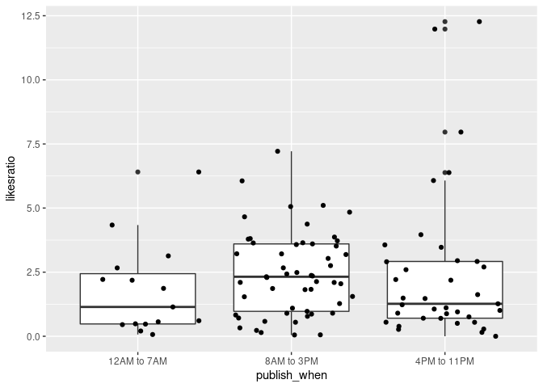<!-- -->

## Visualizing comparison with barchart

### Who were the most prolific producers of trending videos in recent weeks?

Tujuan kita adalah:

Take only the channels that have at least 10 videos being trending\!

Kita akan mengambil base data frame dari `vids.u` yang tidak ada
*duplicate*.

``` r
# take only the channels that have at least 10 videos being trending
top = 
  vids.u %>% 
  group_by(channel_title) %>% 
  summarise(Freq = n()) %>% 
  ungroup() %>% 
  filter(Freq >= 10) %>% 
  arrange(desc(Freq)) %>% 
  rename(Channel = channel_title)

top 
```

    ## # A tibble: 38 x 2
    ##    Channel                                 Freq
    ##    <chr>                                  <int>
    ##  1 Refinery29                                31
    ##  2 The Tonight Show Starring Jimmy Fallon    30
    ##  3 Vox                                       29
    ##  4 TheEllenShow                              28
    ##  5 Netflix                                   27
    ##  6 NFL                                       25
    ##  7 ESPN                                      24
    ##  8 Jimmy Kimmel Live                         24
    ##  9 The Late Show with Stephen Colbert        22
    ## 10 Late Night with Seth Meyers               21
    ## # … with 28 more rows

Let’s turn the table to a barchart visualization:

``` r
top %>% 
  ggplot(aes(x = Channel,
             y = Freq)) +
  geom_col()
```

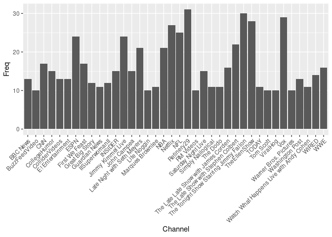<!-- -->

Notice that the axis labels were too “tight”. There are two approaches
on handling this problem:

``` r
# first approach: rotate the axis
top %>% 
  ggplot(aes(x = Channel,
             y = Freq)) +
  geom_col()+
  theme(axis.text.x = element_text(angle = 45,hjust=1))
```

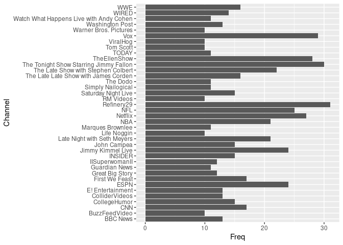<!-- -->

``` r
# second approach: flip the coordinate with `coord_flip`
top %>% 
  ggplot(aes(x = Channel,
             y = Freq)) +
  geom_col() +
  coord_flip()
```

<!-- -->

Make your barchart more efficient by ordering the bars based on the
value you want to show:

``` r
# rerun the code above
top %>% 
  ggplot(aes(x = reorder(Channel,Freq), # kalau mau kebalikannya, bisa tambah - di depan Freq
             y = Freq)) +
  geom_col() +
  coord_flip()
```

<!-- -->

#### Colors in ggplot

  - Use `fill` or `color` argument inside the `geom_*`:
      - `fill`: fill changes the colour within shapes  
      - `color`: colour changes the outline

<!-- end list -->

``` r
# add general color 
top %>% 
  ggplot(aes(x = reorder(Channel,Freq),
             y = Freq)) +
  geom_col(fill="blue") +
  coord_flip()
```

<!-- -->

``` r
# use aes to give visual aesthetic by variable in data
top %>% 
  ggplot(aes(x = reorder(Channel,Freq),
             y = Freq)) +
  geom_col(aes(fill = Freq))+
  coord_flip()
```

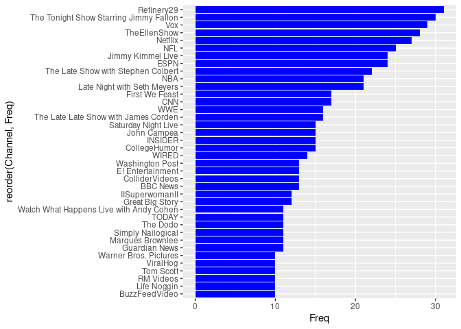<!-- -->

``` r
# adjust color with `scale_fill_*`/`scale_color_*`
top %>% 
  ggplot(aes(x = reorder(Channel,Freq),
             y = Freq)) +
  geom_col(aes(fill = Freq))+
  coord_flip()+
  scale_fill_gradient(low="lightblue",high="darkred") +
  theme(axis.text.y = element_text(size = 8,face='bold.italic'),
        axis.text.x = element_text(size = 15,face='bold.italic')) # digunakan utk ganti2
```

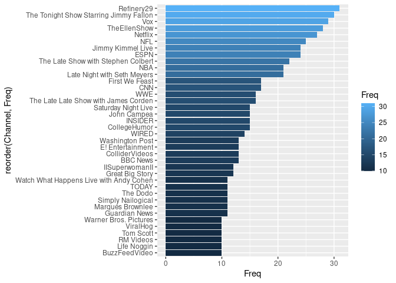<!-- -->

### Multivariate Barchart

#### How positive is the engagement?

#### Data transformation

Tujuan: kita akan membuat data baru berisi top channel lalu kita akan
hitung 3 parameter utama: likes, dislikes, comment.

``` r
# subset `vids.u` based on channel in `top`
target_channel = top$Channel

# filtering
vids.top = 
  vids.u %>% 
  filter(channel_title %in% target_channel)

head(vids.top)
```

    ## # A tibble: 6 x 20
    ##   trending_date title channel_title category_id publish_time         views likes
    ##   <date>        <chr> <chr>         <fct>       <dttm>               <int> <int>
    ## 1 2017-11-14    "Dio… NFL           Sports      2017-11-12 21:05:26 8.14e4   655
    ## 2 2017-11-14    "Ira… BBC News      News and P… 2017-11-12 16:16:40 3.48e4   308
    ## 3 2017-11-14    "Jas… The Late Lat… Entertainm… 2017-11-10 04:35:00 1.50e6 15504
    ## 4 2017-11-14    "Mar… Late Night w… Comedy      2017-11-10 06:00:04 2.25e5  1731
    ## 5 2017-11-14    "Owe… TheEllenShow  Entertainm… 2017-11-10 09:00:10 3.05e5  3305
    ## 6 2017-11-14    "Mea… Jimmy Kimmel… Comedy      2017-11-08 23:58:04 1.32e6  9312
    ## # … with 13 more variables: dislikes <int>, comment_count <int>,
    ## #   comments_disabled <lgl>, ratings_disabled <lgl>,
    ## #   video_error_or_removed <lgl>, trending_dow <ord>, trending_month <ord>,
    ## #   publish_wday <ord>, publish_hour <int>, publish_when <ord>,
    ## #   likesratio <dbl>, dislikeratio <dbl>, commentratio <dbl>

##### Data Aggregation

Kita buat data agregat dulu untuk ini:

``` r
# aggregate data
vids.top.agg = 
  vids.top %>% 
  group_by(channel_title) %>% 
  summarise(likesratio = mean(likesratio),
            dislikeratio = mean(dislikeratio)) %>% 
  ungroup()

head(vids.top.agg)
```

    ## # A tibble: 6 x 3
    ##   channel_title    likesratio dislikeratio
    ##   <chr>                 <dbl>        <dbl>
    ## 1 BBC News              0.792       0.233 
    ## 2 BuzzFeedVideo         2.91        0.217 
    ## 3 CNN                   1.04        0.579 
    ## 4 CollegeHumor          3.55        0.166 
    ## 5 ColliderVideos        3.53        0.253 
    ## 6 E! Entertainment      0.691       0.0922

#### Data Reshaping

Simpel pakai `library(reshape2)` untuk mengubah data wide ke bentuk
tabular

``` r
library(reshape2)

vids.long =
  vids.top.agg %>% 
  melt(id.vars = 'channel_title') %>% 
  rename(name = variable)

head(vids.long)
```

    ##      channel_title       name     value
    ## 1         BBC News likesratio 0.7922651
    ## 2    BuzzFeedVideo likesratio 2.9079947
    ## 3              CNN likesratio 1.0442537
    ## 4     CollegeHumor likesratio 3.5509637
    ## 5   ColliderVideos likesratio 3.5337230
    ## 6 E! Entertainment likesratio 0.6908298

#### Visualization: Positions in `geom_col`

Biasanya ada dua cara utk membuat barchart di `ggplot2`:

  - `geom_bar`
  - `geom_col`

<!-- end list -->

1.  Stacked bars (default position):  

<!-- end list -->

  - subgroups are just displayed on top of each other, not beside  
  - the x axis is the **total** of two groups (less interpretable)

<!-- end list -->

``` r
# default position: `position="stack"`
vids.long %>% 
  ggplot(aes(x = channel_title,
             y = value)) +
  geom_col(aes(fill = name),position = 'stack')
```

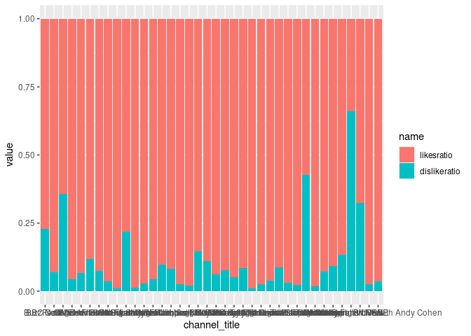<!-- -->

2.  Percent stacked barchart (`position="fill"`):  

<!-- end list -->

  - percentage of each subgroup is represented, allowing to study the
    evolution of their proportion in the whole  
  - the x axis is the range of 0-100%

Tujuan: membuat bar chart 100% stacked bar

``` r
# `position=`fill` to `
vids.long %>% 
  ggplot(aes(x = channel_title,
             y = value)) +
  geom_col(aes(fill = name),position = 'fill')
```

<!-- -->

3.  Grouped barchart (`position="dodge"`):  

<!-- end list -->

  - display a numeric value for a set of entities split in groups and
    subgroups  
  - the x axis shows the actual value of each group

<!-- end list -->

``` r
# `position=`fill` to `
vids.long %>% 
  ggplot(aes(x = channel_title,
             y = value)) +
  geom_col(aes(fill = name),position = 'dodge') +
  labs(title = 'Top Channel',
       fill = 'Jenis Parameter') +
  coord_flip()
```

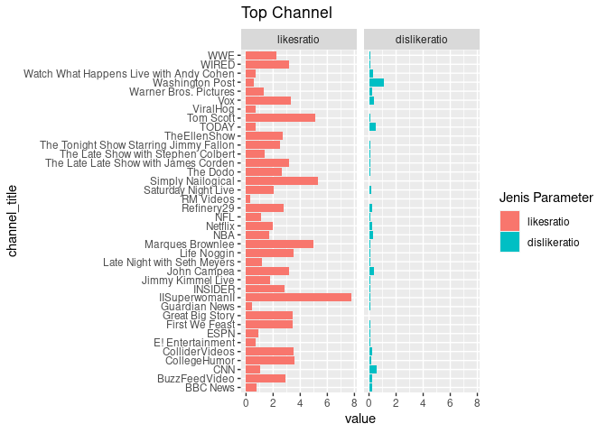<!-- -->

-----

## `ggplot2` features: facet & label

### Facets: split a plot into a matrix of panels

Say, we want to split our previous grouped barcharts into multiple
panels, based on each `ratios`:

``` r
## same code as above + `facet_wrap()`
vids.long %>% 
  ggplot(aes(x = channel_title,
             y = value)) +
  geom_col(aes(fill = name)) +
  labs(title = 'Top Channel',
       fill = 'Jenis Parameter') +
  coord_flip() +
  facet_wrap(~name)
```

<!-- -->

#### Adjust the scales in facet with `scales = "free_*"`

``` r
# `scales = "free"` gives each facet individual axis
vids.long %>% 
  ggplot(aes(x = channel_title,
             y = value)) +
  geom_col(aes(fill = name)) +
  labs(title = 'Top Channel',
       fill = 'Jenis Parameter') +
  coord_flip() +
  facet_wrap(~name,scales = 'free')
```

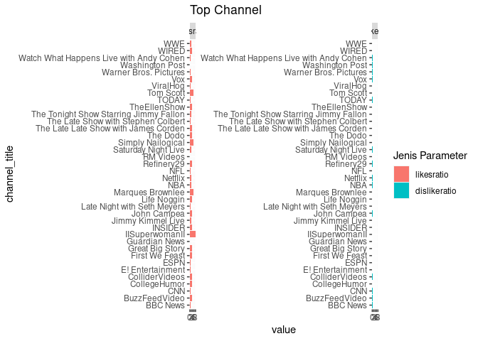<!-- -->

``` r
# `scales = "free_y"` gives each facet individual y axis
vids.long %>% 
  ggplot(aes(x = channel_title,
             y = value)) +
  geom_col(aes(fill = name)) +
  labs(title = 'Top Channel',
       fill = 'Jenis Parameter') +
  coord_flip() +
  facet_wrap(~name,scales = 'free_y')
```

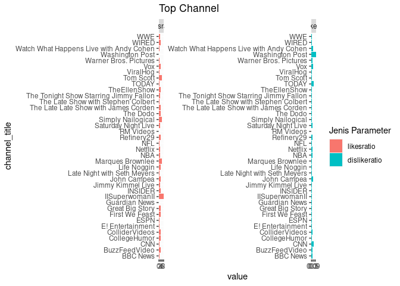<!-- -->

``` r
# `scales = "free_x"` gives each facet individual x axis
vids.long %>% 
  ggplot(aes(x = channel_title,
             y = value)) +
  geom_col(aes(fill = name)) +
  labs(title = 'Top Channel',
       fill = 'Jenis Parameter') +
  coord_flip() +
  facet_wrap(~name,scales = 'free_x')
```

<!-- -->

### Add text/labels on your chart with `geom_text()`:

Sekarang kita akan masukkan label ke dalam chart menggunakan prinsip
`%>%`, sebagai berikut:

``` r
# prepare text for label in `geom_text()`
# add geom text
vids.long %>% 
  mutate(label_new = round(value*100,1), # satu angka di belakang koma
         label_new = paste0(label_new,"%")) %>%  # ini kita buat agar ada tulisan persennya 
  ggplot(aes(x = channel_title, y= value))+
  geom_col(aes(fill = name), position = "dodge")+
  geom_text(aes(label = label_new))+ # add geom_text to plot
  coord_flip()+
  labs(title = "Likeability Analysis on Popular Channels",
       x = NULL,
       y = NULL,
       fill = "Ratios in (%):")+
  facet_wrap(~name, scales = "free_x")
```

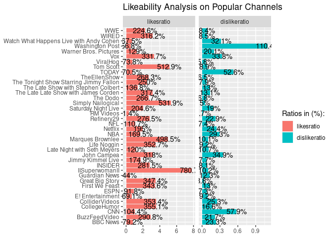<!-- -->

#### Enhancing the aesthetic of `geom_text`

Tulisan textnya berantakan yah gaes… kita rapihkan dengan beberapa
*custom setting* sbb:

  - `hjust` (horizontal justification)/ `vjust` (vertical
    justification): adjust the text position
  - `size`: adjust the text size

<!-- end list -->

``` r
vids.long %>% 
  mutate(label_new = round(value*100,1), # satu angka di belakang koma
         label_new = paste0(label_new,"%")) %>%  # ini kita buat agar ada tulisan persennya 
  ggplot(aes(x = channel_title, y= value))+
  geom_col(aes(fill = name), position = "dodge")+
  geom_text(aes(label = label_new), hjust = 1, size = 2.1)+ # add geom_text to plot
  coord_flip()+
  labs(title = "Likeability Analysis on Popular Channels",
       x = NULL,
       y = NULL,
       fill = "Ratios in (%):")+
  facet_wrap(~name, scales = "free_x")
```

<!-- -->

## Visualizing trend with line chart

Sekarang kita akan melakukan *dive deeper* dengan menganalisa
*Pre-Campaign Analysis* pada kategori:

  - Entertainment,
  - Music
  - Gaming

Kita akan lakukan *pre-processing* dengan `dplyr` sebagai berikut:

``` r
vids.camp2 =
  vids %>% 
  filter(category_id %in% c("Entertainment", "Music", "Gaming")) %>% 
  group_by(trending_date,category_id) %>% 
  summarise(n = n()) %>% 
  ungroup()

head(vids.camp2)
```

    ## # A tibble: 6 x 3
    ##   trending_date category_id       n
    ##   <date>        <fct>         <int>
    ## 1 2017-11-14    Entertainment    45
    ## 2 2017-11-14    Gaming            1
    ## 3 2017-11-14    Music            45
    ## 4 2017-11-15    Entertainment    45
    ## 5 2017-11-15    Gaming            1
    ## 6 2017-11-15    Music            37

**Customize the x axis (date)**:
<https://ggplot2.tidyverse.org/reference/scale_date.html>

``` r
vids.camp2 %>% 
  ggplot(aes(x = trending_date , y = n))+
  geom_line(aes(color = category_id))+
  geom_point(aes(color = category_id))
```

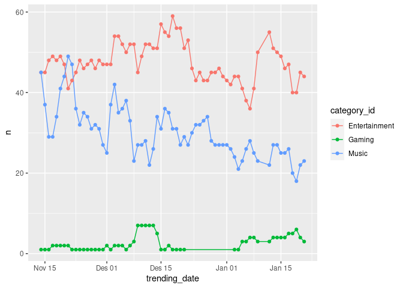<!-- -->

  - Double axis in `ggplot2`: <https://rpubs.com/MarkusLoew/226759>
  - Why not to use two axes, and what to use instead:
    <https://blog.datawrapper.de/dualaxis/>

<!-- end list -->

``` r
vids.camp2 %>% 
  ggplot(aes(x = trending_date , y = n)) +
  geom_line(aes(color = category_id)) +
  geom_point(aes(color = category_id)) +
  scale_x_date(date_breaks = "1 week", date_labels = "%m-%d")
```

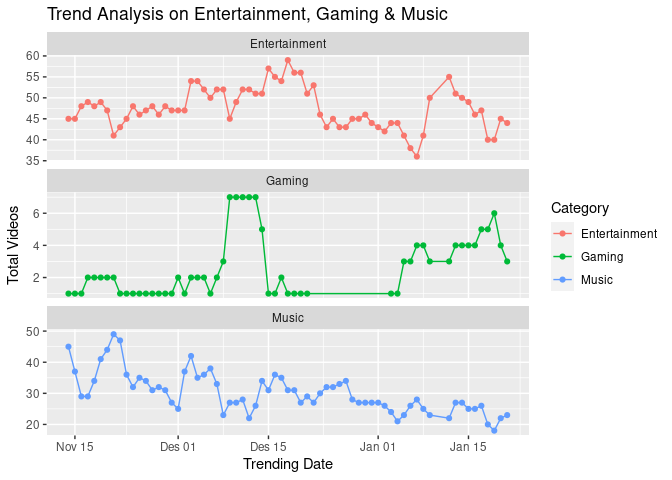<!-- -->

``` r
vids.camp2 %>% 
  ggplot(aes(x = trending_date , y = n, group = category_id))+
  geom_line(aes(color = category_id))+
  geom_point(aes(color = category_id))+
  facet_wrap(~category_id, scales = "free_y", ncol = 1)+
  labs(title = "Trend Analysis on Entertainment, Gaming & Music",
       x = "Trending Date",
       y = "Total Videos",
       color = "Category")
```

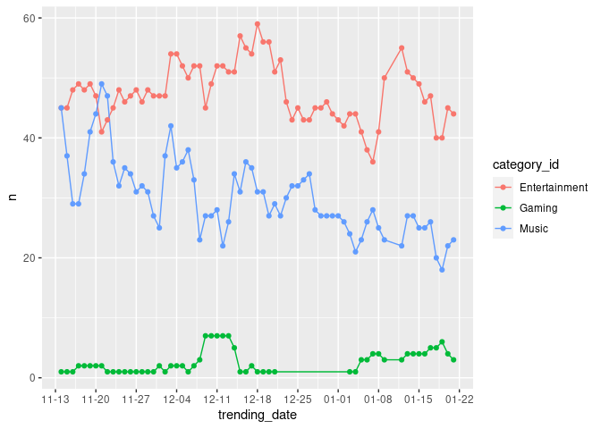<!-- -->

### Group in Line chart

  - Visualizing day of week trend

<!-- end list -->

``` r
vids.camp2 = 
  vids.camp2 %>% 
  mutate(trending_dow = wday(trending_date, label = T))

day.agg = 
  vids.camp2 %>% 
  group_by(trending_dow,category_id) %>% 
  summarise(n = mean(n)) %>% 
  ungroup() %>% 
  arrange(category_id,trending_dow)

day.agg
```

    ## # A tibble: 21 x 3
    ##    trending_dow category_id       n
    ##    <ord>        <fct>         <dbl>
    ##  1 Min          Entertainment 47   
    ##  2 Sen          Entertainment 48.7 
    ##  3 Sel          Entertainment 47.3 
    ##  4 Rab          Entertainment 47.4 
    ##  5 Kam          Entertainment 47   
    ##  6 Jum          Entertainment 48.7 
    ##  7 Sab          Entertainment 46.7 
    ##  8 Min          Gaming         3.12
    ##  9 Sen          Gaming         3   
    ## 10 Sel          Gaming         2.62
    ## # … with 11 more rows

``` r
ggplot(day.agg, aes(trending_dow, n)) +
  geom_line(aes(color = category_id))
```

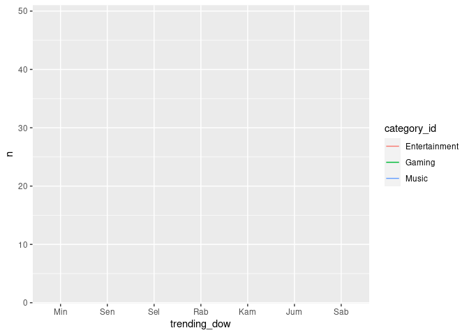<!-- -->

``` r
ggplot(day.agg, aes(trending_dow, n)) +
  geom_line(aes(color = category_id, group = category_id))
```

<!-- -->
