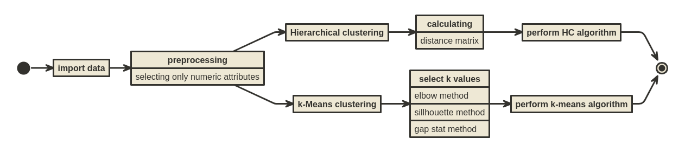

```{r, include=FALSE}
setwd("/home/ikanx101/Live-Session-Nutrifood-R/LEFO Market Research/Clustering")

# membersihkan global environment
rm(list=ls())
# load semua libraries yang dibutuhkan
library(dplyr)
library(cluster)
library(factoextra)
library(ggplot2)
library(readxl)

sht = excel_sheets("data josh.xlsx")
```

# _Introduction_

Kita akan coba lakukan _clustering_ dengan beberapa metode yah, seperti:

1. _Hierarchical clustering_,
1. _K-Means clustering_, dan
1. _DB Scan clustering_.

# _Workflow_

```{r,fig.cap="Langkah Kerja"}

```

# Data yang Digunakan

Berikut adalah _sample_ 10 data yang akan telah terkumpul:

```{r}
df = read_excel("data josh.xlsx",sheet = sht[6],skip = 2) %>% 
     janitor::clean_names()

head(df,10) %>% DT::datatable()

# kita hanya akan pilih data numerik saja
df_final = df %>% select(where(is.numeric))
```

Sedangkan berikut adalah data numerik yang akan dimasukkan ke analisa _clustering_:

```{r}
head(df_final,10) %>% DT::datatable()
```

```{r}
summary(df_final)
```

# _k-Means Clustering_

Pertama-tama saya akan melakukan k-means clustering, langkah awal yang harus dilakukan adalah mencari nilai $k$ yang tepat.

Saya akan gunakan tiga metode yang bisa digunakan untuk mencarinya, yakni:

1. _Elbow method_,
1. _Sillhouette method_, dan
1. _Gap Stat method_.

## _Elbow method_

```{r}
# elbow method dan plotnya
elbow = fviz_nbclust(df_final, kmeans, method = "wss")
plot(elbow)
```

Dari _plot_ di atas, kita dapatkan nilai $k=3$ memberikan hasil _cluster_ yang optimal.

## _Sillhouette Method_

```{r}
# sillhouette method dan plotnya
siluet = fviz_nbclust(df_final, kmeans, method = "silhouette")
plot(siluet)
```

Dari _plot_ di atas didapatkan bahwa $k = 2$.

## _Gap Stat Method_

```{r}
# gap stat method dan plotnya
gap_stat = clusGap(df_final, FUN = kmeans, nstart = 10,K.max = 10, B = 10)
gap = fviz_gap_stat(gap_stat)
plot(gap)
```