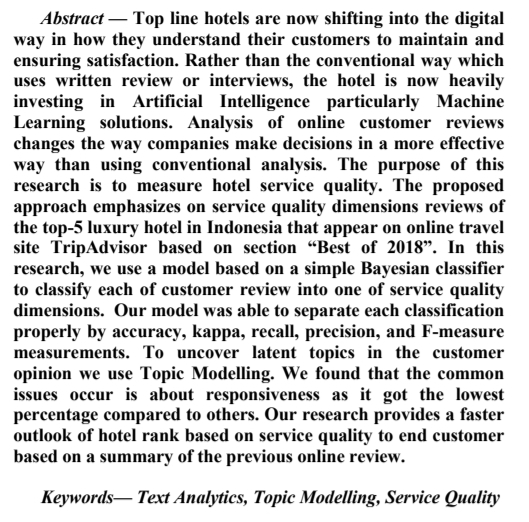
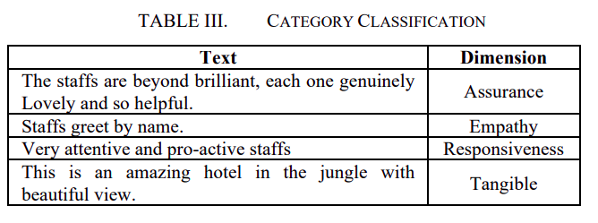
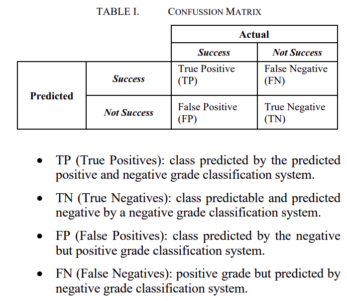

---
title       : Hotel Preference Rank based on Online Customer Review
subtitle    : Learning Forum
author      : Ikang Fadhli
job         : Market Research Nutrifood
framework   : io2012        # {io2012, html5slides, shower, dzslides, ...}
highlighter : highlight.js  # {highlight.js, prettify, highlight}
hitheme     : tomorrow      # 
widgets     : [mathjax, quiz, bootstrap] # {mathjax, quiz, bootstrap}
mode        : selfcontained # {standalone, draft}
knit        : slidify::knit2slides
logo        : nf big.png
biglogo     : nf big.png
assets      : {assets: ../../assets}
--- 

## _Journal Title_

- Andry Alamsyah: Presiden AIDI (Asosiasi Ilmuwan Data Indonesia).
- Apriandito: Sekjen AIDI dan Admin Komunitas R Indonesia.

--- .class #id

## _Abstract_

--- .class #id

## Latar Belakang

_User-Generated-Content_ (UGC) adalah konten atau data yang dibuat oleh konsumen secara mandiri di internet. Bentuk UGC biasanya berupa _customer feedback_ seperti _reviews_ dan _ratings_. 

_Customer feedback_ adalah sumber informasi esensial yang bisa digunakan untuk meng-_improve_ layanan dari industri jasa.

> Top line hotels are now shifting into the digital way in how they understand their customers to maintain and ensuring the satisfaction. Rather than the conventional way which uses written review or interviews, the hotel is now heavily investing in Artificial Intelligence particularly Machine Learning solutions.

--- .class #id

## Metode Penelitian

### Data dan Analisa

> The proposed approach emphasizes on SERVQUAL reviews of top-5 luxury hotels in Indonesia that appear on an online travel site called www.tripadvisor.com. The top-5 luxury hotel in Indonesia is based on section “Best of 2018” in TripAdvisor website.

Mereka mengumpulkan `7.259` _reviews_ untuk kemudian dilakukan _text analysis_ seperti:

1. _Naive Bayes Classifier_ untuk melalukan _text classification_.
1. _LDA Topic Modelling_.

--- .class #id

## Metode Penelitian

### _Pre Processing_

Sebelum melakukan _text analysis_, perlu dilakukan tiga hal berikut ini:

1. _Tokenization_; _Tokenize serves to remove all non-letter characters and to divide a text into small, meaningful elements such as sentences and words_.
1. _Stemming_; _Stem is a process to convert the word to its original word_.
1. _Filtering_; _Filter stop words serves to eliminate unnecessary words in sentence_.

--- .class #id

## _Text Classification_

Dikumpulkan data perhotel, lalu dibagi menjadi _train dataset_ dan _test dataset_ dengan aturan `70-30`. Kemudian dibuat model untuk mengklasifikasi lima dimensi.

--- .class #id

## _Goodness of Fit Model_

Seberapa bagus model _text classification_ dihitung dari beberapa parameter. Dimulai dari membuat _confusion matrix_ sebagai berikut:

--- .class #id

## _Goodness of Fit Model_

$$Recall = \frac{TP}{TP + FN}$$

$$Precision = \frac{TP}{TP + FP}$$

$$Accuracy = \frac{TP + TN}{TP + FP + TN + FN}$$

$$Kappa = \frac{P(A) - P(E)}{1-P(E)}$$

> Kappa is used to measure agreement between each pair of annotators in which the annotator is used to assess the making of a text classification method.

--- .class #id

## _Model Evaluation Results_

--- .class #id

## _Model Classification Results_

--- .class #id

## _Topic Modelling Result_

- Mandapa Hotel: ___the service by the staff___.
- Komaneka Hotel: ___the pool in the villa___.
- Viceroy Hotel: ___the breakfast at the restaurant and the spa___.
- Katamama Hotel: ___the staff breakfast and Seminyak___.
- Jamahal Hotel: ___the beach pool and jamahal___.

--- .class #id

## _Conclusion_

- In this research, data classification is capable to separate each service quality dimension properly. It is proven by the percentage of Accuracy, Kappa, Recall, Precision, and FMeasure. 
- To uncover latent topics in the opinion author employ topic modelling. 
- We found in each hotel, the common issues occur is about responsiveness as this dimension got the lowest percentage compared to other dimensions. 
- For each hotel the issues are varied. 
    - Mandapa got the lowest percentage for responsiveness. 
    - Komaneka is low in the empathy.
    - Viceroy the assurance needs to be improved. 
    - Katamama and Jamahal got the same issue in which low in responsiveness as well. 
- After knowing the
lowest dimension of each hotel, we can relate to the topic mostly discuss in each hotel from the topic of review that we have uncovered.

