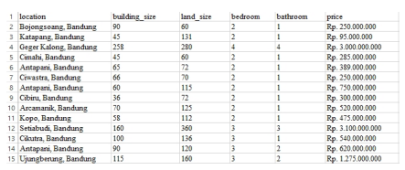

```{r setup, include=FALSE}
knitr::opts_chunk$set(echo = FALSE)
```


## Abstract

Online property business or known as e-commerce is currently experiencing an increase of home sales. Indonesia ecommerce property business has positive trending shown by the increasing sales for more than 500% from 2011 to 2015. A prediction of property price is important to help investor or public to have accurate information before buying property. One of methods for prediction is classification based on several distinctive of property industry attributes, such as building size, land size, number of rooms, and location. 

Today, data is easily obtained, there are many open data from E-commerce sites. The E-commerce contains information about home and other property advertised to sell. People also regularly visit the site to find the right property or to sell the property using price information which collectively available as open data.

To predict the property sales, this research employed two different classification methods in Data Mining which are Decision Tree and k-NN classification. We compare which model classification is better to predict property price and their attributes. We use Indonesia biggest property based ecommerce sites Rumah123.com as our open data source, and choose location Bandung in our experiment. The accuracy result of decision tree is 75% and KNN is 71%, other than that k-NN can explore more data pattern than Decision Tree.

Keywords: Property business, Data Mining, Classification, K-NN, Decision Tree

## _Output_

### _Our result is a model to predict property price and their attributes_.

### Sumber data: rumah123.com area Bandung.

## _Theoretical Background_ {.smaller}

::: columns

:::: {.column width=50%}

### Classification

There are many classification methods, such as:

- Decision Tree,
- k-NN, 
- Naive Bayes, 
- SVM and 
- Neural Network. 

Each of methods is suitable for classify specific application. Naive Bayes and SVM normally used for text classification. Decision Tree is used to detect simple visualization pattern within complex variable data, k-NN could see the similarity of the data based on their respective distance, and Neural Network is able capture knowledge or predict event from complex data.

::::

:::: {.column width=50%}

### k-NN

k-NN is one of the simple classification methods, the main idea of k-NN is measure the data similarity by using nearest neighbor distance of data. 

### Decision Tree

Decision Tree is a model represented as two-way split binary tree to
display the value of a target variable can be predicted by using the values of an independent variables.

::::

::: 

## Data Collected

We collect the data by from e-commerce site rumah123.com. We get in total 801 home sales data in
Bandung, from the 2015-2016 transaction period. The home sales data consists of price, building size, land size, bedroom, bathroom and location.

```{r out.width="50%",echo=FALSE,fig.cap="Data rumah123.com",fig.align='center'}

```


## Decision Tree Output {.smaller}

::: columns

:::: {.column width=50%}

```{r out.width="50%",echo=FALSE,fig.cap="Decision Tree",fig.align='center'}

```

::::

:::: {.column width=50%}

The root node is building_size represent building size, while land_size represent land size as the leaf node. Both variable is significantly important variables to define property price. The variable bathrooms, bedroom and location are not significantly important in decision tree model. The reason for this is given by data characteristics of those three variables, which their value does not considerably varies across the data.

To understand the model, we give the following example; If we want to know what is the price for a property that have building size is 80m2 and land size is 100 m2. We trace the corresponding value in Node 1 and Node 5, then we conclude that the 91,5% probability that the price is fall into Price_A class, which is less than Rp. 603500000.

::::

::: 

## k-NN Tree Output {.smaller}

::: columns

:::: {.column width=50%}

```{r out.width="50%",echo=FALSE,fig.cap="k-NN",fig.align='center'}

```

::::

:::: {.column width=50%}

k-NN represent all the variables where it classifies the property data based on the data similarity or their closest distance across any available variables.

To understand the practicality of this model, we use following example; if we want to buy a home where the land size is 80 m2 land size and its building size is 80 m2. Our budget is not more than Rp 1500000000, -. We find data similarities on all the variables. There are 4 similar variables which are land_size, building_size, and bathroom. We have also 2 variables that mismatched which are location and price_class. We conclude that the decision fall into data in Hegarmanah with Price_B which is the price around between Rp. 603500000 to Rp 1487500000. 

::::

::: 

## Validation

```{r out.width="50%",echo=FALSE,fig.cap="Validation",fig.align='center'}

```

## Summary

```{r out.width="50%",echo=FALSE,fig.cap="Summary",fig.align='center'}

```

## The End