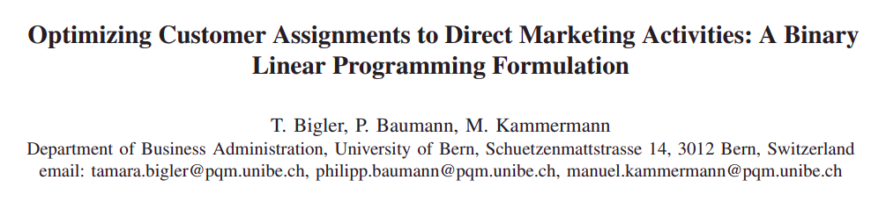
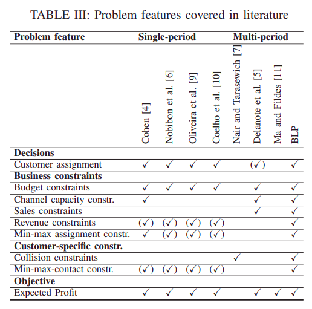
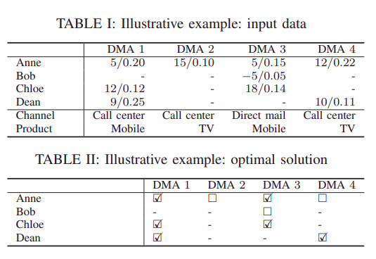

```{r setup, include=FALSE}
knitr::opts_chunk$set(echo = FALSE)

rm(list=ls())
```

## _Journal_

```{r out.width="75%",fig.retina=10,echo=FALSE,fig.align='center'}

```

[_Journal link_](https://ieeexplore.ieee.org/stamp/stamp.jsp?tp=&arnumber=8978863) didapatkan dari [___IEEE Xplore___](https://ieeexplore.ieee.org/).

## _Intro_

### _Abstract_

_Direct marketing has become a fundamental advertising method in many industries. In direct marketing, companies target specific customers with personalized product offers. By optimally assigning customers to direct marketing activities, the effectiveness of direct marketing campaigns can be greatly increased. In this paper, we study a real-world customer assignment problem of a leading telecommunications provider in Switzerland. The planning problem contains many business and customer-specific constraints that have not yet been covered in the literature. We propose a binary linear programming formulation that solves instances involving up to one million customers and over 100 direct marketing activities to optimality in short running time. The novel formulation delivers substantially better solutions in terms of expected profit than the current practice at the company._

### _Keywords_

- Direct marketing, 
- Customer assignment, 
- Binary linear programming.

## _Direct Marketing_

### _Definition_

Direct marketing is an advertising method that promotes products and services to specific customers with personalized offers.

### _Background_

Contacting customers directly with a call, a direct mail, an email, or a text message has proven to be more effective in many industries than using masscommunication media such as posters, television, or radio^[ F. Monard, H.-P. Uebersax, M. Hirt, F. Hannich, S. Müller, and K. Ackermann, “Benchmark-Studie Kundenservice 2017,” PIDAS AG and Zurich University of Applied Science, Institute of Marketing Management, Tech. Rep., 2017.].

By targeting the right customers, one can greatly enhance the impact of the available direct marketing budget. To identify the right customers, companies have started to develop so-called response models, which estimate the probability of a customer to react positively to a direct marketing activity^[S. Lessmann, J. Haupt, K. Coussement, and K. W. De Bock, “Targeting customers for profit: An ensemble learning framework to support marketing decision-making,” Information Sciences, 2019, to appear].

Case study: Swiss Telecommunication Provider.

## _Direct Marketing Activities_ (DMA)

::: columns

:::: {.column width=50%}

A time horizon and a set of DMAs that take place on specific days during the time horizon are given. Each DMA is associated with a product, a channel (call center, direct mail, email, or text message), a cost of contact, and a group of potential customers with individual response probabilities and expected profits.

The company defines various business ___constraints___, such as:

1. Budgets that must not be exceeded,
1. Channel capacities,
1. Product-specific sales,
1. Customer-specific constraints (ensure that a customer is not assigned too often).

::::

:::: {.column width=50%}

```{r out.width="60%",fig.retina=10,echo=FALSE,fig.align='center'}

```

::::

::: 

### _Goals_

> A feasible solution of customer assignments to DMAs is sought that maximizes the total expected profit.

## _Ilustration_

```{r out.width="30%",fig.retina=10,echo=FALSE,fig.align='center'}

```

### _Objective Function_

$$\sum_{j \in J} \sum_{i \in I_j} p_{ij} x_{ij}$$

Memaksimalkan _profit_ dari _customer_ yang dipilih DMA-nya.

