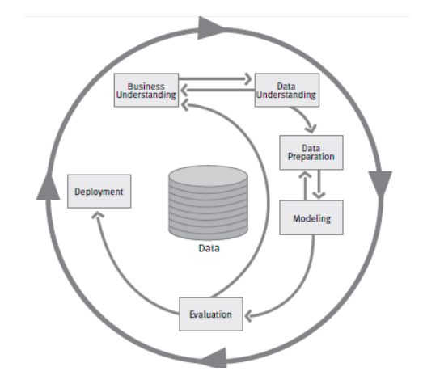
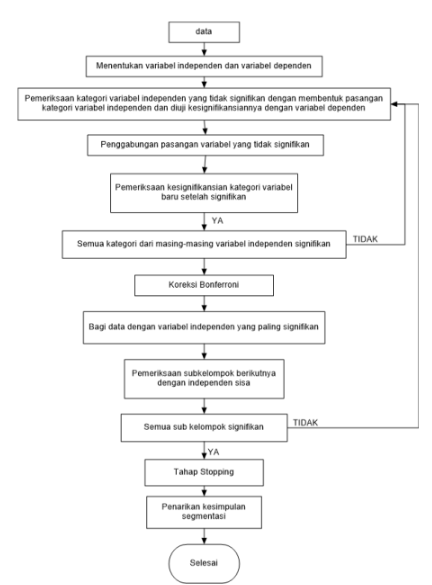
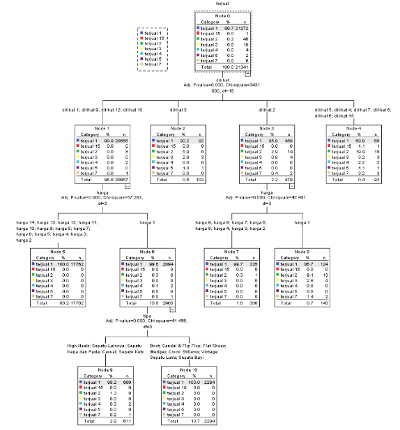

```{r setup, include=FALSE}
knitr::opts_chunk$set(echo = FALSE)
```


## Abstrak

___The growth of internet users in Indonesia gives an impact on many aspects of daily life, including commerce. Indonesian smallmedium enterprises took this advantage of new media to derive their activity by the meaning of online commerce. Until now, there is no known practical implementation of how to predict their sales and revenue using their historical transaction. In this paper, we build a sales prediction model on the Indonesian footwear industry using real-life data crawled on Tokopedia, one of the biggest e-commerce providers in Indonesia. Data mining is a discipline that can be used to gather information by processing the data. By using the method of classification in data mining, this research will describe patterns of the market and predict the potential of the region in the national market commodities. Our approach is based on the classification decision tree. We managed to determine predicted the number of items sold by the viewers, price, and type of shoes.___

_Keywords: Prediction Model, Data Mining, Classification, Decision Tree, CHAID._

## _Output_

### _We managed to determine predicted the number of items sold by the viewers, price, and type of shoes_.

## _Theoretical Background_ {.smaller}

::: columns

:::: {.column width=50%}

### _Social Computing_

Social computing is concerned with the study of social behavior, and social context based on computational systems. Social computing provides four main facilities to the behavioral modeling.

1. Model: Building To create & build up models for behavior.
1.Analysis: Review the creation & already created models with their design work.
1. Pattern mining: Minimize the patterns through mining.
1. Prediction: Follow the rules & regulations to control the error in the designing.

### Classification

Classification models describe data relationships and predict values for future observations. Classification maps data into predefined groups of classes. It is often referred to as supervised learning because the classes are determined before examining the data. 

### Decision Tree

The decision tree is a logical model represented as a binary (two-way split) tree that shows how the value of a target variable (output) can be predicted by using the values of a set of predictor variables (input). Decision tree is a predictive model which can be used to represent both classifiers and regression models.

::::

:::: {.column width=50%}

### CRISP-DP

The Cross-Industry Standard Process for Data Mining (CRISP-DM) is a popular methodology for increasing the success of DM projects. This methodology defines a non-rigid sequence of six phases, which allow the building and implementation of a DM model to be used in a real environment, helping to support business decisions

```{r out.width="50%",echo=FALSE,fig.cap="CRISP-DM Process",fig.align='center'}

```

::::

::: 

## Methodology

We investigate data of shoe sales in Indonesia using the web mining method on online marketplace website (tokopedia.com) until March $3^{rd}$, 2015. The attribute used in this research are:

1. price, 
1. type of shoes,
1. insurance, 
1. product viewer, 
1. city of the seller, 
1. rating of speed, service, and accuracy. 

has an impact on product sales.

```{r,echo=FALSE}
nomnoml::nomnoml("
                 [Tokopedia] -> [Scraping]
                 [Scraping] -> [Pre Processing]
                 [Pre Processing] -> [Modelling]
                 [Modelling] -> [Prediction]
                 ")
```

## CHAID Analysis

::: columns

:::: {.column width=50%}

There are several steps to make a decision tree using the CHAID algorithm which are:

1. Merging. Category merging can be done on an independent variable that has more than two categories that are related.
2. Splitting. In this part independent variable which used as the best split node. Splitting was conducted with a p-value on each independent variable.
3. Stopping. The decision tree should be terminated by the rules. If there is no significant independent variable or if a tree reaches a maximum value limit of the tree defined specifications.

::::

:::: {.column width=50%}

```{r out.width="50%",echo=FALSE,fig.cap="CHAID Flowchart",fig.align='center'}

```

::::

::: 


## CHAID

In CHAID analysis, the following are the components of the decision tree:

- _Root Node_: The root node contains the dependent variable or target variable. For example, a bank can predict the credit card risk based upon information like age, income, number of credit cards, etc. In this example, credit card risk is the target variable and the remaining factors are the predictor variables.
- _Parent's Node_: The algorithm splits the target variable into two or more categories. These categories are called parent nodes or initial nodes. For the bank example, high, medium, and low categories are the parent's nodes.
- _Child Node_: Independent variable categories which come below the parent's categories in the CHAID analysis tree are called the child node.
- _Terminal Node_: The last categories of the CHAID analysis tree are called the terminal node. In the CHAID analysis tree, the category that is a major influence on the dependent variable comes first and the less important category comes last. Thus, it is called the terminal node.

## CHAID Modelling

Menggunakan data yang telah dikategorisasi terlebih dahulu.

```{r out.width="50%",echo=FALSE,fig.cap="Model CHAID",fig.align='center'}

```


## Prediction {.bigger}

With terminal and classification patterns, we can predict sales. For illustration, if we sell shoes at Rp 62.000 with 80 viewers and classified as "Sneakers", there is a 98,2% probability that the shoes will be sold 1-143 unit, 1.3% probability that the shoes will be sold 155-287 unit, 0.3% probability that the shoes will be sold 431-573 unit, and 0.2% probability that the shoes will be sold 860-1002 unit.


## Discussion

CHAID sudah digunakan pada _project_ Lenny, MB, dan Rendy.