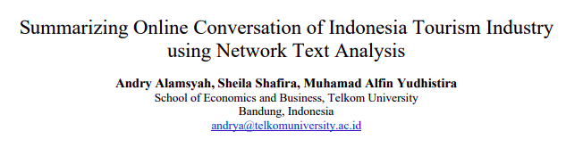
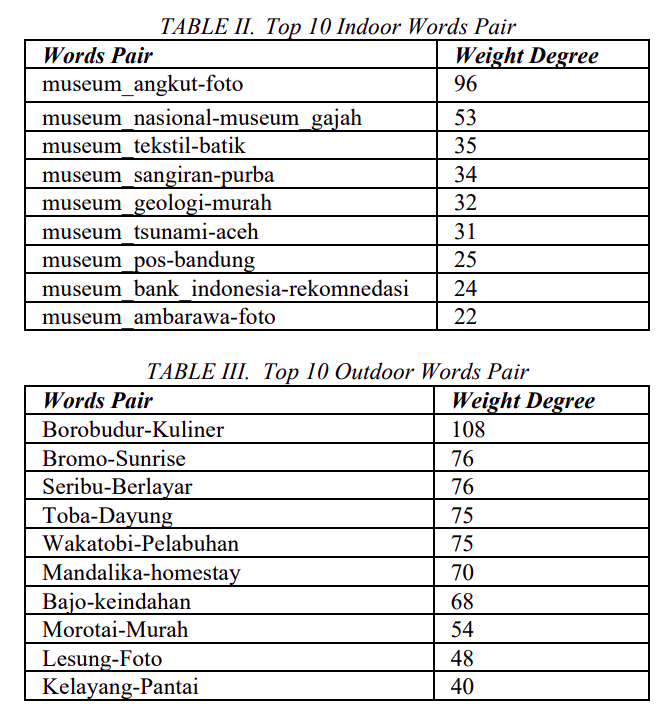
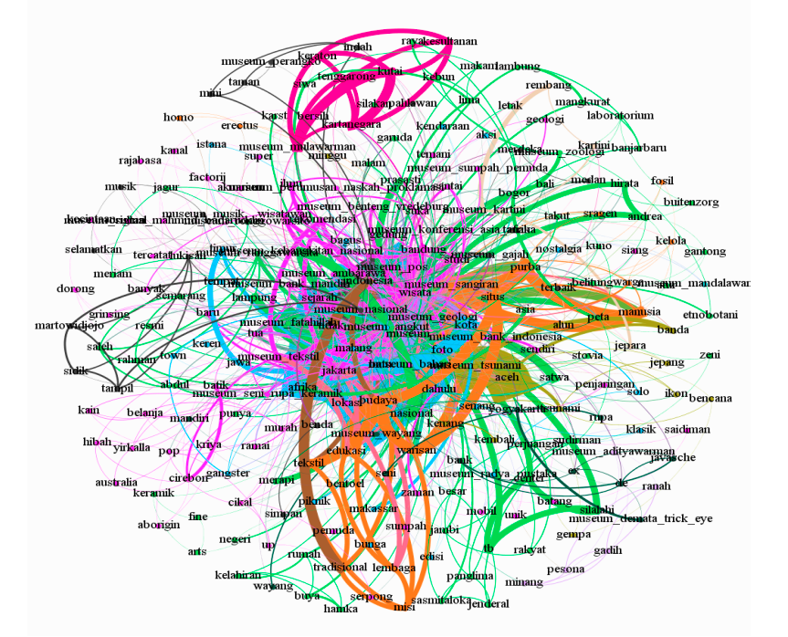
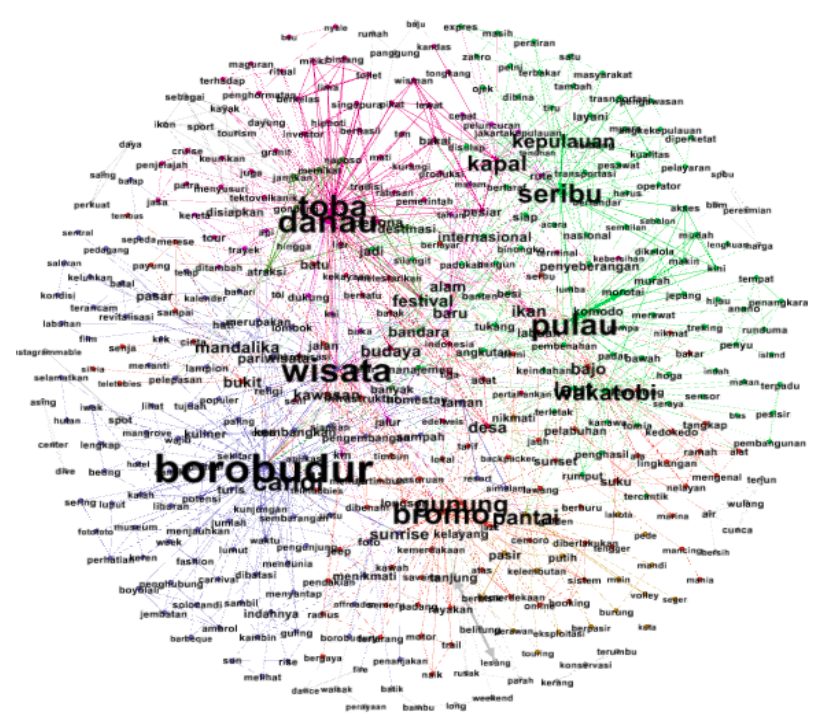

```{r setup, include=FALSE}
knitr::opts_chunk$set(echo = FALSE)
setwd("~/Live-Session-Nutrifood-R/LEFO Market Research/LEFO MR 2022/September 2022")

rm(list=ls())
```

## JURNAL

```{r out.width="75%",echo=FALSE,fig.align='center'}

```

## ABSTRAK

Tourism Industry is one of potential revenue and has an important role in economics in Indonesia. Tourism Industry
brings job and business opportunity, foreign exchange earnings, and infrastructure development, tourism also plays the role as one of the main drivers in socio-economic progress in Indonesia. The number of foreign tourists visiting Indonesia increase cumulatively and has reached 10.41 million visits or an increase of 10.46 percent from the same period in previous year.

Government trying to increase the number of tourists to visit Indonesia by promoting many Indonesia tourist attraction.
To support the government effort, we need a way to understand how people’s perception about tourism aspect in
Indonesia. The easiest and cheapest way to see that is by extracting opinion from user generated reviews in a form of conversation among the users in social media such as Twitter. This paper proposes a method for extracting and summarizing of opinion or perception expressed by social media users. Our methods based on frequently appeared words and words relations among those dominant words. We call this method as Network Text Analysis, which is based on Social Network Analysis methodology.

As a case study, we conduct experiment against two tourism object aspect in Indonesia: Indoor and Outdoor tourist
object. Specifically extracting user opinion regarding museum and nature destination from Twitter. The proposed methodology
classifies topics from opinion data. Our method is fast and significantly accurate to summarize dominant topics in tourism
industry when implemented in large-scale data.

## METODE

```{r out.width="115%",echo=FALSE,fig.align='center',fig.retina=15}
nomnoml::nomnoml("
                 [Twitter] -> [Scrape]
                 [Scrape] -> [Preprocessing]
                 [Preprocessing] -> [Analysis]
                 
                 [Preprocessing|
                    [Filtering irrelevant tweets] -> [Grouping indoor vs outdoor]
                    ]
                 
                 [Analysis|
                    [Frequent words] -> [Word association]
                    [Word association] -> [Network text]
                    ]
                 ")
```


## HASIL

```{r out.width="30%",echo=FALSE,fig.align='center'}

```

## HASIL

```{r out.width="50%",echo=FALSE,fig.align='center'}

```

## HASIL

```{r out.width="50%",echo=FALSE,fig.align='center'}

```


