Beberapa Contoh Metode Clustering dengan R
================

# *Introduction*

Berikut adalah beberapa *showcase* contoh penerapan metode *clustering*
dengan **R**.

# *K-Means Clustering*

## Contoh Kasus I

``` r
# import data
df = read.csv("~/Live-Session-Nutrifood-R/LEFO Market Research/LEFO MR 2023/Unsupervised/k means/compact disks.csv") %>% 
     janitor::clean_names() %>%
     select(-x) %>%
     rename(x = x_2)

# kita bikin visualisasinya terlebih dahulu
plt = 
  df %>%
  ggplot(aes(x,y)) +
  geom_point()
plt
```

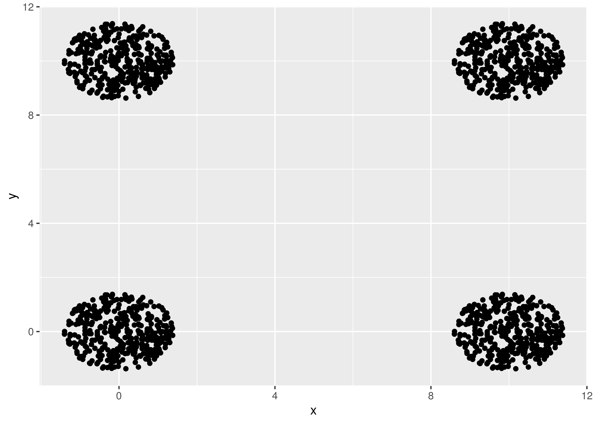

Jika melihat langsung data di atas, kita sudah bisa pastikan bahwa ada
$k = 4$ buah *cluster*.

> Namun bagaimana jika kita gunakan *elbow method* dan *silhouette
> method* untuk menentukan berapa banyaknya $k$?

### *Elbow Method*

``` r
elbow = fviz_nbclust(df, kmeans, method = "wss")
plot(elbow)
```

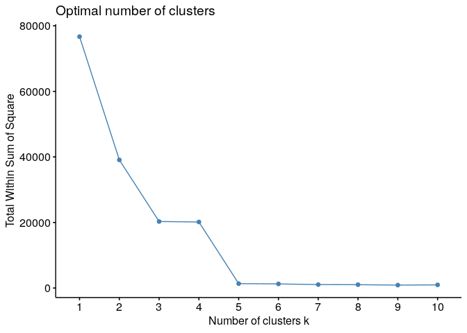<!-- -->

### *Silhouette Method*

``` r
siluet = fviz_nbclust(df, kmeans, method = "silhouette")
plot(siluet)
```

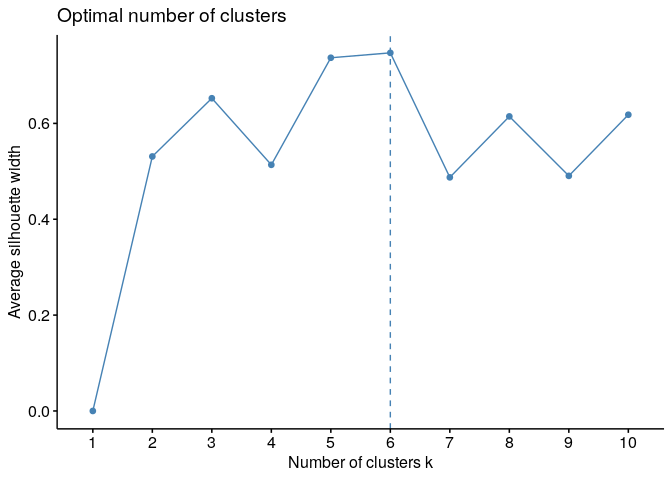<!-- -->

### Kesimpulan Sementara

Penentuan $k$ menggunakan *elbow* dan *silhouette method* bisa
berpotensi *miss leading*.

#### Jika $k=5$

``` r
# k-means clustering
final = kmeans(df, 5, nstart = 25)

# center dari masing-masing cluster
final$centers
```

    ##             x           y
    ## 1  0.04097999  9.98130971
    ## 2 10.04097999  9.98130971
    ## 3  0.04097999 -0.01869029
    ## 4 10.50025161 -0.39974068
    ## 5  9.53552463  0.40067802

``` r
# save hasil cluster ke data awal
data_kmeans = df
data_kmeans$cluster = final$cluster

# berapa banyak isi dari cluster
table(data_kmeans$cluster)
```

    ## 
    ##   1   2   3   4   5 
    ## 376 376 376 197 179

``` r
plt = 
  data_kmeans %>%
  ggplot(aes(x,y)) +
  geom_point(aes(color = as.factor(cluster)))
plt
```

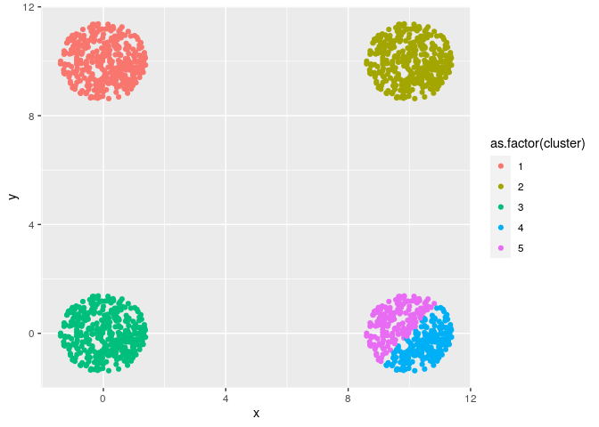<!-- -->

#### Jika $k=6$

``` r
# k-means clustering
final = kmeans(df, 6, nstart = 25)

# center dari masing-masing cluster
final$centers
```

    ##             x           y
    ## 1  0.04097999 -0.01869029
    ## 2 10.50025161  9.60025932
    ## 3 10.50025161 -0.39974068
    ## 4  9.53552463  0.40067802
    ## 5  9.53552463 10.40067802
    ## 6  0.04097999  9.98130971

``` r
# save hasil cluster ke data awal
data_kmeans = df
data_kmeans$cluster = final$cluster

# berapa banyak isi dari cluster
table(data_kmeans$cluster)
```

    ## 
    ##   1   2   3   4   5   6 
    ## 376 197 197 179 179 376

``` r
plt = 
  data_kmeans %>%
  ggplot(aes(x,y)) +
  geom_point(aes(color = as.factor(cluster)))
plt
```

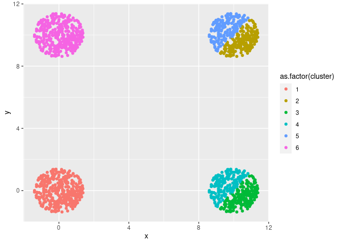<!-- -->

### Jawaban yang Benar

Seharusnya $k=4$.

``` r
# k-means clustering
final = kmeans(df, 4, nstart = 25)

# center dari masing-masing cluster
final$centers
```

    ##             x           y
    ## 1  0.04097999 -0.01869029
    ## 2 10.04097999  9.98130971
    ## 3 10.04097999 -0.01869029
    ## 4  0.04097999  9.98130971

``` r
# save hasil cluster ke data awal
data_kmeans = df
data_kmeans$cluster = final$cluster

# berapa banyak isi dari cluster
table(data_kmeans$cluster)
```

    ## 
    ##   1   2   3   4 
    ## 376 376 376 376

``` r
plt = 
  data_kmeans %>%
  ggplot(aes(x,y)) +
  geom_point(aes(color = as.factor(cluster)))
plt
```

<!-- -->

> Lantas bagaimana jika kita tidak bisa menentukan banyaknya $k$ secara
> visual dan hanya bisa mengandalkan *elbow* dan *silhouette method*?

## Contoh Kasus II

``` r
# import data
df = read.csv("~/Live-Session-Nutrifood-R/LEFO Market Research/LEFO MR 2023/Unsupervised/k means/dual disks.csv") %>% 
     janitor::clean_names() %>%
     select(-x) %>%
     rename(x = x_2)

# kita bikin visualisasinya terlebih dahulu
plt = 
  df %>%
  ggplot(aes(x,y)) +
  geom_point()
plt
```

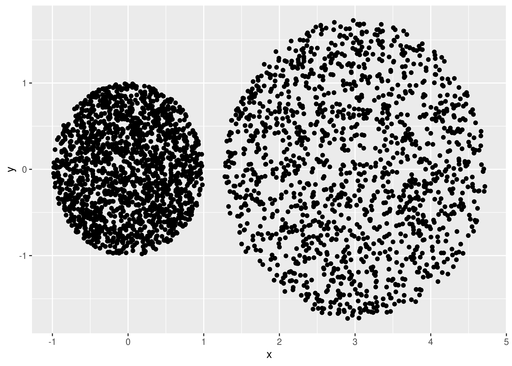

Jika melihat langsung data di atas, kita sudah bisa pastikan bahwa ada
$k = 2$ buah *cluster*.

> Namun bagaimana jika kita gunakan *elbow method* dan *silhouette
> method* untuk menentukan berapa banyaknya $k$?

### *Elbow Method*

``` r
elbow = fviz_nbclust(df, kmeans, method = "wss")
plot(elbow)
```

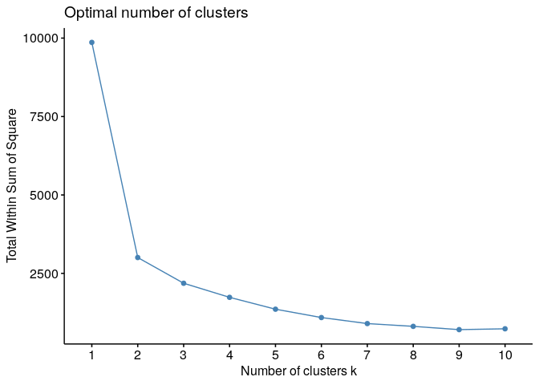<!-- -->

### *Silhouette Method*

``` r
siluet = fviz_nbclust(df, kmeans, method = "silhouette")
plot(siluet)
```

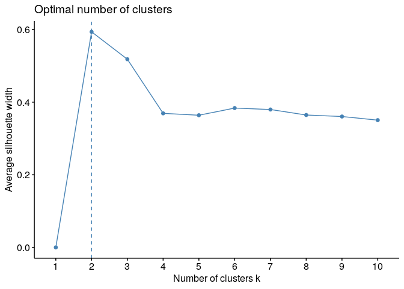<!-- -->

Kedua metode tersebut konklusif menyatakan $k=2$, sehingga:

``` r
# k-means clustering
final = kmeans(df, 2, nstart = 25)

# center dari masing-masing cluster
final$centers
```

    ##            x           y
    ## 1 0.04054186 0.003287305
    ## 2 3.01638486 0.018651232

``` r
# save hasil cluster ke data awal
data_kmeans = df
data_kmeans$cluster = final$cluster

# berapa banyak isi dari cluster
table(data_kmeans$cluster)
```

    ## 
    ##    1    2 
    ## 1763 1381

``` r
plt = 
  data_kmeans %>%
  ggplot(aes(x,y)) +
  geom_point(aes(color = as.factor(cluster)))
plt
```

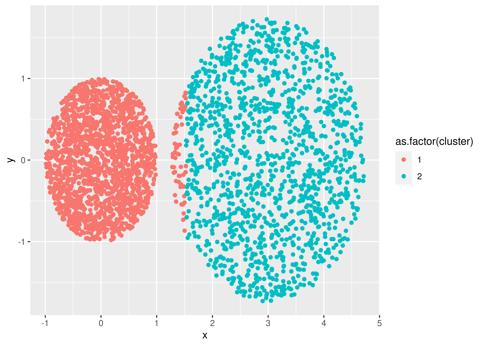

Terlihat bahwa ada beberapa titik data yang *overlap* masuk ke *cluster*
lainnya.

------------------------------------------------------------------------

# *Hierarchical Clustering*

## Contoh I

``` r
rm(list=ls())
df = read.csv("~/Live-Session-Nutrifood-R/LEFO Market Research/LEFO MR 2023/Unsupervised/hierarchical/donat.csv") %>% 
     janitor::clean_names() %>%
     select(x_2,y) %>%
     rename(x = x_2)

# membuat grafik
plt = 
  df %>%
  ggplot(aes(x,y)) +
  geom_point()
plt
```

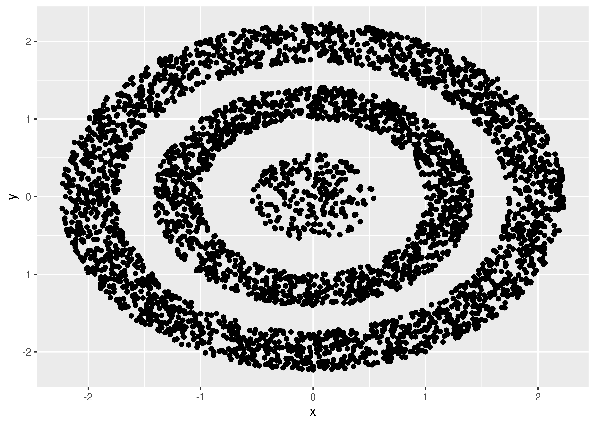

``` r
# Finding distance matrix
distance_mat = dist(df, method = 'euclidean')
```

### *Single Link*

``` r
# Fitting Hierarchical clustering Model
set.seed(240)  # Setting seed
Hierar_cl = hclust(distance_mat, method = "single")

plot(Hierar_cl)

# Pemecahan menjadi 3 cluster
fit = cutree(Hierar_cl, k = 3)
table(fit)
```

    ## fit
    ##    1    2    3 
    ##  229 1560 2541

``` r
plot(Hierar_cl)
rect.hclust(Hierar_cl, k = 3, border = "red")
```

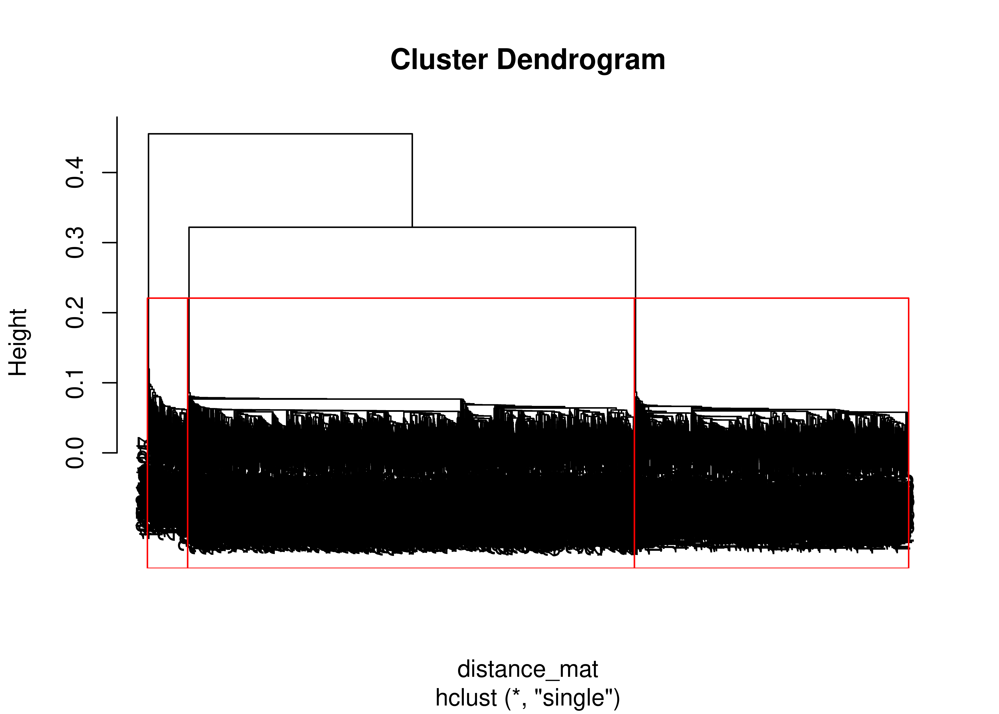

``` r
# save hasil cluster ke data awal
data_hc = df
data_hc$cluster = fit

# berapa banyak isi dari cluster
hie_plot = 
  data_hc %>%
  ggplot(aes(x,y,color = as.factor(cluster))) +
  geom_point()
hie_plot
```

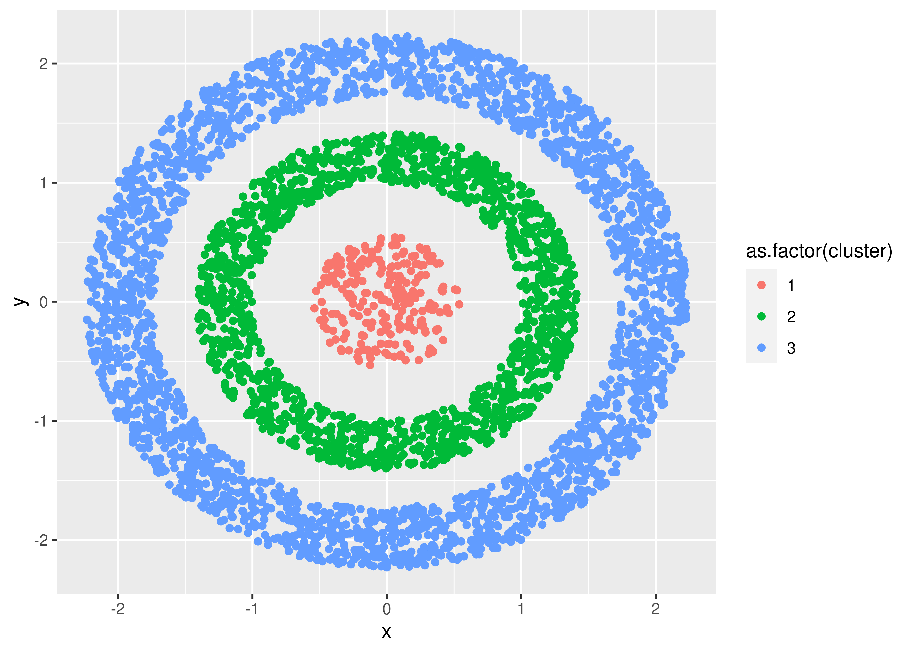

### *Complete Link*

``` r
# Fitting Hierarchical clustering Model
set.seed(240)  # Setting seed
Hierar_cl = hclust(distance_mat, method = "complete")

plot(Hierar_cl)

# Pemecahan menjadi 3 cluster
fit = cutree(Hierar_cl, k = 6)
table(fit)
```

    ## fit
    ##   1   2   3   4   5   6 
    ## 767 824 814 594 834 497

``` r
plot(Hierar_cl)
rect.hclust(Hierar_cl, k = 6, border = "red")
```

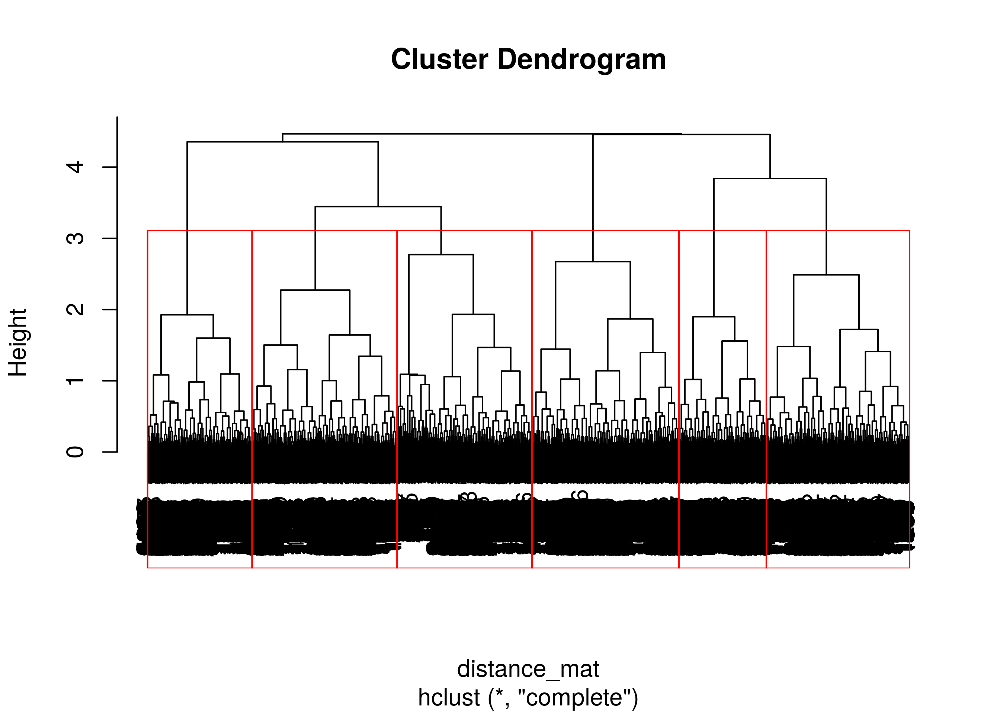

``` r
# save hasil cluster ke data awal
data_hc = df
data_hc$cluster = fit

# berapa banyak isi dari cluster
hie_plot = 
  data_hc %>%
  ggplot(aes(x,y,color = as.factor(cluster))) +
  geom_point()
hie_plot
```

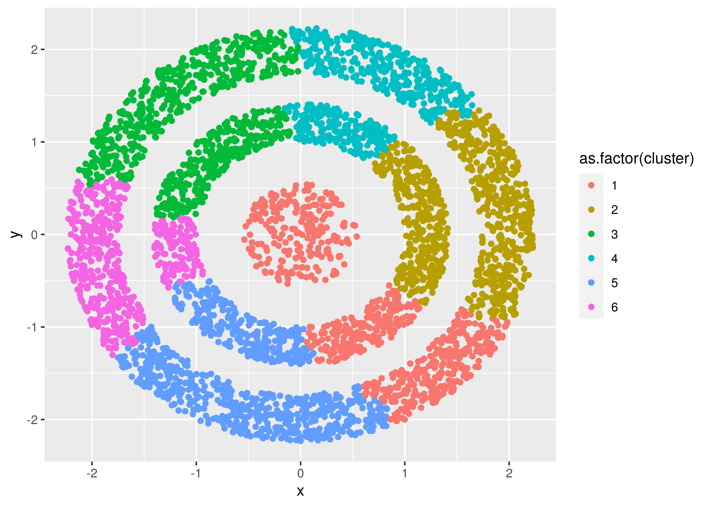

### *Average Link*

``` r
# Fitting Hierarchical clustering Model
set.seed(240)  # Setting seed
Hierar_cl = hclust(distance_mat, method = "average")

plot(Hierar_cl)

# Pemecahan menjadi 3 cluster
fit = cutree(Hierar_cl, k = 4)
table(fit)
```

    ## fit
    ##    1    2    3    4 
    ## 1632 1168  732  798

``` r
plot(Hierar_cl)
rect.hclust(Hierar_cl, k = 4, border = "red")
```

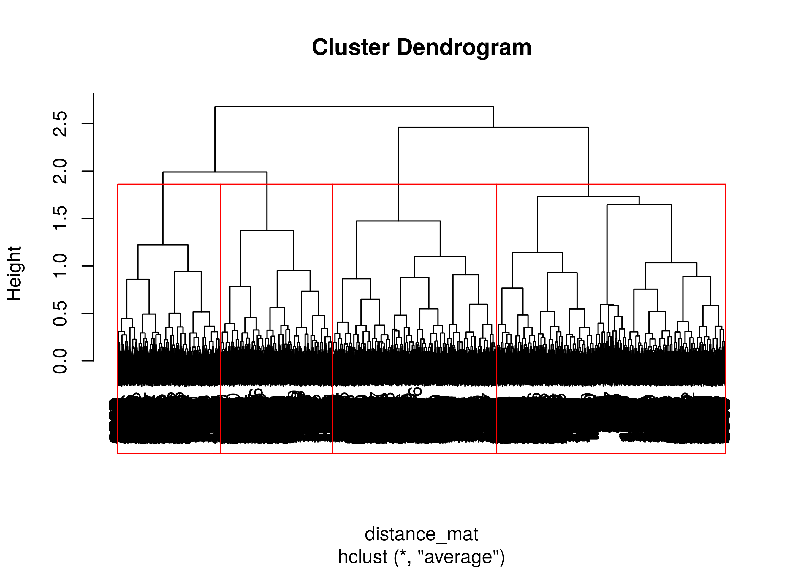

``` r
# save hasil cluster ke data awal
data_hc = df
data_hc$cluster = fit

# berapa banyak isi dari cluster
hie_plot = 
  data_hc %>%
  ggplot(aes(x,y,color = as.factor(cluster))) +
  geom_point()
hie_plot
```

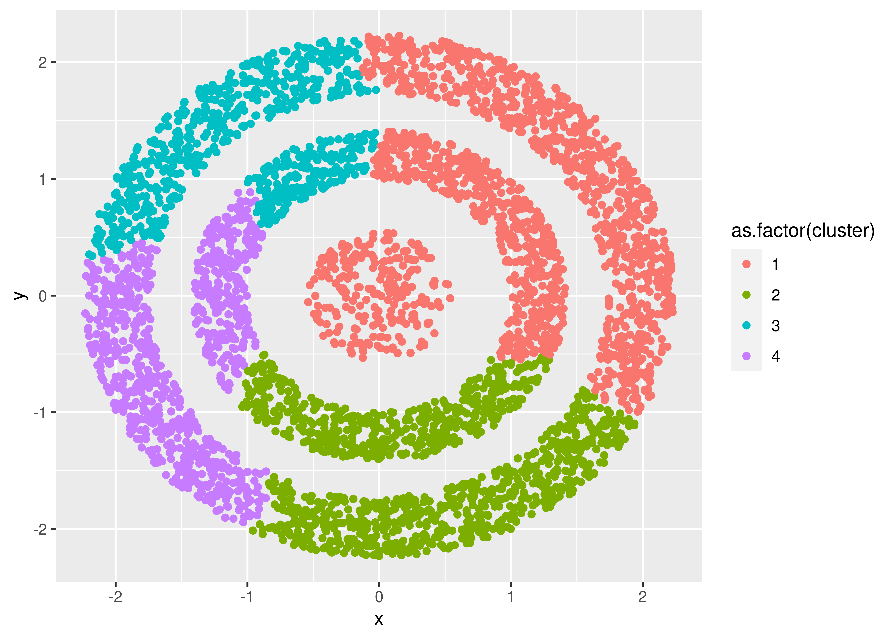

## Contoh II

``` r
rm(list=ls())
df = read.csv("~/Live-Session-Nutrifood-R/LEFO Market Research/LEFO MR 2023/Unsupervised/hierarchical/hi.csv") %>% 
     janitor::clean_names() %>%
     select(x_2,y) %>%
     rename(x = x_2)

# membuat grafik
plt = 
  df %>%
  ggplot(aes(x,y)) +
  geom_point()
plt
```

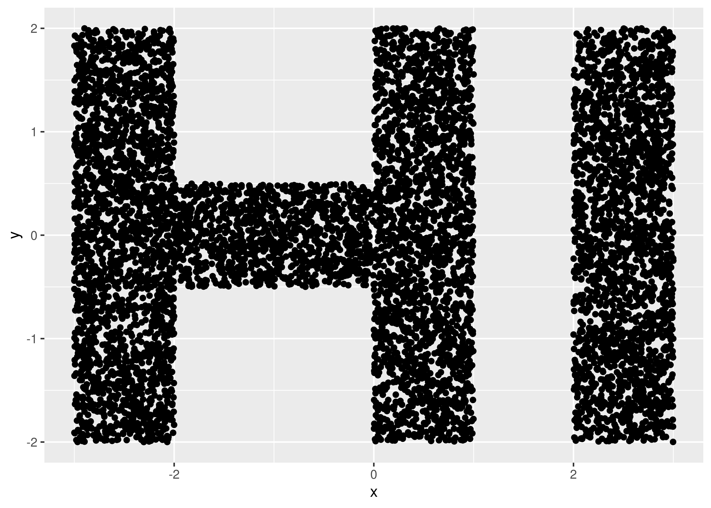

``` r
# Finding distance matrix
distance_mat = dist(df, method = 'euclidean')
```

### *Single Link*

``` r
# Fitting Hierarchical clustering Model
set.seed(240)  # Setting seed
Hierar_cl = hclust(distance_mat, method = "single")

plot(Hierar_cl)

# Pemecahan menjadi 2 cluster
fit = cutree(Hierar_cl, k = 2)
table(fit)
```

    ## fit
    ##    1    2 
    ## 2223 6717

``` r
plot(Hierar_cl)
rect.hclust(Hierar_cl, k = 2, border = "red")
```


``` r
# save hasil cluster ke data awal
data_hc = df
data_hc$cluster = fit

# berapa banyak isi dari cluster
hie_plot = 
  data_hc %>%
  ggplot(aes(x,y,color = as.factor(cluster))) +
  geom_point()
hie_plot
```

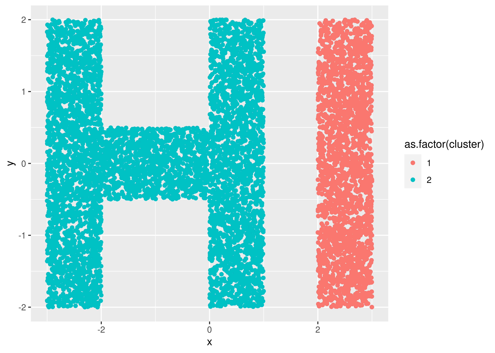
