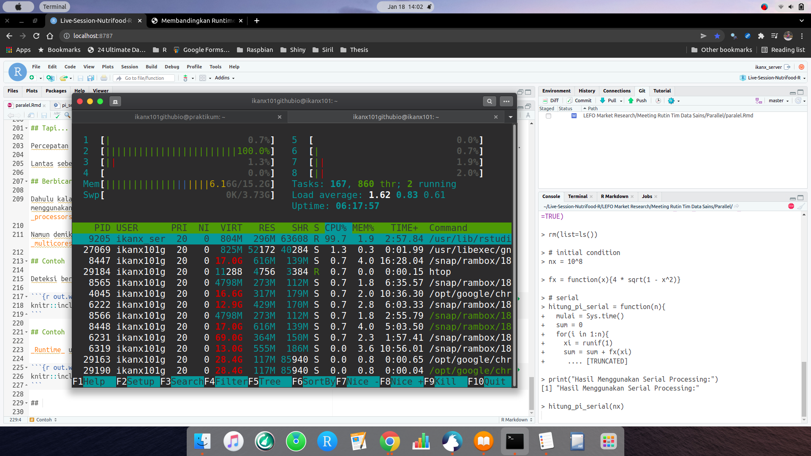
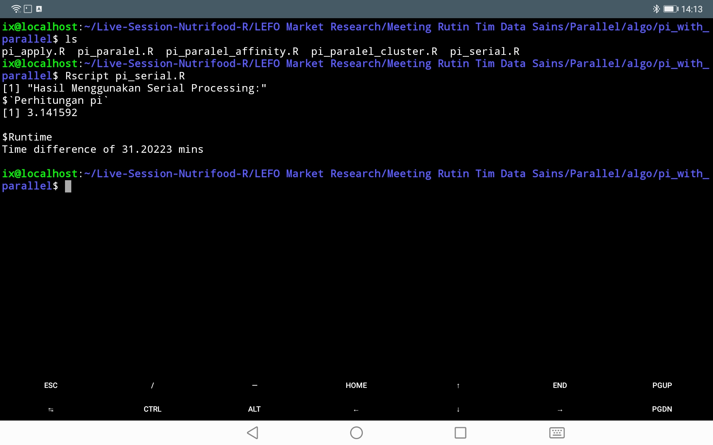
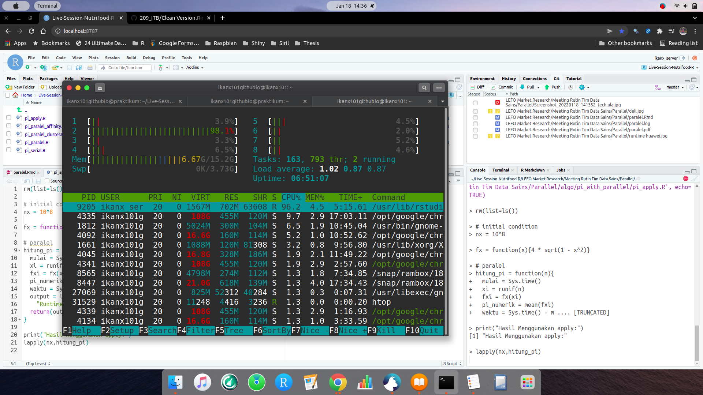
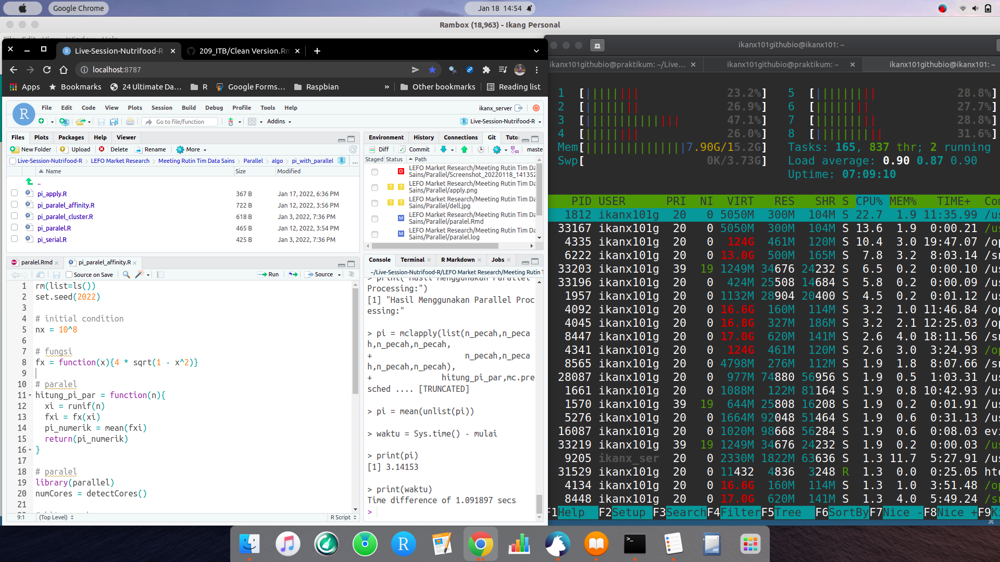
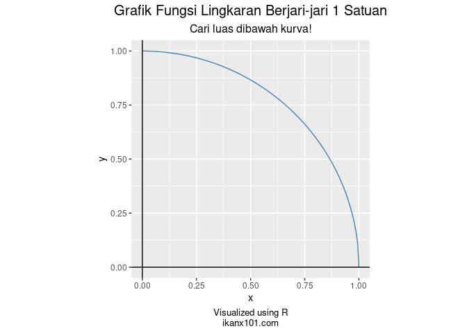

```{r setup, include = FALSE}
rm(list=ls())
library(dplyr)
library(ggplot2)
```

# MUKADIMAH

## _Learning Forum_ Hari Ini

Pada hari ini, kita akan membahas dan berdiskusi tentang beberapa topik, yakni:

1. _Virtual Machine_
   - _Linux OS_
   - _Google Cloud Virtual Machine_
1. _Parallel Processing_
   - _Serial Processing_
   - _Embarassingly Parallel_
   - _Parallel_ yang Sebenarnya


# _VIRTUAL MACHINE_

## Apa itu _Virtual Machine_?

Pada konsep _computing_, _virtual machine_ adalah _virtualization_ atau _emulation_ dari suatu sistem komputer. 

_Virtual machine_ berbasis suatu arsitektur komputer tertentu dan berfungsi sama halnya dengan komputer pada biasanya.

Salah satu _operating system_ yang paling sering digunakan pada _virtual machine_ adalah LINUX OS.

__Android__ merupakan salah satu _mobile OS_ yang berbasis Linux.

## Apa itu _Virtual Machine_?

```{r out.width="40%",fig.align='center',echo=FALSE}
nomnoml::nomnoml("
                 [Local Machine] <--> [Virtual Machine]
                 
                 [Virtual Machine|
                     [Cloud]
                     [Intra Network]
                     ]
                 
                 [Local Machine|
                     [Laptop]
                     [PC]
                     [Gadget]
                     ]
                 ")
```

Pembahasan pada __LEFO__ kali ini dibatasi untuk _cloud VM_. Istilah lain yang sering digunakan untuk menyebut _VM_ di _cloud_ adalah _virtual private server_ (VPS).

## Apa itu LINUX OS?

Linux adalah _operating system_ berbasis UNIX (sama halnya dengan MacOS) yang bersifat _open source_. Dibuat oleh seorang _programmer_ bernama __Linus Torvalds__ pada 1991. Sampai saat ini, OS Linux merupakan OS yang populer digunakan di berbagai _server_ dan _high performance computer_ di dunia.

Ada banyak _distro_ Linux yang berkembang (dengan basis komunitas yang kuat) antara lain:

- Ubuntu,
- Debian,
- Kali,
- Arch,
- Fedora.

Setiap distro memiliki spesialisasi tertentu sesuai dengan komunitas pengembang dan tujuannya.

Distro yang paling sering digunakan pada _server_ dan _HPC_ adalah Debian atau Ubuntu.

## _Fun Fact_

__Linus Torvalds__ juga salah seorang _creator_ dari `Git`.

## Apa itu LINUX OS?

Linux memiliki dua versi, yakni:

1. _Command line interface_.
1. _Graphical user interface_.

Kita bisa memilih versi mana yang hendak kita gunakan di _virtual machine_. Tapi versi __CLI__ lebih disukai karena lebih ringan dan bisa memaksimalkan kemampuan _processors_ yang dimiliki.

## Apa itu LINUX OS?

Linux sangat ringan, bahkan bisa dijalankan dengan ___USB drive___ tanpa harus di-_install_ terlebih dahulu di laptop/komputer.

Selain itu, Linux bisa di-_install_ di berbagai komputer dan _gadget_ apapun. Misal: HP / tablet Android dan laptop Windows.

Di _gadget_ Android, kita bisa mencicipi Linux CLI dan GUI dengan meng-_install_ _apps_ bernama `userLand`. Pada laptop Windows, kita bisa meng-_install_ berbagai _virtual box_ (misalkan `MobaXterm`).

## _Google Virtual Machine_

Berbekal _credit_ yang kita dapatkan saat mengaktifkan layanan _Google Cloud Service_, kita bisa menyewa _virtual machine_ sesuai dengan kebutuhan.

__Bagaimana caranya?__

## _Google Virtual Machine_

DEMO

## `UserLand` di Android

DEMO

## Diskusi

_Any comments?_

# _PARALLEL PROCESSING_

## Apa Tujuannya _Parallel Processing_?

Manusia itu terobsesi dengan hal-hal yang bisa dilakukan dengan cepat. Apalagi jika sumber daya komputasi yang dimiliki sangat mumpuni.

___Jika suatu komputasi bisa dilakukan lebih cepat, kenapa tidak?___

## Lebih Cepat, Lebih Baik!

```{r out.width="60%",fig.align='center',echo=FALSE}

```

## Sekilas tentang _Runtime_

_Runtime_ suatu proses komputasi bergantung pada dua hal:

1. Kompleksitas algoritma (termasuk bahasa pemrograman yang dipilih).
1. Kapasitas _hardware_ (termasuk _memmory allocation_).

Oleh karena itu, _runtime_ baik _serial processing_ dan _parallel processing_ sangat berpengaruh pada kedua faktor di atas.

## _Serial Processing_ vs _Parallel Processing_

### _Serial Processing_

Adalah proses komputasi yang bersifat sekuensial. Misal suatu proses komputasi memiliki $n$ proses. Proses ke $i$ tidak bisa dilakukan hingga proses ke $i-1$ selesai ($i \leq n$).

### _Parallel Processing_

Adalah proses komputasi dimana semua proses yang terlibat dijalankan secara bersamaan. Misalkan suatu proses komputasi memiliki $n$ proses dijalankan bersamaan. Proses ke $i$ bisa dijalankan tanpa menunggu proses yang lain.

## Analogi

```{r out.width="60%",fig.align='center',echo=FALSE}

```

__Menurut kalian proses perakitan satu mobil ini berlangsung secara serial atau parallel?__

## Analogi

Suatu ketika, saya diminta tolong untuk memberikan informasi kepada 8 orang via _messaging_.

Apa harus saya lakukan jika saya menggunakan:

1. _Serial Processing_
1. _Parallel Processing_

## Analogi

Dalam _parallel processing_ ada yang disebut dengan _embarassingly parallel_. Apakah se-memalukannya itu?

### Contoh I

Saya membuat grup WA berisi `8` orang tersebut. Lalu menginformasikannya melalui grup tersebut.

### Contoh II

Saya meminta tolong orang lain sehingga menggunakan `8` buah _gadgets_ untuk mengirimkan informasi tersebut kepada `8` orang secara bersamaan.

### Pertanyaannya

Antara contoh I dan II, mana yang memalukan?

## Apakah _Serial Processing_ Buruk?

```{r out.width="60%",fig.align='center',echo=FALSE}

```

Sejatinya saat __R__ atau __Python__ melakukan _process_ terhadap suatu algoritma, __mereka hanya memakai 1 core komputer kita saja__.

## Ide Dasar _Parallel Processing_

Jika suatu proses komputasi bisa dilakukan selama $X$ detik pada _single processor_, maka jika kita memiliki $n$ buah _processors_ prosesnya seharusnya bisa dihemat menjadi $\frac{X}{n}$ detik.

__Setuju? Logis gak?__

## Tapi...

Percepatan _runtime_ ini tidak berlaku _linear_ seperti di atas. Tapi yang jelas memang lebih cepat dibanding _serial processing_.

Lantas seberapa cepat?

## Berbicara Mengenai _Parallel Processing_

Dahulu kala saat berbicara mengenal _parallel processing_, istilah ini hanya digunakan saat seseorang melakukan komputasi menggunakan _high performance computer_ (HPC). HPC merupakan "super komputer" yang dibuat dari beberapa komputer (multi _processors_) yang dibuat sedemikian rupa (menggunakan arsitektur jaringan tertentu).

Namun demikian, istilah ini sekarang bisa untuk segala jenis komputer. Bahkan _gadget_ Android yang kita pakai sekarang sudah _multicores_ sehingga memungkinkan untuk melakukan _parallel processing_.

## Contoh

Deteksi berapa banyak _cores_ di Huawei T10s.

```{r out.width="60%",fig.align='center',echo=FALSE}

```

## Contoh

_Runtime_ untuk menjalankan `pi.serial.R` di Huawei T10s:

```{r out.width="60%",fig.align='center',echo=FALSE}

```

## Kita Mulai Bedah _Parallel Processing_

_Runtime_ suatu proses komputasi bergantung pada dua hal:

1. Kompleksitas algoritma (termasuk bahasa pemrograman yang dipilih).
1. Kapasitas _hardware_ (termasuk _memmory allocation_).

## Kapasitas _Hardware_

Salah satu faktor yang berpengaruh adalah _clock_ dari _processor_. Maka semakin banyak _processors_ maka diharapkan prosesnya semakin cepat. _Memory allocation_ juga (konon) berpengaruh.

Pada _Python_, _parallelism_ yang menggunakan konsep _message parsing interface_ diperlukan _middleware_ untuk menghubungkan Python dan _processors_. Kita bisa gunakan _middleware_ bernama __openMPI__.

## Kompleksitas Algoritma

Perhitungan kompleksitas waktu $T(n)$ diukur dari tahapan komputasi yang dibutuhkan untuk menjalankan algoritma sebagai fungsi dari _input_ $n$.

Sebagai contoh, suatu algoritma yang digunakan untuk menghitung rata-rata dari suatu data $\{1,2,..,n\}$ sebagai berikut:

```
sum = 0
for i in 1 to n:
  sum = sum + i
avg = sum / n
```

Memiliki kompleksitas waktu $T(n)=n$. Dihitung dari operasi mendasar di dalamnya yakni `sum = sum + i` yang diulang sebanyak $n$ kali.

## Kompleksitas Algoritma

Akibatnya waktu komputasi yang diperlukan menjadi lebih banyak karena __tahapan yang dilalui juga banyak__.

Oleh karena itu, salah satu hal yang bisa dilakukan dalam _parallel processing_ adalah mengubah paradigma membuat algoritma, dari sekuensial ke bentuk _parallel_.

## Mengubah Paradigma

Bahasa pemrograman modern saat ini sudah memungkinkan komputer untuk memproses suatu _array_ secara sekaligus. Prinsip sederhana ini yang bisa digunakan dalam membuat algoritma _embarassingly parallel processing_. 

Contohnya di __R__ adalah penggunaan:

1. `apply()`
1. `sapply()`
1. `lapply()`

## Penggunaan Keluarga `apply()`

Penggunaan keluarga `apply()` membuat proses jauh lebih cepat karena data diproses secara _array_. Namun _memory_ yang dibutuhkan biasanya akan semakin besar.

Namun, perlu dipahami bahwa yang terjadi adalah __kita tetap menggunakan 1 core saja__.

## _Runtime_ dengan `apply()`

```{r out.width="75%",fig.align='center',echo=FALSE}

```

## Bagaimana Agar Memaksimalkan Semua _Cores_?

Setidaknya ada berbagai cara menuliskan algoritma dan _libraries_ yang bisa melakukan _parallel processing_. Salah satu _library_ bawaan __R__ yang bisa kita pakai adalah `library(parallel)`.

```{r out.width="60%",fig.align='center',echo=FALSE}

```

## Setidaknya ada `3` Cara di `parallel`

Kita bisa memanfaatkan _function_ `mclapply()` dengan memanfaatkan beberapa parameter berikut:

1. Menggunakan _all cores_.
1. Menggunakan _all cores_ dan meng-_assign_ setiap _cores_ dengan tugas-tugas tertentu.

Kita bisa membuat _cluster nodes_ dan menggunakan perintah `parSapply()` dan `parLapply()`

## DEMO

Pada demo ini, kita akan menghitung nilai $\pi$ dengan cara melakukan integral dari fungsi berikut:

$$\int_0^1 4 (1 - x^2) dx$$

Secara numerik, berarti kita mencari luas dari kurva berikut:

```{r out.width="40%",fig.align='center',echo=FALSE}

```

