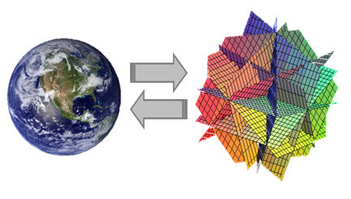
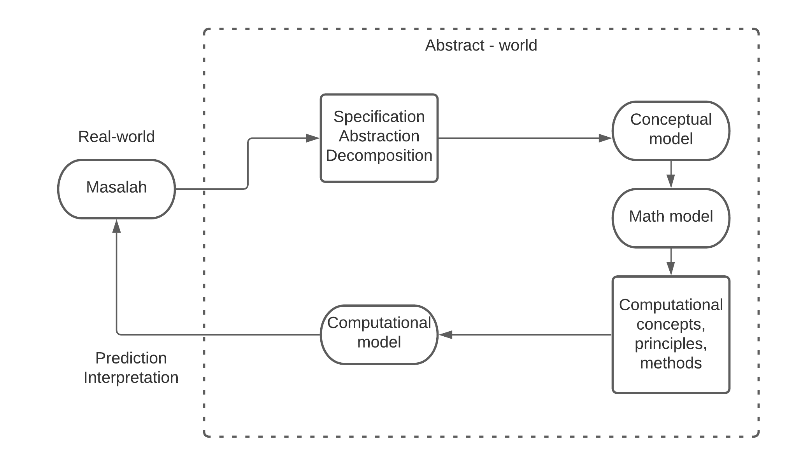
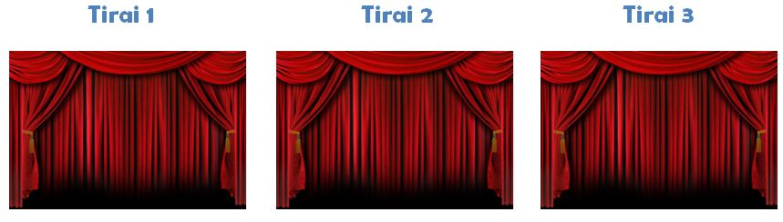
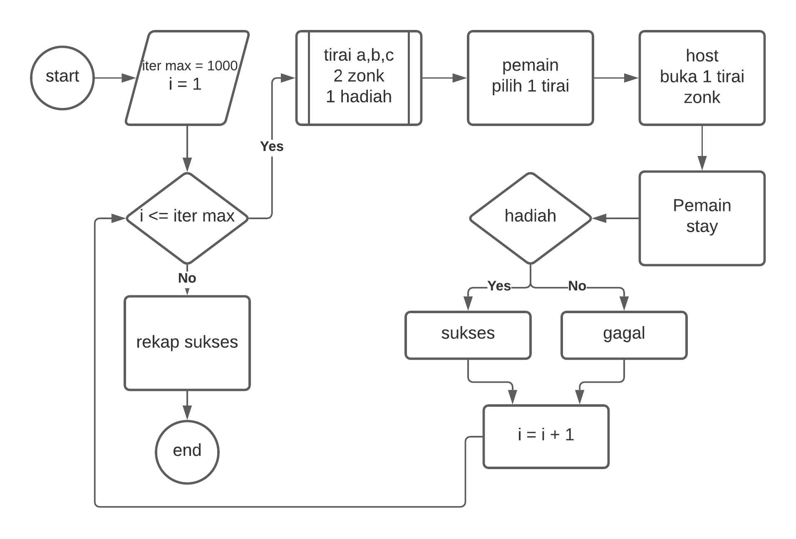
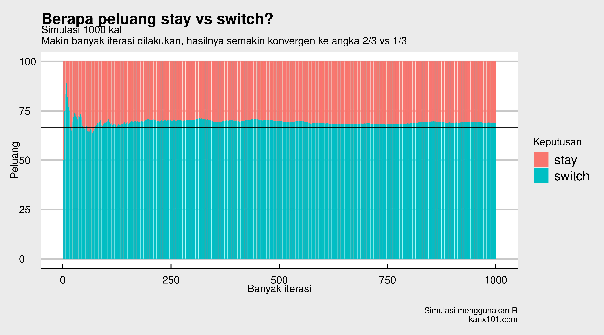
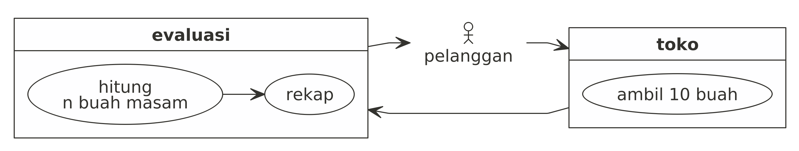
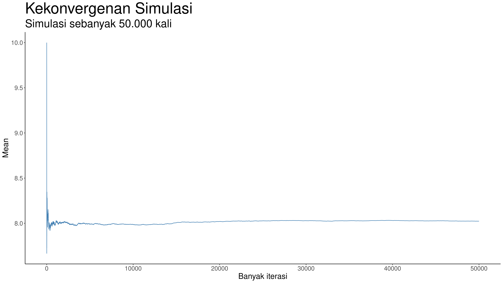

```{r setup, include=FALSE}
knitr::opts_chunk$set(echo = FALSE)
```

# MODELLING

## Model

\begin{columns}
\column{0.6\textwidth}

```{r out.width = '85%',echo=FALSE}

```

\column{0.4\textwidth}
A model is a tool to help us understand the complexities of the universe, and never a substitute for the universe itself. Nate Silver.
\end{columns}

## Mencari Solusi Model

Suatu permasalahan bisa dituliskan menjadi model matematis (termasuk statistik). Biasanya _goals_ dari model tersebut adalah untuk:

1. Mencari akar (_roots_).
1. Memaksimalkan atan meminimalkan (_optimize_).

## Mencari Solusi Model

Untuk menyelesaikan dan mencari solusi dari suatu model, setidaknya ada dua pendekatan yang bisa dilakukan:

1. Metode _exact_: menggunakan prinsip matematika (kalkulus dan aljabar) untuk mencari solusi.
    - _Advantages_: __pasti memberikan solusi terbaik__.
    - _Disadvantages_: Lama dan tidak semua masalah di dunia bisa dicari solusi eksaknya.
1. Metode _numeric_: menggunakan aproksimasi dengan prinsip-prinsip komputasi (_conditional_, _looping_, dan _sequence_).
    - _Advantages_: __belum tentu memberikan solusi terbaik__.
    - _Disadvantages_: Relatif cepat dan bisa untuk semua masalah.
    
## Mencari Solusi Model (lanjutan)

Sebenarnya ada satu lagi pendekatan yang bisa dilakukan, yakni:

Metode _heuristic_: menggunakan aproksimasi dengan prinsip komputasi __namun__ cara kerjanya terinspirasi dari kejadian-kejadian alam yang bersifat acak.

- _Advantages_: __belum tentu memberikan solusi terbaik__.
- _Disadvantages_: Relatif cepat. Apakah bisa untuk semua masalah? _No free lunch theorem_.

## Contoh Metode _Heuristic_

- _Artifical bee colony_ (_ABC_) _algorithm_. Terinspirasi dari koloni lebah yang selalu berkumpul mencari madu. Lebah akan dibagi menjadi lebah pekerja dan lebah _scout_.
- _Simulated annealing algorithm_. Terinspirasi dari pendinginan metal yang dilebur. Pada metode ini, kita akan menggunakan istilah `temperatur`, `cooling rate`, dan `epoch`.
- _Spiral optimization algorithm_. Terinspirasi dari bentuk-bentuk spiral yang ada di alam (orbit planet, kerang, dll). Pada metode ini, kita akan menggunakan istilah `rotasi` dan `kontraksi`.
- _Genetic algorithm_. Terinspirasi dari mutasi DNA akibat perkawinan silang. Pada metode ini, kita akan menggunakan istilah `populasi`, `kromosom`, `gen`, `allele`, `genotype`, `fenotype`, dll.

## Metode _Heuristic_

Saya akan bahas di tahun depan.

# SIMULASI

## _Definition_

- _Simulation is the operation of a model, which is a representation of that system._
- _A simulation uses a model to emulate the dynamic characteristics of a system._
- _The operation of the model can be studied, and then properties concerning the behavior of the actual system can be inferred._

## Dalam Bahasa Manusia

> Kita mungkin tidak bisa memiliki data dari suatu sistem. Namun jika kita tahu sifat-sifat dan karakteristik dari sistem tersebut, kita bisa membuat model yang bekerja layaknya sistem tersebut.

- _Mathematicians_ $\rightarrow$ tidak selalu membutuhkan data.
- _Statisticians_ $\rightarrow$ membutuhkan data.

## Monte Carlo

\begin{columns}
\column{0.7\textwidth}

```{r out.width = '85%',echo=FALSE}

```

\column{0.3\textwidth}
Diambil dari suatu nama daerah di Monaco yang memiliki banyak kasino dan tempat perjudian.
\end{columns}

## Simulasi Monte Carlo

__Prinsip__

> Melakukan sebanyak-banyaknya pengulangan model __secara acak__ untuk mencapai kondisi di mana _law of large number_ terpenuhi.

```{r out.width = '30%',echo=FALSE,fig.align='center'}

```

## _Flow chart_

```{r out.width = '50%',echo=FALSE,fig.align='center'}

```

[_Further reading_](https://ikanx101.com/blog/comp-think/)

## Simulasi Monte Carlo

___Advantages___

1. Tidak perlu menuliskan dan menurunkan formulasi matematika dari permasalahan.
1. Cukup menuliskan algoritma _random number generator_ sesuai kebutuhan.
1. Bisa digunakan untuk berbagai macam masalah _real_.

___Disdvantages___

1. Untuk permasalahan yang kompleks, butuh waktu yang lebih lama.
1. Tidak ada jaminan solusi yang didapatkan adalah yang paling optimal.

# _USE CASES_ I

## _Monty Hall Problem_

```{r out.width = '80%',echo=FALSE,fig.align='center'}

```


## _Monty Hall Problem_

```{r out.width = '70%',echo=FALSE,fig.align='center'}

```

## Algoritma _Monty Hall_ dalam _Single Round_

Berikut adalah algoritma _Monty Hall_ dalam satu babak:

```
pintu = 1:3
hadiah = sample(pintu,1)
pilih = sample(pintu,1)
buka = pintu[c(-pilih,-hadiah)]
  if(length(buka)>1){buka = sample(buka,1)}
decision = ifelse(pilih == hadiah,"stay","switch")
```

## Prinsip Simulasi untuk Menyelesaikan _Monty Hall_

### Prinsip Simulasi

Dari algoritma _single round_ di _slide_ sebelumnya, kita akan ulang ribuan kali untuk melihat seberapa mana `decision` terbaik dari sekian banyak kemungkinan _event_ yang terjadi.

## _Flowchart_ Simulasi Monte Carlo untuk _Monty Hall_

```{r out.width = '65%',echo=FALSE,fig.align='center'}

```

## Hasil Simulasi Monte Carlo untuk _Monty Hall_

```{r out.width = '70%',echo=FALSE,fig.align='center'}

```

# _USE CASES_ II

## _Resampling_ Data

Salah satu kegunaan dari simulasi _Monte Carlo_ adalah kita bisa melakukan _resampling_ memanfaatkan prinsip ini.

Sebagai contoh, tim _market research_ sering mendapatkan _request_ untuk menyamakan proporsi SES dari berbagai _Annual Research_ atau Riset _Media Habit_.

## Analogi

Di suatu toko buah, ada 4 jenis buah yang dijual yaitu: apel, jeruk, mangga, dan salak. Dari informasi _supplier_, diketahui:

1. Sebanyak 35 buah dari total 100 buah apel berasa masam.
1. Sebanyak 25 buah dari total 55 buah jeruk berasa masam.
1. Sebanyak 40 buah dari total 60 buah mangga berasa masam.
1. Sebanyak 15 buah dari total 75 buah salak berasa masam.

Setiap jenis buah ditempatkan di baknya masing-masing (terpisah) dan tidak bisa dibedakan secara kasat mata mana yang masam dan manis.

## Analogi (lanjutan)

Lalu seorang pelanggan datang dan mengambil:

- 4 buah apel,
- 8 buah jeruk,
- 3 buah mangga,
- 5 buah salak.

### Pertanyaannya

Berapa banyak buah masam yang bisa diperoleh pelanggan tersebut?

## Analogi (lanjutan)

Ada tiga kemungkinan yang bisa terjadi. Yakni:

1. Si pelanggan mengambil __semua buah masam__ (20 buah masam).
1. Si pelanggan __tidak mengambil buah yang masam__ sama sekali (0 buah masam).
1. Si pelanggan mengambil $1 \leq n \leq 19$ buah yang masam.

## Masalah Utama

Jadi masalahnya adalah menghitung kira-kira berapa buah masam yang berpeluang tinggi bisa diambil pelanggan (_expected value_).

## Prinsip Simulasi

Prinsip dari simulasi adalah dengan membuat seolah-olah ada banyak pelanggan datang, mengambil buah, lalu menghitung berapa banyak yang masam. Semua pelanggan akan direkap, rata-rata berapa banyak buah masam akan dihitung. 

## Ilustrasi Simulasi

```{r,include=FALSE}
nomnoml::nomnoml("
                 [<actor> pelanggan] -> [toko]
                 [toko] -> [evaluasi]
                 [evaluasi] -> [<actor> pelanggan]
                 
                 [evaluasi|
                  [<usecase> hitung\nn buah masam] -> [<usecase> rekap]]
                 [toko|
                  [<usecase> ambil 10 buah]]
                 ","resampling.png",700,300)
```

```{r out.width="100%",fig.align='center',echo=FALSE,fig.height=3,fig.width=7}

```

Simulasi akan mengulang-ulang proses di atas hingga ribuan bahkan jutaan kali.

## Algoritma Simulasi _Single Round_ {.allowframebreaks}

```
# probability
p_apel = 35/100
p_jeruk = 25/55
p_mangga = 40/60
p_salak = 15/75

# yang diambil pelanggan
n_apel = 4
n_jeruk = 8
n_mangga = 3
n_salak = 5


# simulasi
apel = sample(c(1,0),n_apel,replace = T,prob = c(p_apel,1-p_apel))
jeruk = sample(c(1,0),n_jeruk,replace = T,prob = c(p_jeruk,1-p_jeruk))
mangga = sample(c(1,0),n_mangga,replace = T,prob = c(p_mangga,1-p_mangga))
salak = sample(c(1,0),n_salak,replace = T,prob = c(p_salak,1-p_salak))
buah_busuk = sum(apel,jeruk,mangga,salak)
```

Kita hanya perlu mengulang-ulang algoritma di atas hingga hasilnya konvergen.

## Hasil Simulasi _Resampling_

Berikut adalah hasil simulasinya:

```{r out.width="65%",fig.align='center',echo=FALSE,fig.height=3,fig.width=7}

```

## _Resampling Annual Research_

Prinsip pada _slides_ sebelumnya bisa dengan mudah kita aplikasikan untuk melakukan _resampling_. Jika pada contoh sebelumnya kita __tidak memiliki data__ (hanya mengetahui parameter-parameter yang ada dalam data), pada _annual research_ atau _riset media habit_ kita memiliki data _real_-nya.

Caranya adalah dengan me-_random_ `id_resp` berdasarkan proporsi-proporsi yang diinginkan (misal `SES`, `range_usia`, `gender`, atau `wilayah`).


