layout: true

<div class="my-footer"><span>POK Nutrifood</span></div>

```{r setup, include=FALSE}
rm(list=ls())
#setwd("~/Live-Session-Nutrifood-R/LEFO Market Research/NRC Grant")
library(dplyr)
library(ggplot2)
library(ggpubr)
```

---
class: center, middle, inverse

# _WELCOME!_

---
class: center, middle, inverse

# APA FAEDAHNYA MATERI INI?
_Project_ yang kalian kerjakan bisa jadi terkait dengan data. Jika tidak, setidaknya materi ini bisa dijadikan bahan evaluasi apakah _project_ yang kalian kerjakan `berhasil` atau `tidak`, `impactful` atau `tidak`.

---

class: center, middle, inverse
# _WHY ANALYTICS MATTER?_
## _Kenapa sih harus pake beginian segala?_

---
class: center, middle

## ___Karena___
### ___Setiap perusahaan bisa menjual barang yang sama dan memberikan jasa yang sama kepada pelanggannya. Pembeda satu perusahaan dengan perusahaan lainnya adalah analytics.___
### Thomas Davenport, Professor Harvard.

```{r out.width = '35%',echo=FALSE}
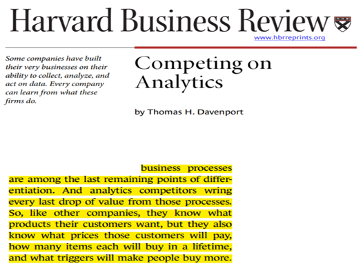
```

---
class: middle

# Apa itu _analytics_?

.pull-left[

### _Analytics_ bisa didefinisikan sebagai kemampuan perusahaan untuk mengeksplorasi dan mengeksploitasi data yang ada di internal dan eksternal organisasinya.

### __Matematika__ dan __statistika__ adalah _tools_ terbaik yang digunakan untuk melakukan _analytics_.

]

.pull-right[
```{r out.width = '75%',echo=FALSE}
knitr::include_graphics('analytics.jpg')
```
]

---
class: middle

# Limitasi dan Asumsi

.pull-left[

### _A model is a tool to help us understand the complexities of the universe, and never a substitute for the universe itself._

### Nate Silver, _American statistician and writer_.
]

.pull-right[
```{r out.width = '85%',echo=FALSE}
knitr::include_graphics('model.PNG')
```
]
---

# _Research Workflow_

## _Proper Steps_

Dalam setiap riset atau penelitan, alur pengerjaannya relatif sama seperti ini:


Setidaknya ada __tiga__ proses kritis dalam _flow_ tersebut, yakni:

1. Formulasi masalah.
2. _Design research_ dan pengumpulan data.
3. Analisa data.

---
class: middle
# Formulasi Masalah

## ___Salah dalam memformulasikan masalah akan menimbulkan masalah.___

---
class: middle
# _Design Research_

.pull-left[
## Kenapa ini menjadi penting?

> Tentunya kita ingin agar hasil _study_ kita bisa digeneralisasi ke populasi.

## Cara pengumpulan data:

- Observasi atau pengamatan.
- Percobaan, yakni respon individu atas kondisi tertentu.

]

.pull-right[
## Tiga prinsip dasar:

1. _Randomization_: setiap unit percobaan memiliki peluang yang sama untuk diberikan perlakuan,
1. _Replication_: Penerapan perlakuan terhadap beberapa unit percobaan, dan
1. Pengendalian kondisi: pengendalian kondisi-kondisi lingkungan yang berpotensi mempengaruhi respon dari perlakuan.

### Tujuan: Meminimalisir __BIAS__!

]

---
class: middle
# Analisa Data

```{r,include=FALSE}
nomnoml::nomnoml("
                 [Masalah] -> [Tujuan]
                 [Tujuan] -> [Data]
                 [Data] -> [Analisa]
                 [Analisa] --> [Masalah]
                 ",
                 "alur.png",
                 450,700)
```

```{r out.width = '85%',echo=FALSE}
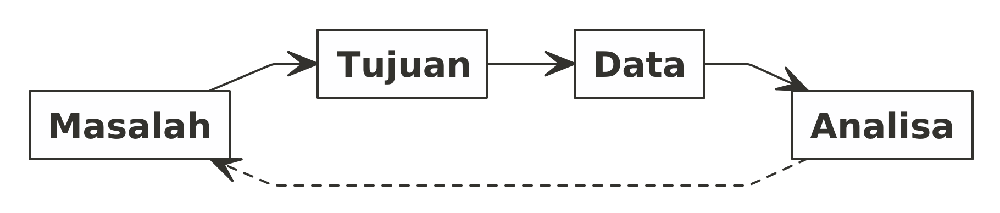
```

---
class: middle
# _Some Useful Framework_

.pull-left[

```{r,echo=FALSE,warning=FALSE,message=FALSE}
nomnoml::nomnoml("
                 [Masalah] -> [Tujuan]
                 [Tujuan] -> [Input]
                 [Input] -> [Proses]
                 [Proses] -> [Output]
                 [Tujuan] review <-- [Output] 
                 
                 [Proses|
                    [Function]
                    [Algorithm]
                    ]
                 
                 [Input|
                    [Data]
                    [Rules]
                    [Constraints]
                    [dsb]
                    ]
                    
                 ")
```

]

.pull-right[

```{r,echo=FALSE,warning=FALSE,message=FALSE}
nomnoml::nomnoml("
                 [S] -> [I]
                 [I] -> [P]
                 [P] -> [O]
                 [O] -> [C]
                 ")
```
]

---
class: center, middle
# Materi Hari Ini

```{r,include=FALSE}
nomnoml::nomnoml("#direction:right
                 [Materi Hari Ini] -> [Perkenalan dengan data]
                 [Materi Hari Ini] -> [Teknik sampling]
                 [Materi Hari Ini] -> [Analisa deskripsi]
                 [Materi Hari Ini] -> [Statistika inferensi|Uji hipotesis]
                 [Statistika inferensi] -> [Statistik Parametrik]
                 [Statistika inferensi] -> [Statistik Non Parametik]",
                 "materi.png", 
                 700, 
                 550)
```

```{r out.width = '85%',echo=FALSE}
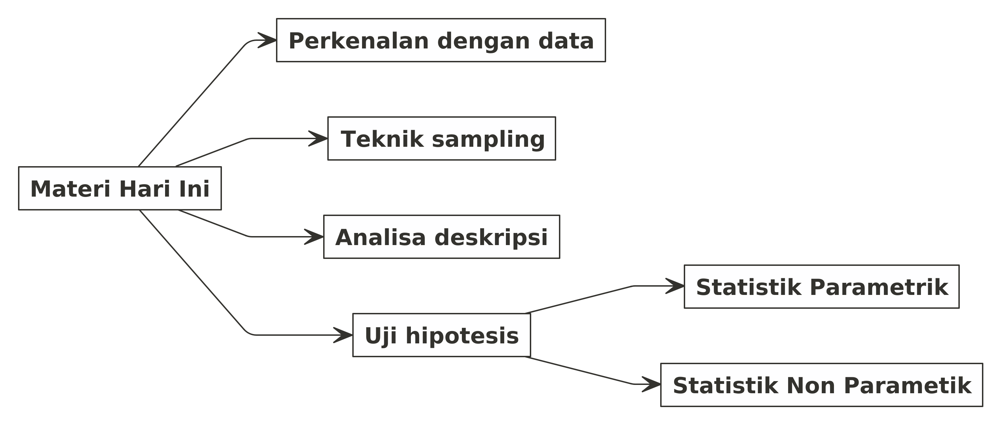
```

---
class: center, middle, inverse
# __Data__

---
# Data
### Definisi: 

__Representasi faktual dari suatu observasi.__

### Bentuk Data:

Bentuknya bermacam-macam, tidak hanya berupa tabel di __Ms. Excel__ saja. Contohnya seperti ini:

```{r out.width = '55%',echo=FALSE}
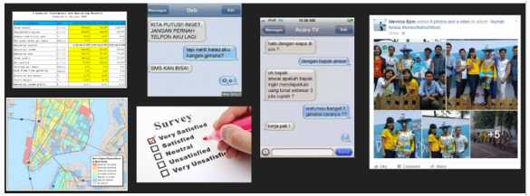
```

---
# Tipe Data

### Masing-masing tipe data memiliki cara tersendiri dalam menganalisa dan memahaminya.

```{r,include=FALSE}
nomnoml::nomnoml("[Data] -> [Qualitative]
                 [Data] -> [Quantitative]
                 [Qualitative] -> [Ordinal]
                 [Qualitative] -> [Nominal]
                 [Ordinal] -> [Urutan penting]
                 [Nominal] -> [Merepresentasikan Sesuatu]
                 [Quantitative] -> [Kontinu]
                 [Quantitative] -> [Diskrit]
                 [Kontinu] -> [Bilangan Real|(mengandung koma)]
                 [Diskrit] -> [Bilangan Bulat]",
                 "tipe_data.png", 
                 900, 
                 450)
```

```{r out.width = '65%',echo=FALSE}
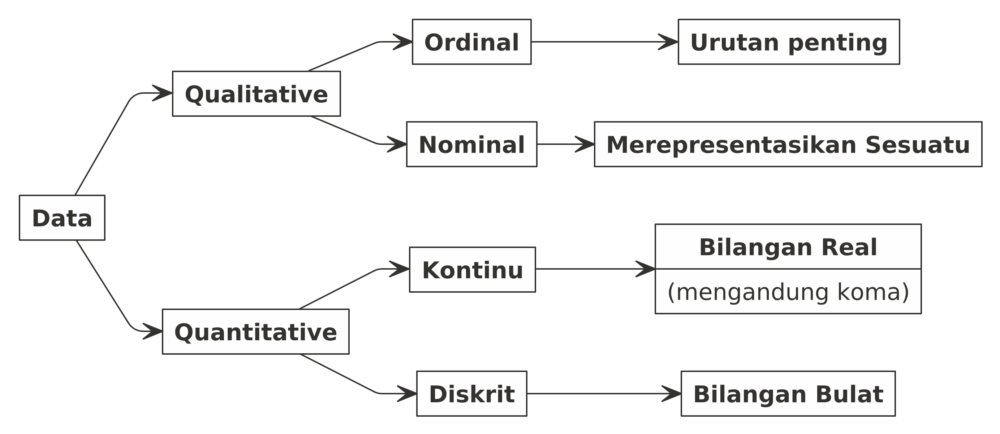
```

---
# _Data Qualitative_

## Contoh Sederhana

Misalkan dalam satu kelas _webinar_ berisi 10 orang peserta dengan _gender_:

1. 7 orang wanita
1. 3 orang pria

Apakah pernyataan berikut ini benar / salah?

___Rata-rata peserta webinar tersebut adalah wanita.___

--

### Pernyataan tersebut __SALAH__!

--

# Kenapa?

---
# Bagaimana cara menghitung rata-rata?

## Formula

$\bar{x} = \frac{\sum_{i=1}^{n} xi}{n}$

--

.pull-left[

## Sekarang kita hitung data kita:

Misalkan saya tulis `pria` sebagai `1` dan `wanita` sebagai `2`.

Maka didapatkan:

$\sum_{i=1}^{n} xi = 1+1+1+2+2+2+2+2+2+2 = 17$

$n = 10$

$\bar{x} = \frac{17}{10} = 1.7$

]

--

.pull-right[

## Apa arti `1.7`?

### Pria yang terlalu kewanitaan?
### Wanita yang agak kelaki-lakian?

]

--

## Pernyataan yang Tepat
### __Mayoritas__ peserta _webinar_ adalah wanita.


---
# Data Berdasarkan Sumbernya

### Berdasarkan sumbernya, data bisa dibagi menjadi dua:

.pull-left[

## Data Primer

> Data yang diambil dari sumber pertama.

Contoh: Data hasil_interview_, data dari mesin, data hasil observasi, dll.

]

.pull-right[

## Data Sekunder

> Data yang berasal dari sumber yang pernah diolah oleh orang lain.

Contoh: Data dari BPS, data covid dari situs Kawal Covid19, dll.

]

--

### Kapan kita memakai ___data primer___?

--

### Kapan kita memakai ___data sekunder___?

---

class: middle, center

```{r,include=FALSE}
nomnoml::nomnoml("
                 [Masalah] -> [Butuh Data]
                 [Butuh Data] -> [Ada data sekunder?]
                 [Ada data sekunder?] -> [Ada]
                 [Ada data sekunder?] -> [Tidak ada]
                 [Tidak ada] -> [Cari data primer]
                 [Ada] -> [Cek karakteristik]
                 [Cek karakteristik] -> [Masih relevan?]
                 [Masih relevan?] -> [Ya]
                 [Masih relevan?] -> [Tidak]
                 [Tidak] -> [Cari data primer]
                 [Ya] -> [Pakai data sekunder]
                 ",
                 "sekunder.png", 
                 900, 
                 450)
```

```{r out.width = '95%',echo=FALSE}
knitr::include_graphics("sekunder.png")
```

---

# Kualitas dari Suatu Data

## ___Data saya sudah bagus belum ya?___

--

Ada beberapa parameter yang bisa digunakan untuk menjawab pertanyaan tersebut:

1. Kualitas dari suatu data diukur dari __seberapa bisa data tersebut memenuhi kebutuhan analisis__.
    - Setelah itu baru dicek secara statistik: _blank_ data atau _extreme values_.

--
2. Data yang bagus biasanya berasal dari _random sampling_.

--
3. Untuk data yang diambil secara berulang-ulang (harian, mingguan, bulanan, tahunan, atau lainnya), pastikan bahwa cara pengambilan data harus sama.

---

# _Importance of Disclaimer_

## Apa yang menyebabkan hasil _survey_ / _study_ / penelitian tidak sesuai dengan kondisi _real_?

### Ingat bahwa setiap penelitian memiliki __limitasi__ dan __asumsi__. 

1. Perhatikan dengan seksama kondisi yang dilalui saat melakukan penelitian. Apakah ada perbedaan dengan kondisi _real_?
1. Perhatikan cara pengambilan data. Apakah ada _bias_ yang kita lakukan saat mengambil data?

--

## Contoh:

### Survey mengenai makanan favorit orang Indonesia tapi survey dilakukan di restoran RM Padang. Kira-kira makanan apa yang menjadi favorit `orang Indonesia` tersebut?

---
class: center, middle, inverse
# __Teknik Sampling__
---

# Teknik Sampling

.pull-left[
## Pertanyaannya:
### Kenapa saya harus melakukan _sampling_?
```{r out.width = '50%',echo=FALSE}
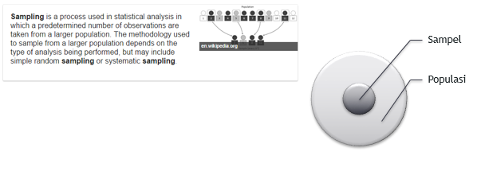
```
]

--

.pull-right[
## Karena kita tidak memiliki waktu, tenaga, dan biaya yang cukup untuk melakukan sensus.

### Sensus - Populasi
### Survey - _Sample_
]

--

## Populasi adalah keseluruhan / _universe_ dari target data yang hendak kita teliti. Sedangkan _sample_ adalah sebagian kecil dari populasi.

--

### Ekspektasi: _sample_ bisa mewakili populasi!

---

# Teknik Sampling

.pull-left[
## _Non probability sampling_

- _Convenience sampling_
- _Judgment sampling_
- _Quota sampling_
- _Snowball sampling_
]

.pull-right[
## _Probability sampling_

- _Simple random sampling_
- _Systematic sampling_
- _Stratified sampling_
- _Cluster sampling_
]

--

## Masih ingat pernyataan ini:

> _Data yang bagus biasanya berasal dari random sampling._

--

### Ada kalanya kita menggunakan teknik sampling _non probability_ saat harus mendapatkan data dengan kriteria yang sulit.

---
class: center, middle
# __Berapa jumlah sampel yang saya butuhkan?__

---
class: center, middle
# __Berapa jumlah sampel yang saya butuhkan?__
## Minimal 30 titik data
### Kesepakatan di internal @nutrifoodID sebagai minimal banyak data bisa dianalisa secara statistik.

--

## Lebih banyak lebih baik!
---
# Menghitung banyaknya sampel

.pull-left[
Secara praktis, jumlah sampel minimal untuk pengolahan data adalah `30` titik data.

Namun, untuk lebih tepat, dapat menggunakan _sample size calculator online_.

Minimal ada tiga informasi yang harus diketahui untuk menghitung berapa banyak _sample_ yang dibutuhkan, apa saja itu?

1. _Population size_; Apakah kita tahu berapa banyak populasi dari target penelitian kita?
2. _Margin of error_; Rentang kesalahan yang bisa diterima (_sample_ vs populasi = survey vs sensus).
3. _Confidence level_; Seberapa yakin survey kita akan menghasilkan hasil yang relatif sama jika dilakukan berulang kali.
]

.pull-right[
```{r out.width = '75%',echo=FALSE}
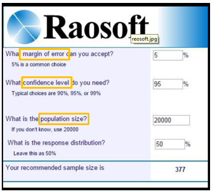
```
]

---

# Contoh

## Misalkan saya telah melakukan penelitian kepada `300` orang diabetes dengan _margin of error_ sebesar `3%` dan _confidence level_ sebesar `80%`.

### Saya mendapatkan bahwa `75%` dari responden suka dengan makanan manis.

## Bagaimana cara mengartikan _margin of error_ dan _confidence level_?

--

Jika hasil survey saya __dikembalikan__ ke populasi orang diabetes:

- $75 \pm 3$ % orang diabetes suka dengan makanan manis.
- Jika survey saya diulang `10` kali, maka `8` dari `10` pengulangan tersebut akan menghasilkan $75 \pm 3$ % orang diabetes suka dengan makanan manis.

---
class: center, middle, inverse

# _GETTING STARTED WITH DATA_

---
# _GETTING STARTED WITH DATA_

## Proses dalam Melakukan Analisa Data

Berikut adalah proses yang _proper_ dalam melakukan analisa data:

```{r,include=FALSE,echo=FALSE}
nomnoml::nomnoml("[Raw Data] -> [Data Preparation|Consistency Check|Structured dan Format Checked]
                 [Data Preparation] -> [Data Cleaning|Empty Cell(s)|Extreme value(s)]
                 [Data Cleaning] -> [Data Analysis]
                 [Data Analysis] -> [Data Visualization|Information|Insights]",
                 "getting.png", 
                 900, 
                 350)
```

```{r out.width = '80%',echo=FALSE}
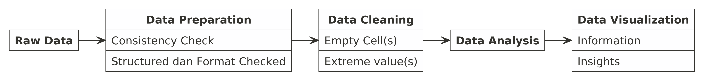
```

.pull-left[
Sebelum mulai melakukan analisa dan memahami data, kita harus melakukan proses _data preparation_ yang mencakup:

- _Consistency check_; yakni melihat konsistensi _content_ dari suatu _cells_ yang ada di __Ms. Excel__. Hal yang biasa dicek adalah:
  - Konsistensi antara `character` atau `number`.
  - Penggunaan tanda baca tertentu seperti: `,` atau `.`.
  - Standarisasi penulisan `character` di dalam _cell_.
  - _Structured_ dan _format checked_. 
]

.pull-right[
Proses _data cleaning_ mencakup:

- Ada kemungkinan kita menemui data yang kosong (bolong-bolong) __atau__ nilai pencilan (_extreme values_). Bagaimana menghadapi masalah ini?
  - Tidak ada jawaban baku untuk kasus ini!
  - Jangan terburu-buru untuk menghapus baris data tersebut! 
  - Kita bisa mengisi kekosongan data yang ada dengan nilai `mean`, `median`, atau `modus` tergantung dari tipe data yang kita miliki.
  
]

---

class: middle, center, inverse
# _Descriptive Analysis_

---
class: middle
# _Descriptive Analysis_

.pull-left[
### _Answers the questions what happened and why did it happen. Looks at past performance and understands that performance by mining historical data to look for the reasons behind past success or failure._
]

.pull-right[
```{r,include=FALSE}
nomnoml::nomnoml("[Analisa Deskriptif] -> [Pemusatan data|Persebaran data]
                 [Analisa Deskriptif] -> [Korelasi|Beda signifikan]
                 [Analisa Deskriptif] -> [Frekuensi tabulasi|Cross tabulasi]
                 [Analisa Deskriptif] -> [Distribusi|Fungsi distribusi]",
                 "deskriptif.png",
                 900, 
                 450)
```

```{r out.width = '75%',echo=FALSE}
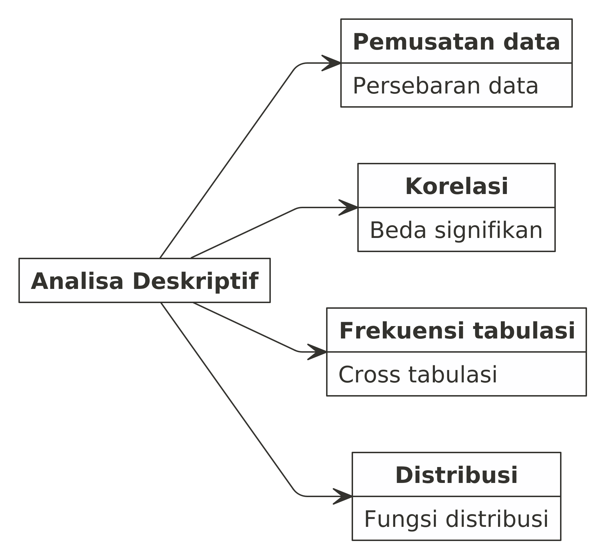
```

]

---
class: middle
# Pemusatan Data

.pull-left[
## Kenapa kita perlu menghitung pemusatan data?

### Pemusatan data adalah _satu nilai_ yang bisa mewakili keseluruhan data.
]

.pull-right[
## Tiga ukuran pemusatan data

- _Mean_, biasa dikenal dengan rata-rata.
  - Kelebihan: _Useful for other statistical analysis, such as: Annova, T-Test, Z-Test_.
  - Kekurangan: Sangat mudah terpengaruh oleh nilai pencilan.
  
- _Median_, biasa dikenal dengan nilai tengah.
  - Kelebihan: Tidak mudah terpengaruh oleh nilai pencilan.
  - Kekurangan: _Very limited statistical use_.
  
- _Modus_, biasa dikenal dengan nilai yang paling sering muncul.
  - Kelebihan: Tidak mudah terpengaruh oleh nilai pencilan.
  - Kekurangan: _Very limited statistical use_.
]

---

class: middle, center
# QUIZ

### _Siapa yang terbaik di antara keduanya?_

```{r,echo=FALSE}
knitr::include_graphics("https://passingthroughresearcher.files.wordpress.com/2019/01/central-tendency.png")
```

---

class: middle,center

# INTERPRETASI

--
### Modus: Konsistensi

--
### Mean: Rata-rata (_obviously_)

--
### Median?

---

class: middle,center

# INTERPRETASI MEDIAN

## Bayangkan sebuah perlombaan lari

```{r,echo=FALSE}
knitr::include_graphics("https://raw.githubusercontent.com/ikanx101/ikanx101.github.io/master/_posts/QnA%20NBC%20Sep/animated.gif")
```

---

class: middle
# SEBARAN DATA

.pull-left[
### Statistik yang digunakan untuk mengukur variasi antara lain:

- Variansi
- Standar deviasi
- Range (max - min)
]

.pull-right[
### _Is variation a bad thing?_

Mengutip dari buku ___Four Lenses___:

_Only if its caused by special cause_.

- __Common cause__: _flaws inherited in the design of the process_.
- __Special cause__: _variations from standards cause by employee and/or unusual circumstance / event_.
]

---
# Korelasi

.pull-left[
## Definisi

Secara definisi statistika, korelasi adalah:

> __Linear strength and direction__ of a relationship between two variables.

## _Keywords_

Ada tiga _keywords_ yang penting pada definisi tersebut, yakni:

1. _Variables_, yakni dua variabel yang ingin dicek hubungannya.
2. _Linear Strengh_, menandakan seberapa kuat kedua variabel tersebut secara linear.
3. _Direction_, menandakan arah dari hubungan kedua variabel tersebut.

]

.pull-right[
## Penting
Ada hal penting yang perlu diperhatikan saat kita hendak melakukan analisa korelasi. Apa itu?

1. Pastikan kedua variabel yang akan kita uji secara logis dapat dihubungkan.
2. Kedua variabel tersebut harus berupa numerik.

Masih ingat dengan tipe-tipe data?

```{r out.width = '70%',echo=FALSE}

```

Jadi, hanya data kuantitatif saja yang bisa dihitung korelasinya.
]

---
class: middle

# Hal yang Penting Sebelum Melakukan Analisa Korelasi
### Variabel dengan tipe data kualitatif

Jadi jika saya memiliki data kualitatif, apakah tidak bisa dihitung korelasinya?

> Jawabannya: tetap bisa

Namun tidak menggunakan metode yang selama ini umum digunakan. Karena saat kita berbicara mengenai korelasi, sebenarnya kita hanya membicarakan hubungan dari dua data kuantitatif saja.

---
class: middle
# Cara Menghitung Korelasi

.pull-left[
Sebagaimana kita ketahui, perhitungan statistik itu ada dua macam. 

Hal ini juga mempengaruhi cara kita menghitung korelasi.

- Pearson, menggunakan parametrik.
- Spearman, menggunakan non parametrik.

Secara _default_, __Ms. Excel__ menggunakan cara perhitungan parametrik (__Pearson__). Oleh karena itu harap kita perhatikan saat kita hendak menghitung korelasi di __Ms. Excel__.
]

.pull-right[
```{r out.width = '83%',echo=FALSE}
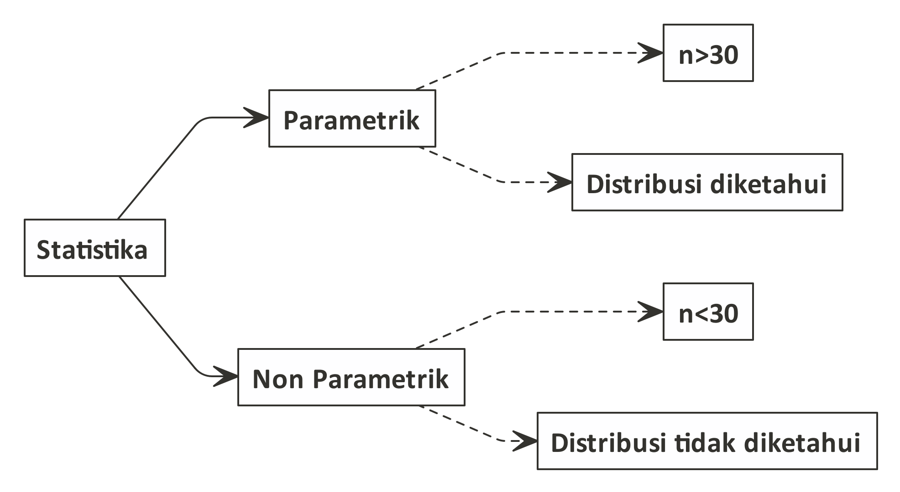
```
]

---
class: middle

# Korelasi Bukan Berarti Kausalitas!

```{r out.width = '83%',echo=FALSE}
knitr::include_graphics("https://miro.medium.com/max/2400/1*LMH2Z_KaYMCLZ9690br8AA.png")
```

---

# Beda Signifikan

.pull-left[

## Seringkali kita dihadapkan pada data berbentuk nominal atau ordinal.

```{r out.width = '83%',echo=FALSE}

```
]

.pull-right[
## Contoh:
Suatu produk makanan berencana untuk memasang iklan di NET TV dan Indosiar. Sebelumnya, mereka mendapatkan data bahwa `44,7%` target marketnya menonton NET TV sementara `42,5%` target marketnya menonton Indosiar.

### Di stasiun TV mana mereka sebaiknya memasang iklan?
]

--

### Jawaban:

Persentase yang tinggi belum cukup untuk membuat kesimpulan bahwa NET TV lebih banyak ditonton dibanding Indosiar. Secara statistik, harus dibuktikan terlebih dahulu bahwa NET TV lebih tinggi dan signifikan perbedaannya!

--

Nama uji: __Uji beda dua proporsi__.

---
class: center, middle, inverse
# Statistika Inferensi
## Uji Hipotesis

---
class: middle
# Statistika Inferensi
## Uji Hipotesis

Statistika inferensi: pengambilan keputusan berdasarkan uji hipotesis secara statistik.

.pull-left[
### Beberapa uji signifikansi yang sering digunakan:

1. Beda dua proporsi (tadi sudah dibahas: Iklan di NET vs Indosiar).
2. Beda rata - rata dari satu sampel (z-test dan t-test).
2. Beda rata - rata dari dua sampel (z-test dan t-test).
3. Beda rata - rata dari tiga atau lebih sampel (Annova).
]

--

.pull-right[
### Langkah - langkah uji hipotesis:

- Tentukan hipotesis nol dan hipotesis tandingan.
    - Notasi: $H_0$ dan $H_1$
    - Hipotesis nol adalah hipotesis yang mengandung unsur sama dengan.
- Hitung statistik uji atau p-value.
- Kesimpulan: Tolak $H_0$ jika $p_{value} < 0.05$.
    - Kenapa dipilih nilai `0.05`?
    - Nilai tersebut sebenarnya bisa kita ganti tergantung seberapa besar atau kecil akurasi pengujian yang kita lakukan.
    - Nilai `0.05` yang digunakan biasanya lazim dipakai pada banyak kasus.
    - Penjelasan terkait nilai `0.05` atau $\alpha$ atau yang biasa disebut sebagai ___significance level___ bisa rekan-rekan cari di berbagai sumber.
- Tuliskan kesimpulan dengan kalimat non matematis.
]

---
class: middle
# Statistika Inferensi
## Z-Test vs T-test

Kapan pakai Z-Test? Kapan pakai T-Test?

1. Menggunakan __z-test__: digunakan jika kita mengetahui parameter variansi dari populasi.
1. Menggunakan __t-test__: digunakan jika kita tidak mengetahui parameter variansi dari populasi sehingga variansi populasi akan kita dekati dengan variansi dari _sample_.

---
class: middle
# Statistika Inferensi
## Uji Beda Rata-Rata Dua Sampel

Perlu saya ingatkan kembali bahwa __uji mean 2 sample__ ada dua jenis, yakni:

1. Uji untuk dua data berpasangan: dilakukan jika __subjek penelitian sama dan ingin melihat apakah perlakuan yang ada memberikan dampak terhadap perubahan mean data atau tidak__. Contoh: peneliti hendak menguji apakah ada perbedaan nilai _pre test_ dan _post test_ dari suatu kelompok murid dalam mengikuti suatu pelatihan. Pada uji ini, kedua _sample_ wajib memiliki jumlah baris yang sama.
1. Uji untuk data independen: dilakukan jika __dua kelompok sample yang diuji tidak saling berkaitan sama sekali__. Pada uji ini, tidak ada keharusan jumlah baris data dari kedua _sample_ harus sama (bisa berbeda).

---
# Statistika Inferensi
## Antara Parametrik dan Non Parametrik

```{r,include=FALSE}
nomnoml::nomnoml("[Uji Hipotesis] -> [Parametrik|Uji statistik yang\nselama ini dipelajari]
                 [Uji Hipotesis] -> [Non Parametrik|Uji statistik yang\njarang diketahui]
                 [Parametrik] -> [Sampel banyak|n>30]
                 [Parametrik] -> [Distribusi diketahui|Normal atau lainnya]
                 [Non Parametrik] -> [Sampel sedikit|n<30]
                 [Non Parametrik] -> [Distribusi tidak diketahui|Bukan normal]",
                 "parnonpar.png", 
                 900, 
                 550)
```

.pull-left[

```{r out.width = '90%',echo=FALSE}
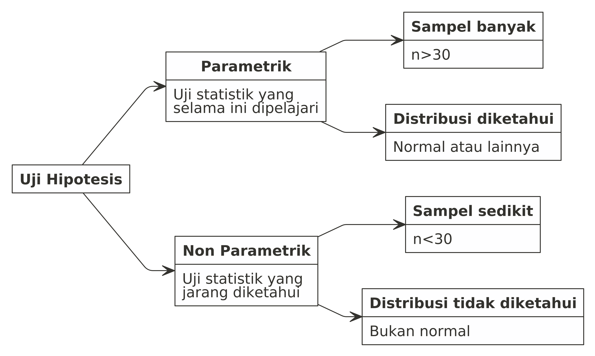
```

]

.pull-right[

> ___Selama ini kita banyak mempelajari dan mendiskusikan mengenai statistika parametrik. Padahal ada limitasi pada analisa parametrik.___

### Kesimpulan:

- Sesuaikan metode analisa dengan ketersediaan data dan distribusi dari data.
- Analisa yang ada pada parametrik juga bisa dilakukan dengan non parametrik.

]

---
class: middle
# Parametrik vs Non Parametrik

```{r,include=FALSE}
nomnoml::nomnoml("[Pengujian] -> [beda 2 mean independen|parametrik: t test dan z test|non parametrik: mann-whitney u]
                 [Pengujian] -> [beda 2 mean dependen|parametrik: paired t test|non parametrik: wilcoxxon sign rank]
                 [Pengujian] -> [beda 3 mean atau lebih|parametrik: annova|non parametrik: kruskal wallis]
                 [Pengujian] -> [korelasi|parametrik: pearson|non parametrik: spearman]
                 ",
                 "parnonpar new.png", 
                 900, 
                 550,
                 direction = down)
```

.pull-left[

```{r out.width = '60%',echo=FALSE}
knitr::include_graphics("parnonpar new.png")
```

]

.pull-right[

## ___Gunakan sesuai kebutuhan!___

]

---

class: middle, center, inverse

## Terima Kasih
# Nutrifood Indonesia

### _find me at:_ ikanx101.com

---

class: middle,center,inverse
# CONTOH-CONTOH KASUS YANG SERING DITEMUI
## Berikut adalah beberapa contoh kasus yang sering ditemui saat _colloqium_

---

# CONTOH I

### Saya hendak membandingkan _service level_ antara dua _supplier_.

# CONTOH II

### Saya hendak membandingkan _service level_ antara tiga _supplier_.

# CONTOH III

### Saya hendak membandingkan apakah _service level_ suatu _supplier_ sudah sesuai dengan spek standar Nutrifood.

# CONTOH IV

### Saya hendak melihat apakah _improvement_ yang saya lakukan bisa menaikkan _sales_ atau tidak.

