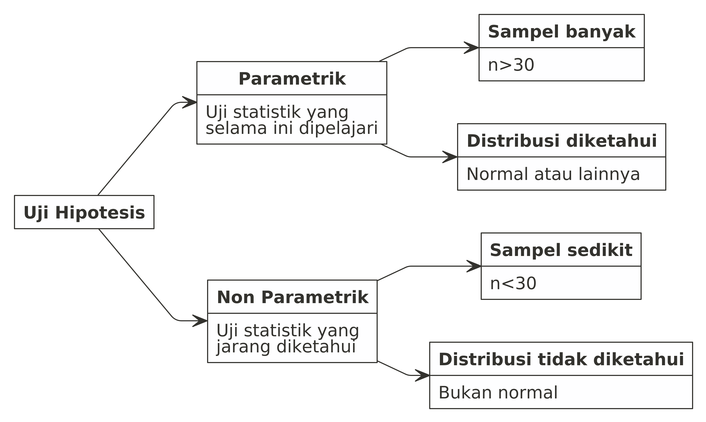
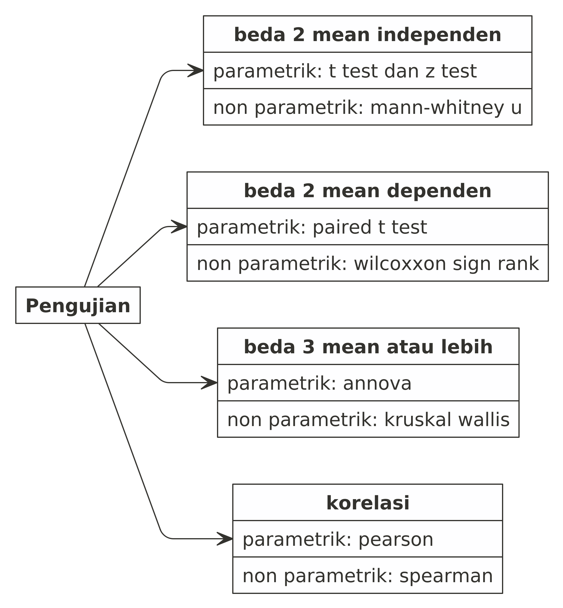

layout: true

<div class="my-footer"><span>Colloqium Nutrifood</span></div>

```{r setup, include=FALSE}
rm(list=ls())
library(dplyr)
library(ggplot2)
library(ggpubr)
```

---

class: center, middle, inverse
# Statistika Inferensi
## Uji Hipotesis

---
class: middle
# Statistika Inferensi
## Uji Hipotesis

Statistika inferensi: pengambilan keputusan berdasarkan uji hipotesis secara statistik.

.pull-left[
### Beberapa uji signifikansi yang sering digunakan:

1. Beda dua proporsi.
2. Beda rata - rata dari satu sampel (z-test dan t-test).
2. Beda rata - rata dari dua sampel (z-test dan t-test).
3. Beda rata - rata dari tiga atau lebih sampel (Annova).
]

--

.pull-right[
### Langkah - langkah uji hipotesis:

- Tentukan hipotesis nol dan hipotesis tandingan.
    - Notasi: $H_0$ dan $H_1$
    - Hipotesis nol adalah hipotesis yang mengandung unsur sama dengan.
- Hitung statistik uji atau p-value.
- Kesimpulan: Tolak $H_0$ jika $p_{value} < 0.05$.
    - Kenapa dipilih nilai `0.05`?
    - Nilai tersebut sebenarnya bisa kita ganti tergantung seberapa besar atau kecil akurasi pengujian yang kita lakukan.
    - Nilai `0.05` yang digunakan biasanya lazim dipakai pada banyak kasus.
    - Penjelasan terkait nilai `0.05` atau $\alpha$ atau yang biasa disebut sebagai ___significance level___ bisa rekan-rekan cari di berbagai sumber.
- Tuliskan kesimpulan dengan kalimat non matematis.
]

---
class: middle
# Statistika Inferensi

.pull-left[
## Contoh:
Suatu produk makanan berencana untuk memasang iklan di NET TV dan Indosiar. Sebelumnya, mereka mendapatkan data bahwa `44,7%` target marketnya menonton NET TV sementara `42,5%` target marketnya menonton Indosiar.

### Di stasiun TV mana mereka sebaiknya memasang iklan?
]

--

.pull-right[
## Jawaban:

Persentase yang tinggi belum cukup untuk membuat kesimpulan bahwa NET TV lebih banyak ditonton dibanding Indosiar. Secara statistik, harus dibuktikan terlebih dahulu bahwa NET TV lebih tinggi dan signifikan perbedaannya!
]

--

### Nama uji: 

#### __Uji beda dua proporsi__.

---
class: middle
# Statistika Inferensi
## Z-Test vs T-test

Kapan pakai Z-Test? Kapan pakai T-Test?

1. Menggunakan __z-test__: digunakan jika kita mengetahui parameter variansi dari populasi.
1. Menggunakan __t-test__: digunakan jika kita tidak mengetahui parameter variansi dari populasi sehingga variansi populasi akan kita dekati dengan variansi dari _sample_.

---
class: middle
# Statistika Inferensi
## Uji Beda Rata-Rata Dua Sampel

Perlu saya ingatkan kembali bahwa __uji mean 2 sample__ ada dua jenis, yakni:

1. Uji untuk dua data berpasangan: dilakukan jika __subjek penelitian sama dan ingin melihat apakah perlakuan yang ada memberikan dampak terhadap perubahan mean data atau tidak__. Contoh: peneliti hendak menguji apakah ada perbedaan nilai _pre test_ dan _post test_ dari suatu kelompok murid dalam mengikuti suatu pelatihan. Pada uji ini, kedua _sample_ wajib memiliki jumlah baris yang sama.
1. Uji untuk data independen: dilakukan jika __dua kelompok sample yang diuji tidak saling berkaitan sama sekali__. Pada uji ini, tidak ada keharusan jumlah baris data dari kedua _sample_ harus sama (bisa berbeda).

---
# Statistika Inferensi
## Antara Parametrik dan Non Parametrik

```{r,include=FALSE}
nomnoml::nomnoml("[Uji Hipotesis] -> [Parametrik|Uji statistik yang\nselama ini dipelajari]
                 [Uji Hipotesis] -> [Non Parametrik|Uji statistik yang\njarang diketahui]
                 [Parametrik] -> [Sampel banyak|n>30]
                 [Parametrik] -> [Distribusi diketahui|Normal atau lainnya]
                 [Non Parametrik] -> [Sampel sedikit|n<30]
                 [Non Parametrik] -> [Distribusi tidak diketahui|Bukan normal]",
                 "parnonpar.png", 
                 900, 
                 550)
```

.pull-left[

```{r out.width = '90%',echo=FALSE}

```

]

.pull-right[

> ___Selama ini kita banyak mempelajari dan mendiskusikan mengenai statistika parametrik. Padahal ada limitasi pada analisa parametrik.___

### Kesimpulan:

- Sesuaikan metode analisa dengan ketersediaan data dan distribusi dari data.
- Analisa yang ada pada parametrik juga bisa dilakukan dengan non parametrik.

]

---
class: middle
# Parametrik vs Non Parametrik

```{r,include=FALSE}
nomnoml::nomnoml("[Pengujian] -> [beda 2 mean independen|parametrik: t test dan z test|non parametrik: mann-whitney u]
                 [Pengujian] -> [beda 2 mean dependen|parametrik: paired t test|non parametrik: wilcoxxon sign rank]
                 [Pengujian] -> [beda 3 mean atau lebih|parametrik: annova|non parametrik: kruskal wallis]
                 [Pengujian] -> [korelasi|parametrik: pearson|non parametrik: spearman]
                 ",
                 "parnonpar new.png", 
                 900, 
                 550,
                 direction = down)
```

.pull-left[

```{r out.width = '60%',echo=FALSE}

```

]

.pull-right[

## ___Gunakan sesuai kebutuhan!___

]

---

class: middle,center,inverse
# CONTOH-CONTOH KASUS YANG SERING DITEMUI
## Berikut adalah beberapa contoh kasus yang sering ditemui saat _colloqium_

---

# CONTOH I

### Saya hendak membandingkan _service level_ antara dua _supplier_.

# CONTOH II

### Saya hendak membandingkan _service level_ antara tiga _supplier_.

# CONTOH III

### Saya hendak membandingkan apakah _service level_ suatu _supplier_ sudah sesuai dengan spek standar Nutrifood.

# CONTOH IV

### Saya hendak melihat apakah _improvement_ yang saya lakukan bisa menaikkan _sales_ atau tidak.

---
class: middle, center, inverse

## Terima Kasih
# Nutrifood Indonesia

### _find me at:_ ikanx101.com