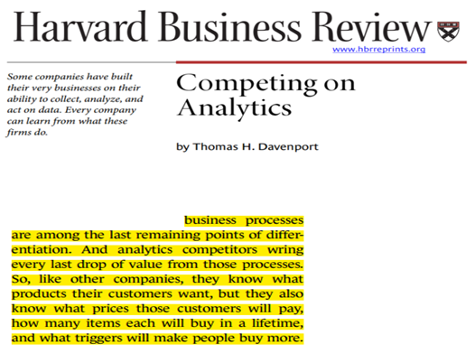
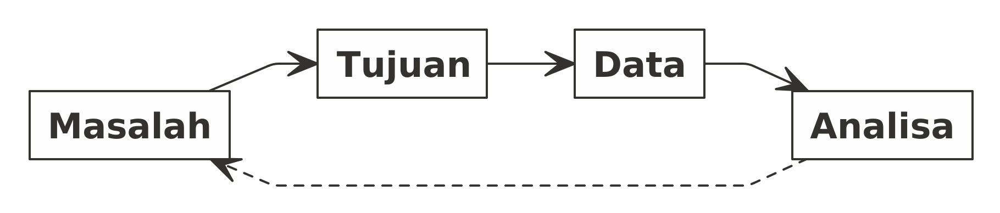
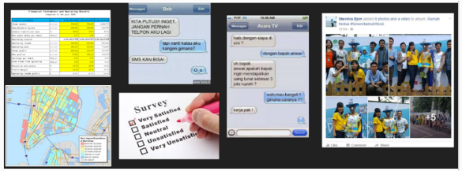
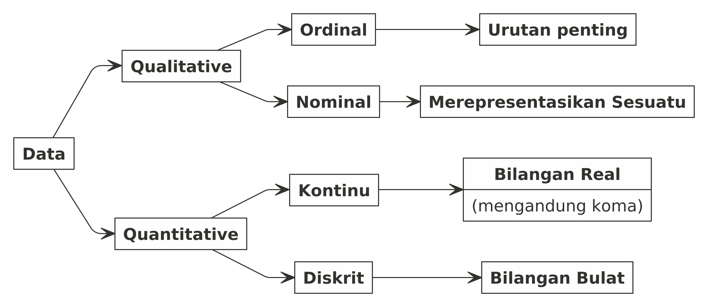

layout: true

<div class="my-footer"><span>NRC Fellowship 2021</span></div>

```{r setup, include=FALSE}
rm(list=ls())
setwd("~/Documents/Live-Session-Nutrifood-R/LEFO Market Research/NRC Grant")
library(dplyr)
library(ggplot2)
library(ggpubr)
```

---
class: middle, center
# ___Congrats!___

---
class: middle, center
# ___Kita pemanasan dulu ya...___

---
class: center, middle, inverse
# _WHY ANALYTICS MATTER?_

---
class: center, middle

## ___Karena___
### ___Setiap perusahaan bisa menjual barang yang sama dan memberikan jasa yang sama kepada pelanggannya. Pembeda satu perusahaan dengan perusahaan lainnya adalah analytics.___
### Thomas Davenport, Professor Harvard.

```{r out.width = '35%',echo=FALSE}

```

---
class: middle

# Apa itu _analytics_?

.pull-left[

### _Analytics_ bisa didefinisikan sebagai kemampuan perusahaan untuk mengeksplorasi dan mengeksploitasi data yang ada di internal dan eksternal organisasinya.

### __Matematika__ dan __statistika__ adalah _tools_ terbaik yang digunakan untuk melakukan _analytics_.

]

.pull-right[
```{r out.width = '75%',echo=FALSE}
knitr::include_graphics('analytics.jpg')
```
]

---
class: middle

# Limitasi dan Asumsi

.pull-left[

### _A model is a tool to help us understand the complexities of the universe, and never a substitute for the universe itself._

### Nate Silver, _American statistician and writer_.
]

.pull-right[
```{r out.width = '85%',echo=FALSE}
knitr::include_graphics('model.PNG')
```
]
---

# _Research Workflow_

## _Proper Steps_

Dalam setiap riset atau penelitan, alur pengerjaannya relatif sama seperti ini:


Setidaknya ada __tiga__ proses kritis dalam _flow_ tersebut, yakni:

1. Formulasi masalah.
2. _Design research_ dan pengumpulan data.
3. Analisa data.

---
class: center, middle
# Ingat baik-baik!

```{r,include=FALSE}
nomnoml::nomnoml("
                 [Masalah] -> [Tujuan]
                 [Tujuan] -> [Data]
                 [Data] -> [Analisa]
                 [Analisa] --> [Masalah]
                 ",
                 "alur.png",
                 450,700)
```

```{r out.width = '85%',echo=FALSE}

```

---
class: center, middle
# Materi Hari Ini

```{r,include=FALSE}
nomnoml::nomnoml("#direction:right
                 [Materi Hari Ini] -> [Perkenalan dengan data]
                 [Materi Hari Ini] -> [Teknik sampling]
                 [Materi Hari Ini] -> [Analisa deskripsi]
                 [Materi Hari Ini] -> [Uji hipotesis]
                 [Uji hipotesis] -> [Statistik Parametrik]
                 [Uji hipotesis] -> [Statistik Non Parametik]",
                 "materi.png", 
                 700, 
                 550)
```

```{r out.width = '85%',echo=FALSE}
knitr::include_graphics('materi.png')
```

---
class: center, middle, inverse
# __Data__

---
# Data
### Definisi: 

__Representasi faktual dari suatu observasi.__

### Bentuk Data:

Bentuknya bermacam-macam, tidak hanya berupa tabel di __Ms. Excel__ saja. Contohnya seperti ini:

```{r out.width = '55%',echo=FALSE}

```

---
# Tipe Data

### Masing-masing tipe data memiliki cara tersendiri dalam menganalisa dan memahaminya.

```{r,include=FALSE}
nomnoml::nomnoml("[Data] -> [Qualitative]
                 [Data] -> [Quantitative]
                 [Qualitative] -> [Ordinal]
                 [Qualitative] -> [Nominal]
                 [Ordinal] -> [Urutan penting]
                 [Nominal] -> [Merepresentasikan Sesuatu]
                 [Quantitative] -> [Kontinu]
                 [Quantitative] -> [Diskrit]
                 [Kontinu] -> [Bilangan Real|(mengandung koma)]
                 [Diskrit] -> [Bilangan Bulat]",
                 "tipe_data.png", 
                 900, 
                 450)
```

```{r out.width = '65%',echo=FALSE}

```

---
# _Data Qualitative_

## Contoh Sederhana

Misalkan dalam satu kelas _webinar_ berisi 10 orang peserta dengan _gender_:

1. 7 orang wanita
1. 3 orang pria

Apakah pernyataan berikut ini benar / salah?

___Rata-rata peserta webinar tersebut adalah wanita.___

--

### Pernyataan tersebut __SALAH__!

--

# Kenapa?

---

# Bagaimana cara menghitung rata-rata?

## Formula

$\bar{x} = \frac{\sum_{i=1}^{n} xi}{n}$

--

## Sekarang kita hitung data kita:

.pull-left[

Misalkan saya tulis `pria` sebagai `1` dan `wanita` sebagai `2`.

Maka didapatkan:

$\sum_{i=1}^{n} xi = 1+1+1+2+2+2+2+2+2+2 = 17$

$n = 10$

$\bar{x} = \frac{17}{10} = 1.7$

]

--

.pull-right[

## Apa arti `1.7`?

### Pria yang terlalu kewanitaan?

]

--
## Pernyataan yang Tepat
### __Mayoritas__ peserta _webinar_ adalah wanita.

---
class: middle

# Data Berdasarkan Sumbernya

### Berdasarkan sumbernya, data bisa dibagi menjadi dua:

.pull-left[

## Data Primer

> Data yang diambil dari sumber pertama.

Contoh: Data hasil_interview_, data dari mesin, data hasil observasi, dll.

]

.pull-right[

## Data Sekunder

> Data yang berasal dari sumber yang pernah diolah oleh orang lain.

Contoh: Data dari BPS, data covid dari situs Kawal Covid19, dll.

]

--

### Kapan kita memakai ___data primer___?

--

### Kapan kita memakai ___data sekunder___?

---

# Kualitas dari Suatu Data

## ___Data saya sudah bagus belum ya?___

--

Ada beberapa parameter yang bisa digunakan untuk menjawab pertanyaan tersebut:

1. Kualitas dari suatu data diukur dari __seberapa bisa data tersebut memenuhi kebutuhan analisis__.
    - Setelah itu baru dicek secara statistik: _blank_ data atau _extreme values_.
1. Data yang bagus biasanya berasal dari _random sampling_.
1. Untuk data yang diambil secara berulang-ulang (harian, mingguan, bulanan, tahunan, atau lainnya), pastikan bahwa cara pengambilan data harus sama.

---

# _Importance of Disclaimer_

## Apa yang menyebabkan hasil _survey_ / _study_ / penelitian tidak sesuai dengan kondisi _real_?

### Ingat bahwa setiap penelitian memiliki __limitasi__ dan __asumsi__. 

1. Perhatikan dengan seksama kondisi yang dilalui saat melakukan penelitian. Apakah ada perbedaan dengan kondisi _real_?
1. Perhatikan cara pengambilan data. Apakah ada _bias_ yang kita lakukan saat mengambil data?

--

## Contoh:

### Survey mengenai makanan favorit orang Indonesia tapi survey dilakukan di restoran RM Padang. Kira-kira makanan apa yang menjadi favorit `orang Indonesia` tersebut?

---


---

Apa saja statistical analysis yang dapat digunakan pada penelitian yang menggunakan manusia ?

Manakah metode analisis yang  lebih tepat untuk produk biskuit fungsional; analisis hubungankah (regresi korelasi) ?  atau analisis perbedaan (anova dan post hoc test) ? atau cukup analisis statistik deskriptif (mean dan standart deviasi) saja?

Bagaimana metode pengujian (analisis statistik) untuk optimasi (mencari titik optimal) dari variable independent dan dependent (X,Y) bagi karakter gizi, antioksidan dan fisik produk pangan fungsional (biscuit) ?

Apakah masih perlu dilakukan analisis statistik untuk data dari variable-variabel penelitian yang telah dianalisis kadarnya/besarannya dengan peralatan-peralatan laboratorium yang canggih seperti Spectrophotometer, HPLC, Bomb Calorymetry, Elisa dan Instron Texturemetry, Loyd Material Testing Machine ?

Bagaimana menentukan uji statistik yang tepat dalam suatu penelitian eksperimen?

Apa saja pengolahan data yang wajib dilampirkan ketika melaporkan data (selain standar deviasi dan sebagainya)?

Bagaimanakah cara terbaik menyajikan analisis perhitungan dalam sebiuah penelitian, dan parameter apa saja yang mengindikasikan bahwa hasil analisis tersebut tepat dan akurat ? 

Bagaimana cara kita mengetahui apakah analisis perhitungan tersebut telah efektif dan efisien ?

---

Berdasarkan pengalaman Bapak dan Ibu, apa saja dasar-dasar melaporkan data yang baik secara visualisasi dan penjelasan?

Seberapa penting peranan konsep dan statistik analisis dalam penelitian atau mendorong peningkatan suatu produk ?

dalam sebuah penelitian kita membutuhkan data-data penunjang, bagaimana cara mendapatkan data-data penelitian?

Bagaimana menyeleraskan konsep yang ada dengan statistik keadaan sebenarnya?

 

---

class: middle, center, inverse

# Terima Kasih
### find me at: ikanx101.com