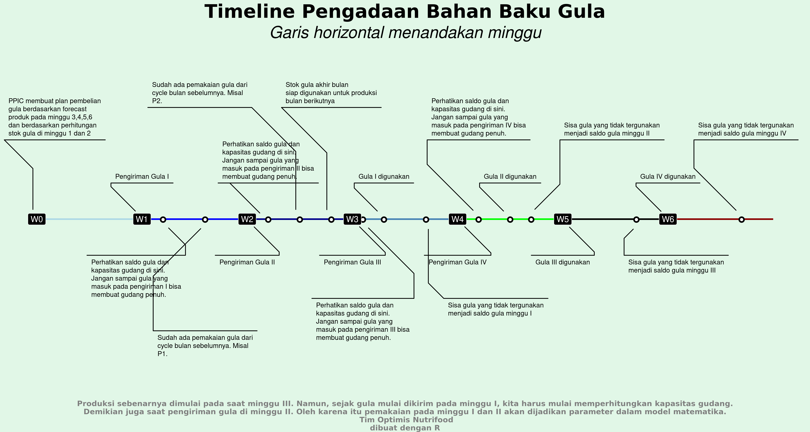

```{r setup, include=FALSE}
knitr::opts_chunk$set(echo = TRUE)
options(scipen = 99)
```

\newpage
\tableofcontents
\pagebreak

# Kata Pengantar {-}

*Alhamdulillah*, *training optimization* telah selesai dilakukan. Peserta merupakan *Nutrifooders* dari tim *market research* dan beberapa tim *member* dari departemen lain yang terkait.

Diharapkan *training* ini memberikan wawasan baru terkait penggunaan metode matematika untuk menyelesaikan masalah *optimization* yang terjadi di banyak area kerja Nutrifood.

Tentunya kalian mungkin menemukan _typo_ pada materi ini. Beberapa materi awal merupakan _copy-paste_ langsung dari materi __FinanMos__ sedangkan pada kasus-kasus merupakan penulisan ulang dari materi __FinanMos__.

Pada beberapa kasus, kalian mungkin juga menemukan perbedaan cara saya menuliskan indeks pada _decision variable_. Itu tidak menjadi masalah karena notasi bisa berbeda tergantung cara penulisan.

Semoga bisa berguna.

Bekasi, 19 April 2021.

Pengepul materi *training*,

Ikang Fadhli

\pagebreak

# Pendahuluan

Catatan ini berisi *R Markdown* penyelesaian dari beberapa kasus yang diberikan pada saat ***optimization training*** oleh **FINANMOS ITB** 2021.

## Tentang _Training_ Ini

_Training_ __Pengantar Optimisasi__ atau __Riset Operasi__ ini adalah training dasar di bidang __Optimisasi__ atau __Riset Operasi__ yang dapat memberikan wawasan apakah __Optimisasi__ atau __Riset Operasi__  itu dan perannya dalam penyelesaian masalah-masalah nyata di industri dan pemerintahan. 

Penekanan _training_ ini adalah pada:

1. Proses pemodelan matematika, yaitu proses abstraksi dari masalah nyata menjadi masalah dalam ekspresi matematika,proses penyelesaian model-model matematika tersebut dengan bantuan optimization _toolbox_ yang tersedia di _Phyton_ atau __R__. 
1. Teknik-teknik  penyelesaian matematika tidak ditekankan di sini, karena itu bagi peserta kuliah yang ingin memperoleh pengetahuan bagaimana teknik-teknik tersebut dibangun, dapat mengikuti kuliah-kuliah lain pada kuliah serial __Optimisasi__ atau __Riset Operasi__  ini. 

__Optimisasi__ atau __Riset Operasi__ sangat terkait dalam pengambilan keputusan-keputusan strategis di industri dan pemerintahan. Dengan adanya teknologi internet, tingkat kompetisi di industri menjadi sangat tinggi. Perusahaan-perusahaan atau institusi pemerintah  harus membuat keputusan-keputusan strategis dengan cepat, agar tetap dapat bersaing dan mendapatkan keuntungan seperti yang diinginkan. Untuk dapat membuat keputusan strategis dalam waktu yang cepat, dibutuhkan tim pembuat keputusan yang semua personilnya mempunyai ilmu dan pengalaman yang cukup tentang masalah yang terkait dengan keputusan yang ingin dibuat. 

Di beberapa perusahaan multi nasional besar, tim tersebut biasanya melibatkan tenaga yang mampu menerapkan __Optimisasi__ atau __Riset Operasi__, dan penerapan riset operasi ini terbukti dapat memberikan efisiensi biaya yang sangat signifikan. Wawasan ilmu __Optimisasi__ atau __Riset Operasi__ dari kuliah ini diharapkan dapat memberikan dasar ilmu bagi peserta kuliah untuk mempersiapkan diri menjadi peneliti atau praktisi.


## Definisi __Optimisasi__ atau __Riset Operasi__

__Riset Operasi__, yang merupakan terjemahan dari ___Operations Research___, adalah metode antar disiplin  ilmu yang digunakan  untuk  menganalisa masalah nyata dan membuat keputusan untuk kegiatan operasional suatu organisasi atau perusahaan. Disiplin-displin ilmu yang sering digunakan dalam metode ini adalah  pemodelan matematika, optimisasi, statistika, algoritma/metoda numerik. Organisasi atau perusahaan yang sering menerapkan riset operasi biasanya memiliki sistem operasi yang kompleks dengan sumber  daya yang terbatas, sehingga riset operasi diharapkan dapat memberikan informasi yang cukup dan rasional dalam membuat keputusan-keputusan strategis di organisasi atau perusahaan.  

Riset Operasi juga dikenal dengan nama lain. Di Britania Raya, ilmu ini dikenal dengan nama ___Operational Research___. Ilmu ini sering juga dinamakan ___Management Science___, ___System Analysis___, ___Cost-Benefit Analysis___, dan ___Cost-Effectiveness Analysis___. Tetapi ___Operations Research___ dan ___Management Science___ adalah dua nama yang paling banyak ditemui dalam buku atau artikel ilmiah lainnya. 

Dalam menerapkan Riset Operasi, masalah nyata dianalisa dan diselesaikan dalam tahapan berikut ini.

1. Proses identifikasi atau penajaman masalah yang akan diselesaikan.
2. Pemodelan masalah menjadi suatu masalah matematika, dalam arti masalah nyata dituliskan dalam sejumlah variabel dan paramater.
3. Pencarian solusi atau penyelesaian dari masalah matematika.
4. Pengujian dari solusi matematika apakah sudah memenuhi seluruh kondisi yang ada di dunia nyata. Jika masih ada kekurangan, maka kembali ke tahap 2 untuk penyempurnaan model matematika.
5. Penerapan solusi matematika untuk mendapatkan solusi masalah nyatanya.

Tahapan tersebut dapat dilihat di diagram alir berikut ini.

```{r out.height="30%",echo=FALSE,fig.align='center'}

```

## Sejarah Riset Operasi

Metode riset operasi mulai berkembang pesat beberapa saat sebelum __Perang Dunia Kedua__ dimulai, yaitu pada tahun 1937 saat Britania Raya mengantisipasi perang udara (tetapi sebagian buku/artikel mengatakan bahwa sebenarnya riset operasi sudah dimulai di akhir Perang Dunia Pertama). Untuk proses antisipasi tersebut, mereka harus mengeksplorasi data-data yang ditunjukkan oleh alat baru, yang sekarang kita kenal dengan istilah radar, yang mereka punyai untuk diubah menjadi informasi penugasan kru dan penggunaan pesawat tempur. Britania Raya menugaskan satu tim multi disiplin untuk melaksanakan riset dalam pengambilan keputusan untuk penugasan kru dan pesawat tempur ini, berdasarkan kondisi operasional radar dan pesawat tempur ini, dan dari sinilah nama ___Operations Research___ ini muncul. 

Tim multi disiplin pada awalnya  mempunyai tujuan untuk memahami sistem operasi radar dan pesawat tempur yang terdiri dari peralatan, kru, dan kondisi lingkungan tempat operasi seperti cuaca dan waktu operasi (siang atau malam). Pemahaman atas sistem operasi ini kemudian memberikan sejumlah ide untuk meningkatkan kinerja dari sistem. Kerja keras yang  dilakukan oleh tim ini telah memberikan hasil yang sangat signifikan aitu kemenangan Britania Raya pada perang udara di Perang Dunia Kedua dan meluasnya penggunaan riset operasi di  divisi militer lain tidak hanya di angkatan udara. Bahkan beberapa orang dari tim ini dinobatkan sebagai pemenang hadiah Nobel atas ide-ide orsinil mereka sehingga tercipta kesuksesan Britania Raya dalam perang udara di __Perang Dunia Kedua__.

Tim riset multi disiplin ini juga dibentuk di angkatan bersenjata Amerika Serikat. Tugas tim ini adalah melindungi konvoy tentara, mencari konvoy tentara musuh, meningkatkan perang anti kapal selam, dan meningkatkan efektifitas dari pengeboman. Ada kesamaan dari usaha tim riset angkatan bersenjata Britania Raya dan Amerika Serikat, yaitu:

1. Pengumpulan data,
1. Observasi langsung dari operasi sistem,
1. Pembuatan model matematika,
1. Penentuan rekomendasi untuk peningkatan kinerja sistem,
1. Penentuan _feedback_ atas dampak dari setiap perubahan yang dialami sistem.

Kelima tahapan tersebut dilaksanakan dengan tujuan agar agar tim dapat melihat segala sesuatunya berjalan di kondisi nyata sehingga tim dapat memberikan peningkatan kinerja dari sistem. Penerapan riset operasi di angkatan bersenjata Britania Raya dan Amerika Serikat telah memberikan peranan penting dalam penentuan strategi jangka panjang, pembuatan senjata, dan pengelolaan logistik. Tidaklah heran jika kita dapat menemukan ___Center for Operation Research___ di ___USA National Security Agency___.  

Mulai tahun 1950an, penerapan riset operasi telah merebak tidak hanya di angkatan bersenjata suatu negara, tetapi juga di perusahaan-perusahaan swata dan instansi pemerintah. Perusahaan swasta pertama yang menerapka riset operasi adalah perusahaan petrokimia, yang menginginkan peningkatan kinerja pabriknya, mengembangkan sumber-sumber alam dan merencanakan strategi perusahaan. Saat ini, riset operasi telah memerankanperan yang sangat penting di berbagai industri, seperti:  

1. Industri penerbangan, digunakan untuk penjadwalan pesawat dan kru (_cockpit crew_, _cabin crew_, _ground handling crew_), sistem reservasi, perencanaan pelatihan kru, perencanaan maintenance pesawat dan logistik, dan perencanaan di fasilitas pelayanan lainnya
1. Perusahaan logistik dan transportasi, digunakan terutama untuk _routing_ dan _planning_,
1. Industri minyak dan gas, digunakan terutama untuk perencanaan produksi, peningkatan efisiensi produksi, distribusi dan transportasi, serta _supply chain management_,
1. Industri manufaktur, industri ___Fast Moving Consumer Good___, industri lainnya, digunakan terutama untuk penjadwalan mesin, penjadwalan pekerja dan _supply chain management_,
1. Rumah Sakit dan institusi pelayanan kesehatan lainnya, terutama untuk penjadwalan tenaga medis, perencanaan penyediaan alat medis dan obat-obatan, 
1. Industri pariwisata (hotel, _restaurant_, _travel agent_), terutama untuk perencanaan dan penjadwalan, 
1. Pemerintahan, terutama untuk penentuan rencana-rencana strategis pemerintah,

Seiring dengan berjalannya waktu, terdapat perubahan yang perlu kita catat bahwa yang tadinya tim riset operasi ini merupakan tim multi disiplin dengan banyak sekali disiplin ilmu yang terlibat menjadi suatu tim yang lebih memfokuskan diri pada pemodelan matematika untuk meningkatkan atau bahkan mengoptimalkan kinerja dari sistem di dunia nyata. 

## Peran Model Matematika

__Model matematika analitik__, yang selanjutnya akan kita singkat menjadi __model matematika__, dalam penerapan riset operasi tidak lain adalah abstraksi atau simplifikasi dari objek nyata, proses nyata, atau sistem nyata yang sedang diteliti. Kata matematika  ditambahkan setelah kata model karena model dipresentasikan dalam struktur matematika seperti persamaan, ketaksamaan, fungsi, atau matriks. Dengan model matematika inilah peneliti atau praktisi riset operasi bekerja sama dengan para pengambil keputusan untuk memberikan keputusan terbaik untuk menyelesaikan masalah. Secara rinci, model matematika dibangun untuk:

1. Membuat tujuan penyelesaian masalah lebih jelas, 
1. Mengkuantifikasi suatu isu atau ukuran tertentu di sistem,
1. Mengidentifikasi variabel keputusan yang dapat dibuat (yang dimaksud dengan variabel keputusan adalah ekspresi dari tindakan yang dapat diambil),
1. Mengekspresikan semua kendala atau aturan yang terkandung di dalam sistem,
1. Membuat komunikasi lebih mudah,

Di mana intuisi dari pembuat model dalam menyelesaikan masalah akan terekspresikan dalam model matematika ini.

Penggunaan model matematika telah teruji memberikan solusi masalah yang membutuhkan biaya relatif murah dan tidak perlu melibatkan sumber daya di sistem selama pencarian solusi dari masalah yang dihadapi. Artinya, selama pembuatan model matematika dan pencarian solusinya, sistem dapat bekerja seperti sedia kala pada tingkat produktifitas yang ada. Berbeda halnya jika pendekatannya adalah melakukan simulasi dengan melibatkan sumber daya sistem. Ada kemungkinan ketika simulasi berjalan, produkstifitas dari sistem sempat mengalami penurunan, yang berarti ada _financial loss_ akibat simulasi tersebut.


## Catatan Penting *Optimization*

*Optimization* berarti proses pencarian suatu nilai yang **optimal**. Kondisi optimal bisa terjadi saat sesuatu bernilai **maksimum** atau **minimum**.

Hal tersebut yang harus kita pahami.

Permodelan matematika terkait *optimization* tidak lepas dari `4` hal berikut ini:

1.  *Decision Variable*, yakni nilai yang ingin dicari. Diharapkan dari nilai ini akan tercipta kondisi yang optimal.
2.  *Parameter*, yakni nilai yang besarannya *given*. Jika kita melihat pada kasus *real*, parameter adalah nilai yang tidak kita kontrol.
3.  *Constraints*, yakni *boundaries* (limitasi) yang ada pada *problem* yang dihadapi. Bisa jadi dalam suatu kasus, kita membuat permodelan matematika yang tidak memiliki *constraints*.
4.  *Objective function*, yakni kondisi optimal yang harus dipenuhi.

*Parameter* dan *decision variable* akan muncul pada *constraints* dan *objective function*.

Suatu *decision variable* disebut *feasible* jika:

> ***Decision variable yang didapatkan tidak melanggar constraints.***

Suatu *decision variable* disebut optimal jika:

> ***Decision variable yang didapatkan memenuhi objective function.***

## Kelas-Kelas Masalah Optimisasi

Model-model matematika di bidang riset operasi dapat dibagi menjadi beberapa kelas, berdasarkan kriteria tertentu. Berikut ini kita akan berkenalan dengan klasifikasi dari berdsarkan beberapa kriteria yang paling banyak dibahas.

- Kriteria pertama adalah kriteria berdasarkan karakteristik nilai dari parameter dan variabel yang terkandung di dalam model. Berdasarkan kriteria ini, model matematika dibagi menjadi:  
    - Model __deterministik__; adalah model matematika di mana nilai dari semua parameter dan variabel yang terkandung di dalam model merupakan satu nilai pasti. Sebagai contoh, jika jadwal keberangkatan dan kepergian pesawat di suatu bandara sudah ditetapkan oleh Dinas Perhubungan dan banyaknya _cockpit crew_ sudah diketahui dengan pasti,  maka kita dapat membuat model matematika deterministik untuk penugasan cockpit crew berdasarkan jadwal yang sudah pasti ini. 
    - Model __stokastik__; adalah model matematika di mana terdapat ketidak-pastian dari nilai satu atau lebih parameter atau variabelnya. Contoh dari model stokastik adalah model sistem antrian, di mana kedatangan pelanggan ke sistem antrian dan atau waktu pelayanan tidak kita ketahui dengan pasti. Sistem antrian sering kita temui di tempat pelayanan publik seperti di bandara, rumah sakit, atau sistem antrian untuk permintaan printing dokumen di suatu kantor di mana komputer-komputer dari para pegawai di kantor tersebut terhubung  ke satu atau beberapa printer dan _Local Area Network_. 
- Kriteria kedua  adalah kriteria berdasarkan bagaimana variabel yang muncul atau tampil di dalam model. Berdasarkan kriteria ini, model matematika dibagi menjadi:  
    - Model Linear. Suatu model matematika dinamakan model linear atau _linear programming_ jika fungsi objektifnya berupa fungsi linear dan semua persamaan atau pertaksamaan di kendala model matematika tersebut adalah persamaan atau pertaksamaan linear. 
    - Model Non-Linear. Suatu model matematika dinamakan model non-linear atau _non-linear programming_ jika minimal salah satu dari fungsi objektif,  persamaan atau pertaksamaan di kendala model matematika tersebut adalah persamaan atau pertaksamaan non-linear. 

## Contoh Kasus yang Dibahas

```{r out.height= "25%", fig.align='center',echo=FALSE}

```

Saya menggunakan **R** untuk membuat model *optimization* dan di-*solve* dengan *engine* yang tersedia di `library(ompr)`. Tipe variabel penentuan yang didukung oleh `ompr` antara lain:

1.  `binary`
2.  `continuos`
3.  `integer`

Agak berbeda dengan *libraries* yang akan digunakan saat *training* dengan **FINANMOS ITB** kelak namun tetap menghasilkan hasil yang sama. Karena persoalan yang pentingnya adalah bagaimana memodelkan masalah *real* ke permodelan matematikanya. Jika sudah termodelkan, akan mudah dimasukkan ke berbagai *libraries* yang ada di **R**.


\pagebreak

# **Koperasi Susu Berkah I**

## Masalah

Manajemen **Koperasi Susu Berkah** (**KSB**) setiap harinya menerima `1000` liter susu dari para anggotanya untuk diproduksi menjadi *yogurt* atau keju *mozarella*.

-   Keuntungan dari setiap liter susu yang terjual adalah `Rp1.000`.
-   Keuntungan dari *yogurt* yang terjual dari bahan satu liter susu adalah `Rp1.200`
-   Sedangkan keuntungan keju *mozarella* dari bahan satu liter susu adalah `Rp900`.

Setelah menganalisa data penjualan, manajemen koperasi mendapatkan informasi sebagai berikut:

-   Paling banyak `500` liter susu.
-   *Yogurt* paling banyak bisa dibuat dari bahan `300` liter susu.
-   Keju *mozarella* paling banyak bisa dibuat dari bahan `400` liter susu.

Dari informasi di atas, manajemen **KSB** ingin menentukan berapa banyak susu yang harus dibuat *yogurt*, susu yang harus dibuat keju *mozarella*, dan susu yang dijual langsung, agar keuntungan yang didapat maksimal.

## Model Matematika

Dari kasus di atas, kita akan membuat model matematikanya.

### Variabel Penentuan

Misalkan saya notasikan `3` variabel berikut ini:

-   $x_1$ sebagai seberapa banyak (dalam liter) susu yang bisa dijual langsung,
-   $x_2$ sebagai seberapa banyak (dalam liter) susu yang bisa dibuat *yogurt*, dan
-   $x_3$ sebagai seberapa banyak (dalam liter) susu yang bisa dibuat keju *mozarella*.

Di mana:

$$x_1,x_2,x_3   \in \mathbb{Z}$$

### *Constraints*

Berikut adalah *constraints* yang ada pada kasus di atas:

-   $0 \leq x_1 \leq 500$
-   $0 \leq x_2 \leq 300$
-   $0 \leq x_3 \leq 400$
-   $x_1 + x_2 + x_3 = 1000$

### *Objective Function*

Tujuan utama permodelan matematika ini adalah **memaksimalkan** *profit* yang ingin dicapai **KSB**, yakni:

$$max(1000x_1 + 1200x_2 + 900x_3)$$

## *Solver R*

### Penulisan Model Matematika di **R**

Untuk menyelesaikan masalah ini, saya akan menggunakan *solver* di **R**. Berikut adalah model yang saya buat:

```{r,message=FALSE,warning=FALSE}
# dimulai dengan hati yang bersih
rm(list=ls())

# memanggil libraries
library(dplyr)
library(ompr)
library(ompr.roi)
library(ROI.plugin.glpk)

#  set vector profit
profit = c(1000,1200,900)

# membuat model
model = 
  MIPModel() %>%
  # add variables
  # non negative integers
  add_variable(x[i],i = 1:3,
               type = "integer",
               lb = 0) %>%
  # set obj function
  set_objective(sum_expr(x[i]*profit[i],i = 1:3),
                "max") %>%
  # add constraints
  add_constraint(x[1] <= 500) %>% 
  add_constraint(x[2] <= 300) %>% 
  add_constraint(x[3] <= 400) %>% 
  add_constraint(sum_expr(x[i],i = 1:3) == 1000)
model
```

### *Solving*

Kemudian saya *solve* dengan **R**:

```{r,message=FALSE,warning=FALSE}
result = solve_model(model, with_ROI(solver = "glpk", verbose = TRUE))
```

### *Final Result*

Saya dapatkan konfigurasi terbaik seperti ini:

```{r,message=FALSE,warning=FALSE}
result %>% get_solution(x[i])
```

Dengan *profit* maksimum sebesar Rp`r round(result$objective_value/1000000,3)` juta.

```{r,include=FALSE}
rm(list=ls())
```

\pagebreak

# **Koperasi Susu Berkah II**

Berikut adalah modifikasi dari permasalah di Koperasi Susu Berkah.

## Masalah

Dari Koperasi Susu Berkah tersebut, sebenarnya untuk penjualan susu cair ada resiko tidak terjualnya keseluruhan susu cair pada hari yang sama sebesar `10%`. Setiap susu yang tidak terjual ini akan memberikan kerugian sebesar `Rp500` per liternya.

> ***Berapa profit maksimal yang masih kita peroleh saat resiko tidak terjualnya susu cair terburuk?***

## Model Matematika

Dari kasus di atas, kita cukup memodifikasi model matematika yang *existing*.

### Variabel Penentuan

Saya akan definisikan variabel baru $x_4$, yakni berapa banyak susu cair yang tidak terjual.

### *Objective Function*

Sekarang, *objective function*-nya berubah menjadi:

$$min(1000x_1 + 1200x_2 + 900x_3 - 500x_4)$$ Kenapa dibuat *min*? Karena kita ingin menghitung profit terbaik saat resiko terburuk.

### *Constraint*

Sekarang saya tambahkan satu *constraint* terkait $x_4$.

$$0 \leq x_4 \leq 0.1x_1$$

dan

$$x_1 + x_2 + x_3 + x_4 = 1000$$

## *Solver* **R**

### Model Matematika di **R**

Berikut adalah penulisan model matematika di **R**:

```{r,message=FALSE,warning=FALSE}
# dimulai dengan hati yang bersih
rm(list=ls())

# memanggil libraries
library(dplyr)
library(ompr)
library(ompr.roi)
library(ROI.plugin.glpk)

#  set vector profit
profit = c(1000,1200,900,-500)

# membuat model
model = 
  MIPModel() %>%
  # add variables
  # non negative integers
  add_variable(x[i],i = 1:4,
               type = "continuous",
               lb = 0) %>%
  # set obj function
  set_objective(sum_expr(x[i]*profit[i],i = 1:4),
                "min") %>%
  # add constraints
  add_constraint(sum_expr(x[i],i = 1:4) == 1000) %>% 
  add_constraint(x[1] <= 500) %>% 
  add_constraint(x[2] <= 300) %>% 
  add_constraint(x[3] <= 400) %>% 
  add_constraint(x[4] - .1*x[1] <= 0)
model
```

### *Solving*

```{r}
result = solve_model(model, with_ROI(solver = "glpk", verbose = TRUE))
```

### *Final Result*

Berikut adalah *final result*-nya:

```{r}
result %>% get_solution(x[i])
result$objective_value
```


```{r,include=FALSE}
rm(list=ls())
```

\pagebreak

# **Tiga Mesin Filling**

## Masalah

Di sebuah perusahaan, departemen *filling* dan *packing* memiliki tiga jenis mesin yang selalu beroperasi setiap harinya. Setiap mesin memiliki kapasitas, biaya proses per unit produk, dan biaya *setup* masing-masing.

Berikut adalah datanya:

```{r,echo=FALSE}
data = data.frame(
  mesin =  c(1:3),
  biaya_setup = c(300,100,200),
  biaya_proses_unit = c(2,10,5),
  kapasitas = c(600,800,1200)
)
knitr::kable(data,align = "c",caption = "Data Mesin Filling dan Packing")
```

Mengingat di setiap mesin harus ada pekerja yang ditugaskan untuk menjalankannya, manajemen mengambil keputusan bahwa jika suatu mesin digunakan, maka mesin tersebut paling sedikit harus memproses `400` unit produk.

Di suatu hari, terdapat beban kerja sebanyak `2000` unit produk yang harus diproses *filling* dan *packing*-nya.

> ***Berapa konfigurasi produk per mesin yang paling optimal?***

## Model Matematika

Dari kasus di atas, kita akan membuat model matematikanya.

### Variabel Penentuan

Misalkan saya notasikan `3` variabel berikut ini:

-   $x_1$ sebagai seberapa banyak (dalam unit) produk yang dijalankan di mesin I,
-   $x_2$ sebagai seberapa banyak (dalam unit) produk yang dijalankan di mesin II, dan
-   $x_3$ sebagai seberapa banyak (dalam unit) produk yang dijalankan di mesin III.

Di mana:

$$x_1,x_2,x_3   \in \mathbb{Z}$$

### *Constraints*

Berikut adalah *constraints* yang ada pada kasus di atas:

-   $400 \leq x_1 \leq 600$
-   $400 \leq x_2 \leq 800$
-   $400 \leq x_3 \leq 1200$
-   $x_1 + x_2 + x_3 = 2000$

### *Objective Function*

Tujuan utama permodelan matematika ini adalah **meminimalkan** *cost* yang terjadi di semua mesin, yakni:

$$min((300+2x_1) + (100+10x_2) + (200+5x_3))$$

## *Solver R*

### Penulisan Model Matematika di **R**

Untuk menyelesaikan masalah ini, saya akan menggunakan *solver* di **R**. Berikut adalah model yang saya buat:

```{r,message=FALSE,warning=FALSE}
# dimulai dengan hati yang bersih
rm(list=ls())

# memanggil libraries
library(dplyr)
library(ompr)
library(ompr.roi)
library(ROI.plugin.glpk)

#  set vector fixed cost
fixed_cost = c(300000,100000,200000)

# set vector cost per unit
cost_per_unit = c(2000,10000,5000)

# membuat model
model = 
  MIPModel() %>%
  # add variables
  # non negative integers
  add_variable(x[i],i = 1:3,
               type = "integer",
               lb = 400) %>%
  # set obj function
  set_objective((fixed_cost[1]+cost_per_unit[1]*x[1]) + (fixed_cost[2]+cost_per_unit[2]*x[2]) + (fixed_cost[3]+cost_per_unit[3]*x[3]),
                "min") %>%
  # add constraints
  add_constraint(x[1] <= 600) %>% 
  add_constraint(x[2] <= 800) %>% 
  add_constraint(x[3] <= 1200) %>% 
  add_constraint(sum_expr(x[i],i = 1:3) == 2000)
model
```

### *Solving*

Kemudian saya *solve* dengan **R**:

```{r,message=FALSE,warning=FALSE}
result = solve_model(model, with_ROI(solver = "glpk", verbose = TRUE))
```

### *Final Result*

Saya dapatkan konfigurasi terbaik seperti ini:

```{r,message=FALSE,warning=FALSE}
result %>% get_solution(x[i])
```

Dengan *cost* minimum sebesar Rp`r round(result$objective_value/1000000,3)` juta.

```{r,include=FALSE}
rm(list=ls())
```

\pagebreak

# **Lampu Penerangan Jalan**

## Masalah

Perhatikan gambar di bawah ini:

```{r out.height="25%",echo=FALSE,fig.align='center'}
print("Courtesy of: FINANMOS ITB 2021")
knitr::include_graphics("download.png")
```

Suatu komplek perumahan dengan denah seperti di atas memiliki `11` jalan. Setiap pertemuan jalan, diberikan tanda nomor `1` hingga `8`. *Town management* hendak memasang lampu penerangan di **setiap pertemuan jalan tersebut**.

Tujuan utama mereka adalah memasang lampu sehingga **semua jalan** diterangi paling sedikit satu lampu.

> ***Di titik mana saja town management harus memasang lampu-lampu tersebut?***

## Model Matematika

Dari kasus di atas, kita akan membuat model matematikanya.

### Parameter

Misalkan saya notasikan $Jl$ sebagai himpunan jalan, yakni:

$$Jl = \{A,B,C,D,E,F,G,H,I,J,K\}$$

Misalkan saya notasikan $J$ sebagai himpunan titik-titik pertemuan jalan, yakni:

$$J = \{1,2,3,4,5,6,7,8\}$$

### Variabel Penentuan

Kemudian saya akan tuliskan $x_j$ sebagai *binary number* yang menyatakan apakah lampu dipasang atau tidak di titik $j \in J$.

$$x_j = \begin{cases} 1,& \text{ jika di titik } j \text{ dipasang lampu}\\ 0, & \text{ lainnya.}\end{cases}$$ Misalkan:

-   $x_1=0$, artinya lampu di titik `1` **tidak dipasang lampu**.
-   $x_2=1$, artinya lampu di titik `2` **dipasang lampu**.

### *Constraints*

Dengan variabel keputusan seperti di atas, maka sesuai keinginan kita menerangi **setiap jalan paling sedikit dengan satu lampu**, kita mempunyai kendala:

1.  $x_1 + x_2 \geq 1$ untuk **Jalan A**.
2.  $x_2 + x_3 \geq 1$ untuk **Jalan B**.
3.  $x_1 + x_6 \geq 1$ untuk **Jalan G**.
4.  $x_2 + x_6 \geq 1$ untuk **Jalan F**.
5.  $x_2 + x_4 \geq 1$ untuk **Jalan I**.
6.  $x_4 + x_7 \geq 1$ untuk **Jalan H**.
7.  $x_4 + x_5 \geq 1$ untuk **Jalan C**.
8.  $x_7 + x_8 \geq 1$ untuk **Jalan D**.
9.  $x_3 + x_5 \geq 1$ untuk **Jalan K**.
10. $x_6 + x_7 \geq 1$ untuk **Jalan E**.
11. $x_5 + x_8 \geq 1$ untuk **Jalan J**.

### *Objective Function*

Tujuan utama permodelan matematika ini adalah **meminimalkan** banyaknya titik yang dipasang lampu penerangan, yakni:

$$min(\sum x_j, j\in J)$$


## *Solver R*

### Penulisan Model Matematika di **R**

Untuk menyelesaikan masalah ini, saya akan menggunakan *solver* di **R**. Berikut adalah model yang saya buat:

```{r,message=FALSE,warning=FALSE}
# dimulai dengan hati yang bersih
rm(list=ls())

# memanggil libraries
library(dplyr)
library(ompr)
library(ompr.roi)
library(ROI.plugin.glpk)

# membuat model
model = 
  MIPModel() %>%
  # add variables
  # binary
  add_variable(x[i],
               i = 1:8,
               type = "binary",
               lb = 0) %>%
  # set obj function
  set_objective(sum_expr(x[i],i = 1:8),
                "min") %>%
  # add constraints
  add_constraint(x[1] + x[2] >= 1) %>% 
  add_constraint(x[2] + x[3] >= 1) %>% 
  add_constraint(x[1] + x[6] >= 1) %>%
  add_constraint(x[2] + x[6] >= 1) %>%
  add_constraint(x[2] + x[4] >= 1) %>%
  add_constraint(x[4] + x[7] >= 1) %>%
  add_constraint(x[4] + x[5] >= 1) %>%
  add_constraint(x[7] + x[8] >= 1) %>%
  add_constraint(x[3] + x[5] >= 1) %>%
  add_constraint(x[6] + x[7] >= 1) %>%
  add_constraint(x[5] + x[8] >= 1)
model
```


### *Solving*

Kemudian saya *solve* dengan **R**:

```{r,message=FALSE,warning=FALSE}
result = solve_model(model, with_ROI(solver = "glpk", verbose = TRUE))
```

### *Final Result*

Saya dapatkan konfigurasi terbaik seperti ini:

```{r,message=FALSE,warning=FALSE}
result %>% get_solution(x[i]) %>% filter(value == 1)
```

Dengan banyak lampu minimum terpasang sebanyak `r round(result$objective_value)` buah.

```{r,include=FALSE}
rm(list=ls())
```


\pagebreak

# **Perusahaan Cat**

## Masalah

Suatu perusahaan memproduksi `4` warna cat yaitu:

-   Putih,
-   Kuning,
-   Hitam, dan
-   Merah.

Keempat cat tersebut diproduksi di mesin-mesin yang sama, sehingga ada keperluan untuk mencuci mesin-mesin tersebut di antara produksi `2` cat yang berbeda warna.

Kita mempunyai masalah untuk menentukan urutan produksi cat harian yang *optimal*, yakni urutan produksi cat yang menghasilkan total waktu pencucian paling kecil.

> ***Urutan harian ini akan dipakai tiap hari, karena perusahaan setiap hari harus memproduksi keempat cat tersebut.***

Tabel berikut menampilkan waktu pencucian antara produksi cat di suatu baris jika akan dilanjutkan dengan cat di suatu kolom.

```{r,echo=FALSE,message=FALSE,warning=FALSE}
data = data.frame(putih = c(NA,20,50,45),
                  kuning = c(10,NA,44,40),
                  hitam = c(17,19,NA,20),
                  merah = c(15,18,25,NA))

row.names(data) = c("putih","kuning","hitam","merah")

options(knitr.kable.NA = '~')
knitr::kable(data,row.names = T,align = "c",caption = "Matriks Cleaning Mesin Cat (dalam menit)")
```

> ***Urutan produksi cat seperti apa yang meminimalkan waktu cleaning?***

## Metode Heuristik

Sebenarnya masalah di atas mirip sekali dengan **Travelling Salesperson Problem**, yakni suatu masalah *optimization* yang mencari rute terpendek dari beberapa tempat.

Jadi alih-alih menggunakan metode *Mixed Integer Linear Programming* (**MILP**) yang biasa saya pakai untuk menyelesaikan *optimization*, saya akan menggunakan cara **TSP** saja.

### *How to*

Langkah pertama adalah menyiapkan matriks cleaning terlebih dahulu, yakni dengan mengubah `data` yang berupa *dataframe* ke bentuk *matrix* di **R**.

```{r}
data[is.na(data)] = 0
level = rownames(data)
matriks = as.matrix(data)
matriks
```

Jika kita perhatikan dengan baik. Matriks *cleaning* di atas berbentuk asimetris. Artinya waktu *cleaning* dari cat `1` ke `2` **tidak sama** dengan waktu *cleaning* dari cat `2` ke `1`.

Oleh karena itu, saya akan membuat *problem* **Assymetric TSP** (**ATSP**) untuk kemudian di-*solve*.

```{r}
library(TSP)
problem = as.ATSP(matriks)
hasil = solve_TSP(problem)
hasil
```

Didapatkan waktu *cleaning* terkecil adalah sebesar `98` menit.

### *Final Result*

Saya dapatkan urutan terbaik seperti ini:

```{r}
paste(level[as.integer(hasil)],collapse = " - ")
```


## Metode Eksak

Sekarang kita akan menyelesaikan persoalan urutan cat ini dengan metode eksak dengan `ompr`.

### Model Matematika

Untuk melakukannya saya akan mendefinisikan beberapa hal sebagai berikut:

#### Parameter Misal saya tuliskan:

-   $W = \{1,2,3,4\}$ sebagai himpunan warna cat yang diproduksi. Angka 1 menunjukkan putih, 2 menunjukkan kuning, 3 menunjukkan hitam, dan 4 menunjukkan merah.
-   $c_{i,j}$ menunjukkan waktu *cleaning* antara produksi cat warna ke $i$ dan $j$, $i,j \in W$.

#### Variabel Keputusan Misal saya tuliskan:

$$x_{i,j} = \begin{cases} 1,& \text{ jika pabrik memproduksi cat ke } i \text{ dilanjutkan cat ke } j \\ 0, & \text{ lainnya.}\end{cases}$$

#### *Constraints*

Mari kita bangun beberapa *constraints* dari kasus ini.

*Constraint* pertama adalah satu warna hanya bisa diikuti oleh satu warna yang lain. Maksudnya dari warna ke $i$, hanya bisa diikuti *unique* oleh warna ke $j$. Saya tuliskan ekspresinya menjadi:

$$\sum_{j \in W,j \neq i} x_{i,j} = 1$$

*Constraint* kedua adalah satu warna hanya bisa berasal dari satu warna yang lain. Maksudnya dari warna $i$, hanya bisa berasal *unique* dari warna ke $j$. Saya tuliskan ekspresinya menjadi:

$$\sum_{i \in W,i \neq j} x_{i,j} = 1$$

Kedua *constraints* yang di atas ternyata belum cukup untuk menjelaskan kondisi *real*-nya. Kenapa? Kita harus pastikan:

> Semua $i \in W$ terlewati. Solusi yang ada **harus melibatkan semua warna**.

Lantas bagaimana caranya?

Saya akan gunakan induksi sebagai berikut:

Misalkan:

Saya mulai produksi dari titik $1$, maka ada kemungkinan saya akan berakhir ke titik $\{2,3,4\}$. Jika saya memilih untuk masuk ke titik $2$, maka ada kemungkinan saya akan berakhir ke titik $\{3,4\}$. Seandainya itu adalah langkah yang saya lakukan, maka saya tidak boleh melakukan langkah kembali dari $2$ ke $1$.

```{r out.width="30%",echo=FALSE, fig.align='center'}
nomnoml::nomnoml("
                 [1] -> [2]
                 [1] --> [3]
                 [1] --> [4]
                 
                 [2] -> [3]
                 [2] --> [4]
                 [2] <--> [1]
                 ")

```

Maka saya tuliskan:

$$x_{1,2} + x_{2,1} \leq x_{1,3} + x_{1,4} + x_{2,3} + x_{2,4}$$

Proses ini akan saya ulangi untuk semua alternatif lainnya:

-   Dari $1$ ke $3$ (termasuk kebalikannya),
-   Dari $1$ ke $4$ (termasuk kebalikannya),
-   Dari $2$ ke $3$ (termasuk kebalikannya),
-   Dari $2$ ke $4$ (termasuk kebalikannya),
-   Dari $3$ ke $4$ (termasuk kebalikannya).

Sehingga *constraint* terakhirnya:

$$x_{1,2} + x_{2,1} \leq x_{1,3} + x_{1,4} + x_{2,3} + x_{2,4}$$

$$x_{1,3} + x_{3,1} \leq x_{1,2} + x_{1,4} + x_{3,2} + x_{3,4}$$

$$x_{1,4} + x_{4,1} \leq x_{1,2} + x_{1,3} + x_{4,2} + x_{4,3}$$

$$x_{2,3} + x_{3,2} \leq x_{2,1} + x_{2,4} + x_{3,1} + x_{3,4}$$

$$x_{3,4} + x_{4,3} \leq x_{3,1} + x_{3,2} + x_{4,1} + x_{4,2}$$

#### *Objective Function*

Permasalahan ini adalah meminimalisir waktu *cleaning* dari urutan yang ada, yakni:

$$min(\sum_{i \in W} \sum_{j \in W,j \neq i} x_{i,j}*c_{i,j})$$

### *Solver* **R**

Cara mengerjakan dengan _solver_ __R__ diberikan kepada pembaca sebagai bahan latihan.

```{r,include=FALSE}
rm(list=ls())
```

\pagebreak

# ___Travelling Salesperson Problem___

Pada bagian sebelumnya, saya telah menyebutkan bagaimana metode heuristik __TSP__ bisa menyelesaikan masalah _schedulling_. Sekarang saya akan menunjukkan bagaimana cara membuat model eksak dari masalah __TSP__.

## Masalah

Secara ringkas, masalah __TSP__ dapat dituliskan sebagai berikut: 

> ___Diberikan koordinat sejumlah titik, kita ingin menentukan tur dengan jarak terpendek yang mengunjungi semua titik tepat satu kali.___ 

```{r,out.height="50%",fig.align='center',echo=FALSE}

```

## Model Matematika dari __TSP__

### Parameter

Diberikan $n$ titik yang diberikan label $0,1,2,..,n-1$ dengan label $0$ sebagai titik awal. Didefinisikan $c_{ij}$ sebagai jarak antara titik $i$ dan $j$.

### _Decision Variable_

Misalkan $T = (0,1,..,n-1)$, saya definisikan untuk $i,j \in T \text{ dengan } i \neq j$

$$y_{ij} = \begin{cases}1, & \text{ jika kita menuju titik } j \text{ setelah mengunjungi titik }  i \\0, & \text{ lainnya}\end{cases}.$$

### _Constraints_

#### Kendala I

Dari suatu titik, kita menuju __tepat__ satu titik lainnya.

$$\forall i \in T, \sum_{j \neq i} y_{ij} =1$$

#### Kendala II

Dari suatu titik, kita menuju __tepat__ satu titik lainnya.

$$\forall j \in T, \sum_{i \neq j} y_{ij} =1$$

#### Kendala III

Kendala ketiga dibuat untuk mencegah terjadinya _sub tour_ yang melibatkan $2$ atau $3$ sampai $n-1$ titik.

Untuk setiap $S \subset T$ dengan $2 \leq |S| \leq n-2$:

$$\sum_i \sum_j y_{ij} \leq |S| - 1$$

### _Objective Function_

Masalah dari __TSP__ ini adalah:

$$\sum_{i} \sum_{j} c_{ij} y_{ij}$$

\pagebreak

# ___Vehicle Routing Problem___

Di bagian ini kita akan membahas masalah yang dapat dianggap sebagai perluasan dari __TSP__, yang dikenal dengan nama ___Vehicle Routing Problem___ (__VRP__).

## Masalah __VRP__ Klasik

setiap rute bermula dan berakhir di titik tertentu, yang kita namakan titik _origin_, setiap titik dikunjungi tepat satu kali oleh tepat satu _vehicle_. Pengertian biaya optimal di sini dapat bervariasi, bisa berupa rute-rute dengan total jarak terkecil, atau rute-rute yang membutuhkan _vehicle_ sesedikit mungkin. 

Berikut ini adalah ilustrasi dari penyelesaian __VRP__.

```{r out.height="40%",echo=FALSE,fig.align='center'}

```

__VRP__ sering sekali kita temui dalam masalah transportasi barang dari satu titik (_plant_ atau gudang) ke  sejumlah titik distribusi atau titik _demand_. Pada era ekonomi global sekarang ini, kebutuhan transportasi barang ini berkembang sangat pesat membuat kompleksitas __VRP__ yang dipunyai makin bertambah. Karena itu, banyak penelitian dilakukan untuk memodelkan variasi dari __VRP__ dan teknik-teknik penyelesaian variasi dari __VRP__ agar kegiatan transportasi barang makin efisien.

Di kegiatan industri sehari-hari, seringkali masalah yang dihadapi lebih rumit dibandingkan masalah __VRP klasik__ yang dijelaskan di atas. 

1. Contoh yang pertama adalah masalah __VRP__ di mana tujuan kunjungan yang harus dilakukan adalah untuk mengirim sejumlah barang ke titik-titik _demand_ dengan _volume demand_ yang kadang kala cukup besar, melebihi kapasitas angkut dari _vehicle_ yang ada. 
1. Contoh yang kedua adalah masalah __VRP__ yang mewakili kebutuhan kunjungan oleh teknisi atau _sales_, di mana tidak ada kendala kapasitas _vehicle_ tetapi ada kendala total waktu tur yang dibatasi oleh jam kerja teknisi atau _sales_. 

Beragamnya kendala yang ada mengakibatkan banyaknya variasi dari __VRP__, yang sebagiannya akan dibahas setelah ini.

## Variasi __VRP__

- Jika terdapat kendala di mana _vehicle_ yang ada mempunyai kapasitas tertentu: ___Capacitated Vehicle Routing Problem___ (__CPRV__).
- Jika terdapat kendala di mana tiap titik harus dikunjungi pada _interval_ waktu tertentu: ___Vehicle Routing Problem with Time Windows___ (__PRVTW__).
- Jika terdapat kondisi di mana suatu titik dapat dikunjungi atau dilayani oleh lebih dari satu _vehicle_: ___Vehicle Routing Problem with Split Deliveries___ (__PRVSD__).
- Jika terdapat kondisi di mana sutu titik dapat dikunjungi atau dilayani oleh lebih dari satu _vehicle_ dan tiap titik harus dikunjungi pada _interval_ waktu tertentu: ___Vehicle Routing Problem with Time Windows and Split Deliveries___ (__PRVTWSD__).
- Di dunia nyata, kadang kita menemukan __VRP__ di mana tujuannya bukan menentukan rute-rute dengan total jarak dari seluruh rute terkecil tetapi menentukan rute-rute dengan rute terpanjangnya mempunyai total jarak terkecil: ___Min Max Vehicle Routing Problem___ (__MMVRP__). 

Salah satu alasan munculnya __MMVRP__ ini adalah adanya kebutuhan untuk membuat rute-rute yang cenderung seragam dalam hal total jarak, atau karena adanya batasan untuk total waktu tempuh dari rute-rute yang akan didapatkan dari penyelesaian __VRP__ ini.

## Model Matematika __VRP__ Klasik

Sekarang kita akan membuat model matematika dari permasalahan __VRP__ klasik.

### Parameter

Misalkan:

- $T = \{1,2,..,n\}$ adalah himpunan titik _demand_.
- Titik $0$ adalah titik depot atau gudang.
- $d_{ij}$ adalah jarak dari $i$ ke $j$.
- $q_i$ adalah _demand_ barang di titik $i$.
- $V = \{1,2,..,m\}$ adalah himpunan _vehicles_.

### _Decision Variables_

Misal saya definisikan:

$$x_{ijk} = \begin{cases} 1,  &\text{ jika titik } j \text{ dikunjungi setelah kunjungan ke titik } i  \text{ oleh vehicle ke } k\\ 0, & \text{ lainnya.}\end{cases}$$

dan

$$y_{ik} = \begin{cases} 1,  &\text{ jika titik } i \text{ dikunjungi oleh vehicle ke  }  k, \\ 0, & \text{ lainnya.}\end{cases}$$

### _Constraints_

Berikut adalah kendala-kendala yang ada:

$$\forall i \in T \bigcup \{ 0 \} , \, \forall k \in V, \sum_{ j \neq i} x_{ijk} =   y_{ik}$$

dan

$$\forall j \in T  \bigcup \{ 0 \} , \, \forall k \in V, \sum_{i \neq j} x_{ijk} =   y_{ik}$$

Kendala ini menjamin di  setiap titik _demand_ dikunjungi oleh suatu _vehicle_ dan _vehicle_ tersebut pasti akan meninggalkan titik tersebut.

Sedangkan:

$$\forall i \in T, \,  \sum_{k \in V} y_{ik} =1$$

Kendala ketiga menjamin setiap titik dikunjungi tepat satu _vehicle_.

Lalu:

$\forall S \subset T, \text{ dengan } 2 \leq |S| \leq n-2, \text{ dan } \forall k \in V$:

$$\sum _i \sum _j x_{ijk} \leq |S| -1$$

### _Objective Function_

Tujuan utama masalah ini adalah meminimumkan jarak yang ditempuh.

$$\sum_{i \in T} \sum_{j \neq j} \sum_{k \in V} d_{ij} x_{ijk}$$

\pagebreak

# ***Nurse Schedulling***

Di bagian ini kita akan mempelajari masalah penjadwalan perawat (*nurse scheduling*) yang mempunyai aturan kerja yang tidak terlalu banyak. Aturan kerja yang dibahas di sini mungkin saja merupakan aturan di suatu rumah sakit saja, yang sedikit berbeda dengan aturan kerja perawat di rumah sakit lainnya. Tetapi tujuan dibuat aturan kerja ini di rumah sakit manapun adalah sama, yaitu aturan yang dibuat agar jam kerja perawat diatur sedemikian hingga sehingga para perawat berada pada kondisi yang baik ketika bekerja.

## Masalah

Lingkungan kerja para perawat yang kita bahas adalah sebagai berikut:

-   Para perawat bekerja pada suatu shift kerja

-   Terdapat `3` shift kerja yaitu:

    -   *day shift* (8.00 - 16.00),
    -   *evening shift* (16.00 - 24.00), dan
    -   *night shift* (24.00 - 8.00)

-   Pada setiap shift dibutuhkan `4` orang perawat.

Selain itu, terdapat beberapa aturan kerja perawat yang harus dipenuhi, yakni:

1.  Setiap perawat dalam satu hari dapat ditugaskan paling banyak dalam satu *shift*.
2.  Jika seorang perawat ditugaskan pada *shift* malam, maka dia tidak dapat ditugaskan di *shift* pagi di hari berikutnya.
3.  Jika seorang perawat ditugaskan dalam `3` hari berturut-turut, maka hari keempatnya harus diberi libur.
4.  Jika seorang perawat ditugaskan pada suatu *shift* di *weekend*, maka dia tidak dapat ditugaskan di *weekend* berikutnya.

> ***Bagaimana jadwal yang optimal? Berapa banyak perawat yang dibutuhkan?***

## Model Matematika

### Membangun Model Matematika

#### *Time Frame*

Untuk memudahkan membuat model matematika *nurse schedulling*, saya akan mendefinisikan terlebih dahulu *time frame* yang hendak digunakan. Apakah akan dibuat jadwal selama seminggu, sebulan, atau periode tertentu.

Untuk itu, saya akan melihat **aturan kerja ke-4**, yakni:

> Jika seorang perawat ditugaskan pada suatu *shift* di *weekend*, maka dia tidak dapat ditugaskan di *weekend* berikutnya.

Dari kasus di atas, setidaknya *time frame* penjadwalan **tersingkat** yang bisa buat adalah dalam waktu `2` minggu.

Dari *time frame* tersebut, kita juga bisa mengandaikan berapa banyak perawat yang dibutuhkan.

#### Berapa banyak perawat yang dibutuhkan?

Dari penjelasan kasus di atas, sebenarnya tidak ada batasan maksimal berapa perawat yang bisa ditugaskan di rumah sakit tersebut. Namun, dari **aturan kerja ke-4** kita bisa hitung secara kasar berapa minimal perawat yang harus ditugaskan.

> Bagaimana caranya?

Mari kita ingat beberapa hal berikut ini:

1.  *Weekend* terjadi pada hari Sabtu dan Minggu.
2.  Setiap hari ada `3` *shifts*.
3.  Setiap *shift* minimal ada `4` perawat.
4.  Perawat yang sudah ditugaskan di *weekend* I, tidak boleh ditugaskan di *weekend* II.

Oleh karena itu, pada *weekend* I paling sedikit kita bisa menugaskan $3*4=12$ orang perawat.

> Pada *weekend* I, kita bisa mempekerjakan `12` perawat pada Sabtu dan Minggu.

Ke-`12` orang perawat ini tidak boleh ditugaskan di *weekend* II. Sehingga dibutuhkan $3*4=12$ orang perawat lainnya di *weekend* II.

> ***Sehingga dibutuhkan minimal `24` orang perawat untuk `2` minggu ini.***

### Parameter

Dari penjelasan-penjelasan di atas, saya akan mendefinisikan beberapa hal, yakni:

-   $H = \{1,2,3,4,5,6,7,8,9,10,11,12,13,14\}$ adalah himpunan hari dalam *time frame* `2` minggu. Saya tuliskan `1` sebagai Senin. *Weekend* terjadi pada $H_w = \{6,7,13,14\}$.
-   $S = \{1,2,3\}$ adalah himpunan *shift* kerja harian perawat.
-   $N = \{1,2,3,4,...,24\}$ adalah himpunan banyaknya perawat yang dibutuhkan. Pada mulanya, saya akan *set* dulu sebanyak `24` orang perawat. Jika ternyata tidak *feasible*, maka akan saya tambah satu demi satu sehingga ditemukan solusi *feasible*.

### Variabel Penentuan

Saya definisikan:

$$x_{n,h,s} = \begin{cases} 1,& \text{ jika di perawat ke } n \text{ bekerja di hari } h \text{ pada shift ke }s\\ 0, & \text{ lainnya.}\end{cases}$$

### *Constraints*

Sekarang kita akan menuliskan *constraints* dalam bahasa matematika.

#### *Constraint* I

Setiap perawat dalam satu hari dapat ditugaskan paling banyak dalam satu *shift*.

$$x_{n,h,1} + x_{n,h,2} + x_{n,h,3} \leq 1 \text{, untuk } n \in N \text{ dan } h \in H$$

Ekspresi matematika di atas memastikan bahwa seorang perawat hanya bisa ditugaskan dalam **satu shift** per hari **atau** tidak ditugaskan sama sekali.

#### *Constraint* II

Jika seorang perawat ditugaskan pada *shift* malam, maka dia tidak dapat ditugaskan di *shift* pagi.

$$x_{n,h,3} + x_{n,h+1,1} \leq 1 \text{, untuk } n \in N \text{ dan } h \in \{1,2,..,13\}$$

Ekspresi matematika di atas memastikan bahwa seorang perawat yang bertugas *night shift* pada hari $h$ tidak boleh bertugas pada *shift* pagi esok harinya ($h+1$) **atau** perawat tersebut tidak ditugaskan sama sekali.

#### *Constraint* III

Jika seorang perawat ditugaskan dalam `3` hari berturut-turut, maka hari keempatnya harus diberi libur.

Jadi seorang perawat bisa saja bertugas di berbagai *shift* selama 3 hari berturut-turut tapi **tidak diperbolehkan** untuk bertugas di hari keempat.

$$x_{n,h,1} + x_{n,h+1,1} + x_{n,h+2,1} + x_{n,h+3,1} +$$

$$x_{n,h,2} + x_{n,h+1,2} + x_{n,h+2,2} + x_{n,h+3,2} +$$

$$x_{n,h,3} + x_{n,h+1,3} + x_{n,h+2,3} + x_{n,h+3,3} \leq 3 \text{, untuk } n \in N \text{ dan } h \in \{1,2,..,11\}$$

#### *Constraint* IV

Jika seorang perawat ditugaskan pada suatu *shift* di *weekend*, maka dia tidak dapat ditugaskan di *weekend* berikutnya.

Saya telah menuliskan *weekend* terjadi saat $H \in \{6,7,13,14\}$.

Bagi saya, *constraint* IV merupakan *constraint* yang tersulit untuk dituliskan model matematikanya. Oleh karena itu, saya akan gunakan induksi sebagai berikut:

##### Tanggal `6`

Jika seorang perawat bertugas di hari `6` (*shift* apapun), dia tidak boleh bertugas di hari `13` dan `14`. Tapi jika dia tidak bertugas di hari `6`, maka dia diperbolehkan bertugas di hari `13` **dan atau** `14`. Akibatnya:

-   Jika $x_{n,6,s} = 1$ maka $x_{n,13,s} + x_{n,14,s} = 0$
-   Jika $x_{n,6,s} = 0$ maka $x_{n,13,s} + x_{n,14,s} \leq 2$ karena perawat tersebut bisa bertugas di tanggal `13` **dan atau** `14`.

Maka model matematika pada *constraint* tanggal `6` adalah sebagai berikut:

$$ 2\sum_{s \in S} x_{n,6,s} + \sum_{s \in S}x_{n,13,s} + \sum_{s \in S}x_{n,14,s} \leq 2 
\text{, untuk } n \in N $$

##### Tanggal `7`

Dengann prinsip yang sama dengan tanggal `6`, saya bisa dapatkan model matematika pada *constraint* tanggal `7` adalah sebagai berikut:

$$ 2\sum_{s \in S} x_{n,7,s} + \sum_{s \in S}x_{n,13,s} + \sum_{s \in S}x_{n,14,s} \leq 2 
\text{, untuk } n \in N $$

#### *Constraint* V

Ada satu *constraint* terakhir yang kita tidak boleh lupakan. Apa itu?

Setiap *shift* harus dilayani minimal `4` orang perawat.

$$\sum_{n \in N} x_{n,h,s} \geq 4 \text{, untuk } h \in H,  \text{ dan } s \in S$$

### *Objective Function*

$$min \sum_{n \in N} \sum_{h \in H} \sum_{s \in S} x_{n,h,s} $$


## *Solver R*

### Penulisan Model Matematika di **R**

Berikut adalah penulisan model matematika di **R**:

```{r,message=FALSE,warning=FALSE}
# dimulai dengan hati yang bersih
rm(list=ls())

# memanggil libraries
library(dplyr)
library(ompr)
library(ompr.roi)
library(ROI.plugin.glpk)

# membuat model
model = 
  MIPModel() %>%
  # add variables
  # non negative integers
  add_variable(x[n,h,s],
               n = 1:24,
               h = 1:14,
               s = 1:3,
               type = "binary",
               lb = 0) %>%
  # set obj function
  set_objective(sum_expr(x[n,h,s],
                         n = 1:24,
                         h = 1:14,
                         s = 1:3),
                "min") %>%
  # add constraints
  # constraint I
  add_constraint(x[n,h,1] + x[n,h,2] + x[n,h,3] <= 1, 
                 n = 1:24,
                 h = 1:14) %>% 
  # constraint II
  add_constraint(x[n,h,3] + x[n,h+1,1] <= 1,
                 n = 1:24,
                 h = 1:13) %>% 
  # constraint III
  add_constraint(x[n,h,1] + x[n,h+1,1] + x[n,h+2,1] + x[n,h+3,1] + 
                 x[n,h,2] + x[n,h+1,2] + x[n,h+2,2] + x[n,h+3,2] + 
                 x[n,h,3] + x[n,h+1,3] + x[n,h+2,3] + x[n,h+3,3] <= 3,
                 n = 1:24,
                 h = 1:11) %>% 
  # constraint IV tanggal 6
  add_constraint(2*(x[n,6,1] + x[n,6,2] + x[n,6,3]) + 
                 sum_expr(x[n,13,s],
                          s = 1:3) + 
                 sum_expr(x[n,14,s],
                          s = 1:3) <= 2,
                 n = 1:24) %>% 
  # constraint IV tanggal 7
  add_constraint(2*(x[n,7,1] + x[n,7,2] + x[n,7,3]) + 
                 sum_expr(x[n,13,s],
                          s = 1:3) + 
                 sum_expr(x[n,14,s],
                          s = 1:3) <= 2,
                 n = 1:24) %>% 
  # contraint V
  add_constraint(sum_expr(x[n,h,s],
                          n = 1:24) >= 4,
                 h = 1:14,
                 s = 1:3)
model
```

### *Solving*

Kemudian saya *solve* dengan **R**:

```{r,message=FALSE,warning=FALSE}
result = solve_model(model, with_ROI(solver = "glpk", verbose = TRUE))
```


## Solusi Optimal

### Jadwal Optimal

Berikut adalah jadwal optimal dalam kasus ini:

```{r,echo=FALSE,message=FALSE,warning=FALSE}
result %>% 
  get_solution(x[n,h,s]) %>%
  filter(value == 1) %>% 
  group_by(h,s) %>% 
  summarise(perawat = paste(n,collapse = ",")) %>% 
  ungroup() %>% 
  mutate(s = case_when(s == 1 ~ "Pagi",
                       s == 2 ~ "Siang",
                       s == 3 ~ "Malam"),
         s = factor(s, levels = c("Pagi","Siang","Malam"))
         ) %>% 
  reshape2::dcast(h ~ s,
                  value.var = "perawat") %>% 
  rename(tanggal = h) %>% 
  knitr::kable(align = "c",caption = "Jadwal Perawat: Angka Pada Tanggal Menunjukkan id Perawat")
```

### Rekap Jadwal Optimal

Berikut adalah rekapan jadwal optimal per perawat:

```{r,echo=FALSE,warning=FALSE,message=FALSE}
result %>% 
  get_solution(x[n,h,s]) %>%
  filter(value == 1) %>% 
  group_by(n,s) %>% 
  count() %>% 
  ungroup() %>% 
  mutate(s = case_when(s == 1 ~ "Pagi",
                       s == 2 ~ "Siang",
                       s == 3 ~ "Malam"),
         s = factor(s, levels = c("Pagi","Siang","Malam"))
         ) %>% 
  rename(id_perawat = n,
         shift = s,
         berapa_x_bertugas = nn) %>% 
  reshape2::dcast(id_perawat ~ shift,
                  value.var = "berapa_x_bertugas") %>% 
  knitr::kable(align = "c",caption = "Rekapan Berapa Kali Perawat Bertugas")
  
```

Setelah kita lihat bersama, ternyata ada beberapa perawat yang **hanya** mendapatkan porsi kecil dalam jadwal tersebut. Lantas muncul pertanyaan:

> ***Apakah kita bisa meratakan workload antar perawat?***

## Masalah Baru

Sekarang kita akan paksakan setiap *nurse* mendapatkan *workload* yang sama.

Pertama-tama, mari kita hitung. Berapa banyak shift yang ideal per perawat.

$$\text{banyak shift ideal} = \frac{hari*shift*min(\text{perawat per shift})}{\text{total perawat}} $$

Yakni:

$$\text{banyak shift ideal} = \frac{14*3*4}{24} = \frac{168}{7} = 7$$

Jadi diharapkan setiap perawat mendapatkan banyak *shift* yang sama, yakni sebanyak `7` *shifts*.

Maka model matematika dari *constraint* ini adalah:

$$\sum_{h \in H} \sum_{s \in S} x_{h,n,s} = 7, \text{untuk } n \in N$$

## *Solver R*

### Penulisan Model Matematika di **R**

Berikut adalah penulisan model matematika di **R**:

```{r,message=FALSE,warning=FALSE}
# membuat model
model = 
  model %>% 
  # contraint baru
  add_constraint(sum_expr(x[n,h,s],
                          h = 1:14,
                          s = 1:3) == 7,
                 n = 1:24)
model
```

### *Solving*

Kemudian saya *solve* dengan **R**:

```{r,message=FALSE,warning=FALSE}
result = solve_model(model, with_ROI(solver = "glpk", verbose = TRUE))
```

### Solusi Optimal

#### Jadwal Optimal

Berikut adalah jadwal optimal dalam kasus ini:

```{r,echo=FALSE,message=FALSE,warning=FALSE}
result %>% 
  get_solution(x[n,h,s]) %>%
  filter(value == 1) %>% 
  group_by(h,s) %>% 
  summarise(perawat = paste(n,collapse = ",")) %>% 
  ungroup() %>% 
  mutate(s = case_when(s == 1 ~ "Pagi",
                       s == 2 ~ "Siang",
                       s == 3 ~ "Malam"),
         s = factor(s, levels = c("Pagi","Siang","Malam"))
         ) %>% 
  reshape2::dcast(h ~ s,
                  value.var = "perawat") %>% 
  rename(tanggal = h) %>% 
  knitr::kable(align = "c",caption = "Jadwal Perawat: Angka Pada Tanggal Menunjukkan id Perawat")
```


#### Rekap Jadwal Optimal

Berikut adalah rekapan jadwal optimal per perawat:

```{r,echo=FALSE,warning=FALSE,message=FALSE}
result %>% 
  get_solution(x[n,h,s]) %>%
  filter(value == 1) %>% 
  group_by(n,s) %>% 
  count() %>% 
  ungroup() %>% 
  mutate(s = case_when(s == 1 ~ "Pagi",
                       s == 2 ~ "Siang",
                       s == 3 ~ "Malam"),
         s = factor(s, levels = c("Pagi","Siang","Malam"))
         ) %>% 
  rename(id_perawat = n,
         shift = s,
         berapa_x_bertugas = nn) %>% 
  reshape2::dcast(id_perawat ~ shift,
                  value.var = "berapa_x_bertugas") %>% 
  knitr::kable(align = "c",caption = "Rekapan Berapa Kali Perawat Bertugas")
  
```


\pagebreak

# __Masalah Inventori Gudang__

Kali ini kita akan melihat contoh pemodelan matematika di masalah pengelolaan inventori (_inventory control_) untuk memperluas wawasan jenis-jenis model optimisasi. 

## Masalah

Suatu toko _online_ rumahan biasa menjual _frozen food_ berupa somay dan dimsum. Karena masih beroperasi skala kecil, toko tersebut hanya memiliki 2 buah _freezer_ untuk dijadikan tempat penyimpanan stok barang yang hendak dijual. Toko tersebut selalu melakukan restok barang di hari Minggu setiap pekan.

> Setiap pekan barang yang terjual di toko tersebut tidak selalu sama tapi kita bisa hitung rata-rata produk terjual setiap pekannya.

Di masa pandemi ini, usahanya sudah berkembang pesat. 

- Kadangkala stok barang sudah habis ketika ada konsumen yang hendak membeli _frozen food_. 
- Kadang pula setelah satu pekan masih tersedia stok barang yang belum terjual dan ini membuat biaya penyimpanan bertambah. 

Oleh karena itu, toko tersebut perlu mengetahui berapa stok barang yang harus dipesan ke _supplier_ setiap kali pemesanan. Lalu apakah toko tersebut harus memesan lebih sering atau lebih jarang.

---

Berapa banyak barang harus dipesan dan berapa sering barang harus dipesan dikenal dengan nama ___Economic Order Quantity___ (__EOQ__), suatu besaran yang dihitung dalam rangka meminimumkan rata-rata biaya inventori, yaitu biaya-biaya untuk pemesanan dan penyimpanan.

## Parameter

Parameter di masalah kita adalah beberapa besaran yang diketahui, seperti:

1. $C_O$ adalah biaya pemesanan dalam satu kali pesan. Pada kasus ini biaya tidak bergantung pada banyaknya barang yang dipesan ke _supplier_.
1. $D$ adalah rata-rata banyaknya barang yang terjual setiap pekan. Satuan dari $D$ adalah $\frac{pcs}{7 hari}$.
1. $S$ adalah biaya penyimpanan setiap barang per hari.

Kita asumsikan semua nilainya tetap (tidak ada perubahan apapun).

## Model Matematika
### _Decision Variable_

Kita definisikan _decision variable_ sebagai berikut:

- $O$ adalah banyaknya barang yang dipesan dalam satu kali pesan.
- $P$ adalah panjangnya siklus antara __dua__ kali pemesanan (dalam hari).

### Masalah Optimisasi

Kita dapat memodelkan masalah optimisasinya dengan terlebih dahulu membuat simplifikasi dinamika inventori barang sebagai berikut:

- Misalkan barang dipesan sebanyak 10 pcs tiap pekan.
- Rata-rata banyaknya barang yang terjual ke konsumen adalah $\frac{10}{7}$ pcs per pekan.
- Asumsikan _lead time_, yaitu periode waktu yang dibutuhkan mulai dari memesan sampai barang datang adalah `0`. Maksudnya adalah saat toko memesan barang ke _supplier_, tingkat inventori adalah 0 dan setelah dipesan tingkat inventori langsung berubah menjadi 10.

Perhatikan grafik berikut:

```{r out.width="70%", echo=FALSE, fig.align='center'}

```

> __Tujuan kita adalah menentukan berapa nilai $O$ dan berapa nilai $P$ agar rata-rata biaya inventori minimum.__

Agar lebih mudah dalam penurunan fungsi objektif, kita akan gunakan rata-rata biaya inventori per hari. Kita sebenarnya dapat juga menurunkan fungsi objektif berupa rata-rata biaya inventori per pekan atau per bulan karena pada masalah ini biaya pemesanan adalah tetap (tidak tergantung pada berapa banyak barang yang kita pesan). 

Jika toko memesan barang tiap $P$ hari, maka:

- Rata-rata biaya pesan per hari adalah $\frac{C_O}{P}$,
- Rata-rata biaya penyimpanan per hari adalah $\frac{OP}{2}$.

Sehingga rata-rata total biaya iventori perhari adalah:

$$\frac{C_O}{P} + \frac{OP}{2}$$

Fungsi di atas adalah fungsi __dua peubah__. Kita bisa mengubahnya menjadi fungsi satu peubah dengan mensubtitusi variabel $P$ dalam variabel $O$ jika kita gunakan asumsi tambahan bahwa kita memesan di saat tingkat inventori sama dengan nol. 

Oleh karena itu jika kita gunakan ilustrasi grafik di atas, maka pada __kondisi umum__ kemiringan grafiknya adalah $-\frac{D}{7}$. Sehingga didapatkan:


$$P = \frac{7O}{D}$$

Jika saya substitusikan kembali ke persamaan biaya, maka:

$$\frac{C_O}{P} + \frac{OP}{2} = \frac{C_OD}{7O} + \frac{7O^2}{2D}$$

Nilai $O$ yang optimal dapat diperoleh dengan menyamakan turunan pertama fungsi dia atas sama dengan nol (syarat perlu untuk keoptimalan), dan kita dapatkan:

$$EOQ = \sqrt{ \frac{2 C_O D^2}{7} }$$

dan nilai $P$ yang optimal dapat diperoleh dengan mensubstitusikan nilai $EOQ$ di atas ke persamaan yang mengalikan $P$ dan $O$, yaitu $P = \frac{7O}{D}$.


\pagebreak

# ___Non Linear Modelling___

## Masalah

Ada kalanya kita bertemu dengan masalah *optimization* yang tidak linear. Justru biasanya masalah *real world* tidak berbentuk linear. Sayangnya *solver* di **R** yang ada sekarang masih terbatas di *linear problem* saja.

> ***Bagaimana menyelesaikannya?***

Salah satu solusinya adalah dengan mengkonversi masalah **tidak linear** menjadi **linear**.

## Contoh Masalah *Optimization*

**Minimumkan:**

$$x_1^2 + x_1 x_2 + x_2^2 + x_1 +x_2$$

Terhadap:

$$4 x_1 + 6 x_2 \geq 10 \text{, dimana: }x_1,x_2 \in \{0,1\}$$

### *Solver* di **R**

Untuk mengecek apakah `ompr` bisa menyelesaikan masalah *non linear* di atas, maka saya akan tuliskan model matematikanya dalam **R**:

```{r,message=FALSE,warning=FALSE}
# dimulai dengan hati yang bersih
rm(list=ls())

# memanggil libraries
library(dplyr)
library(ompr)
library(ompr.roi)
library(ROI.plugin.glpk)

# membuat model
# model = 
#   MIPModel() %>%
#   add_variable(x[i],
#                i = 1:2, 
#                type = "binary",
#                lb = 0) %>%
#   set_objective(x[1]^2 + x[1] * x[2] + x[2]^2 + x[1] + x[2],
#                 "min") %>%
#   add_constraint(4*x[1] + 6*x[2] >= 10)

# model
```

`ompr` tidak mampu menyelesaikan masalah *non linear* seperti di atas.

### Konversi ke Masalah Linear

#### Definisi Variabel $y$

Untuk mengubahnya ke dalam masalah linear, saya akan membuat pemisalan sebagai berikut:

$$y = x_1x_2$$

Karena $x_1$ dan $x_2$ adalah *binary*, maka:

$$x_1^2 = x_1$$

$$x_2^2 = x_2$$

$$y \leq x_1$$

$$y \leq x_2$$

$$y \geq x_1 + x_2 - 1$$

#### Perubahan Model *Optimization*

Dari persamaan-persamaan di atas, kita telah mendapatkan perubahan linear dari masalah awalnya.

Yakni:

**Minimumkan**:

$$y + 2x_1 + 2x_2$$

Terhadap:

$$4x_1 + 6x_2 \geq 10$$

$$-x_1 + y \leq 0$$

$$-x_2 + y \leq 0$$

$$x_1 + x_2 - y \leq 1$$

$$x_1,x_2,y \in \{0,1\}$$

#### Penulisan Model di **R**

Sekarang kita akan menuliskan model di atas ke dalam **R** sebagai berikut:

```{r}
# dimulai dengan hati yang bersih
rm(list=ls())

# memanggil libraries
library(dplyr)
library(ompr)
library(ompr.roi)
library(ROI.plugin.glpk)

# membuat model
model = 
  MIPModel() %>%
  add_variable(x[i],
               i = 1:2, 
               type = "binary",
               lb = 0) %>%
  add_variable(y,
               type = "binary",
               lb = 0) %>% 
  set_objective(y + 2*x[1] + 2*x[2],
                "min") %>%
  add_constraint(4*x[1] + 6*x[2] >= 10) %>% 
  add_constraint(-x[1] + y <= 0) %>% 
  add_constraint(-x[2] + y <= 0) %>% 
  add_constraint(x[1] + x[1] - y <= 1)

model
```

#### *Solving*

Kemudian saya *solve* dengan **R**:

```{r,message=FALSE,warning=FALSE}
result = solve_model(model, with_ROI(solver = "glpk", verbose = TRUE))
```

#### Solusi Optimal

Berikut adalah solusi optimal yang didapatkan:

```{r}
result %>% get_solution(x[i])
```

\pagebreak

# __Regresi Linear__

Suatu permasalahan regresi linear bisa dipandang sebagai masalah _optimization_. _Kok bisa?_

Mari kita lihat contoh kasus berikut ini:

## Masalah

Suatu laboratorium hendak melakukan penelitian tentang mikroba dalam beberapa makanan basi. Mereka mengambil sampel mikroba dalam selang waktu tertentu dan mencatat berapa banyak mikroba yang ada di beberapa makanan tersebut.

Berikut adalah datanya:

```{r,echo=FALSE,message=FALSE,warning=FALSE,fig.align='center'}
rm(list=ls())
library(ggplot2)

data = data.frame(t = 1:10,
                  y = sample(50:100,10)
                  )

data$y = round((31:40)*data$y/100,
               1)
data %>% 
  ggplot(aes(x = t,
             y = y)) +
  geom_point() +
  geom_label(aes(label = paste0("(",t,", ",y,")")),
             size = 3) +
  labs(x = "Waktu",
       y = "Rata-rata Banyak Mikroba (dalam juta)",
       title = "Data Hasil Penelitian",
       subtitle = "Suatu laboratorium melakukan observasi terhadap suatu makanan.\nMereka meneliti seberapa banyak mikroba yang muncul saat makanan dibiarkan dalam\nsuatu tempat terbuka.")
```

> ___Bisakah kita membuat model prediksi berapa banyak mikroba dari waktu tertentu?___

## Permodelan Matematika

Misalkan persamaan regresi linear yang akan saya cari adalah sebagai berikut:

$$y = at + b$$

Dengan $y$ adalah banyaknya mikroba dan $t$ adalah waktu.

Jika kita perhatikan kembali, suatu persamaan regresi linear disebut __terbaik__ saat _error_ yang dihasilkan sangat kecil. Misal saya tulis $\hat{y_i}$ sebagai hasil prediksi model regresi pada waktu $i$.

Maka $error$ bisa saya tuliskan sebagai $e_i = \hat{y_i} - y_i$.

Kalau kita ingat, ada satu parameter _goodness of fit_ bernama __RMSE__ (_Root Mean Square Error_). Kelak __RMSE__ ini akan saya jadikan _objective function_ dari masalah _optimization_.

### _Objective Function_

$$\text{min}(e_1^2) = \\ \text{min}(\hat{y_i} - y_i)^2 = \\ \text{min} (at_i + b - y_i)^2$$

### _Decision Variables_

Variabel keputusan yang dicari adalah:

$$a,b \in \text{R}$$

### _Constraint_

_Constraints_ pada masalah ini hanyalah pada _boundaries_ $t$ dan $y$ yang ada pada data berikut ini:

```{r,echo=FALSE}
data %>% knitr::kable(caption = "Data",align = "c")
```

## _Solver_ __R__

Cara mengerjakan dengan _solver_ __R__ diberikan kepada pembaca sebagai bahan latihan.

## Metode Lain: Menggunakan _Linear Modelling_

Untuk menyelesaikan masalah regresi linear di __R__, kita bisa menggunakan _function_ `lm()`. Salah satu tutorial lengkap terkait regresi linear di __R__ bisa dilihat di [sini](https://ikanx101.com/blog/belajar-regresi/).

### Menyelesaikan `lm()` di __R__

```{r,warning=FALSE,message=FALSE}
regresi_model = lm(y ~ t, data)
summary(regresi_model)
```

Dari hasil di atas, kita dapatkan:

$y =$ `r regresi_model$coefficients[1]` $+$ `r regresi_model$coefficients[2]` $t$

Jika kita hitung __RMSE__, didapatkan nilai:

```{r,message=FALSE,warning=FALSE}
caret::RMSE(regresi_model$fitted.values,data$y)
```

\pagebreak

# Penyediaan BBM

Di bagian ini kita akan mempelajari simplifikasi dari masalah penyediaan bahan bakar minyak (BBM) di Indonesia. Kebutuhan BBM di Indonesia sangat tinggi, mengingat banyaknya penduduk di Indonesia yang memerlukanbahan bakar gas.  Walaupun Indonesia adalah negara penghasil minyak mentah, yang merupakan bahan pembuat BBM, tetapi konsumsi BBM jauh lebih tinggi dibandingkan total produksi BBM yang dapat dihasilkan dari seluruh minyak mentah yang dikilang di kilang dalam negeri. Gambar berikut memperlihatkan kondisi kekurangan tersebut, sehingga sejak tahun 2004 Indonesia adalah negara pengimpor minyak mentah dan bahan bakar minyak. 

```{r out.width="80%", echo=FALSE, fig.align='center'}
print("Grafik produksi dan konsumsi BBM Indonesia. Sumber: PWC Indonesia.")

```

Mengapa disebut negara pengimpor minyak mentah dan juga bahan bakar minyak?

## Masalah

Dalam setahun, Indonesia:

- Membutuhkan BBM sejumlah tertentu. Di grafik di atas, pada tahun 2018 kebutuhan BBM Indonesia adalah sekitar 1.750 juta kilo liter per hari.
- Dari sejumlah kilang yang ada, Indonesia hanya mampu  memproses minyak mentah menjadi BBM sejumlah tertentu. Di tahun 2018, kemampuan produksinya hanyalah sejumlah 638 ribu kilo liter.
- Dari sejumlah blok sumur minyak yang ada, Indonesia dapat menghasilkan sejumlah minyak mentah jenis tertentu. Di grafik di atas, pada tahun 2018 volume produksi minyak mentah Indonesia adalah sekitar 800 ribu kilo liter. Tetapi: 
    - (a)  yang mutlak dimiliki pemerintah Indonesia hanya sekitar 10% nya saja, sisanya dimiliki oleh pihak KKKS yang bebas menjualnya ke dalam negeri atau untuk eksport. Selain itu, 
    - (b) tidak semua minyak yang dihasilkan optimal dikilang di kilang-kilang yang ada di Indonesia. 

Karena alasan (a) dan (b) di atas, sebagian dari minyak mentah yang dihasilkan diekspor ke manca negara, dan pengilangan minyak mentah di kilang-kilang dalam negeri bahan mentahnya adalah minyak mentah hasil _lifting_ dalam negeri dan minyak mentah impor dari luar negeri (contohnya dari Arab Saudi, Nigeria, Australia dan Aljazair). 

\pagebreak
## Asumsi

Di model optimisasi kita melihat simplifikasi masalah dengan mengasumsikan:

1. Hanya ada dua jenis BBM hasil pengilangan, yaitu BBM 1 dan BBM 2.
1. Ada empat negara dari mana kita mengimport minyak mentah, yaitu negara  Arab Saudi, Nigeria, Australia dan Aljazair,
1. _Yield factor_ dari minyak mentah yang diimpor dari tiap negara berbeda. 
    - _Yield factor_ adalah proporsi untuk tiap jenis BBM yang dihasilkan dari pengilangan minyak mentah. 
    - Sebagai contoh, jika _yield factor_ dari suatu minyak mentah dalam menghasilkan BBM 1 adalah 0.7 maka dari satu juta kilo liter minyak mentah tersebut yang dikilang dihasilkan 700 ribu kilo liter BBM 1. 
1. Ada satu negara dari mana kita mengimpor BBM 1 dan BBM 2.
1. Biaya pengilangan minyak mentah di semua kilang sama, sehingga di model ini kita boleh menganggap hanya ada satu kilang saja.

Berdasakan deskripsi di atas, kita dapat menyimpulkan masalah optimisasi dalam penyediaan BBM di Indonesia adalah berapa banyak ekspor minyak mentah, berapa banyak impor minyak mentah (dan dari negara mana saja), berapa banyak kita mengimpor tiap jenis BBM, agar kebutuhan BBM terpenuhi dengan total biaya penyediaan BBM minimum.

## Parameter

Berikut ini kita akan melihat parameter-parameter yang terlibat dalam pemodelan masalah penyediaan BBM ini, setelah ada beberapa proses simplifikasi dari masalah nyatanya. Demikian pula dengan nilai-nilai paramter yang ada dibuat dummy, mengingat beberapa nilai parameter nilainya berubah seiring perubahan harga minyak dunia dan kondisi infrastruktur pengilangan minyak mentah di Indonesia. 

Untuk memudahkan pemodelan, kita mendefinisikan himpunan indeks terlebih dahulu. Memodelkan masalah penyediaan BBM ini setingkat lebih rumit dibandingkan memodelkan perencaan produksi di koperasi susu sebelumnya karena bahan baku produksi BBM berasal dari lebih dari satu pemasok (supplier), di mana keputusan menggunakan bahan baku dari pemasok mana saja adalah hal yang akan menjadi bagian dari solusi masalah. Sementara di masalah koperasi susu, susu sudah tersedia dan tidak ada kebutuhan mengetahui susu dari mana saja itu berasal. Variabel keputusan dapat didefinisikan dengan mudah setelah kita mempunyai himpunan indeks ini secara lengkap, demikian pula ketika kita membuat kendala-kendala di masalah optimisasi himpunan indeks ini akan sangat membantu kita membuat ekspresi matematikanya.

Misalkan:

- $I = \{1,2\}$ adalah himpunan jenis BBM.
- $J = \{1,2,..,5\}$ adalah himpunan pemasok BBM. Sebagai catatan $J=5$ berarti pemasok dalam negeri.
- $D_i$ adalah _demand_ BBM jenis $i$ dalam satuan kilo liter.
- $CO_i$ adalah harga impor BBM jenis $i$ dalam satuan USD per satu juta kilo liter.
- $S_i$ adalah harga jual BBM jenis $i$ dalam satuan USD per satu juta kilo liter.
- $CR_j$ adalah harga impor minyak mentah dari negara $j$ dalam satuan USD per satu juta kilo liter.
- $Y_ji$ adalah _yield factor_ dari minyak mentah $j$ dalam menghasilkan BBM jenis $i$.
- $OP$ adalah biaya kilang BBM dalam satuan USD per satu juta kilo liter.
- $P$ adalah kapasitas produksi kilang minyak dalam negeri dengan satuan USD per satu juta kilo liter.

## _Decision Variable_

- Misalkan $x_j$ adalah banyaknya minyak mentah yang dibeli dari negara $j$. Ingat kembali untuk $j=5$ variabel ini terkait dengan penggunaan BBM dari dalam negeri.
- Misalkan $z_i$ adalah banyaknya impor BBM jenis $i$.

## _Constraints_

Berikut adalah kendala-kendala yang ada:

- _Demand_ dari tiap jenis BBM harus terpenuhi, baik dari hasil pengilangan minyak mentah ataupun dari impor BBM. 

$$\sum_{j\in J} Y_{ji}x_j + z_i \geq D_i$$

- Kapasitas produksi kilang di dalam negeri terbatas, yaitu paling banyak sebanyak $P$.

$$\sum_{j\in J} x_j  \leq P$$

- Banyaknya minyak mentah hasil lifting minyak mentah dalam negeri yang diproses di kilang adalah terbatas, yaitu paling banyak $L$.

$$x_5 \leq L$$

## _Objective Function_

Fungsi objektif dari masalah ini adalah biaya penyediaan BBM. Biaya terdiri dari:

1. Biaya untuk mengimpor minyak mentah,
1. Biaya untuk mengimpor BBM,
1. Biaya untuk mengilang minyak mentah.

Semua biaya tersebut kita keluarkan, dan di masalah ini masih ada peluang kita mempunyai pendapatan dari mengekspor minyak mentah dan penjualan BBM. Karena itu, lebih baik kita menggunakan besaran keuntungan, yaitu pendapatan dikurangi biaya, sebagai fungsi objektif. Sekarang kita rinci berapa biaya yang kita keluarkan dan berapa pendapatan yang mungkin.

- Biaya impor/pembelian minyak mentah sebanyak $\sum_{j=1}^5 C_j x_j$.
- Biaya impor BBM sebanyak $\sum_{i=1}^2 CO_i z_i$.
- Biaya pengilangan minyak mentah sebanyak $OP\sum_{j=1}^5 x_j$.
- Pendapatan dari penjualan BBM sebanyak $\sum_{i=1}^2 S_i (\sum_{j=1}^5 Y_{ji}x_j)$,
- Pendapatan dari eksport minyak mentah sebesar $C_5 (L-x_5)$.

Sehingga kita mempunyai fungsi objektif berupa fungsi keuntungan dengan ekspresi.

$$\text{Obj Function} = \sum_{i = 1}^2 S_{i} (\sum_{j=1}^5 Y_{ji} x_{j}) + C_5 (L - x_5) - \sum_{j=1}^5 C_j x_j - \sum_{i=1}^2 CO_i z_i - OP \sum_{j=1}^5 x_j$$

Maka tujuan kita adalah $max(\text{Obj Function})$.

\pagebreak
# Penentuan _Supplier_

Kali ini, kita akan membahas terkait masalah _real_ yang dihadapi Nutrifood di _plant_.

## Latar Belakang

Dalam rangkaian produksi, __Nutrifood__ menggunakan banyak sekali bahan baku. Salah satu bahan baku utama yang paling sering digunakan adalah __gula__. 

Selama ini __Nutrifood__ memesan gula secara __langsung tiap bulannya__ dengan besarnya pemesanan disesuaikan dengan:

1. Angka _forecast_ masing-masing produk yang menggunakan gula-gula tersebut.
1. _Existing stock_ gula yang ada di gudang bahan baku.
1. _Minimum order_ per jenis gula yang ditetapkan _vendor_.

Informasi terkait pengiriman gula:

- Pengiriman bahan baku gula oleh para _vendor_ dilakukan sebanyak __4__ kali dalam sebulan dengan jumlah  sesuai dengan aturan berikut:
    - Banyaknya gula pada __pengiriman pertama__ disesuaikan dengan __stok__ ___existing___ dan ___demand___ produk terkait gula tersebut pada minggu I.
    - Sedangkan banyaknya gula pada __pengiriman kedua hingga keempat__ dibuat proporsional.
    - Contoh pada suatu bulan tertentu:
        - Kebutuhan gula diperkirakan sebesar __400 ton__.
        - Stok _existing_ gula di gudang bahan baku ada __50 ton__.
        - Maka Nutrifood perlu memesan gula sebesar __350 ton__.
        - Pengiriman dilakukan __4 kali__.
        - Pada minggu I, diperkirakan kebutuhan gula ada sebesar __100 ton__. Oleh karena itu, __pengiriman gula pertama__ adalah sebesar __50 ton__ saja.
        - Pada minggu II, III, dan IV pengiriman gula adalah proporsional sebesar __100 ton__.
    - Oleh karena itu, kelak pada model matematika perlu ada _constraints_ terkait hal ini.
    
```{r out.width="90%",echo=FALSE,fig.align='center'}
knitr::include_graphics("ilustrasi.png")
```
    
- __Waktu pengiriman dan inspeksi__ selama __17__ hari setelah pemesanan gula sampai akhirnya gula tersebut dapat digunakan untuk produksi. 

> __Oleh karena itu, perencanaan pembelian gula dilakukan setidaknya sebulan sebelum gula tersebut akan digunakan.__

Saat ini, ada __6__ jenis gula yang bisa dipesan ke __6__ _vendor_ yang berbeda. Masing-masing gula digunakan untuk membuat produk tertentu. 

Informasi lain yang perlu diketahui adalah:

- __Tidak ada kewajiban__ bagi Nutrifood untuk membeli semua jenis gula. 
- Terkait penggunaan bahan baku gula:
    - Sebagian kecil dari produk hanya bisa diproduksi dengan __satu jenis gula saja__.
    - Sebagian besar lainnya memungkinkan untuk diproduksi dengan __dua atau lebih jenis gula__.
        - Unit per jenis gula yang digunakan untuk membuat produk adalah sama walau berbeda jenis gula.
- Setidaknya minimal ada __2 jenis gula__ yang dibeli Nutrifood sebagai _back up_ substitusi bahan baku.
- Pembelian gula harus memenuhi _minimum order_ yang ditetapkan oleh _vendor_ __tapi__ jika pembelian di atas _minimum order_ harus dilakukan __pembulatan__. Misalkan:
    - _Minimum order_ gula adalah __10 ton__, maka Nutrifood:
        - Boleh membeli __11 ton__.
        - Tidak boleh membeli __10.5 ton__.
- Harga masing-masing jenis gula berbeda. Namun untuk lama pengiriman gula, pada kasus ini semua gula memiliki lama pengiriman yang sama.

> ___Berapa banyak gula yang harus dipesan ke masing-masing vendor `dalam sebulan` agar menghasilkan cost yang terendah?___

### Alur Pengadaan Bahan Baku Gula

Berikut adalah _summary_ alur pengadaan bahan baku gula yang dilakukan Nutrifood:

```{r out.width="90%",echo=FALSE,fig.align='center'}

```

Model matematika yang dibuat akan berdasarkan _flow_ di atas.


## Contoh Ilustrasi

### Case I: Minimal __2 jenis__ gula sebagai _back up_

Dalam suatu bulan tertentu, untuk memproduksi produk __A__, __B__, dan __C__ dibutuhkan gula $x_1$, $x_2$, __atau__ $x_3$.

Untuk memastikan tidak ada masalah di kemudian hari (sebagai _back up_), maka minimal harus ada __2__ jenis gula yang harus dibeli. Alternatifnya:

1. Membeli $x_1$ dan $x_2$,
1. Membeli $x_1$ dan $x_3$,
1. Membeli $x_2$ dan $x_3$, atau
1. Membeli $x_1$, $x_2$, dan $x_3$.

### Case II: Unit gula yang digunakan __sama__

Dalam suatu bulan tertentu, untuk membuat produk __A__, kita bisa menggunakan:

1. 100 unit $x_1$ atau,
1. 100 unit $x_2$.

Sedangkan untuk membuat produk __B__, kita bisa menggunakan:

1. 100 unit $x_2$ atau,
1. 100 unit $x_3$.

Dari kasus di atas, kita bisa menuliskan bahwa:

1. Kebutuhan gula 1 ada sebesar $x_1 \leq 100$.
1. Kebutuhan gula 2 ada sebesar $x_2 \leq 200$.
1. Kebutuhan gula 3 ada sebesar $x_3 \leq 100$.

Karena minimal harus ada __2 gula yang dipilih__, maka alternatif solusi yang ada adalah:

1. 100 unit $x_1$ dan 100 unit $x_2$.
1. 100 unit $x_1$ dan 100 unit $x_3$.
1. 100 unit $x_2$ dan 100 unit $x_3$.
1. 100 unit $x_1$, 100 unit $x_2$ dan 100 unit $x_3$.
    
## __Model Matematika__

### ___Time Frame___
_Time frame_ dari masalah ini adalah penentuan berapa banyak jenis gula yang harus dibeli setiap __bulan__ dalam rentang __6 minggu__. 

### ___Known Parameter___

Dari informasi di atas, kita bisa dapatkan informasi:

- $M = \{1,2,..,6\}$ adalah himpunan minggu dalam _timeframe_ masalah ini.
- $\hat{M} = M \setminus \{1,6\}$
- $P = P_1 \bigcup P_2 \bigcup \cdots \bigcup P_6$ adalah himpunan produk yang diproduksi selama 6 minggu tersebut.
- $\hat{P}$ adalah bagian dari $P$, berupa himpunan produk yang menggunakan paling sedikit dua jenis gula.
- $\dot{P}$ adalah bagian dari $P$, berupa himpunan produk yang menggunakan satu jenis gula saja.
- $G = \{1,2,..,6\}$ adalah himpunan jenis gula.
- $D$ adalah kebutuhan gula di bulan perencanaan, yaitu: $week_3,week_4,week_5, \text{ dan } week_6$.
- $maxcap$ adalah kapasitas gudang atau tempat penyimpanan gula.
- $\forall i \in P_j, \, g_{ijk}$ adalah kebutuhan gula (dalam ton) dari produk $i$ di minggu ke $k$.
- $\forall k \in G, \, c_k$ adalah harga gula (dalam ton) dari pemasok atau jenis ke $k$.
- $\forall k \in G, \, \epsilon _k$ adalah minimum order gula jenis $k$.
- $\forall k \in G, \, \hat{d}_{2k}$ adalah total kebutuhan gula jenis ke $k$ di minggu ke $2$.
- $\forall k \in G, \, Z_{ik}$ adalah ___level of inventory___ dari gula jenis $k$ di akhir minggu $1$.

### _Decision Variables_

Misalkan saya definisikan $\forall k \in G, x_k$ sebagai banyaknya gula jenis $k$ (dalam ton) yang dibeli dari _supplier_ $k$. Kita ketahui bahwa tidak ada kewajiban bagi Nutrifood untuk membeli semua jenis gula tersebut. Perlu diingat juga bahwa $x_k \in \mathbb{Z}$.

Artinya:

- $x_k = 0$ jika kita tidak membeli gula $k$ 
- $\epsilon_k \leq x_k \leq maxcap$ jika kita membeli gula. 

Untuk menangani nilai diskontinu dari $x_k$, misalkan $\forall k \in G$ saya definisikan:

$$y_k = \begin{cases} 1,& x_k = 0 \\ 0, & \epsilon_k \leq x_k \leq maxcap \end{cases}$$

Lalu $\forall j \in M \setminus \{1,6\}, \, \forall  i \in P_j, \, \forall k \in G$, saya definisikan $\hat{x_{jk}}$ sebagai banyaknya pengiriman gula jenis $k$ di awal minggu ke $j$.

Saya definisikan juga:

$$a_{ijk} = \begin{cases} 1, & \text{produk ke } i \text{ di minggu ke } j \text{ menggunakan gula jenis } k\\ 0, & \text{lainnya},\end{cases}$$

$$b_{ijk} = \text{proporsi penggunaan gula jenis } k \text{  dari seluruh kebutuhan gula  produk ke } i \text{ di minggu ke } j.$$

$b_{ijk}$ berada di _range_ $0 \leq b_{ijk} \leq 1$$

Lalu $\forall j \in M \setminus \{1\}, \, \forall k \in G$, saya definisikan $z_{jk}$ sebagai _level of inventory_ gula jenis $k$ di akhir minggu $j$, dengan $0 \leq z_{jk} \leq maxcap$.

\pagebreak

### _Constraints_

#### ___Constraint___ __I__ 
memberikan hubungan yang benar antara variabel keputusan biner $y_k$ dan variabel keputusan integer atau variabel kontinyu $x_k$ yang berkaitan dengannya.

$\forall k \in G$,

$$x_k \leq D y_k$$

$$x_k \geq \epsilon_k y_k$$

$\forall j \in M \setminus \{1,2\}, \, \forall  i \in P_j, \, \forall k \in G$,

$$b_{ijk} \leq a_{ijk}$$

$$b_{ijk} \geq \mu a_{ijk}, \text{ untuk nilai } \mu \text{ yang sangat kecil.}$$

#### ___Constraint___ __II__ 
dibuat agar total pemesanan gula tidak kurang dari _total demand_ di bulan perencanaan.

$$\sum_{k \in G} x_k \geq D$$

#### ___Constraint___ __III__ 
mengatur hubungan antara total pembelian gula dan pengiriman tiap minggu, $\forall k \in G$ maka:

$$x_k = \sum_{j \in \hat{M}} \hat{x} _{jk}$$

#### ___Constraint___ __IV__ 
menjaga volume setiap jenis gula yang dikirim di pengiriman kedua, ketiga dan keempat selalu sama, $\forall k \in G$ maka:

$$\hat{x}_{3k} = \hat{x}_{4k} \text{ dan } \hat{x}_{4k} = \hat{x}_{5k}$$

#### ___Constraint___ __V__ 
dibuat untuk menjaga komposisi gula yang diinginkan. 

Pertama-tama untuk produk yang menggunakan lebih dari satu jenis gula, $\forall j \in M \setminus \{1, 2\} ,  \forall i \in \hat{P} _j$, maka:

$$\sum_{k \in G} a_{ijk} \geq 2$$

$$\sum_{k \in G} b_{ijk}  = 1$$

Kedua untuk produk yang hanya bisa menggunakan satu jenis gula, $\forall j \in M \setminus \{1, 2\} ,  \forall i \in \dot{P} _j$, maka:

$$\sum_{k \in G} a_{ijk} = 1$$

$$\sum_{k \in G} b_{ijk}  = 1$$

#### ___Constraint___ __VI__ 
dibuat untuk menjaga _level of inventory_ sesaat setelah pengiriman gula tidak melebihi kapasitas gudang atau tempat penyimpanan.

$$\sum_{k \in G} (Z_{1k} + \hat{x}_{1k} - \hat{d}_{2k} + z_{jk})  = maxcap$$

$\forall j \in M \setminus \{1,2\}$,

$$\sum_{k \in G} (z_{(j-1) k} + \hat{x} _{(j-1) k}) - \sum_{i \in P_j} b_{ijk} g_{ijk} + z_{jk} = maxcap$$

### _Objective Function_

Berdasarkan pembahasan di atas, maka masalah pemiihan pemasok gula dan volume pemesanannya dapat dituliskan menjadi masalah:

$$\text{min} \sum_{k \in G}c_k x_k$$

\pagebreak
# Epilog {-}