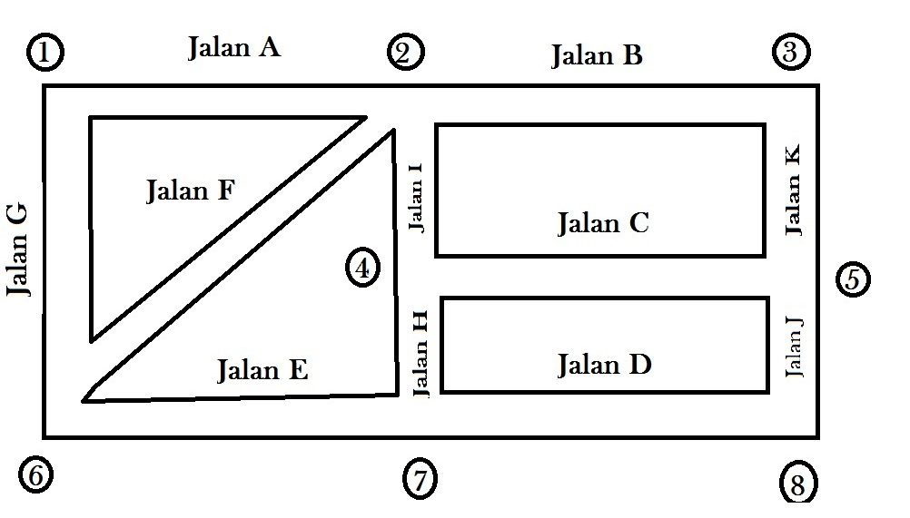

```{r setup, include=FALSE}
knitr::opts_chunk$set(echo = TRUE)
options(scipen = 99)
```

# Kasus _Optimization_ III

## Masalah

Perhatikan gambar di bawah ini:

```{r,fig.align='center'}
print("Courtesy of: FINANMOS ITB 2021")

```

Suatu komplek perumahan dengan denah seperti di atas memiliki `11` jalan. Setiap pertemuan jalan, diberikan tanda nomor `1` hingga `8`. _Town management_ hendak memasang lampu penerangan di __setiap pertemuan jalan tersebut__.

Tujuan utama mereka adalah memasang lampu sehingga semua jalan diterangi paling sedikit satu lampu.

> ___Di titik mana saja town management harus memasang lampu-lampu tersebut?___

## Model Matematika

Dari kasus di atas, kita akan membuat model matematikanya.

### Variabel Penentuan

Misalkan saya notasikan $J$ sebagai himpunan titik-titik pertemuan jalan, yakni:

$$J = 	\{1,2,3,4,5,6,7,8\}$$

Kemudian saya akan tuliskan $x_j$ sebagai _binary number_ yang menyatakan apakah lampu dipasang atau tidak di titik $j \in J$.

$$x_j = \begin{cases} 1,& \text{ jika di titik } j \text{ dipasang lampu}\\ 0, & \text{ lainnya.}\end{cases}$$
### _Constraints_

Dengan variabel keputusan seperti di atas, maka sesuai keinginan kita menerangi setiap jalan paling sedikit dengan satu lampu, kita mempunyai kendala:

- $x_1 + x_2 \geq 1$
- $x_2 + x_3 \geq 1$
- $x_1 + x_6 \geq 1$
- $x_2 + x_6 \geq 1$
- $x_2 + x_4 \geq 1$
- $x_4 + x_7 \geq 1$
- $x_4 + x_5 \geq 1$
- $x_7 + x_8 \geq 1$
- $x_3 + x_5 \geq 1$
- $x_6 + x_7 \geq 1$
- $x_5 + x_8 \geq 1$

### _Objective Function_

Tujuan utama permodelan matematika ini adalah __meminimalkan__ banyaknya titik yang dipasang lampu penerangan, yakni:

$$min(\sum x_j, j\in J)$$

## _Solver R_

### Penulisan Model Matematika di __R__

Untuk menyelesaikan masalah ini, saya akan menggunakan _solver_ di __R__. Berikut adalah model yang saya buat:

```{r,message=FALSE,warning=FALSE}
# dimulai dengan hati yang bersih
rm(list=ls())

# memanggil libraries
library(dplyr)
library(ompr)
library(ompr.roi)
library(ROI.plugin.glpk)

# membuat model
model = 
  MIPModel() %>%
  # add variables
  # binary
  add_variable(x[i],
               i = 1:8,
               type = "binary",
               lb = 0) %>%
  # set obj function
  set_objective(sum_expr(x[i],i = 1:8),
                "min") %>%
  # add constraints
  add_constraint(x[1] + x[2] >= 1) %>% 
  add_constraint(x[2] + x[3] >= 1) %>% 
  add_constraint(x[1] + x[6] >= 1) %>%
  add_constraint(x[2] + x[6] >= 1) %>%
  add_constraint(x[2] + x[4] >= 1) %>%
  add_constraint(x[4] + x[7] >= 1) %>%
  add_constraint(x[4] + x[5] >= 1) %>%
  add_constraint(x[7] + x[8] >= 1) %>%
  add_constraint(x[3] + x[5] >= 1) %>%
  add_constraint(x[6] + x[7] >= 1) %>%
  add_constraint(x[5] + x[8] >= 1)
model
```

### _Solving_

Kemudian saya _solve_ dengan __R__:

```{r,message=FALSE,warning=FALSE}
result = solve_model(model, with_ROI(solver = "glpk", verbose = TRUE))
```

### _Final Result_

Saya dapatkan konfigurasi terbaik seperti ini:

```{r,message=FALSE,warning=FALSE}
result %>% get_solution(x[i]) %>% filter(value == 1)
```

Dengan banyak lampu minimum terpasang sebanyak `r round(result$objective_value)` buah.

---