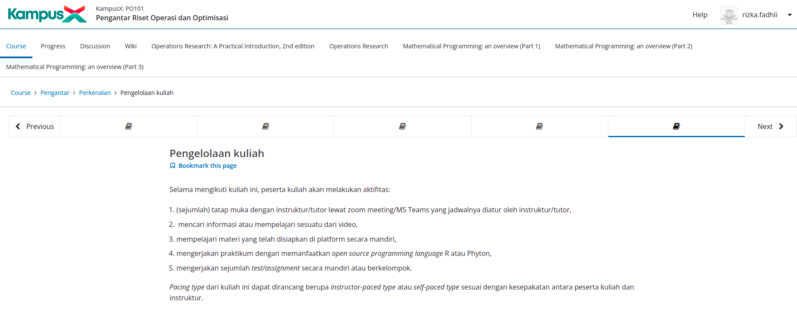
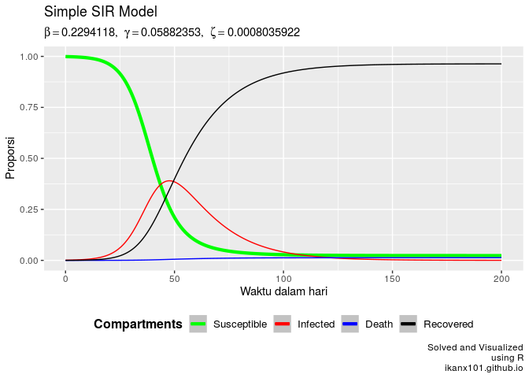
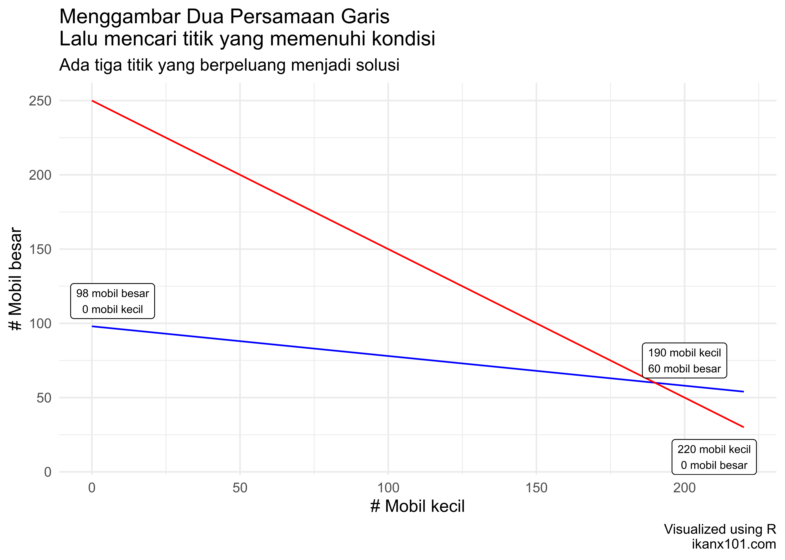
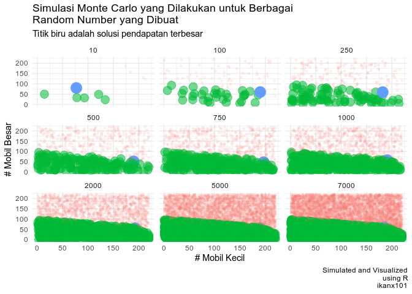

```{r setup, include = FALSE}
rm(list=ls())
library(dplyr)
library(ggplot2)
```

# CERITA DULU YA

## Mid-2020

```{r out.width="70%",echo=FALSE,fig.align='center'}
knitr::include_graphics("data sains.jpg")
```

## _Data Science is Not About Prediction!_

```{r out.width="70%",echo=FALSE,fig.align='center',fig.retina=10}
nomnoml::nomnoml("
                 [data science] -> [automation]
                 [data science] -> [unsupervised]
                 [data science] -> [association]
                 ")
```

## Sampai Suatu Ketika

```{r out.width="70%",echo=FALSE,fig.align='center'}
knitr::include_graphics("ecom.png")
```

## Portofolio Diskon Produk

Tercatat ada ribuan _listed products_ dari berbagai _sellers_. Dengan _budget_ sebesar Rp200 juta, produk mana saja yang pantas diberikan tambahan diskon? Berapa besar total _expected profit_ yang akan didapatkan?

```{r,echo=FALSE}
produk = c("a","b","c","d")
budget = runif(4,10,100) %>% round(0) %>% paste0("rb")
expected_profit = runif(4,10,100) %>% round(0) %>% paste0("rb")

data.frame(produk,budget,expected_profit) %>% 
   knitr::kable(caption = "Contoh Data Budget vs Expected Profit")
```

## _Solving the Problem_

### Simulasi

Karena saya lebih familiar membuat algoritma simulasi, maka saya mencari solusi dengan cara simulasi, yakni menghitung secara _random_ semua kejadian yang muncul.

### _Binary Programming_

Rekan-rekan mahasiswa menyelesaikan masalah tersebut dengan cara memodelkan permasalahan tersebut sebagai _binary linear programming_.

$$\max{ \sigma{profit_i \times p_i}}, p_i \in [0,1], i \in {1,2,3,..,n}$$

dengan dibatasi $\sigma{budget_i \times p_i} \leq 200jt$.

## _Pros vs Cons_

### Simulasi

_Pros_: mudah membuat algoritmanya. _Cons_: butuh waktu $> 45$ menit untuk menghasilkan solusi paling optimal.

### _Binary Programming_

_Pros_: _runtime_ algoritmanya $<5$ detik. _Cons_: butuh _knowledge_ untuk membuat model matematikanya.

## _Follow Up_

```{r out.width="50%",echo=FALSE,fig.align='center'}

```

## Akhirnya Berlanjut ke

```{r out.width="80%",echo=FALSE,fig.align='center'}

```

# LATAR BELAKANG

## _Real World Problem_

```{r out.width="40%",echo=FALSE,fig.align='center'}
knitr::include_graphics("problem.png")
```

Dalam pekerjaan sehari-hari, kita seringkali berhadapan dengan permasalahan.

## Maksimalkan! Minimalkan!

```{r out.width="40%",echo=FALSE,fig.align='center'}
knitr::include_graphics("maximini.jpg")
```

Apalagi permasalahan yang dihadapi berkaitan dengan _maximize_ atau _minimize_!

## _Multiple Way_

Tentunya ada banyak cara untuk menyelesaikannya.

```{r out.width="30%",echo=FALSE,fig.align='center'}
knitr::include_graphics("solusi.jpg")
```

_Science_ menawarkan salah satu cara untuk menyelesaikan _real world problem_ melalui _mathematical modelling_.

## _Remember This!_

```{r out.width="35%",echo=FALSE,fig.align='center'}
knitr::include_graphics("model.PNG")
```

### Nate Silver

_A model is a tool to help us understand the complexities of the universe, and never a substitute for the universe itself._ 

# PEMODELAN MATEMATIKA, OPTIMISASI, DAN RISET OPERASI

## Hubungan Ketiganya

```{r out.width="50%",echo=FALSE,fig.align='center'}
knitr::include_graphics("hubungan.png")
```

## Definisi 

### Pemodelan Matematika

Pemodelan matematika adalah mendeskripsikan suatu sistem dalam konsep dan bahasa matematika.

### Riset Operasi

__Riset operasi__ adalah metode antar disiplin ilmu yang digunakan untuk menganalisa masalah nyata dan membuat keputusan untuk kegiatan operasional organisasi atau perusahaan^[Pengantar Riset Operasi dan Optimisasi, KampusX: PO101]. 

### Optimisasi

Optimisasi adalah __proses mencari nilai yang optimal__ dari suatu masalah tertentu.

## Pemodelan Matematika

(Hampir) semua permasalahan bisa dibuatkan model matematikanya. Namun tidak semua permasalahan atau model tersebut merupakan optimisasi. Contohnya adalah __SIR Model__ untuk memodelkan penyebaran penyakit.

```{r out.width="50%",fig.align="center",echo=FALSE}

```

## Riset Operasi {.allowframebreaks} 

```{r out.width="60%",fig.align="center",echo=FALSE}

```

\break 

Riset operasi dimulai pada era Perang Dunia II. Oleh karena peperangan, diperlukan suatu cara yang efektif untuk mengalokasikan _resources_ yang ada sehingga pihak militer Inggris dan Amerika Serikat mengumpulkan ilmuwan-ilmuwan untuk mencari pendekatan yang saintifik dalam memecahkan masalah[@lieberman].

\break

Pada tahun 1940, sekelompok _researchers_ yang dipimpin oleh __PMS Blackett__ dari ___the University of Manchester___ melakukan studi tentang __Sistem Radar Baru Anti Pesawat Terbang__. Kelompok _researchers_ ini sering dijuluki sebagai __Kelompok Sirkus Blackett__ (_Blackett’s circus_). Julukan ini terjadi karena keberagaman latar belakang disiplin ilmu para _researchers_ tersebut. Mereka terdiri dari disiplin ilmu fisiologi, matematika, astronomi, tentara, surveyor, dan fisika. Pada 1941, kelompok ini terlibat dalam penelitian radar deteksi kapal selam dan pesawat terbang. _Blackett_ kemudian memimpin _Naval Operational Research_ pada Angkatan Laut Kerajaan Inggris Raya. Prinsip-prinsip ilmiah yang digunakan untuk mengambil keputusan dalam suatu operasi dinamai sebagai __Riset Operasi__[@vincentius].

\break

Saat Amerika Serikat mulai terlibat pada Perang Dunia II, prinsip riset operasi juga digunakan untuk berbagai operasi militer mereka. Kelompok riset operasi AS bertugas untuk menganalisis serangan udara dan laut tentara NAZI Jerman.

Selepas Perang Dunia II, penerapan riset operasi dinilai bisa diperluas ke dunia ekonomi, bisnis,_engineering_, dan sosial. Riset operasi banyak berkaitan dengan berbagai disiplin ilmu seperti matematika, statistika, _computer science_, dan lainnya. Tidak jarang beberapa pihak menganggap riset operasi itu _overlapping_ dengan disiplin-disiplin ilmu tersebut. 

\break

Oleh karena tujuan utama dari aplikasi riset operasi adalah tercapainya __hasil yang optimal__ dari semua kemungkinan perencanaan yang dibuat. Maka __pemodelan matematika dan optimisasi__ bisa dikatakan sebagai disiplin utama dari riset operasi.

## Optimisasi {.allowframebreaks}

Notasi matematikanya dapat ditulis sebagai berikut:

Misalkan suatu fungsi $f$ yang memetakan dari himpunan $A$ ke bilangan _real_.

$$f: A \rightarrow \mathbb{R}$$

Cari suatu nilai $x_0 \in A$ sedemikian sehingga:

- $f(x_0) \leq f(x), \forall x \in A$ untuk proses __minimalisasi__.
- $f(x_0) \geq f(x), \forall x \in A$ untuk proses __maksimalisasi__.

\break

__Pierre De Fermat__ dan __Joseph-Louis Lagrange__ adalah orang-orang yang pertama kali menemukan formula kalkulus untuk mencari nilai optimal. Sementara __Isaac Newton__ dan __Johann C. F.Gauss__ mengusulkan metode iteratif untuk mencari nilai optimal^[https://empowerops.com/en/blogs/2018/12/6/brief-history-of-optimization]. 

Salah satu bentuk optimisasi yakni _linear programming_ dimulai oleh __Leonid Kantorovich__ pada 1939. __Metode Simplex__ merupakan salah satu metode penyelesaian optimisasi yang terkenal, pertama kali diperkenalkan pada 1947 oleh __George Dantzig__ sementara di tahun yang sama _Theory of Duality_ diperkenalkan oleh __John von Neumann__. 

## Bahasan dalam Optimisasi

Bahasan dalam optimisasi dapat dikategorikan menjadi:

- Pemodelan masalah nyata menjadi masalah optimisasi.
- Pembahasan karakteristik dari masalah optimisasi dan keberadaan solusi dari masalah optimisasi tersebut.
- Pengembangan dan penggunaan algoritma serta analisis numerik untuk mencari solusi dari masalah tersebut.

## Masalah Optimisasi {.allowframebreaks}

__Masalah optimisasi__ adalah masalah matematika yang mewakili masalah nyata (_real_). Dari ekspresi matematika tersebut, ada beberapa hal yang perlu diketahui^[Pengantar Riset Operasi dan Optimisasi, KampusX: PO101], yakni:

1. __Variabel__ adalah suatu simbol yang memiliki banyak nilai dan nilainya ingin kita ketahui. Setiap nilai yang mungkin dari suatu variabel muncul akibat suatu kondisi tertentu di sistem.
1. __Parameter__ di suatu model matematika adalah suatu konstanta yang menggambarkan suatu karakteristik dari sistem yang sedang diteliti. Parameter bersifat _fixed_ atau _given_. 
1. ___Constraints___ (atau kendala) adalah kondisi atau batasan yang harus dipenuhi. Kendala-kendala ini dapat dituliskan menjadi suatu persamaan atau pertaksamaan. Suatu masalah optimisasi dapat memiliki hanya satu kendala atau banyak kendala.
1. ___Objective function___ adalah satu fungsi (pemetaan dari variabel-varibel keputusan ke suatu nilai di daerah _feasible_) yang nilainya akan kita minimumkan atau kita maksimumkan.

## Jenis-Jenis Masalah Optimisasi

Masalah optimisasi bisa dibagi dua menjadi dua kategori berdasarkan tipe _variables_ yang terlibat^[Optimization problem. https://en.wikipedia.org/wiki/Optimization_problem], yakni:

```{r out.width="70%",echo=FALSE,message=FALSE,warning=FALSE,fig.align='center'}
nomnoml::nomnoml("#direction: down
                 [Optimisasi] -> [Diskrit]
                 [Optimisasi] -> [Kontinu]
                 
                 [Diskrit] -> [Binary\nProgramming]
                 [Diskrit] -> [Integer\nProgramming]
                 [Diskrit] -> [Mixed Integer\nLinear Programming]
                 
                 [Kontinu] -> [Diferensiabel]
                 [Kontinu] -> [Non Diferensiabel]
                 
                 [Diferensiabel] -> [Linear\nProgramming]
                 [Diferensiabel] -> [Non Linear\nProgramming]
                 [Diferensiabel] -> [Quadratic\nProgramming] 
                 
                 [Linear\nProgramming] --> [Mixed Integer\nLinear Programming]
                 ")
```

# CONTOH MASALAH _OPTIMIZATION_: _Linear Programming_

## _Linear Programming_

_Linear programming_ adalah bentuk metode optimisasi sederhana yang memanfaatkan relasi linear (semua fungsi dan _constraints_ merupakan fungsi linear).

## Contoh Masalah _Linear Programming_ I

Saya memiliki area parkir seluas 1.960 $m^2$. Luas rata-rata untuk mobil berukuran kecil adalah 4 $m^2$ dan mobil besar adalah 20 $m^2$. Daya tampung maksimum hanya 250 kendaraan, biaya parkir mobil kecil adalah Rp 7.000 per jam dan mobil besar adalah Rp 12.000 per jam. Jika dalam 1 jam area parkir saya terisi penuh dan tidak ada kendaraan yang pergi dan datang, maka berapa pendapatan maksimum yang bisa saya dapatkan dari tempat parkir itu?

## Bagaimana Menuliskan Modelnya?

Saya memiliki area parkir seluas 1.960 $m^2$. Luas rata-rata untuk mobil berukuran kecil adalah 4 $m^2$ dan mobil besar adalah 20 $m^2$.

$$4 x_1 + 20 x_2 \leq 1960$$

Daya tampung maksimum hanya 250 kendaraan.

$$x_1 + x_2 \leq 250$$

Biaya parkir mobil kecil adalah Rp 7.000 per jam dan mobil besar adalah Rp 12.000 per jam. 

$$7000x_1 + 12000x_2$$

## Bagaimana Menuliskan Modelnya?

Mari kita _recap_ model optimisasinya:

$$max(7000x_1 + 12000x_2)$$

Dengan _constraints_: 

$$4 x_1 + 20 x_2 \leq 1960$$

dan

$$x_1 + x_2 \leq 250$$

serta $x_1 \geq 0, x_2 \geq 0$.

## Bagaimana Menyelesaikan Model Ini?

Setidaknya ada beberapa cara yang bisa digunakan untuk menyelesaikan permasalahan ini, yakni:

1. Metode grafik,
1. Metode simulasi, dan
1. Metode aljabar.

## Metode Grafik

```{r out.width="50%",fig.align="center",echo=FALSE}

```

_Remarks_: Ini adalah metode termudah yang dapat dilakukan. Tapi jika variabel yang terkait banyak ($>3$), maka akan sulit menggambar grafiknya.

## Metode Simulasi

```{r out.width="50%",echo=FALSE,message=FALSE,warning=FALSE,fig.align='center'}
library(dplyr)
library(ggplot2)
library(ggpubr)

simu = function(n){
   x = sample(0:200,n,replace = T)
   y = sample(0:220,n,replace = T)
   df = 
      data.frame(x,y) %>% 
      mutate(marker = ifelse(4*x + 20*y <= 1960 & x + y <= 250,
                      1,
                      0)) %>% 
      mutate(profit = 7000*x + 12000*y) %>% 
      mutate(marker_2 = 0)
   temp = df %>% filter(marker == 1) %>% filter(profit == max(profit)) %>% mutate(marker_2 = 1)
   df = rbind(df,temp) %>% mutate(marker_2 = as.factor(marker_2))
   return(df)
}

p1 = simu(2)
p2 = simu(9)
p3 = simu(20)
p4 = simu(40)
p4 = simu(70)

p1 = 
   p1 %>% ggplot(aes(x,y)) + geom_point(aes(color = marker_2)) + 
   scale_color_manual(values = c("blue","red")) + xlim(0,230) + ylim(0,260) +
   theme_minimal() +
   theme(legend.position = "none")
p2 = 
   p2 %>% ggplot(aes(x,y)) + geom_point(aes(color = marker_2)) + 
   scale_color_manual(values = c("blue","red")) + xlim(0,230) + ylim(0,260) +
   theme_minimal() +
   theme(legend.position = "none")
p3 = 
   p3 %>% ggplot(aes(x,y)) + geom_point(aes(color = marker_2)) + 
   scale_color_manual(values = c("blue","red")) + xlim(0,230) + ylim(0,260) +
   theme_minimal() +
   theme(legend.position = "none")
p4 = 
   p4 %>% ggplot(aes(x,y)) + geom_point(aes(color = marker_2)) + 
   scale_color_manual(values = c("blue","red")) + xlim(0,230) + ylim(0,260) +
   theme_minimal() +
   theme(legend.position = "none")

ggarrange(p1,p2,p3,p4,ncol = 2,nrow = 2)
```

## Metode Simulasi

```{r out.width="70%",fig.align="center",echo=FALSE}

```

## Contoh Lain _Linear Programming_ {.allowframebreaks}

Manajemen **Koperasi Susu Berkah** (**KSB**) setiap harinya menerima `1000` liter susu dari para anggotanya untuk diproduksi menjadi *yogurt* atau keju *mozarella*.

-   Keuntungan dari setiap liter susu yang terjual adalah `Rp1.000`.
-   Keuntungan dari *yogurt* yang terjual dari bahan satu liter susu adalah `Rp1.200`
-   Sedangkan keuntungan keju *mozarella* dari bahan satu liter susu adalah `Rp900`.

Setelah menganalisa data penjualan, manajemen koperasi mendapatkan informasi sebagai berikut:

-   Dalam sehari susu yang terjual paling banyak sebesar `500` liter susu.
-   *Yogurt* paling banyak bisa dibuat dari bahan `300` liter susu.
-   Keju *mozarella* paling banyak bisa dibuat dari bahan `400` liter susu.

Dari informasi di atas, manajemen **KSB** ingin menentukan berapa banyak susu yang harus dibuat *yogurt*, susu yang harus dibuat keju *mozarella*, dan susu yang dijual langsung, agar keuntungan yang didapat maksimal?

\break

Berikut adalah *constraints* yang ada pada kasus di atas:

-   $0 \leq x_1 \leq 500$
-   $0 \leq x_2 \leq 300$
-   $0 \leq x_3 \leq 400$
-   $x_1 + x_2 + x_3 = 1000$

\break

Tujuan utama permodelan matematika ini adalah **memaksimalkan** *profit* yang ingin dicapai **KSB**, yakni:

$$max(1000x_1 + 1200x_2 + 900x_3)$$

## Modifikasi Masalah Koperasi Susu Berkah {.allowframebreaks}

Dari Koperasi Susu Berkah tersebut, sebenarnya untuk penjualan susu cair ada resiko tidak terjualnya keseluruhan susu cair pada hari yang sama sebesar `10%`. Setiap susu yang tidak terjual ini akan memberikan kerugian sebesar `Rp500` per liternya.

***Berapa profit maksimal yang masih kita peroleh saat resiko tidak terjualnya susu cair terburuk?***

\break

Dari kasus di atas, kita cukup memodifikasi model matematika yang *existing*.

\break

### Variabel Penentuan

Saya akan definisikan variabel baru $x_4$, yakni berapa banyak susu cair yang tidak terjual.

### *Objective Function*

Sekarang, *objective function*-nya berubah menjadi:

$$min(1000x_1 + 1200x_2 + 900x_3 - 500x_4)$$ Kenapa dibuat *min*? Karena kita ingin menghitung profit terbaik saat resiko terburuk.

\break

### *Constraints*

Sekarang saya tambahkan dua *constraints* terkait $x_4$.

$0 \leq x_4 \leq 0.1x_1$ dan $x_1 + x_2 + x_3 + x_4 = 1000$

## Tiga Mesin _Filling_ {.allowframebreaks}

Di sebuah perusahaan, departemen *filling* dan *packing* memiliki tiga jenis mesin yang selalu beroperasi setiap harinya. Setiap mesin memiliki kapasitas, biaya proses per unit produk, dan biaya *setup* masing-masing.

Berikut adalah datanya:

```{r,echo=FALSE}
data = data.frame(
  mesin =  c(1:3),
  biaya_setup = c(300,100,200),
  biaya_proses_per_unit = c(2,10,5),
  kapasitas = c(600,800,1200)
)
knitr::kable(data,align = "c",caption = "Data Mesin Filling dan Packing")
```

\break 

Mengingat di setiap mesin harus ada pekerja yang ditugaskan untuk menjalankannya, manajemen mengambil keputusan bahwa jika suatu mesin digunakan, maka mesin tersebut paling sedikit harus memproses `400` unit produk.

Di suatu hari, terdapat beban kerja sebanyak `2000` unit produk yang harus diproses *filling* dan *packing*-nya.

***Berapa konfigurasi produk per mesin yang paling optimal?***

## Model Matematika {.allowframebreaks}

Dari kasus di atas, kita akan membuat model matematikanya.

### Variabel Penentuan

Misalkan saya notasikan `3` variabel berikut ini:

-   $x_1$ sebagai seberapa banyak (dalam unit) produk yang dijalankan di mesin I,
-   $x_2$ sebagai seberapa banyak (dalam unit) produk yang dijalankan di mesin II, dan
-   $x_3$ sebagai seberapa banyak (dalam unit) produk yang dijalankan di mesin III.

Di mana: 

$$x_1,x_2,x_3   \in \mathbb{Z}$$

\pagebreak

### *Constraints*

Berikut adalah *constraints* yang ada pada kasus di atas:

-   $400 \leq x_1 \leq 600$
-   $400 \leq x_2 \leq 800$
-   $400 \leq x_3 \leq 1200$
-   $x_1 + x_2 + x_3 = 2000$

### *Objective Function*

Tujuan utama permodelan matematika ini adalah **meminimalkan** *cost* yang terjadi di semua mesin, yakni:

$$min((300+2x_1) + (100+10x_2) + (200+5x_3))$$

# CONTOH MASALAH _OPTIMIZATION_: _Binary Programming_

## _Binary Programming_

_Binary programming_ adalah bentuk metode optimisasi di mana variabel yang terlibat merupakan bilangan biner (0,1). Biasanya metode ini dipakai dalam masalah penjadwalan yang memerlukan prinsip _matching_ antar kondisi yang ada.

## Contoh Masalah _Binary Programming_ {.allowframebreaks}

Beberapa minggu ke belakang, kasus harian Covid semakin menurun. Pemerintah mulai melonggarkan aturan PPKM yang mengakibatkan sekolah-sekolah mulai menggelar pengajaran tatap muka terbatas (PTMT) untuk siswanya secara _offline_. 

Suatu sekolah memiliki kelas berisi 20 orang siswa. Mereka hendak menggelar PTMT dengana aturan sebagai berikut:

1. PTMT digelar dari Senin hingga Jumat (5 hari).
1. Dalam sehari, siswa yang boleh hadir dibatasi 4-8 orang saja.
1. Dalam seminggu, diharapkan siswa bisa hadir 2-3 kali.
1. Siswa yang hadir di selang sehari baru bisa hadir kembali.

Dari uraian di atas, kita bisa membuat model optimisasinya sebagai berikut:

Saya definisikan $x_{i,j} \in (0,1)$ sebagai bilangan biner di mana $i \in \{1,2,..,20\}$ menandakan siswa dan $j \in \{1,2,..,5\}$ menandakan hari. Berlaku:

$$x_{i,j} = \left\{\begin{matrix}
0, \text{ siswa i tidak masuk di hari j}\\ 
1, \text{ siswa i masuk di hari j}
\end{matrix}\right.$$

___Objective Function___

Tujuan utama kita adalah memaksimalkan siswa yang hadir.

$$\max{\sum_{j=1}^5 \sum_{i=1}^{20} x_{i,j} }$$

___Constraints___

Dalam sehari, ada pembatasan jumlah siswa yang hadir.

$$4 \leq \sum_i x_{i,j} \leq 8, j \in \{1,2,..,5\}$$

Dalam seminggu, siswa hadir dalam frekuensi tertentu.

$$2 \leq \sum_j x_{i,j} \leq 3, i \in \{1,2,..,20\}$$

\pagebreak 

Ada jeda sehari agar siswa bisa masuk kembali.

$$x_{i,j} + x_{i,j+1} \leq 1$$

Jangan lupa bahwa $x_{i,j} \geq 0$.

## Contoh Lain: Lampu Penerangan Jalan {.allowframebreaks}

```{r out.width="50%",echo=FALSE,fig.align='center'}
knitr::include_graphics("jalan.png")
```

Suatu komplek perumahan dengan denah seperti di atas memiliki `11` jalan. Setiap pertemuan jalan, diberikan tanda nomor `1` hingga `8`. *Town management* hendak memasang lampu penerangan di **setiap pertemuan jalan tersebut**.

Tujuan utama mereka adalah memasang lampu sehingga **semua jalan** diterangi paling sedikit satu lampu.

***Di titik mana saja town management harus memasang lampu-lampu tersebut?***

## Model Matematika

Dari kasus di atas, kita akan membuat model matematikanya.

### Parameter

Misalkan saya notasikan $Jl$ sebagai himpunan jalan, yakni:

$$Jl = \{A,B,C,D,E,F,G,H,I,J,K\}$$

Misalkan saya notasikan $J$ sebagai himpunan titik-titik pertemuan jalan, yakni:

$$J = \{1,2,3,4,5,6,7,8\}$$

## Model Matematika {.allowframebreaks}

Kemudian saya akan tuliskan $x_j$ sebagai *binary number* yang menyatakan apakah lampu dipasang atau tidak di titik $j \in J$.

$$x_j = \begin{cases} 1,& \text{ jika di titik } j \text{ dipasang lampu}\\ 0, & \text{ lainnya.}\end{cases}$$ Misalkan:

-   $x_1=0$, artinya lampu di titik `1` **tidak dipasang lampu**.
-   $x_2=1$, artinya lampu di titik `2` **dipasang lampu**.

**Constraints**

Dengan variabel keputusan seperti di atas, maka sesuai keinginan kita menerangi **setiap jalan paling sedikit dengan satu lampu**, kita mempunyai kendala:

1.  $x_1 + x_2 \geq 1$ untuk **Jalan A**.
2.  $x_2 + x_3 \geq 1$ untuk **Jalan B**.
3.  $x_1 + x_6 \geq 1$ untuk **Jalan G**.
4.  $x_2 + x_6 \geq 1$ untuk **Jalan F**.
5.  $x_2 + x_4 \geq 1$ untuk **Jalan I**.
6.  $x_4 + x_7 \geq 1$ untuk **Jalan H**.
7.  $x_4 + x_5 \geq 1$ untuk **Jalan C**.
8.  $x_7 + x_8 \geq 1$ untuk **Jalan D**.
9.  $x_3 + x_5 \geq 1$ untuk **Jalan K**.
10. $x_6 + x_7 \geq 1$ untuk **Jalan E**.
11. $x_5 + x_8 \geq 1$ untuk **Jalan J**.

### *Objective Function*

Tujuan utama permodelan matematika ini adalah **meminimalkan** banyaknya titik yang dipasang lampu penerangan, yakni:

$$min(\sum x_j, j\in J)$$

## Contoh Lain: Urutan Produksi {.allowframebreaks}

Suatu perusahaan memproduksi `4` warna cat yaitu:

-   Putih,
-   Kuning,
-   Hitam, dan
-   Merah.

Keempat cat tersebut diproduksi di mesin-mesin yang sama, sehingga ada keperluan untuk mencuci mesin-mesin tersebut di antara produksi `2` cat yang berbeda warna.

Kita mempunyai masalah untuk menentukan urutan produksi cat harian yang *optimal*, yakni urutan produksi cat yang menghasilkan total waktu pencucian paling kecil.

***Urutan harian ini akan dipakai tiap hari, karena perusahaan setiap hari harus memproduksi keempat cat tersebut.***

## Contoh Lain: Urutan Produksi {.allowframebreaks}

Tabel berikut menampilkan waktu pencucian antara produksi cat di suatu baris jika akan dilanjutkan dengan cat di suatu kolom.

```{r,echo=FALSE,message=FALSE,warning=FALSE}
data = data.frame(putih = c(NA,20,50,45),
                  kuning = c(10,NA,44,40),
                  hitam = c(17,19,NA,20),
                  merah = c(15,18,25,NA))

row.names(data) = c("putih","kuning","hitam","merah")

options(knitr.kable.NA = '~')
knitr::kable(data,row.names = T,align = "c",caption = "Matriks Cleaning Mesin Cat (dalam menit)")
```

***Urutan produksi cat seperti apa yang meminimalkan waktu cleaning?***

# CONTOH MASALAH _OPTIMIZATION_: _Integer Programming_

## _Integer Programming_

_Integer programming_ adalah bentuk metode optimisasi di mana variabel yang terlibat merupakan bilangan bulat (_integer_). Jika fungsi-fungsi yang terkait merupakan _linear_, maka disebut dengan _integer linear programming_.

Sebagai contoh, variabel yang merupakan bilangan bulat adalah banyak orang.

## Contoh _Integer Programming_ {.allowframebreaks}

```{r,echo=FALSE}
rm(list=ls())

nakes = data.frame(
  hari = c('Senin','Selasa','Rabu','Kamis','Jumat','Sabtu','Minggu'),
  min = c(24,22,23,11,16,20,12),
  max = c(29,27,28,16,21,25,17)
)

nakes %>%
  rename("Min Nakes Required" = min,
	 "Max Nakes Required" = max) %>%
  knitr::kable("simple",align = "c",caption = "Tabel Kebutuhan Nakes Harian")
```

Di rumah sakit tersebut berlaku kondisi sebagai berikut:

1. Setiap nakes hanya diperbolehkan bekerja selama 5 hari berturut-turut dan harus libur selama 2 hari berturut-turut.
1. Tidak ada pemberlakuan _shift_ bagi nakes.

Berapa banyak nakes yang harus dipekerjakan oleh rumah sakit tersebut? Bagaimana konfigurasi penjadwalannya?

Untuk memudahkan dalam mencari solusi permasalahan di atas, kita bisa membuat tabel ilustrasi berikut:

```{r,echo=FALSE}
nakes %>%
  mutate(x1 = c('x','x','x','x','x','' , ''),
	 x2 = c('' ,'x','x','x','x','x', ''),
	 x3 = c('' , '','x','x','x','x','x'),
	 x4 = c('x', '', '','x','x','x','x'),
	 x5 = c('x','x', '', '','x','x','x'),
	 x6 = c('x','x','x', '', '','x','x'),
	 x7 = c('x','x','x','x', '', '','x')) %>%
  rename("Min Nakes Required" = min,
	 "Max Nakes Required" = max) %>%
  knitr::kable("simple",align = "c",caption = "Konfigurasi Penjadwalan Nakes")
```

Kolom $x_i, i =1,2,3,4,5,6,7$ menandakan kelompok nakes yang perlu dipekerjaan pada hari-hari tertentu. Setiap nilai $x_i$ tersebut merupakan __bilangan bulat positif__ $x \geq 0, x \in \mathbb{Z}$.

Dari ilustrasi di atas, kita bisa membuat model optimisasinya sebagai berikut:

___Objective Function___

$$\min{ \sum_{i=1}^7 x_i}$$

___Constraints___

- Hari Senin: $24 \leq \sum x_i \leq 29, i \in \{1,4,5,6,7\}$.
- Hari Selasa: $22 \leq \sum x_i \leq 27, i \in \{1,2,5,6,7\}$.
- Hari Rabu: $23 \leq \sum x_i \leq 28, i \in \{1,2,3,6,7\}$.
- Hari Kamis: $11 \leq \sum x_i \leq 16, i \in \{1,2,3,4,7\}$.
- Hari Jumat: $16 \leq \sum x_i \leq 21, i \in \{1,2,3,4,5\}$.
- Hari Sabtu: $20 \leq \sum x_i \leq 25, i \in \{2,3,4,5,6\}$.
- Hari Minggu: $12 \leq \sum x_i \leq 17, i \in \{3,4,5,6,7\}$.

Kita juga perlu perhatikan bahwa $x_i \geq 0, i \in \{1,2,3,4,5,6,7\}$.


# CONTOH MASALAH _OPTIMIZATION_: _Mixed Integer Linear Programming_

## _Mixed Integer Linear Programming_

Pada bagian sebelumnya, kita telah membahas masalah optimisasi dengan variabel berupa diskrit dan kontinu. Permasalahan _real_ yang ada di kehidupan sehari-hari biasanya merupakan memiliki variabel yang _mixed_ antara keduanya. Oleh karena itu, ada metode yang disebut dengan _mixed integer linear programming_. Pada masalah optimisasi tipe ini, _decision variables_ yang terlibat bisa saja berupa _binary_, _integer_, dan _continuous_ sekaligus.

## Pemilihan dan Penentuan Item Produksi {.allowframebreaks}

Suatu pabrik makanan dan minuman berencana untuk membuat tiga produk baru yang bisa diproduksi di dua _plants_ yang berbeda.

```{r,echo=FALSE}
rm(list=ls())

runtime = data.frame(Produk = c("Item 1","Item 2","Item 3"),
		     run1 = c(3,4,2),
		     run2 = c(4,6,2)
		    )
runtime %>%
  rename("Runtime Plant 1" = run1,
	 "Runtime Plant 2" = run2) %>%
  knitr::kable("simple",caption = "Tabel Runtime Item Produk per Plant (harian - dalam jam)")
```

__Plant 1__ memiliki maksimum _working hours_ sebesar 30 jam perhari.

__Plant 2__ memiliki maksimum _working hours_ sebesar 40 jam perhari.

```{r,echo=FALSE}
profit = data.frame(Produk = c("Item 1","Item 2","Item 3"),
		    profit = c(5,7,3),
		    sales = c(7,5,9)
			)

profit %>%
  rename("Profit per ton" = profit,
	 "Sales potential per ton" = sales) %>%
  knitr::kable("simple",caption = "Tabel Profit dan Potensi Sales Item Produk")
```

Masalah timbul saat mereka harus memilih __dua dari tiga__ produk baru tersebut yang harus di produksi. Selain itu, mereka juga harus memilih __satu dari dua__ _plants_ yang memproduksi _items_ tersebut.

# CONTOH LAINNYA

## Berbagai Contoh Lain

Berbagai contoh optimisasi lainnya bisa dilihat di _link_ berikut:

https://ikanx101.com/tags/#optimization-story

# References
