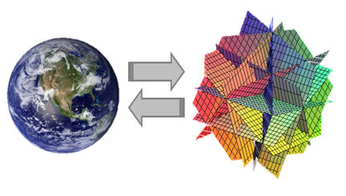
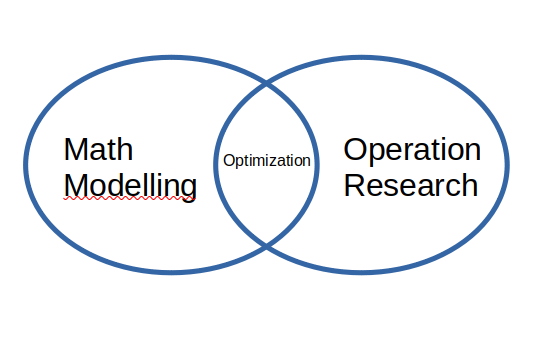

```{r setup, include = FALSE}
rm(list=ls())
library(dplyr)
library(ggplot2)
```

# CERITA DULU YA

## Mid-2020

```{r out.width="70%",echo=FALSE,fig.align='center'}

```

## _Data Science is Not About Prediction!_

```{r out.width="70%",echo=FALSE,fig.align='center',fig.retina=10}
nomnoml::nomnoml("
                 [data science] -> [automation]
                 [data science] -> [unsupervised]
                 [data science] -> [association]
                 ")
```

## Sampai Suatu Ketika

```{r out.width="70%",echo=FALSE,fig.align='center'}

```

# LATAR BELAKANG

## _Real World Problem_

```{r out.width="40%",echo=FALSE,fig.align='center'}
knitr::include_graphics("problem.png")
```

Dalam pekerjaan sehari-hari, kita seringkali berhadapan dengan permasalahan.

## Maksimalkan! Minimalkan!

```{r out.width="40%",echo=FALSE,fig.align='center'}

```

Apalagi permasalahan yang dihadapi berkaitan dengan _maximize_ atau _minimize_!

## _Multiple Way_

Tentunya ada banyak cara untuk menyelesaikannya.

```{r out.width="30%",echo=FALSE,fig.align='center'}

```

_Science_ menawarkan salah satu cara untuk menyelesaikan _real world problem_ melalui _mathematical modelling_.

## _Remember This!_

```{r out.width="35%",echo=FALSE,fig.align='center'}

```

### Nate Silver

_A model is a tool to help us understand the complexities of the universe, and never a substitute for the universe itself._ 

# PEMODELAN MATEMATIKA, OPTIMISASI, DAN RISET OPERASI

## Hubungan Ketiganya

```{r out.width="50%",echo=FALSE,fig.align='center'}

```

## Definisi 

### Pemodelan Matematika

Pemodelan matematika adalah mendeskripsikan suatu sistem dalam konsep dan bahasa matematika.

### Riset Operasi

__Riset operasi__ adalah metode antar disiplin ilmu yang digunakan untuk menganalisa masalah nyata dan membuat keputusan untuk kegiatan operasional organisasi atau perusahaan^[Pengantar Riset Operasi dan Optimisasi, KampusX: PO101]. 

### Optimisasi

Optimisasi adalah __proses mencari nilai yang optimal__ dari suatu masalah tertentu.

# _OPERATION RESEARCH_


# SEJARAH

# PEMODELAN MATEMATIKA


# CONTOH

# SOLVER

# References