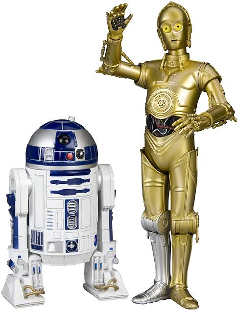
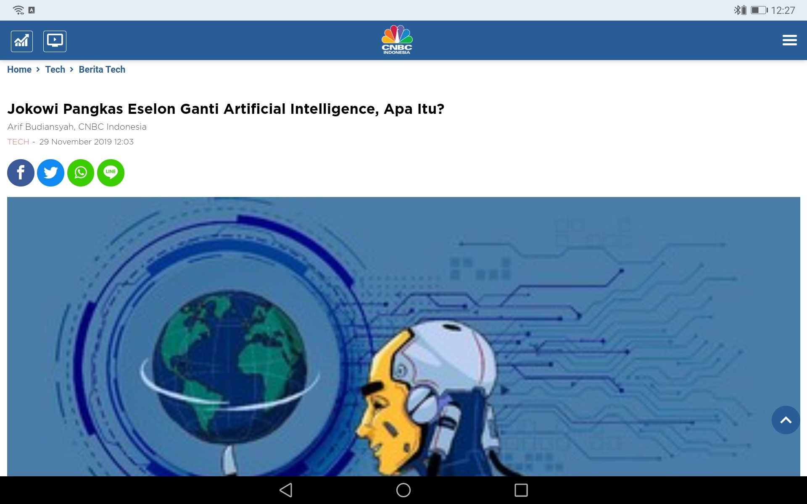
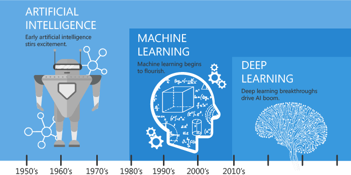
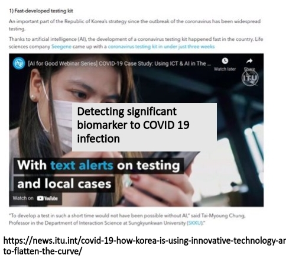
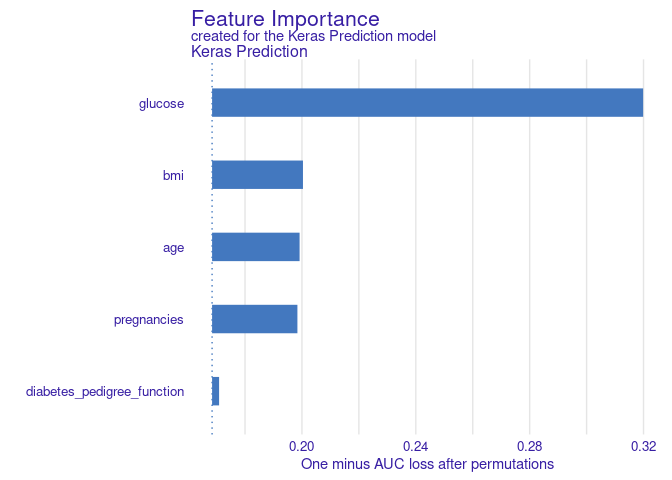
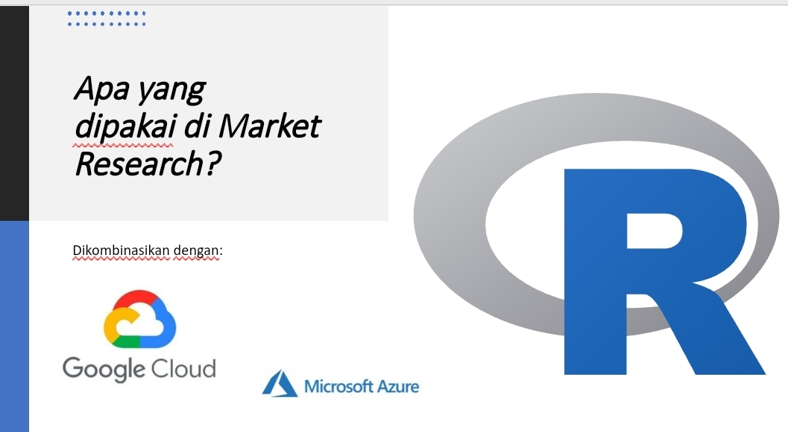
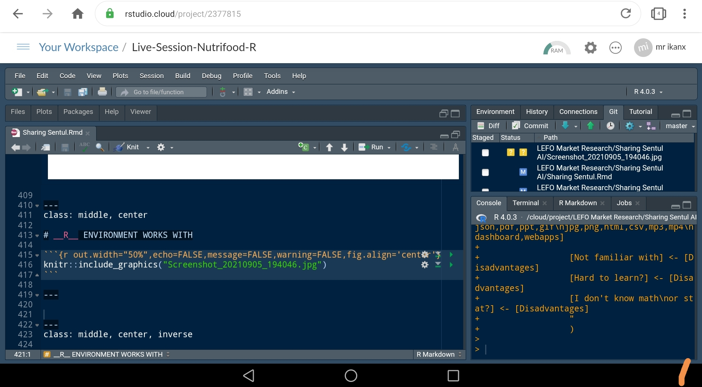

layout: true

<div class="my-footer"><span>Sharing Sentul Plant</span></div>

```{r setup, include=FALSE}
rm(list=ls())
setwd("/cloud/project/LEFO Market Research/Sharing Sentul AI")
library(dplyr)
library(ggplot2)
```

---
class: middle, center, inverse

## Tenang saja isinya tidak __semenyeramkan__ judulnya
_Please sit back and relax, we will uncover the truth behind AI_

---
class: middle

### Apa yang terlintas dalam pikiran rekan-rekan saat mendengar kata-kata:
# _ARTIFICIAL INTELLIGENCE_ ?

---
# Apakah ini?

```{r,echo=FALSE,message=FALSE,warning=FALSE,fig.align='center'}

```

---
# Atau ini?

```{r,echo=FALSE,message=FALSE,warning=FALSE,fig.align='center',fig.height=4}

```

---
# Atau ini?

```{r out.width="70%",echo=FALSE,message=FALSE,warning=FALSE,fig.align='center'}

```

---
class: middle

# Lantas apa itu ___AI___ ?

---
class: middle

### Lantas apa bedanya dengan:
# _MACHINE LEARNING_ ?

--
# _DEEP LEARNING_ ?

---
class: middle

# ANALOGI

.pull-left[

### _It is like teenagers talking about sex._

> Everybody talks about it but how many doing it?

]

.pull-right[

```{r,echo=FALSE,message=FALSE,warning=FALSE,fig.align='center',fig.height=4}

```

]

---
class: middle

# SULIT BAGI ORANG AWAM UNTUK MEMBEDAKAN

--

## Mana yang termasuk _science_ ? 

--

## Mana yang termasuk _Science Fiction_?

--

#### Terence Tse dan Mark Esposito, __AI Republic__, 2019.

---
class: middle
# SCIENCE VS SCIENCE FICTION

.pull-left[

## _Artificial General Intelligence_

- This is considered as __“Strong AI”__. 
- This is the kind of AI that scared people, self-aware, has free-will, cannot be dictated by human.
- This is what __average person__ thinks about when they hear AI.

]

.pull-right[

## _Artificial Narrow Intelligence_

- This is considered __“weak AI”__. 
- __Right now__, all computer intelligent technologies are working solely with ANI, machine that can only serve a very well-defined purpose.

]

--

## Kesimpulan: Saat ini kita sampai di __ANI__.

--

> Bagaimana dengan _self driving_ car?

--

## _Keywords: repetitive and well-defined purpose_

---
class: middle, center

# So, how AlphaGo defeat human world champion in 2017?

```{r,echo=FALSE,message=FALSE,warning=FALSE,fig.align='center',fig.height=4}
knitr::include_graphics("images-5.jpeg")
```

--

## _Simply_: Number Crunching!

---

class: middle, center, inverse

# JADI
## Apa itu _Artificial Intelligence_ ?

---
class: middle

# Apa itu _Artificial Intelligence_ ?

.pull-left[

## _Did you know_

Term AI has been used since the 1950s as umbrella terms for applied science such as Maths, Statistics, Physics, Engineering and Computer science.

## _So, what is AI, ML and DL?_

It is just a bunch lines of algorithm codes doing well-defined jobs!

]

.pull-right[

```{r,echo=FALSE,message=FALSE,warning=FALSE,fig.align='center',fig.height=4}

```

]

---
class: middle

# SUMMARY

.pull-left[

## Isi dari _Artificial Intelligence_ adalah:

```{r,echo=FALSE,message=FALSE,warning=FALSE,fig.align='center'}
nomnoml::nomnoml("#direction: down,
                 [Artificial Intelligence] -> [Science]
                 [Artificial Intelligence] -> [Engineering]
                 [Science] -> [Computation]
                 [Engineering] -> [Computation]
                 
                 [Science|
                    [Theoretical] -> [Math]
                    [Theoretical] -> [Physic]
                    [Theoretical] -> [Chemist]
                    [Theoretical] -> [Biology]
                    ]
                    
                 [Computation| 
                    [Iterasi]
                    [Aproksimasi]
                    ]
                 ")
```

]

.pull-right[

## Apa itu Algoritma?

```{r,echo=FALSE,message=FALSE,warning=FALSE,fig.align='center'}
nomnoml::nomnoml("#direction: down,
                 [Input] -> [<choice>Sekumpulan baris kode\nberisi perintah\nmemproses input menjadi desired output]
                 [<choice>Sekumpulan baris kode\nberisi perintah\nmemproses input menjadi desired output] -> [output]
                 "
                 )

```

]

---
class: middle
# APA YANG __AI__ BISA LAKUKAN?

.pull-left[

### Human brain is ___limited___ in terms of computing.

### While machine or computer has ___"unlimited"___ computing resources.

### AI is a ___tools___ that help us to:

]

.pull-right[

```{r,echo=FALSE,message=FALSE,warning=FALSE,fig.align='center'}
nomnoml::nomnoml("
                 [AI] -> [Automation]
                 [AI] -> [Optimization]
                 [AI] -> [Prediction/Classification\nForecast]
                 [AI] -> [Advance Analysis]
                 [AI] -> [Data Acquisition]
                 "
                 )

```

]

---

# _"UNLIMITED_ COMPUTING RESOURCES

.pull-left[

## Deteksi Biomarker dalam Darah

Untuk mengetahui seseorang terinfeksi Covid atau tidak.

```{r,echo=FALSE,message=FALSE,warning=FALSE,fig.align='center',fig.height=4}

```

]

.pull-right[

## Prediksi Diabetes

Mengetahui faktor apa saja yang membuat seseorang wanita beresiko diabetes.

```{r,echo=FALSE,message=FALSE,warning=FALSE,fig.align='center',fig.height=2.5}

```

Sumber data: PIMA Indian Diabetes. https://ikanx101.com/blog/diabet-ai/

]

---
class: middle,center,inverse

# _FREQUENTLY ASKED QUESTIONS_

### Seperti apa bentuknya?

### Bagaimana barangnya?

### Bagaimana cara membuatnya?
---
class: center

```{r out.width="100%",echo=FALSE,message=FALSE,warning=FALSE,fig.align='center'}
nomnoml::nomnoml("#direction: down,
                 [AI] -> [Cara membuat]
                 [AI] -> [Lokasi komputasi]
                 [AI] -> [License]
                 
                 [Cara membuat] -> [No code]
                 [Cara membuat] -> [Low code]
                 [Cara membuat] -> [Hard code]
                 
                 [Lokasi komputasi] -> [Local]
                 [Lokasi komputasi] -> [Cloud]
                 
                 [License] -> [Open source]
                 [License] -> [Paid / Freemium]
                 "
                 )

```

---
class: middle,center,inverse

# PERLU BANGET _NGODING_ ?

--

## _Iya!_

---
class: middle 

# KENAPA HARUS _NGODING_ ?

```{r out.width="100%",echo=FALSE,message=FALSE,warning=FALSE,fig.align='center'}
nomnoml::nomnoml("
                 [Ngoding] -> [Advantages]
                 [Disadvantages] <- [Ngoding]
                 
                 [Advantages] -> [Customize solution]
                 [Advantages] -> [Reproducible]
                 [Advantages] -> [Time saver]
                 [Advantages] -> [Multiple data format]
                 [Advantages] -> [Cheap]
                 [Cheap] -> [Open source]
                 [Cheap] -> [It even run on Android!]
                 [Multiple data format] -> [Input]
                 [Multiple data format] -> [Output]
                 [Input] -> [xls,doc,pdf,json,pdf,ppt,gif\njpg,png,html,csv,mp3,mp4\ndashboard,webapps]
                 [Output] -> [xls,doc,pdf,json,pdf,ppt,gif\njpg,png,html,csv,mp3,mp4\ndashboard,webapps]
                 
                 [Not familiar with] <- [Disadvantages]
                 [Hard to learn?] <- [Disadvantages]
                 [I don't know math\nor stat?] <- [Disadvantages]
                 "
                 )

```

---
class: middle, center, inverse

# APA YANG DIGUNAKAN DI _MARKET RESEARCH_ ?

---
class: middle, center

# KAMI MENGGUNAKAN

```{r out.width="100%",echo=FALSE,message=FALSE,warning=FALSE,fig.align='center'}
nomnoml::nomnoml("#direction: down,
                 [AI] -> [Cara membuat]
                 [AI] -> [Lokasi komputasi]
                 [AI] -> [License]
                 
                 [Cara membuat] -> [No code]
                 [Cara membuat] -> [Low code]
                 [Cara membuat] -> [Hard code]
                 
                 [Lokasi komputasi] -> [Local]
                 [Lokasi komputasi] -> [Cloud]
                 
                 [License] -> [Open source]
                 [License] -> [Paid / Freemium]
                 
                 [Open source] -> [R]
                 [Hard code] -> [R]
                 [Local] -> [R]
                 
                 "
                 )

```

---
class: middle, center

# __R__ ENVIRONMENT WORKS WITH

```{r out.width="50%",echo=FALSE,message=FALSE,warning=FALSE,fig.align='center'}

```

---
class: middle, center

# WHAT IS IT LOOKS LIKE?

```{r out.width="80%",echo=FALSE,message=FALSE,warning=FALSE,fig.align='center'}

```

---
class: middle, center, inverse

# _INTRODUCTION'S SUMMARY_

## _Are we clear?_

--

### Now we will talking about the projects!

---
class: middle,center,inverse

# NUTRIFOOD _DATA SCIENCE AND AI-RELATED PROJECTS_ 

## Kolaborasi tim _Market Research_ dengan departemen lain

_Notes_: Kami akan membatasi pada _projects_ yang bervariasi

---
class: middle

# _REMARKS_

.pull-left[

## Masih ingat bagan ini?

```{r,echo=FALSE,message=FALSE,warning=FALSE,fig.align='center'}
nomnoml::nomnoml("
                 [AI] -> [Automation]
                 [AI] -> [Optimization]
                 [AI] -> [Prediction/Classification\nForecast]
                 [AI] -> [Advance Analysis]
                 [AI] -> [Data Acquisition]
                 "
                 )

```

]

.pull-right[

## _Framework_ penjelasan

```{r,echo=FALSE,message=FALSE,warning=FALSE,fig.align='center'}
nomnoml::nomnoml("#direction: down,
                 [Masalah] -> [Tujuan]
                 [Tujuan] -> [Input]
                 [Input] -> [Proses]
                 [Proses] -> [Output]
                 
                 [Output|
                    [Desired output]
                    ]
                 
                 [Proses|
                    [Komputasi] -> [Iterasi]
                    [Komputasi] -> [Conditional]
                    [Komputasi] -> [Sequence]
                    ]
                 
                 [Input|
                    [Related] -> [Data]
                    [Related] -> [Prosedur]
                    [Related] -> [Constraints]
                    ]
                    
                 "
                 )

```

]

---
class: middle,center

# PROJECT I: PPIC

## _Automatic Report Generator_: _Finished Good_ dan _Raw Material_

### Menghitung Saldo

_Keyword: Automation_

---
class:center

# _REPORT FINISHED GOODS_

```{r out.width="100%",echo=FALSE,message=FALSE,warning=FALSE,fig.align='center'}
nomnoml::nomnoml("
                 [Masalah] -> [Tujuan]
                 [Tujuan] -> [Input]
                 [Input] -> [Proses]
                 [Proses] -> [Output]
                 
                 [Masalah|
                    Report daily FG|
                    Hitung saldo vs demand\nsemua SKU|
                    Manual|
                    Long time process|
                    Multiple data source]
                 
                 [Tujuan|
                    Bisa dibuat otomatis\ndan cepat?]
                 
                 [Input|
                    [Data] -> [Stok]
                    [Data] -> [Demand]
                    [Data] -> [IOT]
                    [Data] -> [MTOL]
                    [Data] -> [Konversi]
                    ]
                 
                 [Proses|
                    [Cross referencing]
                    [Compute per item\nper plant\nStok vs Demand\ndalam selang\nwaktu tertentu] 
                    ]
                 
                 [Output|
                    [R program] -> [Report] 
                    [Report] -> [Excel file]
                    ]
                 "
                 )

```

Sekarang prosesnya hanya memakan waktu __< 16 detik__.

---
class: middle,center

# DEMO

---
class:center

# _REPORT RAW MATERIAL_

```{r out.width="100%",echo=FALSE,message=FALSE,warning=FALSE,fig.align='center'}
nomnoml::nomnoml("
                 [Masalah] -> [Tujuan]
                 [Tujuan] -> [Input]
                 [Input] -> [Proses]
                 [Proses] -> [Output]
                 
                 [Masalah|
                    Report daily RM|
                    Raw mat per SKU|
                    Semua SKU|
                    Formula per SKU|
                    Manual|
                    Long time process
                    ]
                 
                 [Tujuan|
                    Bisa dibuat otomatis\ndan cepat?]
                 
                 [Input|
                    [Data] -> [Report FG]
                    [Data] -> [Formula SKU]
                    [Data] -> [Stok]
                    [Data] -> [Demand FG]
                    ]
                 
                 [Proses|
                    [Cross referencing]
                    [Compute per item\nper plant\nStok vs Demand\ndalam selang\nwaktu tertentu]
                    [Compute per raw material]
                    ]
                 
                 [Output|
                    [R program] -> [Report] 
                    [Report] -> [Excel file]
                    ]
                 
                 
                 ")
                 

```

Sekarang prosesnya hanya memakan waktu __< 5 menit__.

---
class: middle,center

# PROJECT II: PRB

## _Converter MTOL to CPG_

### Mengubah MTOL ke format CPG

_Keyword: Automation_

---
class:center

# _MTOL TO CPG ONLINE CONVERTER_

```{r out.width="100%",echo=FALSE,message=FALSE,warning=FALSE,fig.align='center'}
nomnoml::nomnoml("
                 [Masalah] -> [Tujuan]
                 [Tujuan] -> [Input]
                 [Input] -> [Proses]
                 [Proses] -> [Output]
                 
                 [Masalah|
                    Konversi MTOL ke CPG|
                    Daily|
                    1 - 2 jam proses|
                    Manual|
                    Peluang terjadi\nhuman error
                    ]
                 
                 [Tujuan|
                    Bisa dibuat otomatis\ndan cepat?]
                 
                 [Input|
                    [Data] -> [MTOL]
                    [Data] -> [Matriks cleaning]
                    [Matriks cleaning] -> [Urutan warna]
                    ]
                 
                 [Proses|
                    [Cross referencing]
                    [Sorting berdasar warna]
                    [Auto numbering]
                    ]
                 
                 [Output|
                    [Web apps] -> [CPG] 
                    [CPG] -> [Excel file]
                    ]
                 
                 ")
                 

```

Sekarang prosesnya hanya memakan waktu __< 5 menit__.

---
class: center,middle

# DEMO

---
class: middle,center

# PROJECT III: AUDIT FINANCE

## Algoritma Otomatisasi Audit Rekon Gudang Promosi

### Mengecek secara otomatis transaksi gantung di gudang-gudang promosi

_Keyword: Automation_

---
class:center

# OTOMATISASI PROSES AUDIT TRANSAKSI MASUK VS KELUAR GUDANG PROMOSI

```{r out.width="100%",echo=FALSE,message=FALSE,warning=FALSE,fig.align='center'}
nomnoml::nomnoml("
                 [Masalah] -> [Tujuan]
                 [Tujuan] -> [Input]
                 [Input] -> [Proses]
                 [Proses] -> [Output]
                 
                 [Masalah|
                    Proses audit bulanan|
                    Manual|
                    Long process time|
                    Format data transaksi\nberbeda-beda tiap gudang]
                 
                 [Tujuan|
                    Bisakah membuat algoritma\naudit transaksi\notomatis dan cepat?]
                 
                 [Input|
                    [Data] -> [Transaksi]
                    [Data] -> [Rules]
                    ]
                    
                 [Proses|
                    [Cross referencing]
                    ]
                 
                 [Output|
                    [R program] -> [Report\nTransaksi Gantung] 
                    [Report\nTransaksi Gantung] -> [Excel file]
                    ]
                 
                 ")
                 

```

Dahulu per bulan, tim audit harus mengecek `3.000` baris transaksi secara manual. Sekarang tinggal `30` baris saja yang harus dicek manual.

---
class: middle,center

# PROJECT IV: FINANCE

## _AUTOMATION REPORT BUDGET VS REALISASI_ PER DEPARTEMEN

### Otomatisasi pembuatan laporan _budget_ vs realisasi

_Keyword: Automation_

---
class: middle,center

# PROJECT V: E-COMM

## _WEBSCRAPING E-COMMERCE_: PRE AND POST PRODUCT LAUNCH ANALYSIS

### Analisa market Olive Oil di market places (sebelum dan sesudah TS Olive Oil _launch_)

_Keyword: Automation, Advance Analysis_

---
class: middle,center

# PROJECT VI: AREA MARKETING

## _WEBSCRAPING GRABFOOD MERCHANT_: 

### LALA

_Keyword: Automation, Advance Analysis_

---
class: middle,center

# PROJECT VII: SALES

## CLUSTERING OUTLET, POTENTIAL AREA

### LALALA

_Keyword: Automation, Advance Analysis_

---
class: middle, center, inverse

# APA KALIAN SADAR, DARI TADI DIMANA LETAK PREDICTION?

--

## Apa perbedaan _prediction_ dan _forecasting_?

---
class: middle,center
# PERBEDAAN

```{r out.width="100%",echo=FALSE,message=FALSE,warning=FALSE,fig.align='center'}
nomnoml::nomnoml("
                 [Peramalan] -> [Prediction]
                 [Peramalan] -> [Forecast]
                 
                 [Prediction] -> [Classification]
                 [Classification] -> [by predictors - target|independen - dependen]
                 
                 [Forecast] -> [by sequence\nhistorical|time based|time series]
                 
                 ")
```

---
class: middle,center

# PROJECT XX: XX

## _Judul_

### Deskripsi

_Keyword: Automation_

---
class: middle, center, inverse

## Terima Kasih
# _Market Research_ Dept. @nutrifood 

### _find me at:_ ikanx101.com