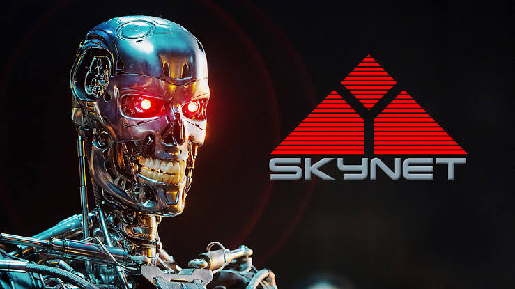

layout: true

<div class="my-footer"><span>Sharing Sentul Plant</span></div>

```{r setup, include=FALSE}
rm(list=ls())
setwd("/cloud/project/LEFO Market Research/Sharing Sentul AI")
library(dplyr)
library(ggplot2)
```

---
class: middle, center, inverse

## Tenang saja isinya tidak __semenyeramkan__ judulnya
_Please sit back and relax, we will uncover the truth behind AI_

---
class: middle

### Apa yang terlintas dalam pikiran rekan-rekan saat mendengar kata-kata:
# _ARTIFICIAL INTELLIGENCE_ ?

---
# Apakah ini?

```{r,echo=FALSE,message=FALSE,warning=FALSE,fig.align='center'}

```

---
# Atau ini?

```{r,echo=FALSE,message=FALSE,warning=FALSE,fig.align='center',fig.height=4}

```

---
# Atau ini?

```{r out.width="70%",echo=FALSE,message=FALSE,warning=FALSE,fig.align='center'}
knitr::include_graphics("Screenshot_20210905_122754_com.opera.browser.jpg")
```

---
class: middle

# Lantas apa itu ___AI___ ?

---
class: middle

### Lantas apa bedanya dengan:
# _MACHINE LEARNING_ ?

--
# _DEEP LEARNING_ ?

---
class: middle

# ANALOGI

.pull-left[

### _It is like teenagers talking about sex._

> Everybody talks about it but how many doing it?

]

.pull-right[

```{r,echo=FALSE,message=FALSE,warning=FALSE,fig.align='center',fig.height=4}
knitr::include_graphics("images-4.jpeg")
```

]

---
class: middle

# SULIT BAGI ORANG AWAM UNTUK MEMBEDAKAN

--

## Mana yang termasuk _science_ ? 

--

## Mana yang termasuk _Science Fiction_?

--

#### Terence Tse dan Mark Esposito, __AI Republic__, 2019.

---
class: middle
# SCIENCE VS SCIENCE FICTION

.pull-left[

## _Artificial General Intelligence_

- This is considered as __“Strong AI”__. 
- This is the kind of AI that scared people, self-aware, has free-will, cannot be dictated by human.
- This is what __average person__ thinks about when they hear AI.

]

.pull-right[

## _Artificial Narrow Intelligence_

- This is considered __“weak AI”__. 
- __Right now__, all computer intelligent technologies are working solely with ANI, machine that can only serve a very well-defined purpose.

]

--

## Kesimpulan: Saat ini kita sampai di __ANI__.

--

> Bagaimana dengan _self driving_ car?

--

## _Keywords: repetitive and well-defined purpose_

---
class: middle, center

# So, how AlphaGo defeat human world champion in 2017?

```{r,echo=FALSE,message=FALSE,warning=FALSE,fig.align='center',fig.height=4}

```

--

## _Simply_: Number Crunching!

---

class: middle, center, inverse

# JADI
## Apa itu _Artificial Intelligence_ ?

---
class: middle

# Apa itu _Artificial Intelligence_ ?

.pull-left[

## _Did you know_

Term AI has been used since the 1950s as umbrella terms for applied science such as Maths, Statistics, Physics, Engineering and Computer science.

## _So, what is AI, ML and DL?_

It is just a bunch lines of algorithm codes doing well-defined jobs!

]

.pull-right[

```{r,echo=FALSE,message=FALSE,warning=FALSE,fig.align='center',fig.height=4}

```

]

---
class: middle

# SUMMARY

.pull-left[

## Isi dari _Artificial Intelligence_ adalah:

```{r,echo=FALSE,message=FALSE,warning=FALSE,fig.align='center'}
nomnoml::nomnoml("#direction: down,
                 [Artificial Intelligence] -> [Science]
                 [Artificial Intelligence] -> [Engineering]
                 [Science] -> [Computation]
                 [Engineering] -> [Computation]
                 
                 [Science|
                    [Theoretical] -> [Math]
                    [Theoretical] -> [Physic]
                    [Theoretical] -> [Chemist]
                    [Theoretical] -> [Biology]
                    ]
                    
                 [Computation| 
                    [Iterasi]
                    [Aproksimasi]
                    ]
                 ")
```

]

.pull-right[

## Apa itu Algoritma?

```{r,echo=FALSE,message=FALSE,warning=FALSE,fig.align='center'}
nomnoml::nomnoml("#direction: down,
                 [Input] -> [<choice>Sekumpulan baris kode\nberisi perintah\nmemproses input menjadi desired output]
                 [<choice>Sekumpulan baris kode\nberisi perintah\nmemproses input menjadi desired output] -> [output]
                 "
                 )

```

]

---
class: middle
# APA YANG __AI__ BISA LAKUKAN?

.pull-left[

### Human brain is ___limited___ in terms of computing.

### While machine or computer has ___"unlimited"___ computing resources.

### AI is a ___tools___ that help us to:

]

.pull-right[

```{r,echo=FALSE,message=FALSE,warning=FALSE,fig.align='center'}
nomnoml::nomnoml("
                 [AI] -> [Automation]
                 [AI] -> [Optimization]
                 [AI] -> [Prediction/Classification\nForecast]
                 [AI] -> [Advance Analysis]
                 [AI] -> [Data Acquisition]
                 "
                 )

```

]

---

# _"UNLIMITED_ COMPUTING RESOURCES

.pull-left[

## Deteksi Biomarker dalam Darah

Untuk mengetahui seseorang terinfeksi Covid atau tidak.

```{r,echo=FALSE,message=FALSE,warning=FALSE,fig.align='center',fig.height=4}

```

]

.pull-right[

## Prediksi Diabetes

Mengetahui faktor apa saja yang membuat seseorang wanita beresiko diabetes.

```{r,echo=FALSE,message=FALSE,warning=FALSE,fig.align='center',fig.height=2.5}

```

Sumber data: PIMA Indian Diabetes. https://ikanx101.com/blog/diabet-ai/

]

---
class: middle,center,inverse

# _FREQUENTLY ASKED QUESTIONS_

### Seperti apa bentuknya?

### Bagaimana barangnya?

### Bagaimana cara membuatnya?
---
class: center

```{r out.width="100%",echo=FALSE,message=FALSE,warning=FALSE,fig.align='center'}
nomnoml::nomnoml("#direction: down,
                 [AI] -> [Cara membuat]
                 [AI] -> [Lokasi komputasi]
                 [AI] -> [License]
                 
                 [Cara membuat] -> [No code]
                 [Cara membuat] -> [Low code]
                 [Cara membuat] -> [Hard code]
                 
                 [Lokasi komputasi] -> [Local]
                 [Lokasi komputasi] -> [Cloud]
                 
                 [License] -> [Open source]
                 [License] -> [Paid / Freemium]
                 "
                 )

```

---
class: middle, center, inverse

## Terima Kasih
# _Market Research_ Dept. @nutrifood 

### _find me at:_ ikanx101.com