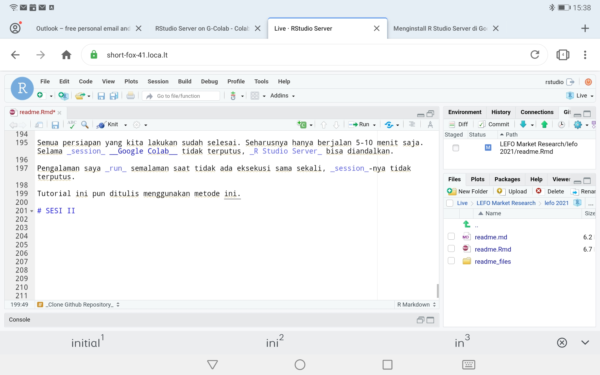

```{r,include=FALSE}
rm(list=ls())
library(dplyr)
library(ggplot2)
```

# PENDAHULUAN

## Latar Belakang

Tidak setiap waktu kita berada di depan laptop atau komputer. Penyimpanan _cloud_ seperti _Google Drive_ atau _OneDrive_ kurang bersahabat bagi analis data, _programmer_, dan _data-related job_.

_Ngoding_ seringkali dirasakan cukup sulit. Apalagi begitu banyak _scripts_ atau _commands_ yang tidak mungkin "dihapalkan" semua. Oleh karena itu, kita bisa mempersingkatnya dengan membuat _function_ sendiri.

## Tujuan

Bekerja dengan lebih produktif dengan __R Studio Server__.

- _Fast_,
- _Reliable_,
- _Agile_.

## Bumbu yang Dibutuhkan

Untuk melakukan ini, kita memerlukan beberapa hal ini:

1. _Gadget_ dengan _browser_ (`Chrome`, `Mozilla`, atau `Opera`. Saya belum mencoba `Safari`) dan koneksi internet.
1. Akun _Gmail_ untuk _run_ di _Google Colab_.
1. Akun `github` untuk _cloud storage_.
1. Waktu $\sim 5$ menit untuk instalasi dan konfigurasi __R Studio Server__.


## Bagaimana Cara Kerjanya?

_Google Colab_ secara _default_ berjalan menggunakan bahasa `Python3` dalam sistem operasi __Linux__ pada _Compute Engine_-nya.

Kita bisa memanfaatkan __Linux__ tersebut untuk meng-_install_ beberapa aplikasi _server_ seperti __R Studio Server__ secara _cloud_. Setelah itu _port server_ tersebut kita _forward_ ke _public_ menggunakan _ssh forwarding_ di __Linux__.

```{r,echo = FALSE,fig.retina=10,fig.align='center'}
nomnoml::nomnoml("#direction: down
                 [Google Colab] -> [Install]
                 [Install] -> [Run]
                 [Run] -> [Github]
                 
                 [Install|
                   [R Studio Server]
                   [Local Tunnel]
                   ]
                 
                 [Run|
                   [Set TZ]
                   [Install libraries]
                   ]
                 
                 [Github|
                   [Config] -> [user name]
                   [Config] -> [user email]
                   [Config] -> [clone repo]
                   
                   ]
                 ")

```

---

# SESI I

# _CLOUD COMPUTING_ {-}

## Persiapan Github

### Buat Akun Github (opsional)

[Github](https://en.m.wikipedia.org/wiki/GitHub) adalah salah satu situs yang digunakan oleh banyak _programmer_ di dunia sebagai area bekerja. Salah satu keunggulannya adalah _environment_-nya yang memang dibuat khusus _programmer_.

Github kini dimiliki oleh _Microsoft_ dan bersifat _free_ dan _open source_.

_Backbone_ dari Github adalah _software_ `Git` yang dibuat oleh penemu __Linux__ ([Linus Torvalds](https://en.m.wikipedia.org/wiki/Linus_Torvalds)).

> Git software for tracking changes in any set of files, usually used for coordinating work among programmers collaboratively developing source code during software development. Its goals include speed, data integrity, and support for distributed, non-linear workflows (thousands of parallel branches running on different systems).

Untuk keperluan market riset, Github akan sangat berguna sebagai _infinite cloud storage_ yang bisa ditempel ke __R Studio__ di perangkat apa saja.

### Buat _Repository_

Silakan buat akun Github (opsional - jika berkenan) lalu coba buat satu _repository_ baru.

Apa itu _repository_?

> Secara simpel suatu repository adalah satu "folder" besar berisi project __R__ yang hendak kita buat atau kerjakan.

Kita bisa membuat _repository_ tersebut _private_ atau _public_ sesuai dengan kebutuhan. Kita juga bisa mengajak rekan-rekan kerja yang lain sebagai _contributors_ dengan _access level_ yang ditentukan dari awal.

Jika kita tidak memiliki akun Github, kita tetap bisa ___clone public repository___ ke dalam __R Studio__ _environment_. Tapi sifatnya hanya pasif (hanya menerima dan mengedit) tidak bisa melakukan perubahan secara _cloud_.

### _Clone_ _Repository_

Jika kita sudah membuat _repository_, silakan _clone repository_ tersebut ke __R Studio__. 

### _Set Tokens_

Sebagai pengaman agar _file_ yang ada di _cloud_ tidak diganggu oleh orang yang tidak berkepentingan, kita perlu membuat _tokens_ yang berguna untuk komunikasi antara __R Studio__ dengan Github.

## Persiapan Google Colab

Pastikan kita telah memiliki akun Gmail. Buka situs [Google Colab](https://colab.research.google.com/#create=true) berbasis `Python3`.

_Copy-paste-run codes below:_

```
# saya berikan penjelasan setiap baris codesnya ya

# dua baris ini adalah untuk membuat user di Linux
# secara default saya buat sebagai berikut:
  # user : rstudio
  # pass : password
# feel free untuk mengganti ATAU menambahkan multi user
# ingatlah bahwa compute engine ini milik Google
# jadi siapa tahu bisa dirun paralel untuk multi user

!sudo useradd -m -s /bin/bash rstudio
!echo rstudio:password | chpasswd


# melakukan update Linux
!apt-get update

# install R base (cli version)
!apt-get install r-base

# install beberapa library Linux
!apt-get install libglpk-dev # ini khusus untuk optimisasi
!apt-get install gdebi-core

# download installer R studio server dari situs resmi
!wget https://download2.rstudio.org/server/bionic/amd64/rstudio-server-1.4.1103-amd64.deb

# proses instalasi R studio server
!gdebi -n rstudio-server-1.4.1103-amd64.deb

# Install localtunnel
!npm install -g npm
!npm install -g localtunnel

# forward port 8787 ke public
!lt --port 8787 
```

Proses ini berkisar antara 2-3 menit saja.

Setelah prosesnya selesai, silakan buka alamat situs yang tertera. Klik `continue` dan masukkan _username_ dan _password_ yang telah kita tentukan.

## Persiapan __R Studio Server__

__R Studio Server__ sudah bisa digunakan. Beberapa _libraries_ standar seperti `dplyr` dan `ggplot2` sudah _pre-installed_ di dalam sistem.

Jika kita ingin meng-_install_ _libraries_ lain, kita perlu melakukan konfigurasi _time zone_ dengan perintah sederhana sebagai berikut:

### _Set Time Zone_

_Copy-paste-run codes below:_

```
Sys.setenv(TZ = "GMT")
```

Pada _tab_ `Terminal`.

### _Config Git Global Setting_

Untuk menghubungkan __R Studio Server__ dengan Github _repository_, kita perlu melakukan konfigurasi sebagai berikut:

_Copy-paste-run codes below:_

```
system('git config --global user.name "yourname"')
system('git config --global user.email "youremail@email.com"')
```

Pada _tab_ `Terminal`.

### _Clone Github Repository_

Sekarang kita akan _clone github repository_ ke dalam __R Studio__ _Environment_.

Semua persiapan yang kita lakukan sudah selesai. Seharusnya hanya berjalan 5-10 menit saja. Selama _session_ __Google Colab__ tidak terputus, _R Studio Server_ bisa diandalkan.

Pengalaman saya _run_ semalaman saat tidak ada eksekusi sama sekali, _session_-nya tidak terputus.

Tutorial ini pun ditulis menggunakan metode ini.

```{r,echo=FALSE,fig.align='center',fig.cap = "Screenshoot Saat Membuat Materi"}

```

---

# SESI II

# __R__ _FUNCTION_ dan _MARKDOWN_

Salah satu kelebihan _coding-based data analysis_ dengan _menu-based data analysis_ adalah _reproducibility_. Kita (baca: seharusnya) bisa mengerjakan tugas repetitif dengan lebih cepat dengan memanfaatkan _custom function_ dan _markdown_.

## __R__ _Function_

Kenapa harus membuat _custom function_?

> Seringkali kita menggunakan beberapa baris _codes_ berulang-ulang.

### Struktur __R__ _Function_

Secara teori, teori struktur suatu __R__ _function_ adalah sebagai berikut:

```
INPUT
  - no input
  - input
    - single object
    - multiple object

PROCESS
  - base R function
    - conditional
    - looping
    - sequence
  - other custom function

OUTPUT
  - single object
  - multiple object
```

Di sini saya menuliskan _object_ yang berarti struktur data yang terkait bisa berupa _single value_, _data frame_, dan _list_.

### _Demo_ dan _Hands on_

Mari kita coba dengan studi kasus perhitungan BMI.

## __R__ _Markdown_

Kenapa harus _markdown_?

> Ada kalanya _report_ di _market research_ memiliki _dynamic object_ agar klien bisa berinteraksi langsung. Contoh: _dynamic table_.

