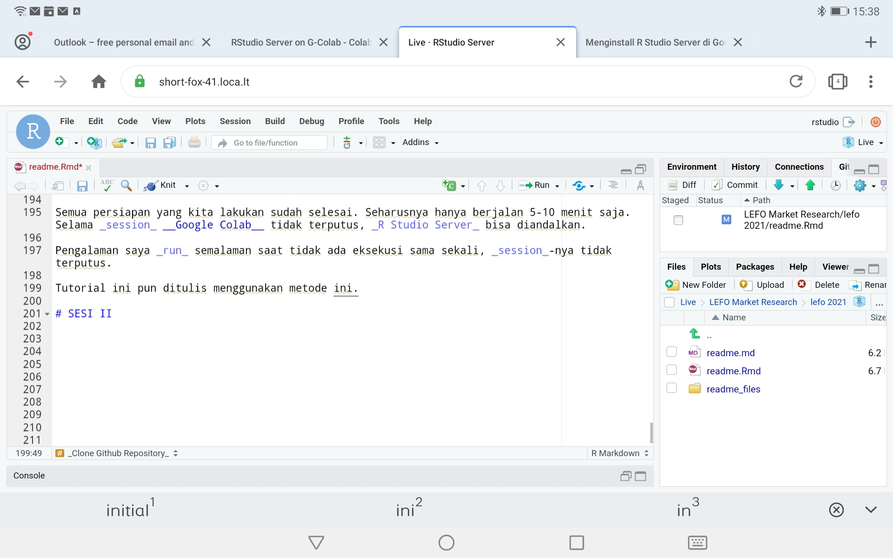

Productive with R Series
================
by: Ikang Fadhli  
Nutrifood Indonesia

# PENDAHULUAN

## Latar Belakang

Tidak setiap waktu kita berada di depan laptop atau komputer.
Penyimpanan *cloud* seperti *Google Drive* atau *OneDrive* kurang
bersahabat bagi analis data, *programmer*, dan *data-related job*.

*Ngoding* seringkali dirasakan cukup sulit. Apalagi begitu banyak
*scripts* atau *commands* yang tidak mungkin “dihapalkan” semua. Oleh
karena itu, kita bisa mempersingkatnya dengan membuat *function*
sendiri.

## Tujuan

Bekerja dengan lebih produktif dengan **R Studio Server**.

  - *Fast*,
  - *Reliable*,
  - *Agile*.

## Bumbu yang Dibutuhkan

Untuk melakukan ini, kita memerlukan beberapa hal ini:

1.  *Gadget* dengan *browser* (`Chrome`, `Mozilla`, atau `Opera`. Saya
    belum mencoba `Safari`) dan koneksi internet.
2.  Akun *Gmail* untuk *run* di *Google Colab*.
3.  Akun `github` untuk *cloud storage*.
4.  Waktu  menit untuk instalasi dan konfigurasi **R Studio
    Server**.

## Bagaimana Cara Kerjanya?

*Google Colab* secara *default* berjalan menggunakan bahasa `Python3`
dalam sistem operasi **Linux** pada *Compute Engine*-nya.

Kita bisa memanfaatkan **Linux** tersebut untuk meng-*install* beberapa
aplikasi *server* seperti **R Studio Server** secara *cloud*. Setelah
itu *port server* tersebut kita *forward* ke *public* menggunakan *ssh
forwarding* di
**Linux**.


-----

# SESI I

# *CLOUD COMPUTING*

## Persiapan Github

### Buat Akun Github (opsional)

[Github](https://en.m.wikipedia.org/wiki/GitHub) adalah salah satu situs
yang digunakan oleh banyak *programmer* di dunia sebagai area bekerja.
Salah satu keunggulannya adalah *environment*-nya yang memang dibuat
khusus *programmer*.

Github kini dimiliki oleh *Microsoft* dan bersifat *free* dan *open
source*.

*Backbone* dari Github adalah *software* `Git` yang dibuat oleh penemu
**Linux** ([Linus
Torvalds](https://en.m.wikipedia.org/wiki/Linus_Torvalds)).

> Git software for tracking changes in any set of files, usually used
> for coordinating work among programmers collaboratively developing
> source code during software development. Its goals include speed, data
> integrity, and support for distributed, non-linear workflows
> (thousands of parallel branches running on different systems).

Untuk keperluan market riset, Github akan sangat berguna sebagai
*infinite cloud storage* yang bisa ditempel ke **R Studio** di perangkat
apa saja.

### Buat *Repository*

Silakan buat akun Github (opsional - jika berkenan) lalu coba buat satu
*repository* baru.

Apa itu *repository*?

> Secara simpel suatu repository adalah satu “folder” besar berisi
> project **R** yang hendak kita buat atau kerjakan.

Kita bisa membuat *repository* tersebut *private* atau *public* sesuai
dengan kebutuhan. Kita juga bisa mengajak rekan-rekan kerja yang lain
sebagai *contributors* dengan *access level* yang ditentukan dari awal.

Jika kita tidak memiliki akun Github, kita tetap bisa ***clone public
repository*** ke dalam **R Studio** *environment*. Tapi sifatnya hanya
pasif (hanya menerima dan mengedit) tidak bisa melakukan perubahan
secara *cloud*.

### *Clone* *Repository*

Jika kita sudah membuat *repository*, silakan *clone repository*
tersebut ke **R Studio**.

### *Set Tokens*

Sebagai pengaman agar *file* yang ada di *cloud* tidak diganggu oleh
orang yang tidak berkepentingan, kita perlu membuat *tokens* yang
berguna untuk komunikasi antara **R Studio** dengan Github.

## Persiapan Google Colab

Pastikan kita telah memiliki akun Gmail. Buka situs [Google
Colab](https://colab.research.google.com/#create=true) berbasis
`Python3`.

*Copy-paste-run codes below:*

    # saya berikan penjelasan setiap baris codesnya ya
    
    # dua baris ini adalah untuk membuat user di Linux
    # secara default saya buat sebagai berikut:
      # user : rstudio
      # pass : password
    # feel free untuk mengganti ATAU menambahkan multi user
    # ingatlah bahwa compute engine ini milik Google
    # jadi siapa tahu bisa dirun paralel untuk multi user
    
    !sudo useradd -m -s /bin/bash rstudio
    !echo rstudio:password | chpasswd
    
    
    # melakukan update Linux
    !apt-get update
    
    # install R base (cli version)
    !apt-get install r-base
    
    # install beberapa library Linux
    !apt-get install libglpk-dev # ini khusus untuk optimisasi
    !apt-get install gdebi-core
    
    # download installer R studio server dari situs resmi
    !wget https://download2.rstudio.org/server/bionic/amd64/rstudio-server-1.4.1103-amd64.deb
    
    # proses instalasi R studio server
    !gdebi -n rstudio-server-1.4.1103-amd64.deb
    
    # Install localtunnel
    !npm install -g npm
    !npm install -g localtunnel
    
    # forward port 8787 ke public
    !lt --port 8787 

Proses ini berkisar antara 2-3 menit saja.

Setelah prosesnya selesai, silakan buka alamat situs yang tertera. Klik
`continue` dan masukkan *username* dan *password* yang telah kita
tentukan.

## Persiapan **R Studio Server**

**R Studio Server** sudah bisa digunakan. Beberapa *libraries* standar
seperti `dplyr` dan `ggplot2` sudah *pre-installed* di dalam sistem.

Jika kita ingin meng-*install* *libraries* lain, kita perlu melakukan
konfigurasi *time zone* dengan perintah sederhana sebagai berikut:

### *Set Time Zone*

*Copy-paste-run codes below:*

    Sys.setenv(TZ = "GMT")

Pada *tab* `Terminal`.

### *Config Git Global Setting*

Untuk menghubungkan **R Studio Server** dengan Github *repository*, kita
perlu melakukan konfigurasi sebagai berikut:

*Copy-paste-run codes below:*

    system('git config --global user.name "yourname"')
    system('git config --global user.email "youremail@email.com"')

Pada *tab* `Terminal`.

### *Clone Github Repository*

Sekarang kita akan *clone github repository* ke dalam **R Studio**
*Environment*.

Semua persiapan yang kita lakukan sudah selesai. Seharusnya hanya
berjalan 5-10 menit saja. Selama *session* **Google Colab** tidak
terputus, *R Studio Server* bisa diandalkan.

Pengalaman saya *run* semalaman saat tidak ada eksekusi sama sekali,
*session*-nya tidak terputus.

Tutorial ini pun ditulis menggunakan metode
ini.

<div class="figure" style="text-align: center">



<p class="caption">

Screenshoot Saat Membuat Materi

</p>

</div>

-----

# SESI II

# **R** *FUNCTION* dan *MARKDOWN*

Salah satu kelebihan *coding-based data analysis* dengan *menu-based
data analysis* adalah *reproducibility*. Kita (baca: seharusnya) bisa
mengerjakan tugas repetitif dengan lebih cepat dengan memanfaatkan
*custom function* dan *markdown*.

## **R** *Function*

Kenapa harus membuat *custom function*?

> Seringkali kita menggunakan beberapa baris *codes* berulang-ulang.

### Struktur **R** *Function*

Secara teori, teori struktur suatu **R** *function* adalah sebagai
berikut:

    INPUT
      - no input
      - input
        - single object
        - multiple object
    
    PROCESS
      - base R function
        - conditional
        - looping
        - sequence
      - other custom function
    
    OUTPUT
      - single object
      - multiple object

Di sini saya menuliskan *object* yang berarti struktur data yang terkait
bisa berupa *single value*, *data frame*, dan *list*.

### *Demo* dan *Hands on*

#### Kasus I

Mari kita coba dengan studi kasus perhitungan BMI.

  
  

Dimana:

  -  adalah berat
    badan (dalam kg).
  -  adalah tinggi
    badan (dalam m).

#### Kasus II

Membuat *pie-chart* langsung dari data riset (*single answer*).

*Copy-paste-run codes below*:

``` r
set.seed(007)
id = 1:100
aware = sample(c("Ya","Tidak"),
           100,
           replace = T,
           prob = c(.7,.3))

data.frame(id,aware)
```

    ##      id aware
    ## 1     1 Tidak
    ## 2     2    Ya
    ## 3     3    Ya
    ## 4     4    Ya
    ## 5     5    Ya
    ## 6     6 Tidak
    ## 7     7    Ya
    ## 8     8 Tidak
    ## 9     9    Ya
    ## 10   10    Ya
    ## 11   11    Ya
    ## 12   12    Ya
    ## 13   13 Tidak
    ## 14   14    Ya
    ## 15   15    Ya
    ## 16   16    Ya
    ## 17   17    Ya
    ## 18   18    Ya
    ## 19   19 Tidak
    ## 20   20    Ya
    ## 21   21    Ya
    ## 22   22    Ya
    ## 23   23 Tidak
    ## 24   24 Tidak
    ## 25   25 Tidak
    ## 26   26    Ya
    ## 27   27    Ya
    ## 28   28    Ya
    ## 29   29 Tidak
    ## 30   30    Ya
    ## 31   31    Ya
    ## 32   32    Ya
    ## 33   33    Ya
    ## 34   34    Ya
    ## 35   35    Ya
    ## 36   36 Tidak
    ## 37   37    Ya
    ## 38   38 Tidak
    ## 39   39 Tidak
    ## 40   40    Ya
    ## 41   41 Tidak
    ## 42   42    Ya
    ## 43   43 Tidak
    ## 44   44    Ya
    ## 45   45 Tidak
    ## 46   46    Ya
    ## 47   47    Ya
    ## 48   48 Tidak
    ## 49   49 Tidak
    ## 50   50 Tidak
    ## 51   51    Ya
    ## 52   52 Tidak
    ## 53   53 Tidak
    ## 54   54    Ya
    ## 55   55 Tidak
    ## 56   56    Ya
    ## 57   57    Ya
    ## 58   58    Ya
    ## 59   59    Ya
    ## 60   60    Ya
    ## 61   61    Ya
    ## 62   62    Ya
    ## 63   63 Tidak
    ## 64   64    Ya
    ## 65   65    Ya
    ## 66   66    Ya
    ## 67   67    Ya
    ## 68   68    Ya
    ## 69   69    Ya
    ## 70   70    Ya
    ## 71   71    Ya
    ## 72   72    Ya
    ## 73   73 Tidak
    ## 74   74    Ya
    ## 75   75    Ya
    ## 76   76    Ya
    ## 77   77    Ya
    ## 78   78    Ya
    ## 79   79    Ya
    ## 80   80 Tidak
    ## 81   81 Tidak
    ## 82   82 Tidak
    ## 83   83    Ya
    ## 84   84 Tidak
    ## 85   85    Ya
    ## 86   86    Ya
    ## 87   87    Ya
    ## 88   88 Tidak
    ## 89   89    Ya
    ## 90   90    Ya
    ## 91   91    Ya
    ## 92   92    Ya
    ## 93   93 Tidak
    ## 94   94    Ya
    ## 95   95 Tidak
    ## 96   96    Ya
    ## 97   97    Ya
    ## 98   98    Ya
    ## 99   99 Tidak
    ## 100 100    Ya

## **R** *Markdown*

Kenapa harus *markdown*?

> Ada kalanya *report* di *market research* memiliki *dynamic object*
> agar klien bisa berinteraksi langsung. Contoh: *dynamic table*.
