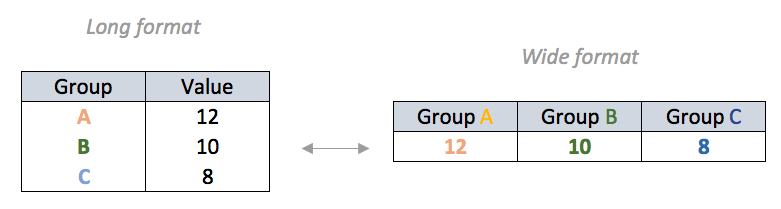

```{r setup, include=FALSE}
knitr::opts_chunk$set(echo = TRUE)
options(scipen = 99) 

# membersihkan global environment
rm(list = ls())

# set working directory
# perhatikan bahwa working directory rekan-rekan akan berbeda dengan saya
# tolong disesuaikan terlebih dahulu
setwd("~/Documents/Training-R---Data-Viz")

# pastikan semua libraries dipanggil
# for data reshaping
library(dplyr)
library(tidyr)
# for working with dates
library(lubridate)
# for visualization
library(ggplot2)
library(plotly)
library(glue)
```


# Abstract

The data we're working is `USvideos.csv`, a dataset scraped from Youtube's US Trending Videos. By analizing this Trending Videos data, we will uncover how these videos were able to reach such massive audience. We'll also take a look and see if there were any similarities between the videos that did well on the platform. 

# Memanggil _Dataset_

Langkah pertama yang harus dilakukan adalah memanggil _dataset_ dan memastikan _dataset_ tersebut sudah masuk ke dalam _Global Environment_.

```{r}
# membaca file csv
vids = read.csv("USvideos.csv")

# melihat seluruh nama variabel dalam dataset vids
names(vids)
```

In this session, we will use visualization techniques to gain such insights from the trending videos data:
1. Does the video publishing time affect its popularity? If so, when is the best time to publish a video?
2. Does user engagement relate to video's popularity? If so, does it tend to has a positive or negative engagement? 
3. Who were the most prolific producers of trending videos in recent weeks?

We will use two plotting systems for our task:  
- Base plot for a quick and simple exploratory visualization
- `ggplot2` for uncovering more complex pattern & for producing explanatory visualization

## Mengecek struktur data

Langkah berikutnya adalah mengecek struktur dari data. Hal ini wajib dilakukan untuk mengetahui apakah variabel dalam data tersebut sudah memiliki tipe yang tepat atau belum.

```{r}
# melihat struktur data
str(vids)
```

Do the column `trending_date` & `publish_time` have stored in the correct class?

# Data Pre-Processing

## Working with date/time

### Date-Time Conversion

In order to answer our first question (*Does the video publishing time affect its popularity?*), we need to explore our datetime data more. Looking back to the structure of our dataset, there are two variables in our dataset which related to datetime data; `trending_date` and `publish_date`.

Previously we've learned base R method to convert our column to date with `as.Date()` function, followed with your data time formatting (if your date data wasn't stored in ISO format;YYYY-MM-DD):

YEAR  
%Y = YYYY  
%y = YY   
  
MONTH  
%B = month name e.g. March  
%b = month name(abbreviation) e.g. Mar  
%m = 2 digits mo e.g. 03  
%M = 1 digit mo e.g. 3  
  
DAY  
%A = weekday e.g. Friday  
%d = weekday digit.

Let's start with `trending_date`. Previously, we learnt to convert a date variable with: `as.Date(vids$trending_date, "%y.%d.%m")`
  
But now, we'll use an easier alternative to work with date-time data, and that is through the use of `lubridate`.
`lubridate` provides tools that make it easier to parse and manipulate dates:

Kesimpulan:

Ada dua cara mengkonversi data tipe `character` menjadi bentuk waktu (tanggal dan jam), yakni dengan:

1. `base` __R__ dengan _function_ `as.Date()`
2. `library(lubridate)`

```{r}
# Contoh:
a <- "08/03/19"
b <- "8-March-2019"
c <- "Thursday, 09-05-2019"
d <- "2019/05/09, 1:42PM"

# convert date using as.Date:
a <- as.Date(a, "%d/%m/%y")
a

# convert date using lubridate:
b <- dmy(b)
c <- dmy(c)
d <- ymd_hm(d)

b
c
d
```

[Time-zone reference](https://en.wikipedia.org/wiki/List_of_tz_database_time_zones#List)

Sekarang kita akan melakukan konversi terhadap dua variabel yang ada, yakni `trending_date` dan `publish_time` menggunakan fungsi dari `library(lubridate)` dengan memanfaatkan prinsip _pipe_ ( `%>%` ) sebagai berikut:

```{r,message=FALSE}
vids = 
  vids %>% 
  mutate(trending_date = ydm(trending_date), # convert trending date
         publish_time = ymd_hms(publish_time,tz = "America/New_York") # convert publish time
         )

# melihat hasil konversi
# 5 data pertama
head(vids)
```

### Date-Time Extraction

Sekarang kita akan lanjutkan ekstraksi informasi tanggal dan waktu dengan memanfaatkan prinsip _pipe_ ( `%>%` ) sebagai berikut: 

```{r}
vids = 
  vids %>% 
  mutate(
    # get time components from trending date
    trending_dow = wday(trending_date,label = T,abbr = T, week_start = 1), # day of week
    trending_month = month(trending_date,label=T), # month
    
    # get time components from publish time
    publish_wday = wday(publish_time,label = T,abbr = F,week_start = 1),
    publish_hour = hour(publish_time)
        ) 

# melihat hasil konversi
# 5 data terakhir
tail(vids,5)
```

### Categorizing hour

Sekarang kita akan membuat kategori dari variabel `publish_hour`. Pertama-tama, kita perhatikan ada data apa saja dari variabel tersebut:

```{r}
sort(unique(vids$publish_hour))
```

Masih ingat terkait materi _function_ ?

Kita sekarang akan membuat _function_ yang bertujuan untuk mengkategorikan `publish_hour` ke tiga kelompok:

1. `12AM to 7AM`
1. `8AM to 3PM`
1. `4PM to 11PM`

```{r}
# membuat function untuk melakukan kategorisasi
pw = function(x){
    if(x < 8){
      x <- "12AM to 7AM"
    }else if(x >= 8 & x < 16){
      x <- "8AM to 3PM"
    }else{
      x <- "4PM to 11PM"
    }  
}
```

Setelah itu, kita akan aplikasikan _function_ tersebut ke dataframe yang ada dengan menggunakan:

`sapply(x, FUN)`

Arguments: 

- `x`: A vector or an object
- `FUN`: Function applied to each element of x

```{r}
# apply function
vids$publish_when = as.factor(sapply(vids$publish_hour,pw))
# see unique data in column publish_when
unique(vids$publish_when)

head(vids)
```

Variabel `publish_when` memiliki tipe `factor` dan masih tidak berurutan. Oleh karena itu, kita akan urutkan sesuai dengan waktu sebagai berikut:

```{r}
# mengurutkan kategory dengan level
vids$publish_when = ordered(vids$publish_when,
                            levels=c("12AM to 7AM",
                                     "8AM to 3PM",
                                     "4PM to 11PM"))
# see 5 first data of publish_when
head(vids$publish_when)
```

## Working with category

```{r}
# e.g. 1
#switch number to words
switch(1,
       "1" = "Low",
       "2" = "Medium",
       "3" = "High")


# e.g. 2
data <- 1:3
# wrong answer
# will throw error:
# switch(data,
#        "1" = "Low",
#        "2" = "Medium",
#        "3" = "High")

#right answer
sapply(data,switch,
       "1" = "Low",
        "2" = "Medium",
        "3" = "High")
```

```{r}
#replacing number codes with words
vids$category_id <- sapply(as.character(vids$category_id), switch, 
                           "1" = "Film and Animation",
                           "2" = "Autos and Vehicles", 
                           "10" = "Music", 
                           "15" = "Pets and Animals", 
                           "17" = "Sports",
                           "19" = "Travel and Events", 
                           "20" = "Gaming", 
                           "22" = "People and Blogs", 
                           "23" = "Comedy",
                           "24" = "Entertainment", 
                           "25" = "News and Politics",
                           "26" = "Howto and Style", 
                           "27" = "Education",
                           "28" = "Science and Technology", 
                           "29" = "Nonprofit and Activism",
                           "43" = "Shows")

vids$category_id <- as.factor(vids$category_id)

head(vids,5)
```

## Select unique videos

Perhatikan data sebagai berikut:

```{r}
# see total of title
length(vids$title)

# see total of title without any duplicates
length(unique(vids$title))
```

Kalau kita perhatikan bersama, ada beberapa `title` yang berulang muncul pada dataset `vids`. Pembedanya adalah `trending_date`. Oleh karena itu, kita hanya akan mengambil data dari masing-masing `title` dari `trending_date` terbaru.

```{r}
# eliminate all duplicates of title in vids data
vids.u =
  vids %>% 
  group_by(title) %>% 
  filter(trending_date == max(trending_date)) %>% 
  ungroup()

head(vids.u)
```

## How Popular is Your Video?

Mari kita buat analisa mengenai seberapa populer video tersebut di Youtube! Setidaknya, kita akan menghitung `3` __parameter__ baru, yakni:

1. `likesratio`: seberapa banyak orang yang _hit_ `likes` dari total `views`.
1. `dislikesratio`: seberapa banyak orang yang _hit_ `dislikes` dari total `views`.
1. `commentratio`: seberapa banyak orang yang menulis `comment` dari total `views`.

```{r}
vids.u = 
  vids.u %>% 
  mutate(
    likesratio = likes/views * 100,
    dislikeratio = dislikes/views * 100,
    commentratio = comment_count/views * 100
  )

head(vids.u,5)
```

## How High is the Engagement?

Misalkan kita hendak melakukan analisa terhadap kategori video:

1. "Autos and Vehicles",
1. "Gaming",
1. "Travel and Events" 

Mari kita _subset_ datanya dengan prinsip _pipe_ (`%>%`) sebagai berikut:

```{r}
# kita buat dulu target campaign yang akan menjadi filter
campaign = c("Autos and Vehicles", "Gaming","Travel and Events")

# extract data only in 'campaign' group
vids.camp = 
  vids.u %>% 
  filter(category_id %in% campaign)

head(vids.camp,5)

# Pertanyaan tambahan
# sorting berdasarkan rules tertentu
# urutannya: Gaming, Travel, Auto
vids_new = 
  vids.camp %>% 
  mutate(category_id = factor(category_id,
                              levels = c('Gaming',
                                         'Travel and Events',
                                         'Autos and Vehicles'))
         ) %>% 
  arrange(category_id)
```

_____________

# Membuat Grafik Menggunakan `base` __R__

Sebelum kita membahas mengenai `library(ggplot2)`, sebenarnya __R__ memiliki `base` untuk membuat grafik yang sederhana dan mudah.

Jenis plot yang dihasilkan juga berubah sesuai tipe data yang dimasukkan, jika:  
* 1 variabel, x kategori: **bar chart**  
* 1 variabel, x numerik: **scatter plot**  
* 2 variabel, x dan y adalah numerik: **scatter plot**  
* 2 variabel, x kategori, y numerik: **boxplot** 

## Contoh grafik _Scatterplot_

_Scatterplot_ digunakan untuk membandingkan/melihat hubungan dua variabel numerik. Kemudian biasanya analisa lanjutan yang sering digunakan adalah korelasi.

_Scatterplot_ dari `base`:

```{r}
plot(vids.camp$comment_count,
     vids.camp$views,
     col = vids.camp$category_id,
     pch = 12)
```

### QUIZ:

Apa fungsi dari `col = ` dan `pch = `?

## Fitur Lain pada _Scatterplot_ Memanfaatkan `base`

Kita bisa menambahkan _trendline_, dengan membuat rumus regresi dari: $views = a*comment + C$

```{r}
plot(vids.camp$comment_count,
     vids.camp$views,
     col = vids.camp$category_id,
     pch = 2)
abline(lm(vids.camp$views ~ vids.camp$comment_count))
legend("topright",legend=levels(vids.camp$category_id),fill=1:6)
```

- Semakin tinggi jumlah `views` pada sebuah video, semakin tinggi juga jumlah `comment_count` pada video tersebut
- Kategori "Gaming" memiliki `views` dan `comment_count` tertinggi  
- Dari kategori Gaming, ada beberapa video dangan `views` yang tinggi namun `comment_count` yang sedikit, dan sebaliknya


____

# `library(ggplot2)`

## Simple Exploratory

### Pre-Campaign Analysis

Problem statements:
  1. Amongst Automotive, Gaming & Travel, which category shows highest likeability (likesperviews)?
  2. Does the publish time affect likeability? 

Untuk menjawab ini mari kita buat grafik berbentuk _boxplot_ dengan bantuan `library(ggplot2)`

Bagaimana cara kerja `ggplot`?

1. Buat kanvas.
1. Masukkan jenis plot yang diinginkan. Berikan fitur (_aesthetic_) untuk masing-masing plot.
1. Tambah fitur pada plot seperti _title_, _subtitle_, _label_, _caption_, dll
1. Berikan tema (jika mau).

```{r}
# 1. create the base canvas
vids.camp %>% 
  ggplot(aes(x = publish_when,
             y = likesratio))
```
  
```{r}
# 2. add the geom element / jenis plot
vids.camp %>% 
  ggplot(aes(x = publish_when,
             y = likesratio)) +
  geom_boxplot()
```

```{r}
# add another geom element
vids.camp %>% 
  ggplot(aes(x = publish_when,
             y = likesratio)) +
  geom_boxplot() +
  geom_jitter()
```

```{r}
# add more visual cues
vids.camp %>% 
  ggplot(aes(x = publish_when,
             y = likesratio)) +
  geom_boxplot(color = 'magenta',size = .75,fill = 'cyan')+
  geom_jitter(aes(color=category_id,size=comment_count),alpha=0.75)+
  labs(title = "Pre-Campaign Analysis: Automotive, Gaming & Travel",
       subtitle = "Gaming shows higher user engagement",
       x = "Publish Time",
       y = "Likes per Views Ratio",
       size = "Comment Count",
       color = "Category",
       caption = "Training Data Viz @nutrifood")
```

## Visualizing comparison with barchart
### Who were the most prolific producers of trending videos in recent weeks?

Tujuan kita adalah: 

Take only the channels that have at least 10 videos being trending!

Kita akan mengambil base data frame dari `vids.u` yang tidak ada _duplicate_.

```{r}
# take only the channels that have at least 10 videos being trending
top = 
  vids.u %>% 
  group_by(channel_title) %>% 
  summarise(Freq = n()) %>% 
  ungroup() %>% 
  filter(Freq >= 10) %>% 
  arrange(desc(Freq)) %>% 
  rename(Channel = channel_title)

top 
```

Let's turn the table to a barchart visualization:

```{r}
top %>% 
  ggplot(aes(x = Channel,
             y = Freq)) +
  geom_col()
```

Notice that the axis labels were too "tight". There are two approaches on handling this problem:
```{r}
# first approach: rotate the axis
top %>% 
  ggplot(aes(x = Channel,
             y = Freq)) +
  geom_col()+
  theme(axis.text.x = element_text(angle = 45,hjust=1))

```

```{r}
# second approach: flip the coordinate with `coord_flip`
top %>% 
  ggplot(aes(x = Channel,
             y = Freq)) +
  geom_col() +
  coord_flip()
```

Make your barchart more efficient by ordering the bars based on the value you want to show:

```{r}
# rerun the code above
top %>% 
  ggplot(aes(x = reorder(Channel,Freq), # kalau mau kebalikannya, bisa tambah - di depan Freq
             y = Freq)) +
  geom_col() +
  coord_flip()
```

#### Colors in ggplot

- Use `fill` or `color` argument inside the `geom_*`:  
  - `fill`: fill changes the colour within shapes  
  - `color`: colour changes the outline  

```{r}
# add general color 
top %>% 
  ggplot(aes(x = reorder(Channel,Freq),
             y = Freq)) +
  geom_col(fill="blue") +
  coord_flip()
```


```{r}
# use aes to give visual aesthetic by variable in data
top %>% 
  ggplot(aes(x = reorder(Channel,Freq),
             y = Freq)) +
  geom_col(aes(fill = Freq))+
  coord_flip()
```

```{r}
# adjust color with `scale_fill_*`/`scale_color_*`
top %>% 
  ggplot(aes(x = reorder(Channel,Freq),
             y = Freq)) +
  geom_col(aes(fill = Freq))+
  coord_flip()+
  scale_fill_gradient(low="lightblue",high="darkred") +
  theme(axis.text.y = element_text(size = 8,face='bold.italic'),
        axis.text.x = element_text(size = 15,face='bold.italic')) # digunakan utk ganti2
```

### Multivariate Barchart
#### How positive is the engagement?

#### Data transformation

Tujuan: kita akan membuat data baru berisi top channel lalu kita akan hitung 3 parameter utama: likes, dislikes, comment.

```{r}
# subset `vids.u` based on channel in `top`
target_channel = top$Channel

# filtering
vids.top = 
  vids.u %>% 
  filter(channel_title %in% target_channel)

head(vids.top)
```

##### Data Aggregation

Kita buat data agregat dulu untuk ini:

```{r}
# aggregate data
vids.top.agg = 
  vids.top %>% 
  group_by(channel_title) %>% 
  summarise(likesratio = mean(likesratio),
            dislikeratio = mean(dislikeratio)) %>% 
  ungroup()

head(vids.top.agg)
```

#### Data Reshaping


Simpel pakai `library(reshape2)` untuk mengubah data wide ke bentuk tabular

```{r}
library(reshape2)

vids.long =
  vids.top.agg %>% 
  melt(id.vars = 'channel_title') %>% 
  rename(name = variable)

head(vids.long)
```

#### Visualization: Positions in `geom_col`

Biasanya ada dua cara utk membuat barchart di `ggplot2`:

- `geom_bar`
- `geom_col`


1. Stacked bars (default position):  
  - subgroups are just displayed on top of each other, not beside  
  - the x axis is the **total** of two groups (less interpretable)  
  
```{r}
# default position: `position="stack"`
vids.long %>% 
  ggplot(aes(x = channel_title,
             y = value)) +
  geom_col(aes(fill = name),position = 'stack')
```

2. Percent stacked barchart (`position="fill"`):  
  - percentage of each subgroup is represented, allowing to study the evolution of their proportion in the whole  
  - the x axis is the range of 0-100% 

Tujuan: membuat bar chart 100% stacked bar

```{r}
# `position=`fill` to `
vids.long %>% 
  ggplot(aes(x = channel_title,
             y = value)) +
  geom_col(aes(fill = name),position = 'fill')
```

3. Grouped barchart (`position="dodge"`):  
  - display a numeric value for a set of entities split in groups and subgroups  
  - the x axis shows the actual value of each group
  
```{r}
# `position=`fill` to `
vids.long %>% 
  ggplot(aes(x = channel_title,
             y = value)) +
  geom_col(aes(fill = name),position = 'dodge') +
  labs(title = 'Top Channel',
       fill = 'Jenis Parameter') +
  coord_flip()
```  

***End of Day 1***

---

## `ggplot2` features: facet & label

### Facets: split a plot into a matrix of panels

Say, we want to split our previous grouped barcharts into multiple panels, based on each `ratios`:

```{r}
## same code as above + `facet_wrap()`
vids.long %>% 
  ggplot(aes(x = channel_title,
             y = value)) +
  geom_col(aes(fill = name)) +
  labs(title = 'Top Channel',
       fill = 'Jenis Parameter') +
  coord_flip() +
  facet_wrap(~name)
```

#### Adjust the scales in facet with `scales = "free_*"`

```{r}
# `scales = "free"` gives each facet individual axis
vids.long %>% 
  ggplot(aes(x = channel_title,
             y = value)) +
  geom_col(aes(fill = name)) +
  labs(title = 'Top Channel',
       fill = 'Jenis Parameter') +
  coord_flip() +
  facet_wrap(~name,scales = 'free')
```

```{r}
# `scales = "free_y"` gives each facet individual y axis
vids.long %>% 
  ggplot(aes(x = channel_title,
             y = value)) +
  geom_col(aes(fill = name)) +
  labs(title = 'Top Channel',
       fill = 'Jenis Parameter') +
  coord_flip() +
  facet_wrap(~name,scales = 'free_y')
```

```{r}
# `scales = "free_x"` gives each facet individual x axis
vids.long %>% 
  ggplot(aes(x = channel_title,
             y = value)) +
  geom_col(aes(fill = name)) +
  labs(title = 'Top Channel',
       fill = 'Jenis Parameter') +
  coord_flip() +
  facet_wrap(~name,scales = 'free_x')
```

### Add text/labels on your chart with `geom_text()`:

Sekarang kita akan masukkan label ke dalam chart menggunakan prinsip `%>%`, sebagai berikut:

```{r}
# prepare text for label in `geom_text()`
# add geom text
vids.long %>% 
  mutate(label_new = round(value*100,1), # satu angka di belakang koma
         label_new = paste0(label_new,"%")) %>%  # ini kita buat agar ada tulisan persennya 
  ggplot(aes(x = channel_title, y= value))+
  geom_col(aes(fill = name), position = "dodge")+
  geom_text(aes(label = label_new), size = 2)+ # add geom_text to plot
  coord_flip()+
  labs(title = "Likeability Analysis on Popular Channels",
       x = NULL,
       y = NULL,
       fill = "Ratios in (%):")+
  facet_wrap(~name, scales = "free_x")

```

#### Enhancing the aesthetic of `geom_text`

- `hjust` (horizontal justification)/ `vjust` (vertical justification): adjust the text position
- `size`: adjust the text size

```{r}

```

**Customize the x axis (continuous)**: https://ggplot2.tidyverse.org/reference/scale_continuous.html

```{r}

```

## Visualizing trend with line chart

**Dive Deeper**: Pre-Campaign Analysis; Entertainment, Music & Gaming 
**Opt 1:** pre-process with `dplyr` count:

```{r message=FALSE, warning=FALSE}


```

```{r}

```

**Customize the x axis (date)**: https://ggplot2.tidyverse.org/reference/scale_date.html

```{r}

```

- Double axis in `ggplot2`: https://rpubs.com/MarkusLoew/226759
- Why not to use two axes, and what to use instead: https://blog.datawrapper.de/dualaxis/  

```{r}

```

### Group in Line chart

- Visualizing day of week trend 
```{r}

```

Warning: `geom_path: Each group consists of only one observation. Do you need to adjust the group aesthetic?`

```{r}

```

Solution: add `group = [grouping category]`

```{r}

```

## Visualizing relationships with scatterplot

Pre-Campaign Analysis; Likes vs. Dislikes Ratio in Refinery29

```{r}

```

Jika pola hubungan/korelasi kurang terlihat jelas pada scatterplot, kita bisa menambahkan `geom_smooth(method = "lm")` untuk menampilkan model linier dari kedua nilai:


```{r}

```

# Enhance your Visualization

```{r}

```


### Predefined themes in `ggplot2`

#### `ggplot2` built in themes

References: https://ggplot2.tidyverse.org/reference/ggtheme.html

```{r}

```

#### Using themes library

```{r}

```

```{r}

```

# Interactive Visualization

# Dive Deeper

1. Tim marketing Algoritma berenca untuk melakukan campaign (iklan) pada 5 channel youtube yang memiliki likes ratio tertinggi. Karena Algoritma bergerak di bidang edukasi dan data science maka, hanya channel-channel yang memiliki video dengan kategori `Education` dan `Science and Technology` yang akan dipilih untuk melakukan campaign. Buatlah sebuah visualisasi yang menggambarkan informasi tersebut.

- filter category `Education` & `Science and Technology`
- mutate kolom baru yang isinya likes/views
- grouping berdasarkan channel dan category
- summrise mean(likes ratio)
- ungroup
- arrange likes ratio besar -> kecil
- head(5)

```{r}

```

# Interactive Visualization

## From `ggplot` to `plotly`

```{r}

```

## Hovering text

```{r}

```

```{r}

```

2. Tim marketing Algoritma sudah memperoleh informasi channel-channel youtube yang memiliki likes ratio tertinggi. Selanjutnya, mereka harus menentukan category `Education` atau `Science and Technology` yang lebih berpeluang untuk trending (jumlah views tinggi). Buatlah sebuah visualisasi yang menggambarkan informasi tersebut.

- filter category `Education` & `Scinece and Technology`
- grouping based on `category_id` & `trending_date`
- summarise count `n()`
- ungroup

```{r}

```

```{r}

```

3. Tim marketing Algoritma juga sudah memperoleh informasi category video yang lebih berpeluang untuk trending. Selanjutnya, mereka ingin mengetahui apakah channel-channel dan category tersebut juga memiliki kesan yang positif (jumlah likes tinggi). Buatlah sebuah visualisasi yang menggambarkan informasi tersebut.

- filter category `Education` & `Scinece and Technology`

```{r}

```


```{r}

```

**References:**  
- *Full documentations of ggplot2*: https://ggplot2.tidyverse.org/  
- *Top 50 ggplot2 visualizations*: http://r-statistics.co/Top50-Ggplot2-Visualizations-MasterList-R-Code.html  
- *Documentations of ggplot2 extensions library*: https://www.ggplot2-exts.org/  


**End of Training**


**References:**  
- *Full documentations of ggplot2*: https://ggplot2.tidyverse.org/  
- *Top 50 ggplot2 visualizations*: http://r-statistics.co/Top50-Ggplot2-Visualizations-MasterList-R-Code.html  
- *Documentations of ggplot2 extensions library*: https://www.ggplot2-exts.org/  