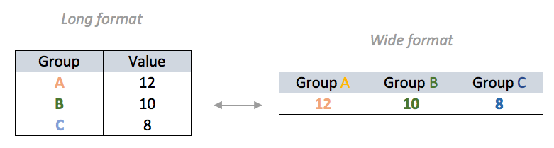

# Libraries and Setup

```{r setup, include=FALSE}
knitr::opts_chunk$set(echo = TRUE)
options(scipen = 99)
```

```{r message=FALSE, warning=FALSE}
rm(list = ls())
# for working with dates
library(lubridate)
# for data reshaping
library(tidyr)
# for visualization
library(ggplot2)
library(plotly)
library(glue)
```

# Abstract

The data we're working is `USvideos.csv`, a dataset scraped from Youtube's US Trending Videos. By analizing this Trending Videos data, we will uncover how these videos were able to reach such massive audience. We'll also take a look and see if there were any similarities between the videos that did well on the platform. 

```{r}
#read csv
vids<- read.csv("data/USvideos.csv")
#see column headers
names(vids)

```


In this session, we will use visualization techniques to gain such insights from the trending videos data:
1. Does the video publishing time affect its popularity? If so, when is the best time to publish a video?
2. Does user engagement relate to video's popularity? If so, does it tend to has a positive or negative engagement? 
3. Who were the most prolific producers of trending videos in recent weeks?

We will use two plotting systems for our task:  
- Base plot for a quick and simple exploratory visualization
- `ggplot2` for uncovering more complex pattern & for producing explanatory visualization


```{r}
#see data structure
str(vids)
```

Recall what you've learned in P4DS. Do the column `trending_date` & `publish_time` have stored in the correct class?

# Data Pre-Processing

## Working with date/time

### Date-Time Conversion

In order to answer our first question (*Does the video publishing time affect its popularity?*), we need to explore our datetime data more. Looking back to the structure of our dataset, there are two variables in our dataset which related to datetime data; `trending_date` and `publish_date`.

Previously we've learned base R method to convert our column to date with `as.Date()` function, followed with your data time formatting (if your date data wasn't stored in ISO format;YYYY-MM-DD):

YEAR  
%Y = YYYY  
%y = YY   
  
MONTH  
%B = month name e.g. March  
%b = month name(abbreviation) e.g. Mar  
%m = 2 digits mo e.g. 03  
%M = 1 digit mo e.g. 3  
  
DAY  
%A = weekday e.g. Friday  
%d = weekday digit.

Let's start with `trending_date`. Previously, we learnt to convert a date variable with: `as.Date(vids$trending_date, "%y.%d.%m")`
  
But now, we'll use an easier alternative to work with date-time data, and that is through the use of `lubridate`.
`lubridate` provides tools that make it easier to parse and manipulate dates:

```{r}
# example:
a <- "08/03/19"
b <- "8-March-2019"
c <- "Thursday, 09-05-2019"
d <- "2019/05/09, 1:42PM"

# convert date using as.Date:
a <- as.Date(a, "%d/%m/%y")

# convert date using lubridate:
b <- dmy(b)
c <- dmy(c)
d <- ymd_hm(d)
```

Let's apply this method to convert the datetime related column's data types in `vids`;
```{r}
#see 5 last data
tail(vids$trending_date)
#convert trending date
vids$trending_date=ydm(vids$trending_date)
#convert publish time
vids$publish_time=ymd_hms(vids$publish_time,tz = "America/New_York")
#see 5 first data
head(vids)
```

[Time-zone reference](https://en.wikipedia.org/wiki/List_of_tz_database_time_zones#List )

### Date-Time Extraction

```{r}
# get time components from trending date

# day of week
vids$trending_dow=wday(vids$trending_date,label = T,abbr = T, week_start = 1)

# month
vids$trending_month=month(vids$trending_date,label=T)
```

```{r}
# get time components from publish time

# day of week
vids$publish_wday=wday(vids$publish_time,
                       label = T,
                       abbr = F, 
                       week_start = 1)


# hour
vids$publish_hour=hour(vids$publish_time)
```

### Categorizing hour

```{r}
unique(vids$publish_hour)

# create function for categorizing
pw <- function(x){
    if(x < 8){
      x <- "12AM to 7AM"
    }else if(x >= 8 & x < 16){
      x <- "8AM to 3PM"
    }else{
      x <- "4PM to 11PM"
    }  
}
```


`sapply(x, FUN)`
Arguments: 
-`x`: A vector or an object
-`FUN`: Function applied to each element of x

```{r}
# apply function
vids$publish_when<-as.factor(sapply(vids$publish_hour,pw))
# see unique data in column publish_when
unique(vids$publish_when)
```

```{r}
# reorder category level
vids$publish_when=ordered(vids$publish_when,
                          levels=c("12AM to 7AM",
                                   "8AM to 3PM",
                                   "4PM to 11PM"))
# see 5 first data of publish_when
head(vids$publish_when)
```

## Working with category

```{r}
# e.g. 1
#switch number to words
switch(1,
       "1" = "Low",
       "2" = "Medium",
       "3" = "High")


# e.g. 2
data <- 1:3
#wrong answer
## will throw error:
#switch(data,
#        "1" = "Low",
#        "2" = "Medium",
#        "3" = "High")

#right answer
sapply(data,switch,
       "1" = "Low",
        "2" = "Medium",
        "3" = "High")
```

```{r}
#replacing number codes with words
vids$category_id <- sapply(as.character(vids$category_id), switch, 
                           "1" = "Film and Animation",
                           "2" = "Autos and Vehicles", 
                           "10" = "Music", 
                           "15" = "Pets and Animals", 
                           "17" = "Sports",
                           "19" = "Travel and Events", 
                           "20" = "Gaming", 
                           "22" = "People and Blogs", 
                           "23" = "Comedy",
                           "24" = "Entertainment", 
                           "25" = "News and Politics",
                           "26" = "Howto and Style", 
                           "27" = "Education",
                           "28" = "Science and Technology", 
                           "29" = "Nonprofit and Activism",
                           "43" = "Shows")

vids$category_id <- as.factor(vids$category_id)
```

## Select unique videos

```{r}
#see total of title
length(vids$title)
#see total of title without any duplicates
length(unique(vids$title))
#create data frame of titles without duplicates
title=unique(vids$title)
#eliminate all duplicates of title in vids data
vids.u=vids[match(title,vids$title),]
```

# Quick Exploration with R's Base plot

```{r}
#see 5 first data of vids
head(vids)
```

## How Popular is Your Video?

A like on a Youtube video is a lot more than just a simple number: in addition to emphasizing quality, creativity and the hidden idea behind the video, it also means popularity. In this case, the perfect ratio between likes and views is: likes: views = 4%. 

In simpler terms, at least 4 like every 100 views.
Visitors, but especially your channel’s subscribers, by investing their time leaving a like will indirectly say that the video is qualitatively valid, from the point of view of entertainment and originality, to the point that it deserves a nice thumb up. 

```{r}
#create engagement ratios

#create likesratio
vids.u$likesratio=vids.u$likes/vids.u$views
#create dislikesratio
vids.u$dislikesratio=vids.u$dislikes/vids.u$views
#create commentsratio
vids.u$commentsratio=vids.u$comment_count/vids.u$views
```

## How High is the Engagement?

Say, one of the content we want to publish have people who interested in "Autos and Vehicles", "Gaming", and "Travel and Events" as our target audience. So let's subset our data based on these particular categories:

```{r}
#make group of 'campaign'
campaign=c("Autos and Vehicles", "Gaming","Travel and Events")
#extract data only in 'campaign' group
vids.camp=vids.u[vids.u$category_id %in% campaign,]
vids.camp$category_id=droplevels(vids.camp$category_id)
```

- Scatterplot digunakan untuk membandingkan/melihat hubungan dua variabel numerik


- positive: nilai x naik, nilai y naik (dan sebaliknya)  
- negative: nilai x naik, nilai y turun (dan sebaliknya)  
- weak/no correlation: kedua variabel tidak menunjukan hubungan  

```{r}
plot(vids.camp$comment_count,vids.camp$views,col=vids.camp$category_id,pch=19)
abline(lm(vids.camp$views ~vids.camp$comment_count))
legend("topright",legend=levels(vids.camp$category_id),fill=1:3)
```

- Semakin tinggi jumlah `views` pada sebuah video, semakin tinggi juga jumlah `comment_count` pada video tersebut
- Kategori "Gaming" memiliki `views` dan `comment_count` tertinggi  
- Dari kategori Gaming, ada beberapa video dangan `views` yang tinggi namun `comment_count` yang sedikit, dan sebaliknya

---

Jenis plot yang dihasilkan berubah sesuai tipe data yang dimasukkan, jika:  
* 1 variabel, x kategori: **bar chart**  
* 1 variabel, x numerik: **scatter plot**  
* 2 variabel, x dan y adalah numerik: **scatter plot**  
* 2 variabel, x kategori, y numerik: **boxplot** 


## Simple Exploratory
### Pre-Campaign Analysis
  1. Amongst Automotive, Gaming & Travel, which category shows highest likeability (likesperviews)?
  2. Does the publish time affect likeability? 
  
```{r}
head(vids.camp)
vids.camp$publish_when=as.factor(vids.camp$publish_when)
```
  
  
```{r}
# 1. create the base canvas
ggplot(vids.camp,aes(publish_when,likesratio))
```
  
```{r}
# 2. add the geom element
ggplot(vids.camp,aes(publish_when,likesratio))+
  geom_boxplot()
```

```{r}
# add another geom element
ggplot(vids.camp,aes(publish_when,likesratio))+
  geom_boxplot()+
  geom_jitter()
```

```{r}
# add more visual cues
ggplot(vids.camp,aes(publish_when,likesratio))+
  geom_boxplot(outlier.shape = NA)+
  geom_jitter(aes(color=category_id,size=comment_count),alpha=0.5)+
  labs(title = "Pre-Campaign Analysis: Automotive, Gaming & Travel",
       subtitle="Gaming shows higher user engagement",
       x="Publish Time",
       y="Likes per Views Ratio",
       size="Comment Count",
       color="Category")
```


## Visualizing comparison with barchart
### Who were the most prolific producers of trending videos in recent weeks?

Since we’re concerned about the quantity of videos (talking about being prolific!) we will create another subset of the full dataframe, but take only the channels that have at least 10 videos being trending!

```{r}
# take only the channels that have at least 10 videos being trending
top=as.data.frame(table(Channel=vids.u$channel_title))
top=top[top$Freq>=10,]
top=top[order(top$Freq,decreasing = T),]
# get top 15 videos
top=head(top,15)

```

Let's turn the table to a barchart visualization:

```{r}
ggplot(top,aes(Channel, Freq))+
  geom_col()
```

Notice that the axis labels were too "tight". There are two approaches on handling this problem:
```{r}
# first approach: rotate the axis
ggplot(top,aes(Channel, Freq))+
  geom_col()+
  theme(axis.text.x = element_text(angle = 45,hjust=1))

```

```{r}
# second approach: flip the coordinate with `coord_flip`
ggplot(top,aes(Channel, Freq))+
  geom_col()+
  coord_flip()
```

Make your barchart more efficient by ordering the bars based on the value you want to show:

```{r}
# reorder the bars based on value
top$Channel=reorder(top$Channel,top$Freq)

# rerun the code above
ggplot(top,aes(Channel, Freq))+
  geom_col()+
  coord_flip()
```

#### Colors in ggplot

- Use `fill` or `color` argument inside the `geom_*`:  
  - `fill`: fill changes the colour within shapes  
  - `color`: colour changes the outline  

```{r}
# add general color 
ggplot(top,aes(Channel, Freq))+
  geom_col(fill="red")+
  coord_flip()
```


```{r}
# use aes to give visual aesthetic by variable in data
ggplot(top,aes(Channel, Freq))+
  geom_col(aes(fill=Freq))+
  coord_flip()
```

```{r}
# adjust color with `scale_fill_*`/`scale_color_*`
ggplot(top,aes(Channel, Freq))+
  geom_col(aes(fill=Freq))+
  coord_flip()+
  scale_fill_gradient(low="green",high="purple")
```

### Multivariate Barchart
#### How positive is the engagement?

#### Data transformation
```{r}
# subset `vids.u` based on channel in `top`
vids.top=vids.u[vids.u$channel_title %in% top$Channel,]
head(vids.top)
```

##### Data Aggregation
Aggregate data with `aggregate.data.frame()`: 
- `aggregate.data.frame(x = list(), by= list(), FUN)`

```{r}
# aggregate data
vids.top.agg=aggregate.data.frame(x=list(likesratio=vids.top$likesratio,
                                         dislikesratio=vids.top$dislikesratio),
                                  by=list(channel=vids.top$channel_title),
                                  mean)

# arrange channel levels by likes vs dislikes ratio
vids.top.agg$channel=reorder(vids.top.agg$channel, (vids.top.agg$likesratio/vids.top.agg$dislikesratio))

head(vids.top.agg)
```

#### Data Reshaping


```{r}
# use `pivot_longer` to convert wide to long
vids.long=pivot_longer(data=vids.top.agg,cols=-channel)
head(vids.long)
```

```{r}
# example on how to use `pivot_wider`
vids.wide=pivot_wider(data=vids.long,names_from = name,values_from = value)
head(vids.wide)
```

#### Visualization: Positions in `geom_col`

1. Stacked bars (default position):  
  - subgroups are just displayed on top of each other, not beside  
  - the x axis is the **total** of two groups (less interpretable)  
  
```{r}
# default position: `position="stack"`

```

2. Percent stacked barchart (`position="fill"`):  
  - percentage of each subgroup is represented, allowing to study the evolution of their proportion in the whole  
  - the x axis is the range of 0-100% 

```{r}
# `position=`fill` to `

```

3. Grouped barchart (`position="dodge"`):  
  - display a numeric value for a set of entities split in groups and subgroups  
  - the x axis shows the actual value of each group
  
```{r}
# `position=`fill` to `

```  

***End of Day 2***

---

## `ggplot2` features: facet & label

### Facets: split a plot into a matrix of panels

Say, we want to split our previous grouped barcharts into multiple panels, based on each `ratios`:

```{r}
## same code as above + `facet_wrap()`

```

#### Adjust the scales in facet with `scales = "free_*"`

```{r}
# `scales = "free"` gives each facet individual axis

```

```{r}
# `scales = "free_y"` gives each facet individual y axis

```

```{r}
# `scales = "free_x"` gives each facet individual x axis

```

### Add text/labels on your chart with `geom_text()`:

```{r}
# prepare text for label in `geom_text()`


# add geom text

```

#### Enhancing the aesthetic of `geom_text`

- `hjust` (horizontal justification)/ `vjust` (vertical justification): adjust the text position
- `size`: adjust the text size

```{r}

```

**Customize the x axis (continuous)**: https://ggplot2.tidyverse.org/reference/scale_continuous.html

```{r}

```

## Visualizing trend with line chart

**Dive Deeper**: Pre-Campaign Analysis; Entertainment, Music & Gaming 
**Opt 1:** pre-process with `dplyr` count:

```{r message=FALSE, warning=FALSE}


```

```{r}

```

**Customize the x axis (date)**: https://ggplot2.tidyverse.org/reference/scale_date.html

```{r}

```

- Double axis in `ggplot2`: https://rpubs.com/MarkusLoew/226759
- Why not to use two axes, and what to use instead: https://blog.datawrapper.de/dualaxis/  

```{r}

```

### Group in Line chart

- Visualizing day of week trend 
```{r}

```

Warning: `geom_path: Each group consists of only one observation. Do you need to adjust the group aesthetic?`

```{r}

```

Solution: add `group = [grouping category]`

```{r}

```

## Visualizing relationships with scatterplot

Pre-Campaign Analysis; Likes vs. Dislikes Ratio in Refinery29

```{r}

```

Jika pola hubungan/korelasi kurang terlihat jelas pada scatterplot, kita bisa menambahkan `geom_smooth(method = "lm")` untuk menampilkan model linier dari kedua nilai:


```{r}

```

# Enhance your Visualization

```{r}

```


### Predefined themes in `ggplot2`

#### `ggplot2` built in themes

References: https://ggplot2.tidyverse.org/reference/ggtheme.html

```{r}

```

#### Using themes library

```{r}

```

```{r}

```

# Interactive Visualization

# Dive Deeper

1. Tim marketing Algoritma berenca untuk melakukan campaign (iklan) pada 5 channel youtube yang memiliki likes ratio tertinggi. Karena Algoritma bergerak di bidang edukasi dan data science maka, hanya channel-channel yang memiliki video dengan kategori `Education` dan `Science and Technology` yang akan dipilih untuk melakukan campaign. Buatlah sebuah visualisasi yang menggambarkan informasi tersebut.

- filter category `Education` & `Science and Technology`
- mutate kolom baru yang isinya likes/views
- grouping berdasarkan channel dan category
- summrise mean(likes ratio)
- ungroup
- arrange likes ratio besar -> kecil
- head(5)

```{r}

```

# Interactive Visualization

## From `ggplot` to `plotly`

```{r}

```

## Hovering text

```{r}

```

```{r}

```

2. Tim marketing Algoritma sudah memperoleh informasi channel-channel youtube yang memiliki likes ratio tertinggi. Selanjutnya, mereka harus menentukan category `Education` atau `Science and Technology` yang lebih berpeluang untuk trending (jumlah views tinggi). Buatlah sebuah visualisasi yang menggambarkan informasi tersebut.

- filter category `Education` & `Scinece and Technology`
- grouping based on `category_id` & `trending_date`
- summarise count `n()`
- ungroup

```{r}

```

```{r}

```

3. Tim marketing Algoritma juga sudah memperoleh informasi category video yang lebih berpeluang untuk trending. Selanjutnya, mereka ingin mengetahui apakah channel-channel dan category tersebut juga memiliki kesan yang positif (jumlah likes tinggi). Buatlah sebuah visualisasi yang menggambarkan informasi tersebut.

- filter category `Education` & `Scinece and Technology`

```{r}

```


```{r}

```

**References:**  
- *Full documentations of ggplot2*: https://ggplot2.tidyverse.org/  
- *Top 50 ggplot2 visualizations*: http://r-statistics.co/Top50-Ggplot2-Visualizations-MasterList-R-Code.html  
- *Documentations of ggplot2 extensions library*: https://www.ggplot2-exts.org/  


**End of Training**