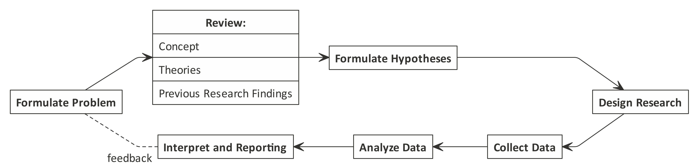
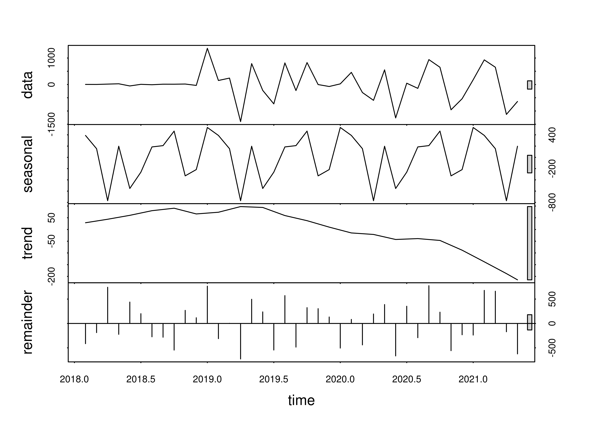
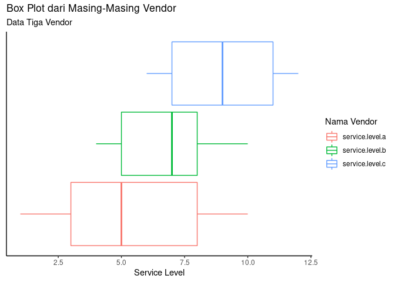

```{r setup, include=FALSE}
knitr::opts_chunk$set(echo = FALSE)
```

# _CONCEPTUAL FRAMEWORK_

### _CONCEPTUAL FRAMEWORK_

Materi pada _training_ ini mencakup:

- _Introduction to data_
- _Knowledge about different data types and formats_
- _Basic knowledge and understanding data_
- _Understanding of relevance and applications of data_

# _INTRODUCTION TO DATA_

### _Introduction to Data_

\begin{alertblock}{Definisi}
Data adalah representasi faktual dari observasi (pengamatan).
\end{alertblock}

Data bisa dikelompokkan sesuai dengan tipe dan karakteristiknya. Dengan memahami tipe data yang kita hadapi, kita akan lebih mudah dalam menentukan metode analisa yang tepat. 

# _KNOWLEDGE ABOUT DIFFERENT DATA TYPES AND FORMATS_ 

## Pengelompokkan Data Berdasarkan Tipe (Statistik)

### Pengelompokkan Data Berdasarkan Tipe (Statistik)

```{r}
nomnoml::nomnoml("[Data] -> [Qualitative]
                 [Data] -> [Quantitative]
                 [Qualitative] -> [Ordinal]
                 [Qualitative] -> [Nominal]
                 [Ordinal] -> [Urutan penting]
                 [Nominal] -> [Merepresentasikan Sesuatu]
                 [Quantitative] -> [Kontinu]
                 [Quantitative] -> [Diskrit]
                 [Kontinu] -> [Bilangan Real|(mengandung koma)]
                 [Diskrit] -> [Bilangan Bulat]")
```

### Data Kualitatif

\begin{alertblock}{Definisi}
Data Kualitatif adalah data yang tidak bisa dilakukan operasi aritmatika (penjumlahan, pengurangan, pembagian, dan perkalian). Data seperti ini bisa juga disebut sebagai data kategorik.
\end{alertblock}

- Nominal; Representasi dari sesuatu. 
  - Contoh: data seperti _gender_. Misalkan angka 1 saya tulis sebagai representasi dari pria dan 2 sebagai wanita.
- Ordinal; Urutan dari data menjadi penting. 
  - Contoh: skala _likert_, misalkan angka 1 - 6 sebagai representasi dari tingkat kesukaan atau kesetujuan (sangat suka sampai sangat tidak suka).

### Data Kuantitatif

\begin{alertblock}{Definisi}
Data Kuantitatif adalah data yang bisa dilakukan operasi aritmatika (penjumlahan, pengurangan, pembagian, dan perkalian). Data seperti ini, kita akan sebut sebagai data numerik.
\end{alertblock}

- Diskrit; bilangan bulat (_integer_). 
  - Contoh: banyaknya anak, banyaknya karyawan, dll.
- Kontinu; bilangan _real_ (mengandung koma). 
  - Contoh: tinggi badan, berat badan, dll.

### Contoh Penerapan

Misalkan dalam satu kelas _webinar_ berisi 10 orang peserta dengan _gender_:

1. 7 orang wanita
1. 3 orang pria

Apakah pernyataan berikut ini benar / salah?

> ___Rata-rata peserta webinar tersebut adalah wanita.___

### Contoh Penerapan

Pernyataan tersebut __SALAH__!

### Contoh Penerapan

__Kenapa?__

Bagaimana cara menghitung rata-rata?

$\bar{x} = \frac{\sum_{i=1}^{n} xi}{n}$

__Sekarang kita hitung data kita:__

Misalkan saya tulis `pria` sebagai `1` dan `wanita` sebagai `2`. Maka didapatkan:

$\sum_{i=1}^{n} xi = 1+1+1+2+2+2+2+2+2+2 = 17$

$n = 10$

$\bar{x} = \frac{17}{10} = 1.7$

### Contoh Penerapan

Apa arti `1.7`?

> __Pria yang terlalu kewanitaan?__

> __Wanita yang agak kelaki-lakian?__

Pernyataan yang __Tepat__ adalah __Mayoritas__ peserta _webinar_ adalah wanita.

## Pengelompokkan Data Berdasarkan Sumber

### Pengelompokkan Data Berdasarkan Sumber

```{r,out.height="30%"}
nomnoml::nomnoml("[Data] -> [Primer]
                 [Data] -> [Sekunder]
                 ")
```

\begin{alertblock}{Definisi}
Data primer adalah data yang diambil dari sumber pertama.

Data sekunder adalah data yang berasal dari sumber yang pernah diolah oleh orang lain.
\end{alertblock}

### Contoh Data Primer dan Sekunder

__Data Primer__

1. Data yang kita himpun sendiri dari hasil interview menggunakan quesioner (_survey_), 
1. Data yang kita ambil dari mesin,
1. Data hasil _web scrape_, dll.

__Data Sekunder__

1. Data kependudukan hasil sensus BPS, 
1. Laporan absensi karyawan, 
1. Data Covid-19 yang tersedia di _website_ resmi pemerintah, dll.

### Masalah Seputar Data Primer dan Sekunder

__Pertanyaannya:__

> Kapan kita memakai ___data primer___? Kapan kita memakai ___data sekunder___?

___Guidance___ __untuk menjawab pertanyaan:__

```{r}
nomnoml::nomnoml("
                 [Masalah] -> [Butuh Data]
                 [Butuh Data] -> [Ada data sekunder?]
                 [Ada data sekunder?] -> [Ada]
                 [Ada data sekunder?] -> [Tidak ada]
                 [Tidak ada] -> [Cari data primer]
                 [Ada] -> [Cek karakteristik]
                 [Cek karakteristik] -> [Masih relevan?]
                 [Masih relevan?] -> [Ya]
                 [Masih relevan?] -> [Tidak]
                 [Tidak] -> [Cari data primer]
                 [Ya] -> [Pakai data sekunder]
                 ")
```

### Penjelasan _Guidance_

Prinsipnya adalah:

> Kita akan menggunakan data primer saat data sekunder tidak ada!

Sejujurnya mencari data primer itu relatif sulit. Setidaknya kita membutuhkan waktu, tenaga, dan biaya untuk mencari data langsung dari sumbernya. Contoh: jika saya ingin mencari tahu berapa banyak orang yang teridentifikasi __COVID-19__ di suatu kota. Alih-alih saya datang ke semua RS yang ada di kota tersebut, saya cukup cek saja _website_ resmi penanganan __Covid-19__ pemerintah.

Jadi, jika data sekundernya sudah tersedia kita bisa mempertimbangkan untuk memakai data tersebut daripada mengambil data primer. __TAPI__ jika ternyata karakteristik data yang kita mau cari tersebut __sangat dinamis dan cepat berubah__ ATAU ada __perbedaan kondisi, situasi atau limitasi__ maka kita harus __mempertimbangkan untuk mencari data primer dan tidak menggunakan data sekunder__.


## Pengelompokkan Data Berdasarkan Tipe (Data Sains)

### Pengelompokkan Data Berdasarkan Tipe (Data Sains)

Di dalam dunia data sains, ada beberapa tipe data yang sering digunakan. Secara hierarki, bisa diurutkan sebagai berikut:

`character > numeric > integer > logical`

### Pengelompokkan Data Berdasarkan Tipe (Data Sains)

Berikut penjelasannya:

1. `character`: merupakan tipe data berupa karakter atau `string`. Semua data bisa dilihat sebagai `character`. Oleh karena itu, secara hierarki tipe data ini ditempatkan di urutan paling atas. Namun, data tipe ini tidak bisa dilakukan operasi aritmatika.
2. `numeric`: merupakan tipe data angka berupa bilangan _real_. Tipe data ini mirip dengan data numerik di poin sebelumnya.
3. `integer`: merupakan tipe data angka berupa bilangan bulat. Sekilas mirip dengan tipe data diskrit di poin sebelumnya. Namun di beberapa kondisi, tipe data ini bisa dijadikan data __kategorik__ sehingga kita bisa sebut tipenya menjadi `factor`.
4. `logical`: merupakan tipe data _boolean_. Hanya berisi `TRUE` atau `FALSE`. Tipe data ini sangat berguna saat kita melakukan _if conditional_, _looping_, atau membuat _regex_ (_reguler expression_).

# BASIC KNOWLEDGE AND UNDERSTANDING DATA

## _Research Workflow_

### _Proper Steps_

Dalam setiap riset atau penelitan, alur pengerjaannya relatif sama seperti ini:

```{r out.width="90%"}

```

### Hubungan Masalah dengan Data

```{r out.width="70%"}
nomnoml::nomnoml("
                 [Masalah] -> [Tujuan]
                 [Tujuan] -> [Data]
                 [Data] -> [Analisa]
                 [Analisa] --> [Masalah]
                 ")
```

\begin{alertblock}{Relevansi Data}
Grafik di atas memberikan suatu arahan bahwa data yang dikumpulkan dan dianalisa harus sesuai dengan masalah yang dihadapi.
\end{alertblock}

## Kualitas dari Suatu Data

### Kualitas dari Suatu Data

__Pertanyaannya:__

> Data saya sudah bagus belum ya?

Ada beberapa parameter yang bisa digunakan untuk menjawab pertanyaan tersebut:

1. Kualitas dari suatu data diukur dari __seberapa bisa data tersebut memenuhi kebutuhan analisis__. Setelah itu baru dicek secara statistik: _blank_ data atau _extreme values_.
2. Data yang bagus biasanya berasal dari _random sampling_.
3. Untuk data yang diambil secara berulang-ulang (harian, mingguan, bulanan, tahunan, atau lainnya), pastikan bahwa cara pengambilan data harus sama.

## _Importance of Disclaimer_

### _Importance of Disclaimer_

__Pertanyaannya:__

> Apa yang menyebabkan hasil _survey_ / _study_ / penelitian / analisa data tidak sesuai dengan kondisi _real_?

Ingat bahwa setiap penelitian memiliki __limitasi__ dan __asumsi__. 

1. Perhatikan dengan seksama kondisi yang dilalui saat melakukan penelitian. Apakah ada perbedaan dengan kondisi _real_?
1. Perhatikan cara pengambilan data. Apakah ada _bias_ yang kita lakukan saat mengambil data?

### Contoh

__Misalkan:__

Survey mengenai makanan favorit orang Indonesia tapi survey dilakukan di RM Padang. 

__Pertanyaannya:__

Kira-kira makanan apa yang menjadi favorit `orang Indonesia` tersebut?

# _APPLICATIONS OF DATA_

## Aplikasi Data di _Sales_

### Aplikasi Data di _Sales_

\begin{columns}
\column{0.75\textwidth}

```{r out.width="90%"}

```

\column{0.25\textwidth}
Tim sales memiliki data omset bulanan suatu produk tertentu. Dari data tersebut, bisa kita analisa tren penjualan, efek seasonal, efek promosi, pengelompokkan customer, dll.

\end{columns}

## Aplikasi Data di _Procurement_

### Aplikasi Data di _Procurement_

\begin{columns}
\column{0.75\textwidth}

```{r out.width="90%"}

```

\column{0.25\textwidth}
Tim procurement hendak mengambil keputusan strategic terkait 3 vendor yang selama ini digunakan. Mereka mencoba service level antara ketiganya. Siapa yang terbaik? Apakah ketiganya masih sesuai dengan spek minimal yang dipersyaratkan?

\end{columns}


