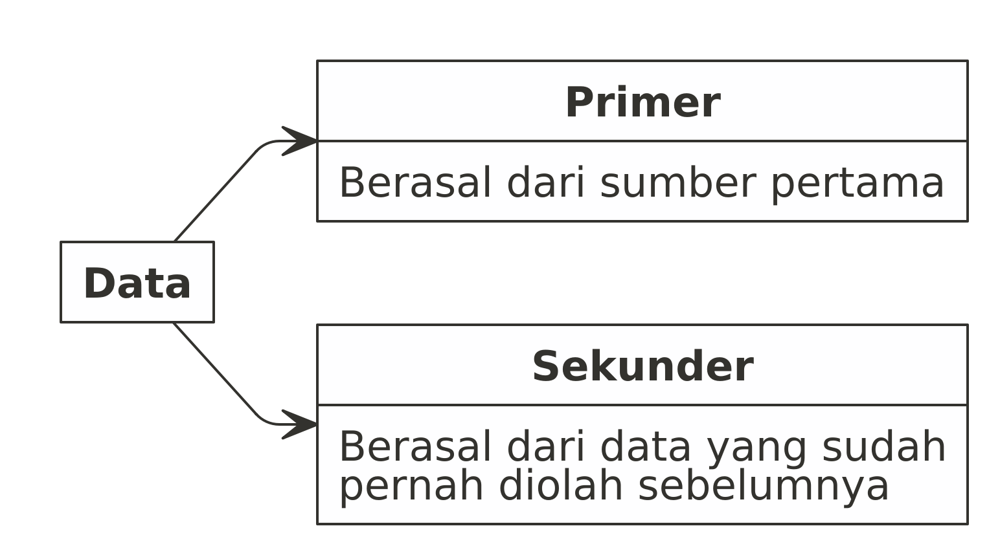

```{r setup, include=FALSE}
knitr::opts_chunk$set(echo = FALSE)
```

# _CONCEPTUAL FRAMEWORK_

## _CONCEPTUAL FRAMEWORK_

Materi pada _training_ ini mencakup:

- _Introduction to data_
- _Basic knowledge and understanding data_
- _Understanding of relevance and applications of data_
- _Knowledge about different data tyoes and formats_

# _INTRODUCTION TO DATA_

## _Introduction to Data_

\begin{alertblock}{Definisi}
Data adalah representasi faktual dari observasi (pengamatan).
\end{alertblock}

Data bisa dikelompokkan sesuai dengan tipe dan karakteristiknya. Dengan memahami tipe data yang kita hadapi, kita akan lebih mudah dalam menentukan metode analisa yang tepat. 

## Pengelompokkan Data Berdasarkan Tipe

```{r,fig.align='center'}
nomnoml::nomnoml("[Data] -> [Qualitative]
                 [Data] -> [Quantitative]
                 [Qualitative] -> [Ordinal]
                 [Qualitative] -> [Nominal]
                 [Ordinal] -> [Urutan penting]
                 [Nominal] -> [Merepresentasikan Sesuatu]
                 [Quantitative] -> [Kontinu]
                 [Quantitative] -> [Diskrit]
                 [Kontinu] -> [Bilangan Real|(mengandung koma)]
                 [Diskrit] -> [Bilangan Bulat]")
```

## Data Kualitatif

\begin{alertblock}{Definisi}
adalah data yang tidak bisa dilakukan operasi aritmatika (penjumlahan, pengurangan, pembagian, dan perkalian). Data seperti ini bisa juga disebut sebagai data kategorik.
\end{alertblock}

- Nominal; Representasi dari sesuatu. 
  - Contoh: data seperti _gender_. Misalkan angka 1 saya tulis sebagai representasi dari pria dan 2 sebagai wanita.
- Ordinal; Urutan dari data menjadi penting. 
  - Contoh: skala _likert_, misalkan angka 1 - 6 sebagai representasi dari tingkat kesukaan atau kesetujuan (sangat suka sampai sangat tidak suka).


## Data Kuantitatif

\begin{alertblock}{Definisi}
adalah data yang bisa dilakukan operasi aritmatika (penjumlahan, pengurangan, pembagian, dan perkalian). Data seperti ini, kita akan sebut sebagai data numerik.
\end{alertblock}

- Diskrit; bilangan bulat (_integer_). 
  - Contoh: banyaknya anak, banyaknya karyawan, dll.
- Kontinu; bilangan _real_ (mengandung koma). 
  - Contoh: tinggi badan, berat badan, dll.

## Contoh Penerapan

Misalkan dalam satu kelas _webinar_ berisi 10 orang peserta dengan _gender_:

1. 7 orang wanita
1. 3 orang pria

Apakah pernyataan berikut ini benar / salah?

> ___Rata-rata peserta webinar tersebut adalah wanita.___

## Contoh Penerapan

Pernyataan tersebut __SALAH__!

## Contoh Penerapan

__Kenapa?__

Bagaimana cara menghitung rata-rata?

$\bar{x} = \frac{\sum_{i=1}^{n} xi}{n}$

__Sekarang kita hitung data kita:__

Misalkan saya tulis `pria` sebagai `1` dan `wanita` sebagai `2`. Maka didapatkan:

$\sum_{i=1}^{n} xi = 1+1+1+2+2+2+2+2+2+2 = 17$

$n = 10$

$\bar{x} = \frac{17}{10} = 1.7$

## Contoh Penerapan

Apa arti `1.7`?

> __Pria yang terlalu kewanitaan?__

> __Wanita yang agak kelaki-lakian?__

Pernyataan yang __Tepat__ adalah __Mayoritas__ peserta _webinar_ adalah wanita.

## Pengelompokkan Data Berdasarkan Sumber

```{r out.width="80%",fig.align='center'}

```


