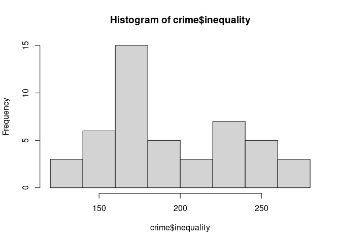
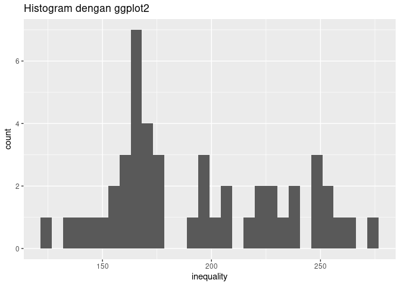
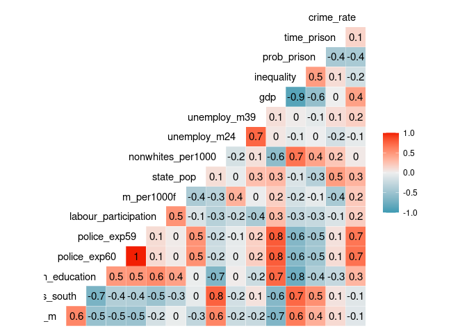
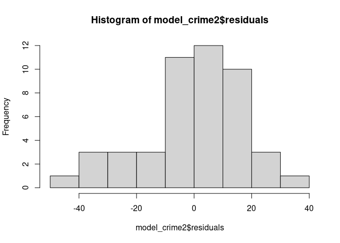
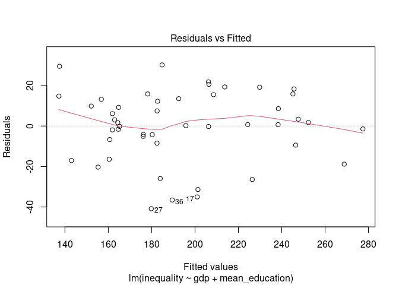

Materi Regresi Linear
================
Lenny M. Wibisana
24 Agustus 2020

# Data Preparation

## Load library yang digunakan

``` r
library(dplyr)
library(tidyverse)
library(GGally)
library(MASS)
library(MLmetrics)
library(lmtest)
library(car)
library(caret)
```

## Read data

``` r
# read data csv crime, dan beri nama datasetnya `crime`
crime = read.csv("crime.csv")
```

``` r
# tampilkan 6 data awal dari dataset crime
head(crime,6)
```

    ##   X   M So  Ed Po1 Po2  LF  M.F Pop  NW  U1 U2 GDP Ineq     Prob    Time    y
    ## 1 1 151  1  91  58  56 510  950  33 301 108 41 394  261 0.084602 26.2011  791
    ## 2 2 143  0 113 103  95 583 1012  13 102  96 36 557  194 0.029599 25.2999 1635
    ## 3 3 142  1  89  45  44 533  969  18 219  94 33 318  250 0.083401 24.3006  578
    ## 4 4 136  0 121 149 141 577  994 157  80 102 39 673  167 0.015801 29.9012 1969
    ## 5 5 141  0 121 109 101 591  985  18  30  91 20 578  174 0.041399 21.2998 1234
    ## 6 6 121  0 110 118 115 547  964  25  44  84 29 689  126 0.034201 20.9995  682

Hilangkan kolom X dan mengganti nama kolom dari data agar lebih mudah
dipahami

``` r
crime = 
  crime %>% 
  mutate(X = NULL)

names(crime) <- c("percent_m", "is_south", "mean_education", "police_exp60", "police_exp59", "labour_participation", "m_per1000f", "state_pop", "nonwhites_per1000", "unemploy_m24", "unemploy_m39", "gdp", "inequality", "prob_prison", "time_prison", "crime_rate")

# tampilkan kembali 6 data awal dari dataset yang nama variabelnya sudah diganti
head(crime,6)
```

    ##   percent_m is_south mean_education police_exp60 police_exp59
    ## 1       151        1             91           58           56
    ## 2       143        0            113          103           95
    ## 3       142        1             89           45           44
    ## 4       136        0            121          149          141
    ## 5       141        0            121          109          101
    ## 6       121        0            110          118          115
    ##   labour_participation m_per1000f state_pop nonwhites_per1000 unemploy_m24
    ## 1                  510        950        33               301          108
    ## 2                  583       1012        13               102           96
    ## 3                  533        969        18               219           94
    ## 4                  577        994       157                80          102
    ## 5                  591        985        18                30           91
    ## 6                  547        964        25                44           84
    ##   unemploy_m39 gdp inequality prob_prison time_prison crime_rate
    ## 1           41 394        261    0.084602     26.2011        791
    ## 2           36 557        194    0.029599     25.2999       1635
    ## 3           33 318        250    0.083401     24.3006        578
    ## 4           39 673        167    0.015801     29.9012       1969
    ## 5           20 578        174    0.041399     21.2998       1234
    ## 6           29 689        126    0.034201     20.9995        682

``` r
# investigasi data
str(crime)
```

    ## 'data.frame':    47 obs. of  16 variables:
    ##  $ percent_m           : int  151 143 142 136 141 121 127 131 157 140 ...
    ##  $ is_south            : int  1 0 1 0 0 0 1 1 1 0 ...
    ##  $ mean_education      : int  91 113 89 121 121 110 111 109 90 118 ...
    ##  $ police_exp60        : int  58 103 45 149 109 118 82 115 65 71 ...
    ##  $ police_exp59        : int  56 95 44 141 101 115 79 109 62 68 ...
    ##  $ labour_participation: int  510 583 533 577 591 547 519 542 553 632 ...
    ##  $ m_per1000f          : int  950 1012 969 994 985 964 982 969 955 1029 ...
    ##  $ state_pop           : int  33 13 18 157 18 25 4 50 39 7 ...
    ##  $ nonwhites_per1000   : int  301 102 219 80 30 44 139 179 286 15 ...
    ##  $ unemploy_m24        : int  108 96 94 102 91 84 97 79 81 100 ...
    ##  $ unemploy_m39        : int  41 36 33 39 20 29 38 35 28 24 ...
    ##  $ gdp                 : int  394 557 318 673 578 689 620 472 421 526 ...
    ##  $ inequality          : int  261 194 250 167 174 126 168 206 239 174 ...
    ##  $ prob_prison         : num  0.0846 0.0296 0.0834 0.0158 0.0414 ...
    ##  $ time_prison         : num  26.2 25.3 24.3 29.9 21.3 ...
    ##  $ crime_rate          : int  791 1635 578 1969 1234 682 963 1555 856 705 ...

Variabel yang ada pada data crime adalah sebagai berikut: - `percent_m`:
percentage of males aged 14-24 - `is_south`: whether it is in a Southern
state. 1 for Yes, 0 for No. - `mean_education`: mean years of schooling
- `police_exp60`: police expenditure in 1960 - `police_exp59`: police
expenditure in 1959 - `labour_participation`: labour force participation
rate - `m_per1000f`: number of males per 1000 females - `state_pop`:
state population - `nonwhites_per1000`: number of non-whites resident
per 1000 people - `unemploy_m24`: unemployment rate of urban males aged
14-24 - `unemploy_m39`: unemployment rate of urban males aged 35-39 -
`gdp`: gross domestic product per head - `inequality`: income inequality
- `prob_prison`: probability of imprisonment - `time_prison`: average
time served in prisons - `crime_rate`: crime rate in an unspecified
category

# Exploratory data analysis

variabel target yang diamati adalah `inequality`

Lihat nilai sebaran data `inequality` yang menjadi target variabel dalam
pembahasan kali ini.

``` r
# buat histogram untuk melihat sebaran data
hist(crime$inequality)
```

<!-- -->

``` r
# bisa juga dengan ggplot2
crime %>% 
  ggplot(aes(inequality)) +
  geom_histogram() +
  labs(title = "Histogram dengan ggplot2")
```

<!-- -->

Cek korelasi tiap variabel dengan `ggcor`

``` r
ggcorr(crime, hjust = 1, label = T)
```

<!-- -->

> Dari hasil korelasi, variabel yg memiliki korelasi tertinggi dengan
> variabel target `inequality` adalah variabel … dan …

# Membuat model regresi

1.  Buat model linear untuk memprediksi inequality berdasarkan gdp

<!-- end list -->

``` r
model_crime1 = lm(inequality~gdp, crime)

# lihat bentuk modelnya
summary(model_crime1)
```

    ## 
    ## Call:
    ## lm(formula = inequality ~ gdp, data = crime)
    ## 
    ## Residuals:
    ##     Min      1Q  Median      3Q     Max 
    ## -42.029 -11.754   1.714  12.438  30.006 
    ## 
    ## Coefficients:
    ##              Estimate Std. Error t value Pr(>|t|)    
    ## (Intercept) 386.03058   15.38651   25.09   <2e-16 ***
    ## gdp          -0.36551    0.02881  -12.69   <2e-16 ***
    ## ---
    ## Signif. codes:  0 '***' 0.001 '**' 0.01 '*' 0.05 '.' 0.1 ' ' 1
    ## 
    ## Residual standard error: 18.86 on 45 degrees of freedom
    ## Multiple R-squared:  0.7815, Adjusted R-squared:  0.7766 
    ## F-statistic: 160.9 on 1 and 45 DF,  p-value: < 2.2e-16

Maka formulanya adalah:

  
  

> Setiap kenaikan 1 gdp akan memberikan kontribusi pengurangan 0.36551
> terhadap inequality.

Nilai *R-Squared* sebesar 78.15%.

> Artinya `gpd` mampu menjelaskan 78.15% dari informasi variabel
> `inequality`.

Nilai *p-value* sebesar
.

> Model menunjukkan pengaruh signifikan dari variabel prediktor terhadap
> variabel target.

Predict nilai inequality menggunakan fungsi predict()

``` r
pred1 = predict(model_crime1, newdata = data.frame(gdp = crime$gdp)) 
summary(pred1)
```

    ##    Min. 1st Qu.  Median    Mean 3rd Qu.    Max. 
    ##   134.2   169.8   189.8   194.0   218.1   280.8

2.  Buat model linear untuk memprediksi inequality berdasarkan gdp dan
    mean education

<!-- end list -->

``` r
model_crime2 <- lm(inequality ~ gdp + mean_education, crime) 

# lihat bentuk modelnya
summary(model_crime2)
```

    ## 
    ## Call:
    ## lm(formula = inequality ~ gdp + mean_education, data = crime)
    ## 
    ## Residuals:
    ##     Min      1Q  Median      3Q     Max 
    ## -40.824  -7.585   0.672  13.344  30.179 
    ## 
    ## Coefficients:
    ##                 Estimate Std. Error t value Pr(>|t|)    
    ## (Intercept)    441.88243   25.44031  17.369  < 2e-16 ***
    ## gdp             -0.28713    0.03994  -7.189 6.04e-09 ***
    ## mean_education  -0.91851    0.34448  -2.666   0.0107 *  
    ## ---
    ## Signif. codes:  0 '***' 0.001 '**' 0.01 '*' 0.05 '.' 0.1 ' ' 1
    ## 
    ## Residual standard error: 17.69 on 44 degrees of freedom
    ## Multiple R-squared:  0.8119, Adjusted R-squared:  0.8033 
    ## F-statistic: 94.93 on 2 and 44 DF,  p-value: < 2.2e-16

Untuk kasus ini, jika multiple linear regression yang perlu dilihat
adalah `Adjusted R-Squared`.

Predict nilai inequality menggunakan fungsi predict()

``` r
pred2 = predict(model_crime2, 
                newdata = data.frame(gdp = crime$gdp,
                                     mean_education = crime$mean_education)) 
summary(pred2)
```

    ##    Min. 1st Qu.  Median    Mean 3rd Qu.    Max. 
    ##   137.2   164.5   184.0   194.0   219.0   277.4

3.  Bandingkan nilai r.squared, adj.r.squared, dan MSE-nya dari kedua
    model tersebut

R-squared

``` r
summary(model_crime1)$r.squared
```

    ## [1] 0.7814512

``` r
summary(model_crime2)$r.squared
```

    ## [1] 0.8118523

Adjusted R-squared

``` r
summary(model_crime1)$adj.r.squared
```

    ## [1] 0.7765945

``` r
summary(model_crime2)$adj.r.squared
```

    ## [1] 0.8033001

> Dari nilai adj R squared, yang memiliki nilai adj r-squared terbesar
> adalah `model_crime2`.

Nilai MSE dari ketiga model tersebut

``` r
MSE(model_crime1$fitted.values,crime$inequality)
```

    ## [1] 340.4619

``` r
MSE(model_crime2$fitted.values,crime$inequality)
```

    ## [1] 293.1021

> Dari nilai MSE, yang memiliki nilai lebih kecil adalah `model_crime2`.

Melihat summary dari model yang lebih baik

``` r
summary(model_crime2)
```

    ## 
    ## Call:
    ## lm(formula = inequality ~ gdp + mean_education, data = crime)
    ## 
    ## Residuals:
    ##     Min      1Q  Median      3Q     Max 
    ## -40.824  -7.585   0.672  13.344  30.179 
    ## 
    ## Coefficients:
    ##                 Estimate Std. Error t value Pr(>|t|)    
    ## (Intercept)    441.88243   25.44031  17.369  < 2e-16 ***
    ## gdp             -0.28713    0.03994  -7.189 6.04e-09 ***
    ## mean_education  -0.91851    0.34448  -2.666   0.0107 *  
    ## ---
    ## Signif. codes:  0 '***' 0.001 '**' 0.01 '*' 0.05 '.' 0.1 ' ' 1
    ## 
    ## Residual standard error: 17.69 on 44 degrees of freedom
    ## Multiple R-squared:  0.8119, Adjusted R-squared:  0.8033 
    ## F-statistic: 94.93 on 2 and 44 DF,  p-value: < 2.2e-16

5.  Manakah model yang terbaik?

Model `model_crime2` karena R-squared terbaik dan MSE terkecil.

# Cek asumsi

## normality of residual

`cek errorny berdistribusi normal atau ngga`

H0: residual berdistribusi normal H1: residual tidak berdistribusi
normal

pvalue \< 0.05, tolak H0, residual tidak berdistribusi normal

Kita ingin pvalue \> 0.05 agar error berdistribusi normal

Dari data crime, pertama-tama cek terlebih dahulu sebaran errornya
dengan menggunakan histogram

``` r
hist(model_crime2$residuals)
```

<!-- -->

Uji kenormalan errornya dengan uji statistik `shapiro.test`

``` r
# pengujian statistik untuk normality
shapiro.test(model_crime2$residuals)
```

    ## 
    ##  Shapiro-Wilk normality test
    ## 
    ## data:  model_crime2$residuals
    ## W = 0.95735, p-value = 0.08442

Kesimpulan :

> Residual dari `model_crime2` berdistribusi normal.

## linearity check

plot korelasi antar variabelnya

``` r
# buat tampilan korelasi antar variabel dengan ggcor
```

Cek linearity dengan plot

``` r
# melihat plot residual dan fitted values dari model
plot(model_crime2,1)
```

<!-- -->

Uji asumsi untuk linearity H0 : Tidak Linear H1 : Linear Mencari p-value
\< 0.05 agar tolak H0, sehingga kesimpulannya adalah linear

Notes: Bisa cek cor.test untuk variabel-variabel prediktor yang
korelasinya mendekati 0 saja

``` r
cor.test(crime$gdp,crime$inequality)
```

    ## 
    ##  Pearson's product-moment correlation
    ## 
    ## data:  crime$gdp and crime$inequality
    ## t = -12.685, df = 45, p-value < 2.2e-16
    ## alternative hypothesis: true correlation is not equal to 0
    ## 95 percent confidence interval:
    ##  -0.9340509 -0.7998850
    ## sample estimates:
    ##        cor 
    ## -0.8839973

``` r
cor.test(crime$mean_education,crime$inequality)
```

    ## 
    ##  Pearson's product-moment correlation
    ## 
    ## data:  crime$mean_education and crime$inequality
    ## t = -8.061, df = 45, p-value = 2.81e-10
    ## alternative hypothesis: true correlation is not equal to 0
    ## 95 percent confidence interval:
    ##  -0.8649104 -0.6178769
    ## sample estimates:
    ##        cor 
    ## -0.7686579

Note: ketika salah satu variabel prediktor *tidak terpenuhi(p-value \>
0.05)*, maka kesimpulannya model yg kita buat tidak linear.

Kesimpulan:

> Lolos uji linearity\!

## uji homoscedascity

Homoscedasticity = error tidak memiliki pola Heteroscedasticity =
errornya berpola

H0: model homoscedasticity H1: model heteroscedasticity pvalue \< alpha,
tolak H0 alpha = 0.05

Kalau terdapat heteroscedasticity, kemungkinan ada outlier yang harus
dibuang

Plot error dan nilai aktualnya

Uji statistiknya dengan fungsi bptest() dari library lmtest

``` r
# test statistik untuk cek homoscedasticity
```

kesimpulan : p-value \> 0.05 maka gagal tolak H0, artinya lolos uji
Homoscedasticity

## Uji multicollinearity

Kita gamau kalau variabel prediktor di model kita itu saling berpengaruh
(dependen). Ujinya menggunakan nilai *vif*. Syaratnya harus \< 10.

Cek korelasi tiap variabel dengan function `ggcor`

Cek dengan fungsi `vif()` dari library car untuk mengetahui
variabel-variabel mana yang tidak bisa ditoleransi menjadi sebuah
prediktor

Kesimpulan : no multicollinearity

Ketika **VIF nilainya \> 10**, maka harus ada variabel yang dieliminasi
atau dilakukan feature engineering (membuat variabel baru dari variabel2
yang sudah ada)

kalau ad VIF yang nilainya \> 10, maka harus ada salah 1 variabel yg
dihilangkan, atau gabungin variabel yg berkorelasi kuat menjadi 1
variabel baru

-----

# Tambahan

Feature Selection using Stepwise Regression

Stepwise Regression merupakan salah satu greedy algorithm (akan
menghasilkan model yang local optima, bukan global optima)

Terminologi: Local optima = model yang baik namun belum tentu terbaik
Global optima = model terbaik

Mengevaluasi model stepwise menggunakan nilai AIC (Akaike Information
Criterion/ Information Loss), model dengan AIC yang terkecil, itu yang
dipilih

Stepwise regression mempunyai 3 metode yaitu: backward, forward, both
*Forward selection* : mengevaluasi model dengan cara menambahkan
variabel prediktor sehingga diperoleh model dengan AIC (Akaike
Information Criterion) terkecil/R-squared terbesar (Dari tidak ada
prediktor, ditambahkan satu per satu sampai mendapat model yang local
optima(**baik tapi belum tentu terbaik**)) *Backward elimination* :
mengevaluasi model dengan cara mengurangi variabel prediktor sehingga
diperileh model AIC terkecil/R-squared nya besar (Dari semua prediktor,
dieliminasi satu satu untuk mendapat model yang baik, dievaluasi dari
nilai AIC) *Both* :Backward and Forward

``` r
# model tanpa prediktor
lm.none <- lm(inequality~1, crime)

# model dengan semua prediktor
lm.all <- lm(inequality~., crime)
```

## Stepwise backward

``` r
crime_back <- step(lm.all, direction = "backward")
```

    ## Start:  AIC=263.35
    ## inequality ~ percent_m + is_south + mean_education + police_exp60 + 
    ##     police_exp59 + labour_participation + m_per1000f + state_pop + 
    ##     nonwhites_per1000 + unemploy_m24 + unemploy_m39 + gdp + prob_prison + 
    ##     time_prison + crime_rate
    ## 
    ##                        Df Sum of Sq    RSS    AIC
    ## - police_exp59          1       0.0 6454.7 261.35
    ## - nonwhites_per1000     1       0.9 6455.5 261.36
    ## - time_prison           1       3.5 6458.1 261.38
    ## - prob_prison           1      19.4 6474.0 261.49
    ## - unemploy_m24          1      23.4 6478.0 261.52
    ## - police_exp60          1      49.6 6504.2 261.71
    ## - unemploy_m39          1      52.9 6507.5 261.74
    ## - m_per1000f            1      66.4 6521.0 261.83
    ## - labour_participation  1     276.0 6730.7 263.32
    ## <none>                              6454.6 263.35
    ## - percent_m             1     340.6 6795.2 263.77
    ## - state_pop             1     493.4 6948.0 264.81
    ## - is_south              1     782.3 7236.9 266.73
    ## - mean_education        1    1177.4 7632.1 269.23
    ## - crime_rate            1    2015.2 8469.9 274.12
    ## - gdp                   1    3492.7 9947.3 281.68
    ## 
    ## Step:  AIC=261.35
    ## inequality ~ percent_m + is_south + mean_education + police_exp60 + 
    ##     labour_participation + m_per1000f + state_pop + nonwhites_per1000 + 
    ##     unemploy_m24 + unemploy_m39 + gdp + prob_prison + time_prison + 
    ##     crime_rate
    ## 
    ##                        Df Sum of Sq    RSS    AIC
    ## - nonwhites_per1000     1       0.9 6455.5 259.36
    ## - time_prison           1       4.3 6459.0 259.38
    ## - prob_prison           1      22.0 6476.7 259.51
    ## - unemploy_m24          1      24.1 6478.8 259.53
    ## - unemploy_m39          1      53.1 6507.7 259.74
    ## - m_per1000f            1      66.5 6521.2 259.83
    ## <none>                              6454.7 261.35
    ## - labour_participation  1     304.5 6759.1 261.52
    ## - percent_m             1     340.7 6795.4 261.77
    ## - state_pop             1     493.5 6948.1 262.82
    ## - is_south              1     787.3 7241.9 264.76
    ## - police_exp60          1     841.2 7295.9 265.11
    ## - mean_education        1    1271.0 7725.7 267.80
    ## - crime_rate            1    2094.3 8549.0 272.56
    ## - gdp                   1    3532.8 9987.5 279.87
    ## 
    ## Step:  AIC=259.36
    ## inequality ~ percent_m + is_south + mean_education + police_exp60 + 
    ##     labour_participation + m_per1000f + state_pop + unemploy_m24 + 
    ##     unemploy_m39 + gdp + prob_prison + time_prison + crime_rate
    ## 
    ##                        Df Sum of Sq     RSS    AIC
    ## - time_prison           1       5.5  6461.0 257.40
    ## - prob_prison           1      26.1  6481.7 257.55
    ## - unemploy_m24          1      26.7  6482.2 257.55
    ## - unemploy_m39          1      54.0  6509.5 257.75
    ## - m_per1000f            1      66.4  6521.9 257.84
    ## <none>                               6455.5 259.36
    ## - labour_participation  1     342.8  6798.3 259.79
    ## - percent_m             1     353.6  6809.1 259.87
    ## - state_pop             1     493.0  6948.5 260.82
    ## - police_exp60          1     930.7  7386.3 263.69
    ## - is_south              1    1014.1  7469.6 264.22
    ## - mean_education        1    1309.2  7764.8 266.04
    ## - crime_rate            1    2117.7  8573.2 270.69
    ## - gdp                   1    3819.3 10274.9 279.20
    ## 
    ## Step:  AIC=257.4
    ## inequality ~ percent_m + is_south + mean_education + police_exp60 + 
    ##     labour_participation + m_per1000f + state_pop + unemploy_m24 + 
    ##     unemploy_m39 + gdp + prob_prison + crime_rate
    ## 
    ##                        Df Sum of Sq     RSS    AIC
    ## - prob_prison           1      20.7  6481.7 255.55
    ## - unemploy_m24          1      25.1  6486.1 255.58
    ## - unemploy_m39          1      50.8  6511.8 255.77
    ## - m_per1000f            1      61.2  6522.3 255.84
    ## <none>                               6461.0 257.40
    ## - percent_m             1     354.3  6815.4 257.91
    ## - labour_participation  1     354.9  6815.9 257.91
    ## - state_pop             1     556.1  7017.1 259.28
    ## - police_exp60          1     952.8  7413.8 261.87
    ## - is_south              1    1011.8  7472.8 262.24
    ## - mean_education        1    1360.3  7821.3 264.38
    ## - crime_rate            1    2117.5  8578.5 268.72
    ## - gdp                   1    3815.4 10276.4 277.21
    ## 
    ## Step:  AIC=255.55
    ## inequality ~ percent_m + is_south + mean_education + police_exp60 + 
    ##     labour_participation + m_per1000f + state_pop + unemploy_m24 + 
    ##     unemploy_m39 + gdp + crime_rate
    ## 
    ##                        Df Sum of Sq     RSS    AIC
    ## - unemploy_m24          1      25.2  6506.9 253.73
    ## - unemploy_m39          1      48.0  6529.7 253.90
    ## - m_per1000f            1      66.9  6548.6 254.03
    ## <none>                               6481.7 255.55
    ## - percent_m             1     355.0  6836.7 256.06
    ## - labour_participation  1     358.3  6840.0 256.08
    ## - state_pop             1     535.5  7017.2 257.28
    ## - police_exp60          1     938.1  7419.8 259.90
    ## - mean_education        1    1343.7  7825.4 262.40
    ## - is_south              1    1373.9  7855.6 262.58
    ## - crime_rate            1    2291.5  8773.1 267.78
    ## - gdp                   1    4254.9 10736.6 277.27
    ## 
    ## Step:  AIC=253.73
    ## inequality ~ percent_m + is_south + mean_education + police_exp60 + 
    ##     labour_participation + m_per1000f + state_pop + unemploy_m39 + 
    ##     gdp + crime_rate
    ## 
    ##                        Df Sum of Sq     RSS    AIC
    ## - unemploy_m39          1      23.4  6530.3 251.90
    ## - m_per1000f            1     182.8  6689.7 253.03
    ## <none>                               6506.9 253.73
    ## - labour_participation  1     340.8  6847.7 254.13
    ## - percent_m             1     350.2  6857.1 254.20
    ## - state_pop             1     587.3  7094.2 255.79
    ## - police_exp60          1    1018.8  7525.7 258.57
    ## - mean_education        1    1347.3  7854.2 260.58
    ## - is_south              1    1423.1  7930.0 261.03
    ## - crime_rate            1    2304.1  8811.0 265.98
    ## - gdp                   1    4516.4 11023.3 276.51
    ## 
    ## Step:  AIC=251.9
    ## inequality ~ percent_m + is_south + mean_education + police_exp60 + 
    ##     labour_participation + m_per1000f + state_pop + gdp + crime_rate
    ## 
    ##                        Df Sum of Sq     RSS    AIC
    ## - m_per1000f            1     159.9  6690.2 251.04
    ## <none>                               6530.3 251.90
    ## - percent_m             1     335.6  6865.9 252.26
    ## - state_pop             1     563.9  7094.2 253.79
    ## - labour_participation  1     563.9  7094.2 253.79
    ## - police_exp60          1     995.5  7525.8 256.57
    ## - mean_education        1    1418.5  7948.8 259.14
    ## - is_south              1    1474.0  8004.3 259.47
    ## - crime_rate            1    2367.9  8898.2 264.44
    ## - gdp                   1    4650.3 11180.6 275.17
    ## 
    ## Step:  AIC=251.04
    ## inequality ~ percent_m + is_south + mean_education + police_exp60 + 
    ##     labour_participation + state_pop + gdp + crime_rate
    ## 
    ##                        Df Sum of Sq     RSS    AIC
    ## <none>                               6690.2 251.04
    ## - percent_m             1     328.0  7018.1 251.29
    ## - state_pop             1     412.3  7102.5 251.85
    ## - labour_participation  1     803.1  7493.2 254.37
    ## - police_exp60          1    1038.6  7728.8 255.82
    ## - mean_education        1    1329.8  8020.0 257.56
    ## - is_south              1    1398.5  8088.7 257.96
    ## - crime_rate            1    2899.1  9589.3 265.96
    ## - gdp                   1    4662.9 11353.1 273.89

``` r
summary(crime_back)
```

    ## 
    ## Call:
    ## lm(formula = inequality ~ percent_m + is_south + mean_education + 
    ##     police_exp60 + labour_participation + state_pop + gdp + crime_rate, 
    ##     data = crime)
    ## 
    ## Residuals:
    ##      Min       1Q   Median       3Q      Max 
    ## -23.7645  -7.3648  -0.2304   9.5643  30.5817 
    ## 
    ## Coefficients:
    ##                        Estimate Std. Error t value Pr(>|t|)    
    ## (Intercept)          383.751874  55.466625   6.919 3.17e-08 ***
    ## percent_m             -0.322926   0.236604  -1.365 0.180332    
    ## is_south              18.885387   6.700763   2.818 0.007621 ** 
    ## mean_education        -0.931265   0.338854  -2.748 0.009114 ** 
    ## police_exp60          -0.378395   0.155792  -2.429 0.019987 *  
    ## labour_participation   0.137360   0.064315   2.136 0.039206 *  
    ## state_pop              0.101107   0.066067   1.530 0.134207    
    ## gdp                   -0.250171   0.048611  -5.146 8.40e-06 ***
    ## crime_rate             0.032878   0.008102   4.058 0.000238 ***
    ## ---
    ## Signif. codes:  0 '***' 0.001 '**' 0.01 '*' 0.05 '.' 0.1 ' ' 1
    ## 
    ## Residual standard error: 13.27 on 38 degrees of freedom
    ## Multiple R-squared:  0.9086, Adjusted R-squared:  0.8894 
    ## F-statistic: 47.23 on 8 and 38 DF,  p-value: < 2.2e-16

## Stepwise forward

``` r
crime_forward <- step(lm.none, scope = list(lower = lm.none, upper = lm.all), direction = "forward")
```

    ## Start:  AIC=347.5
    ## inequality ~ 1
    ## 
    ##                        Df Sum of Sq   RSS    AIC
    ## + gdp                   1     57216 16002 278.02
    ## + mean_education        1     43260 29958 307.50
    ## + is_south              1     39789 33429 312.65
    ## + nonwhites_per1000     1     33589 39629 320.65
    ## + police_exp59          1     30759 42459 323.89
    ## + percent_m             1     29916 43302 324.81
    ## + police_exp60          1     29106 44112 325.68
    ## + prob_prison           1     15853 57365 338.03
    ## + labour_participation  1      5333 67885 345.94
    ## <none>                              73218 347.50
    ## + crime_rate            1      2347 70871 347.97
    ## + m_per1000f            1      2044 71174 348.17
    ## + state_pop             1      1168 72050 348.74
    ## + time_prison           1       759 72459 349.01
    ## + unemploy_m24          1       298 72920 349.31
    ## + unemploy_m39          1        18 73200 349.49
    ## 
    ## Step:  AIC=278.02
    ## inequality ~ gdp
    ## 
    ##                        Df Sum of Sq   RSS    AIC
    ## + crime_rate            1    4052.1 11950 266.30
    ## + is_south              1    3735.3 12266 267.53
    ## + nonwhites_per1000     1    2721.9 13280 271.26
    ## + mean_education        1    2225.9 13776 272.98
    ## + state_pop             1    1729.6 14272 274.65
    ## + police_exp60          1     823.6 15178 277.54
    ## + time_prison           1     767.7 15234 277.71
    ## + unemploy_m39          1     695.8 15306 277.94
    ## <none>                              16002 278.02
    ## + police_exp59          1     577.8 15424 278.30
    ## + percent_m             1     292.1 15710 279.16
    ## + prob_prison           1      69.3 15932 279.82
    ## + unemploy_m24          1      42.9 15959 279.90
    ## + labour_participation  1       7.1 15995 280.00
    ## + m_per1000f            1       5.2 15996 280.01
    ## 
    ## Step:  AIC=266.3
    ## inequality ~ gdp + crime_rate
    ## 
    ##                        Df Sum of Sq     RSS    AIC
    ## + mean_education        1   2206.45  9743.2 258.71
    ## + is_south              1   2056.04  9893.6 259.43
    ## + nonwhites_per1000     1    834.84 11114.8 264.90
    ## + state_pop             1    747.44 11202.2 265.26
    ## <none>                              11949.6 266.30
    ## + time_prison           1    300.64 11649.0 267.10
    ## + unemploy_m39          1    283.53 11666.1 267.17
    ## + police_exp59          1    249.94 11699.7 267.31
    ## + police_exp60          1    175.01 11774.6 267.61
    ## + m_per1000f            1    147.35 11802.3 267.72
    ## + prob_prison           1     55.54 11894.1 268.08
    ## + labour_participation  1     49.78 11899.8 268.10
    ## + percent_m             1      7.58 11942.0 268.27
    ## + unemploy_m24          1      2.45 11947.2 268.29
    ## 
    ## Step:  AIC=258.71
    ## inequality ~ gdp + crime_rate + mean_education
    ## 
    ##                        Df Sum of Sq    RSS    AIC
    ## + police_exp59          1    815.68 8927.5 256.60
    ## + police_exp60          1    788.40 8954.8 256.74
    ## + is_south              1    703.95 9039.2 257.18
    ## + labour_participation  1    453.85 9289.3 258.46
    ## <none>                              9743.2 258.71
    ## + m_per1000f            1    118.16 9625.0 260.13
    ## + state_pop             1     96.62 9646.6 260.24
    ## + prob_prison           1     81.67 9661.5 260.31
    ## + nonwhites_per1000     1     67.46 9675.7 260.38
    ## + percent_m             1     40.55 9702.6 260.51
    ## + unemploy_m39          1     11.91 9731.3 260.65
    ## + unemploy_m24          1      6.84 9736.3 260.67
    ## + time_prison           1      0.34 9742.8 260.70
    ## 
    ## Step:  AIC=256.6
    ## inequality ~ gdp + crime_rate + mean_education + police_exp59
    ## 
    ##                        Df Sum of Sq    RSS    AIC
    ## + is_south              1    763.90 8163.6 254.39
    ## + state_pop             1    457.04 8470.5 256.13
    ## <none>                              8927.5 256.60
    ## + nonwhites_per1000     1    302.84 8624.7 256.98
    ## + labour_participation  1    232.24 8695.3 257.36
    ## + percent_m             1    154.96 8772.5 257.77
    ## + prob_prison           1    151.22 8776.3 257.79
    ## + unemploy_m24          1     41.15 8886.3 258.38
    ## + unemploy_m39          1     16.83 8910.7 258.51
    ## + m_per1000f            1      8.56 8918.9 258.55
    ## + time_prison           1      6.66 8920.8 258.56
    ## + police_exp60          1      1.33 8926.2 258.59
    ## 
    ## Step:  AIC=254.39
    ## inequality ~ gdp + crime_rate + mean_education + police_exp59 + 
    ##     is_south
    ## 
    ##                        Df Sum of Sq    RSS    AIC
    ## + labour_participation  1    598.75 7564.8 252.81
    ## + state_pop             1    536.68 7626.9 253.20
    ## + percent_m             1    345.56 7818.0 254.36
    ## <none>                              8163.6 254.39
    ## + m_per1000f            1     43.41 8120.2 256.14
    ## + nonwhites_per1000     1     20.37 8143.2 256.27
    ## + police_exp60          1     12.78 8150.8 256.32
    ## + unemploy_m39          1      3.78 8159.8 256.37
    ## + time_prison           1      3.59 8160.0 256.37
    ## + unemploy_m24          1      0.65 8162.9 256.39
    ## + prob_prison           1      0.13 8163.5 256.39
    ## 
    ## Step:  AIC=252.81
    ## inequality ~ gdp + crime_rate + mean_education + police_exp59 + 
    ##     is_south + labour_participation
    ## 
    ##                     Df Sum of Sq    RSS    AIC
    ## + state_pop          1    541.50 7023.3 251.32
    ## + percent_m          1    458.86 7106.0 251.87
    ## <none>                           7564.8 252.81
    ## + unemploy_m24       1    101.46 7463.4 254.18
    ## + unemploy_m39       1     72.01 7492.8 254.36
    ## + time_prison        1      2.27 7562.6 254.80
    ## + police_exp60       1      1.38 7563.5 254.80
    ## + nonwhites_per1000  1      0.74 7564.1 254.81
    ## + m_per1000f         1      0.30 7564.5 254.81
    ## + prob_prison        1      0.01 7564.8 254.81
    ## 
    ## Step:  AIC=251.32
    ## inequality ~ gdp + crime_rate + mean_education + police_exp59 + 
    ##     is_south + labour_participation + state_pop
    ## 
    ##                     Df Sum of Sq    RSS    AIC
    ## + percent_m          1   308.906 6714.4 251.21
    ## <none>                           7023.3 251.32
    ## + m_per1000f         1   133.713 6889.6 252.42
    ## + unemploy_m24       1   111.281 6912.1 252.57
    ## + time_prison        1    86.141 6937.2 252.74
    ## + unemploy_m39       1    40.926 6982.4 253.05
    ## + prob_prison        1    28.737 6994.6 253.13
    ## + police_exp60       1    15.810 7007.5 253.22
    ## + nonwhites_per1000  1     9.011 7014.3 253.26
    ## 
    ## Step:  AIC=251.21
    ## inequality ~ gdp + crime_rate + mean_education + police_exp59 + 
    ##     is_south + labour_participation + state_pop + percent_m
    ## 
    ##                     Df Sum of Sq    RSS    AIC
    ## <none>                           6714.4 251.21
    ## + m_per1000f         1   139.674 6574.8 252.22
    ## + unemploy_m24       1    42.255 6672.2 252.91
    ## + time_prison        1    32.683 6681.8 252.98
    ## + police_exp60       1    29.639 6684.8 253.00
    ## + prob_prison        1    21.218 6693.2 253.06
    ## + nonwhites_per1000  1     1.738 6712.7 253.20
    ## + unemploy_m39       1     0.020 6714.4 253.21

``` r
summary(crime_forward)
```

    ## 
    ## Call:
    ## lm(formula = inequality ~ gdp + crime_rate + mean_education + 
    ##     police_exp59 + is_south + labour_participation + state_pop + 
    ##     percent_m, data = crime)
    ## 
    ## Residuals:
    ##      Min       1Q   Median       3Q      Max 
    ## -25.4435  -7.4800  -0.0233   9.0979  30.1273 
    ## 
    ## Coefficients:
    ##                        Estimate Std. Error t value Pr(>|t|)    
    ## (Intercept)          382.103157  55.503952   6.884 3.53e-08 ***
    ## gdp                   -0.252009   0.048453  -5.201 7.07e-06 ***
    ## crime_rate             0.031544   0.007828   4.029 0.000259 ***
    ## mean_education        -0.874630   0.338545  -2.583 0.013752 *  
    ## police_exp59          -0.386989   0.161516  -2.396 0.021605 *  
    ## is_south              19.208354   6.714136   2.861 0.006830 ** 
    ## labour_participation   0.129018   0.065030   1.984 0.054516 .  
    ## state_pop              0.098028   0.065852   1.489 0.144845    
    ## percent_m             -0.312760   0.236543  -1.322 0.194003    
    ## ---
    ## Signif. codes:  0 '***' 0.001 '**' 0.01 '*' 0.05 '.' 0.1 ' ' 1
    ## 
    ## Residual standard error: 13.29 on 38 degrees of freedom
    ## Multiple R-squared:  0.9083, Adjusted R-squared:  0.889 
    ## F-statistic: 47.05 on 8 and 38 DF,  p-value: < 2.2e-16

## Stepwise both

``` r
crime_both <- step(lm.none, scope = list(lower = lm.none, upper = lm.all), direction = "both")
```

    ## Start:  AIC=347.5
    ## inequality ~ 1
    ## 
    ##                        Df Sum of Sq   RSS    AIC
    ## + gdp                   1     57216 16002 278.02
    ## + mean_education        1     43260 29958 307.50
    ## + is_south              1     39789 33429 312.65
    ## + nonwhites_per1000     1     33589 39629 320.65
    ## + police_exp59          1     30759 42459 323.89
    ## + percent_m             1     29916 43302 324.81
    ## + police_exp60          1     29106 44112 325.68
    ## + prob_prison           1     15853 57365 338.03
    ## + labour_participation  1      5333 67885 345.94
    ## <none>                              73218 347.50
    ## + crime_rate            1      2347 70871 347.97
    ## + m_per1000f            1      2044 71174 348.17
    ## + state_pop             1      1168 72050 348.74
    ## + time_prison           1       759 72459 349.01
    ## + unemploy_m24          1       298 72920 349.31
    ## + unemploy_m39          1        18 73200 349.49
    ## 
    ## Step:  AIC=278.02
    ## inequality ~ gdp
    ## 
    ##                        Df Sum of Sq   RSS    AIC
    ## + crime_rate            1      4052 11950 266.30
    ## + is_south              1      3735 12266 267.53
    ## + nonwhites_per1000     1      2722 13280 271.26
    ## + mean_education        1      2226 13776 272.98
    ## + state_pop             1      1730 14272 274.65
    ## + police_exp60          1       824 15178 277.54
    ## + time_prison           1       768 15234 277.71
    ## + unemploy_m39          1       696 15306 277.93
    ## <none>                              16002 278.02
    ## + police_exp59          1       578 15424 278.30
    ## + percent_m             1       292 15710 279.16
    ## + prob_prison           1        69 15932 279.82
    ## + unemploy_m24          1        43 15959 279.90
    ## + labour_participation  1         7 15995 280.00
    ## + m_per1000f            1         5 15996 280.01
    ## - gdp                   1     57216 73218 347.50
    ## 
    ## Step:  AIC=266.3
    ## inequality ~ gdp + crime_rate
    ## 
    ##                        Df Sum of Sq   RSS    AIC
    ## + mean_education        1      2206  9743 258.71
    ## + is_south              1      2056  9894 259.43
    ## + nonwhites_per1000     1       835 11115 264.90
    ## + state_pop             1       747 11202 265.26
    ## <none>                              11950 266.30
    ## + time_prison           1       301 11649 267.10
    ## + unemploy_m39          1       284 11666 267.17
    ## + police_exp59          1       250 11700 267.31
    ## + police_exp60          1       175 11775 267.61
    ## + m_per1000f            1       147 11802 267.72
    ## + prob_prison           1        56 11894 268.08
    ## + labour_participation  1        50 11900 268.10
    ## + percent_m             1         8 11942 268.27
    ## + unemploy_m24          1         2 11947 268.29
    ## - crime_rate            1      4052 16002 278.02
    ## - gdp                   1     58922 70871 347.97
    ## 
    ## Step:  AIC=258.71
    ## inequality ~ gdp + crime_rate + mean_education
    ## 
    ##                        Df Sum of Sq     RSS    AIC
    ## + police_exp59          1     815.7  8927.5 256.60
    ## + police_exp60          1     788.4  8954.8 256.74
    ## + is_south              1     704.0  9039.2 257.18
    ## + labour_participation  1     453.9  9289.3 258.46
    ## <none>                               9743.2 258.71
    ## + m_per1000f            1     118.2  9625.0 260.13
    ## + state_pop             1      96.6  9646.6 260.24
    ## + prob_prison           1      81.7  9661.5 260.31
    ## + nonwhites_per1000     1      67.5  9675.7 260.38
    ## + percent_m             1      40.5  9702.6 260.51
    ## + unemploy_m39          1      11.9  9731.3 260.65
    ## + unemploy_m24          1       6.8  9736.3 260.67
    ## + time_prison           1       0.3  9742.8 260.70
    ## - mean_education        1    2206.4 11949.6 266.30
    ## - crime_rate            1    4032.6 13775.8 272.98
    ## - gdp                   1   19824.5 29567.7 308.88
    ## 
    ## Step:  AIC=256.6
    ## inequality ~ gdp + crime_rate + mean_education + police_exp59
    ## 
    ##                        Df Sum of Sq     RSS    AIC
    ## + is_south              1     763.9  8163.6 254.39
    ## + state_pop             1     457.0  8470.5 256.13
    ## <none>                               8927.5 256.60
    ## + nonwhites_per1000     1     302.8  8624.7 256.98
    ## + labour_participation  1     232.2  8695.3 257.36
    ## + percent_m             1     155.0  8772.5 257.77
    ## + prob_prison           1     151.2  8776.3 257.79
    ## + unemploy_m24          1      41.1  8886.3 258.38
    ## + unemploy_m39          1      16.8  8910.7 258.51
    ## + m_per1000f            1       8.6  8918.9 258.55
    ## + time_prison           1       6.7  8920.8 258.56
    ## + police_exp60          1       1.3  8926.2 258.59
    ## - police_exp59          1     815.7  9743.2 258.71
    ## - mean_education        1    2772.2 11699.7 267.31
    ## - crime_rate            1    4635.6 13563.1 274.25
    ## - gdp                   1    6167.7 15095.2 279.28
    ## 
    ## Step:  AIC=254.39
    ## inequality ~ gdp + crime_rate + mean_education + police_exp59 + 
    ##     is_south
    ## 
    ##                        Df Sum of Sq     RSS    AIC
    ## + labour_participation  1     598.8  7564.8 252.81
    ## + state_pop             1     536.7  7626.9 253.20
    ## + percent_m             1     345.6  7818.0 254.36
    ## <none>                               8163.6 254.39
    ## + m_per1000f            1      43.4  8120.2 256.14
    ## + nonwhites_per1000     1      20.4  8143.2 256.27
    ## + police_exp60          1      12.8  8150.8 256.32
    ## + unemploy_m39          1       3.8  8159.8 256.37
    ## + time_prison           1       3.6  8160.0 256.37
    ## + unemploy_m24          1       0.7  8162.9 256.39
    ## + prob_prison           1       0.1  8163.5 256.39
    ## - is_south              1     763.9  8927.5 256.60
    ## - police_exp59          1     875.6  9039.2 257.18
    ## - mean_education        1    1207.4  9371.0 258.88
    ## - crime_rate            1    3585.1 11748.7 269.50
    ## - gdp                   1    4655.9 12819.5 273.60
    ## 
    ## Step:  AIC=252.81
    ## inequality ~ gdp + crime_rate + mean_education + police_exp59 + 
    ##     is_south + labour_participation
    ## 
    ##                        Df Sum of Sq     RSS    AIC
    ## + state_pop             1     541.5  7023.3 251.32
    ## + percent_m             1     458.9  7106.0 251.87
    ## <none>                               7564.8 252.81
    ## - police_exp59          1     543.9  8108.8 254.08
    ## + unemploy_m24          1     101.5  7463.4 254.18
    ## + unemploy_m39          1      72.0  7492.8 254.36
    ## - labour_participation  1     598.8  8163.6 254.39
    ## + time_prison           1       2.3  7562.6 254.80
    ## + police_exp60          1       1.4  7563.5 254.80
    ## + nonwhites_per1000     1       0.7  7564.1 254.81
    ## + m_per1000f            1       0.3  7564.5 254.81
    ## + prob_prison           1       0.0  7564.8 254.81
    ## - is_south              1    1130.4  8695.3 257.36
    ## - mean_education        1    1705.9  9270.8 260.37
    ## - crime_rate            1    2602.2 10167.0 264.71
    ## - gdp                   1    4345.6 11910.4 272.15
    ## 
    ## Step:  AIC=251.32
    ## inequality ~ gdp + crime_rate + mean_education + police_exp59 + 
    ##     is_south + labour_participation + state_pop
    ## 
    ##                        Df Sum of Sq     RSS    AIC
    ## + percent_m             1     308.9  6714.4 251.21
    ## <none>                               7023.3 251.32
    ## + m_per1000f            1     133.7  6889.6 252.42
    ## + unemploy_m24          1     111.3  6912.1 252.57
    ## + time_prison           1      86.1  6937.2 252.74
    ## - state_pop             1     541.5  7564.8 252.81
    ## + unemploy_m39          1      40.9  6982.4 253.05
    ## + prob_prison           1      28.7  6994.6 253.13
    ## - labour_participation  1     603.6  7626.9 253.20
    ## + police_exp60          1      15.8  7007.5 253.22
    ## + nonwhites_per1000     1       9.0  7014.3 253.26
    ## - police_exp59          1     898.6  7922.0 254.98
    ## - mean_education        1    1060.8  8084.2 255.93
    ## - is_south              1    1224.2  8247.5 256.87
    ## - crime_rate            1    2563.6  9587.0 263.95
    ## - gdp                   1    4471.6 11494.9 272.48
    ## 
    ## Step:  AIC=251.21
    ## inequality ~ gdp + crime_rate + mean_education + police_exp59 + 
    ##     is_south + labour_participation + state_pop + percent_m
    ## 
    ##                        Df Sum of Sq     RSS    AIC
    ## <none>                               6714.4 251.21
    ## - percent_m             1     308.9  7023.3 251.32
    ## - state_pop             1     391.5  7106.0 251.87
    ## + m_per1000f            1     139.7  6574.8 252.22
    ## + unemploy_m24          1      42.3  6672.2 252.91
    ## + time_prison           1      32.7  6681.8 252.98
    ## + police_exp60          1      29.6  6684.8 253.00
    ## + prob_prison           1      21.2  6693.2 253.06
    ## + nonwhites_per1000     1       1.7  6712.7 253.20
    ## + unemploy_m39          1       0.0  6714.4 253.21
    ## - labour_participation  1     695.5  7409.9 253.84
    ## - police_exp59          1    1014.4  7728.8 255.82
    ## - mean_education        1    1179.3  7893.8 256.81
    ## - is_south              1    1446.2  8160.6 258.38
    ## - crime_rate            1    2868.9  9583.3 265.93
    ## - gdp                   1    4779.9 11494.3 274.48

``` r
summary(crime_both)
```

    ## 
    ## Call:
    ## lm(formula = inequality ~ gdp + crime_rate + mean_education + 
    ##     police_exp59 + is_south + labour_participation + state_pop + 
    ##     percent_m, data = crime)
    ## 
    ## Residuals:
    ##      Min       1Q   Median       3Q      Max 
    ## -25.4435  -7.4800  -0.0233   9.0979  30.1273 
    ## 
    ## Coefficients:
    ##                        Estimate Std. Error t value Pr(>|t|)    
    ## (Intercept)          382.103157  55.503952   6.884 3.53e-08 ***
    ## gdp                   -0.252009   0.048453  -5.201 7.07e-06 ***
    ## crime_rate             0.031544   0.007828   4.029 0.000259 ***
    ## mean_education        -0.874630   0.338545  -2.583 0.013752 *  
    ## police_exp59          -0.386989   0.161516  -2.396 0.021605 *  
    ## is_south              19.208354   6.714136   2.861 0.006830 ** 
    ## labour_participation   0.129018   0.065030   1.984 0.054516 .  
    ## state_pop              0.098028   0.065852   1.489 0.144845    
    ## percent_m             -0.312760   0.236543  -1.322 0.194003    
    ## ---
    ## Signif. codes:  0 '***' 0.001 '**' 0.01 '*' 0.05 '.' 0.1 ' ' 1
    ## 
    ## Residual standard error: 13.29 on 38 degrees of freedom
    ## Multiple R-squared:  0.9083, Adjusted R-squared:  0.889 
    ## F-statistic: 47.05 on 8 and 38 DF,  p-value: < 2.2e-16

Summary stepwise

``` r
summary(crime_back)
```

    ## 
    ## Call:
    ## lm(formula = inequality ~ percent_m + is_south + mean_education + 
    ##     police_exp60 + labour_participation + state_pop + gdp + crime_rate, 
    ##     data = crime)
    ## 
    ## Residuals:
    ##      Min       1Q   Median       3Q      Max 
    ## -23.7645  -7.3648  -0.2304   9.5643  30.5817 
    ## 
    ## Coefficients:
    ##                        Estimate Std. Error t value Pr(>|t|)    
    ## (Intercept)          383.751874  55.466625   6.919 3.17e-08 ***
    ## percent_m             -0.322926   0.236604  -1.365 0.180332    
    ## is_south              18.885387   6.700763   2.818 0.007621 ** 
    ## mean_education        -0.931265   0.338854  -2.748 0.009114 ** 
    ## police_exp60          -0.378395   0.155792  -2.429 0.019987 *  
    ## labour_participation   0.137360   0.064315   2.136 0.039206 *  
    ## state_pop              0.101107   0.066067   1.530 0.134207    
    ## gdp                   -0.250171   0.048611  -5.146 8.40e-06 ***
    ## crime_rate             0.032878   0.008102   4.058 0.000238 ***
    ## ---
    ## Signif. codes:  0 '***' 0.001 '**' 0.01 '*' 0.05 '.' 0.1 ' ' 1
    ## 
    ## Residual standard error: 13.27 on 38 degrees of freedom
    ## Multiple R-squared:  0.9086, Adjusted R-squared:  0.8894 
    ## F-statistic: 47.23 on 8 and 38 DF,  p-value: < 2.2e-16

``` r
summary(crime_forward)
```

    ## 
    ## Call:
    ## lm(formula = inequality ~ gdp + crime_rate + mean_education + 
    ##     police_exp59 + is_south + labour_participation + state_pop + 
    ##     percent_m, data = crime)
    ## 
    ## Residuals:
    ##      Min       1Q   Median       3Q      Max 
    ## -25.4435  -7.4800  -0.0233   9.0979  30.1273 
    ## 
    ## Coefficients:
    ##                        Estimate Std. Error t value Pr(>|t|)    
    ## (Intercept)          382.103157  55.503952   6.884 3.53e-08 ***
    ## gdp                   -0.252009   0.048453  -5.201 7.07e-06 ***
    ## crime_rate             0.031544   0.007828   4.029 0.000259 ***
    ## mean_education        -0.874630   0.338545  -2.583 0.013752 *  
    ## police_exp59          -0.386989   0.161516  -2.396 0.021605 *  
    ## is_south              19.208354   6.714136   2.861 0.006830 ** 
    ## labour_participation   0.129018   0.065030   1.984 0.054516 .  
    ## state_pop              0.098028   0.065852   1.489 0.144845    
    ## percent_m             -0.312760   0.236543  -1.322 0.194003    
    ## ---
    ## Signif. codes:  0 '***' 0.001 '**' 0.01 '*' 0.05 '.' 0.1 ' ' 1
    ## 
    ## Residual standard error: 13.29 on 38 degrees of freedom
    ## Multiple R-squared:  0.9083, Adjusted R-squared:  0.889 
    ## F-statistic: 47.05 on 8 and 38 DF,  p-value: < 2.2e-16

``` r
summary(crime_both)
```

    ## 
    ## Call:
    ## lm(formula = inequality ~ gdp + crime_rate + mean_education + 
    ##     police_exp59 + is_south + labour_participation + state_pop + 
    ##     percent_m, data = crime)
    ## 
    ## Residuals:
    ##      Min       1Q   Median       3Q      Max 
    ## -25.4435  -7.4800  -0.0233   9.0979  30.1273 
    ## 
    ## Coefficients:
    ##                        Estimate Std. Error t value Pr(>|t|)    
    ## (Intercept)          382.103157  55.503952   6.884 3.53e-08 ***
    ## gdp                   -0.252009   0.048453  -5.201 7.07e-06 ***
    ## crime_rate             0.031544   0.007828   4.029 0.000259 ***
    ## mean_education        -0.874630   0.338545  -2.583 0.013752 *  
    ## police_exp59          -0.386989   0.161516  -2.396 0.021605 *  
    ## is_south              19.208354   6.714136   2.861 0.006830 ** 
    ## labour_participation   0.129018   0.065030   1.984 0.054516 .  
    ## state_pop              0.098028   0.065852   1.489 0.144845    
    ## percent_m             -0.312760   0.236543  -1.322 0.194003    
    ## ---
    ## Signif. codes:  0 '***' 0.001 '**' 0.01 '*' 0.05 '.' 0.1 ' ' 1
    ## 
    ## Residual standard error: 13.29 on 38 degrees of freedom
    ## Multiple R-squared:  0.9083, Adjusted R-squared:  0.889 
    ## F-statistic: 47.05 on 8 and 38 DF,  p-value: < 2.2e-16

## Evaluasi model

Perbandingan nilai adjusted r-squared pada ketiga model yang sudah
dibuat

``` r
summary(crime_back)$adj.r.squared
```

    ## [1] 0.8893899

``` r
summary(crime_forward)$adj.r.squared
```

    ## [1] 0.888989

``` r
summary(crime_both)$adj.r.squared
```

    ## [1] 0.888989

> nilai adjusted r-squared yang terbesar adalah model `crime_back`

Perbandingan nilai MSE

``` r
MSE(crime_back$fitted.values, crime$inequality)
```

    ## [1] 142.3444

``` r
MSE(crime_forward$fitted.values, crime$inequality)
```

    ## [1] 142.8604

``` r
MSE(crime_both$fitted.values, crime$inequality)
```

    ## [1] 142.8604

> nilai MSE yang terkecil adalah model `crime_back`
