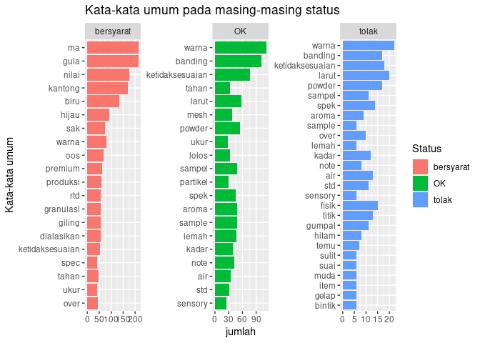
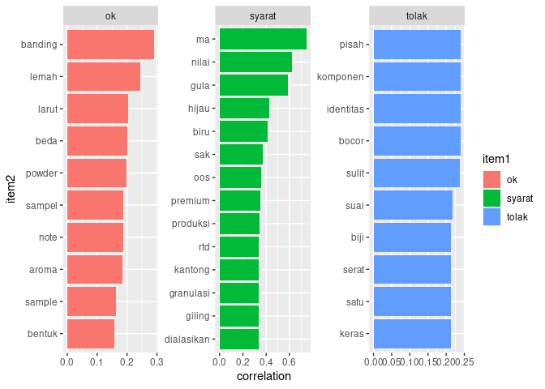
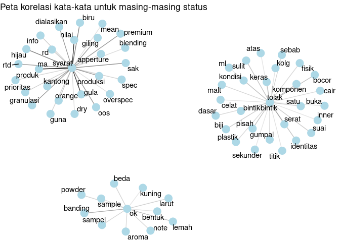

Text prediction tahanan
================
Teguh Prasetia
24 Agustus 2020

# Pendahuluan

Salah satu data yang umum kita jumpai adalah data yang diinput berupa
free text. Departemen QC NFI kadang melakukan penahanan bahan baku yang
datang karena adanya ketidaksesuaian bahan terhadap spesifikasi untuk
dievaluasi lebih lanjut oleh RD terkait. Alasan penahanan produk diinput
berupa free text pada aplikasi QC online, kemudian RD akan melakukan
evaluasi dan menjawab dalam bentuk free text juga. Tujuan dari project
ini adalah untuk :

1.  Exploratory data analysis untuk mengetahui pola kejadian tahanan
    berdasarkan text alasan penahanan, khususnya pada BB yang ditolak,
    rilis bersyarat, maupun pada akhirnya diterima.
2.  Melakukan uji coba membuat model prediktif untuk memprediksi apakah
    suatu bahan baku akan ditolak, release, atau release bersyarat
    berdasarkan data text alasan penahanan yang sudah diolah.

> (kelas silakan mulai mengerjakan dari line 244)

# Workflow

Load data -\> merapikan freetext (menyeragamkan, menghapus kata-kata
yang tidak perlu, dll) -\> convert data menjadi tidytext -\> explorasi
karakter data dari masing-masing variabel target (dalam hal ini, pola2
kata yang sering muncul pada setiap target, dll) -\> preparasi data
untuk pembuatan model -\> pembuatan model menggunakan decision tree dan
naive bayes -\> evaluasi masing-masing model.

# Setup library

Install package katadasaR jika belum ada, silakan hapus tanda \# pada
masing-masing line di chunk di bawah

``` r
# install.packages("devtools")
# devtools::install_github("nurandi/katadasaR")
```

Load library yang dibutuhkan

``` r
library(readxl)
library(tidyverse)
library(tidytext)
library(tm)
library(SnowballC)
library(katadasaR)
library(textclean)
library(tokenizers)
library(stopwords)
library(ggplot2)
library(RVerbalExpressions)
library(widyr)
library(igraph)
library(ggraph)
library(caret)
library(partykit)
library(e1071)
```

# Load data dan explore data awal

Load data tahanan

``` r
tahanan <- read_xlsx("Tahanan2.xlsx")
tahanan$Status <- as.factor(tahanan$Status)
```

Explore data frame dengan melihat beberapa data, summary data, dan
keberadaan NA

``` r
head(tahanan)
```

    ## # A tibble: 6 x 3
    ##   Alasan                              Evaluasi                            Status
    ##   <chr>                               <chr>                               <fct> 
    ## 1 Warna sampel lebih cerah jika diba… "berdasarkan informasi dari team H… OK    
    ## 2 Ketidaksesuian Kimia : 2/3 hasil a… "Sesuai e-mail tanggal 12 Jun 18, … OK    
    ## 3 Ketidaksesuian Kimia : 1/2 hasil a… "Sesuai e-mail tanggal 12 Jun 18, … OK    
    ## 4 Warna larutan berbeda dengan stand… "As bb : 0.04g/100mL air : Penampa… OK    
    ## 5 Warna larutan lebih muda dari stan… "Hasil evaluasi pada binder sweet … OK    
    ## 6 caking                              "berdasarkan hasil evaluasi pada b… OK

``` r
summary(tahanan)
```

    ##     Alasan            Evaluasi               Status   
    ##  Length:707         Length:707         bersyarat:315  
    ##  Class :character   Class :character   OK       :314  
    ##  Mode  :character   Mode  :character   tolak    : 78

Diketahui bahwa data tahanan terdiri atas 3 kolom yaitu: 1. Alasan =
alasan penahanan berupa freetext 2. Evaluasi = hasil evaluasi tahanan
oleh RD berupa freetext 3. Status tahanan = keputusan tahanan yang
terdiri atas 3 macam, yaitu :bersyarat, OK, dan tolak.

Melihat data apakah ada yang memiliki data NA dan menghapus data NA

``` r
which(is.na(tahanan))
```

    ##  [1] 322 323 324 325 326 327 344 345 346 395 539 699 700 701 702

Berdasarkan tujuan project ini, kolom yang akan digunakan sebagai
prediktor adalah alasan dan target variabelnya status. Karena ada data
yang NA, maka diputuskan untuk tidak menggunakan data yang NA tersebut
dengan menghapus baris yang berisi data NA.

``` r
tahanan <- tahanan %>%
  mutate(No = 1:nrow(tahanan)) %>%
  select(No, Alasan, Status) %>%
  filter (!is.na(Alasan))
```

# Merapikan data text part 1. Normalisasi text : menghapus tanda baca, membuat jadi huruf kecil semua, menghapus angka.

Mendaftarkan kata-kata atau pola yang akan dinormalkan/dihapus

``` r
stopwords <- read.csv("stopwords-id.txt", encoding = "UTF-8",header = F)
stopwords <- as.character(stopwords$V1)
punctuation <- rx_punctuation()
number <- rx_digit()
punctuation2 <- c("|", ">", "<", "|")
```

Melakukan normalisasi text menggunakan fungsi dari paket stringr

``` r
tahanan$Alasan <- tahanan$Alasan %>%
  str_to_lower() %>%
  str_remove_all(pattern = punctuation) %>% 
  str_remove_all(pattern = number) %>%
  str_remove_all(pattern = "di ") %>%
  str_remove_all(pattern = "dan") %>%
  str_remove_all(pattern = "ok") %>%
  str_remove_all(pattern = "=") %>%
  str_remove_all(pattern = punctuation2) %>%
  str_squish()
```

Output normalisasi tahap 1

``` r
head(tahanan)
```

    ## # A tibble: 6 x 3
    ##      No Alasan                                                            Status
    ##   <int> <chr>                                                             <fct> 
    ## 1     1 warna sampel lebih cerah jika dibanbdingkan dengan standar sampe… OK    
    ## 2     2 ketidaksesuian kimia hasil analisa ph keluar spek dengan hasil    OK    
    ## 3     3 ketidaksesuian kimia hasil analisa ph keluar spek dengan hasil    OK    
    ## 4     4 warna larutan berbeda dengan standar lebih muda cenderung berwar… OK    
    ## 5     5 warna larutan lebih muda dari standar                             OK    
    ## 6     6 caking                                                            OK

Buat data dummy untuk uji korelasi antar kata pada setiap status

``` r
tahanan.correl <- tahanan %>%
  mutate (Alasan = paste0(Alasan, " ", Status))
```

# Merapikan data text part 2. Normalisasi text : konversi menjadi format tidytext, konversi menjadi kata dasar, menghapus stopwords bahasa Indonesia.

Menghapus kata-kata yang belum bisa dihapus menggunakan stringr pada
data tahanan (note: kata-kata pada dokumen stopwords tidak bisa dihapus
langsung karena ukuran vector berbeda)

``` r
tahanan.tidy <- tahanan %>%
  #select (-Status) %>%
  unnest_tokens(word, Alasan) %>%
  filter (!word %in% stopwords) %>%
  filter (!word %in% c("a","b","c","d","e","f", "hasil", "lebih","standar", "dibanbdingkan", "dibanding", "banding"))
```

``` r
stemming <- function(x){
  paste(lapply(x,katadasar),collapse = " ")}
```

``` r
tahanan.tidy$word <- lapply(tahanan.tidy$word, stemming)
tahanan.tidy$word <- as.character(tahanan.tidy$word)
```

``` r
head(tahanan.tidy)
```

    ## # A tibble: 6 x 3
    ##      No Status word   
    ##   <int> <fct>  <chr>  
    ## 1     1 OK     warna  
    ## 2     1 OK     sampel 
    ## 3     1 OK     cerah  
    ## 4     1 OK     sampel 
    ## 5     1 OK     cair   
    ## 6     1 OK     banding

Menghapus kata-kata yang belum bisa dihapus menggunakan stringr pada
data tahanan correl (note: kata-kata pada dokumen stopwords tidak bisa
dihapus langsung karena ukuran vector berbeda)

``` r
tahanan.tidy1 <- tahanan.correl %>%
  #select (-Status) %>%
  unnest_tokens(word, Alasan) %>%
  filter (!word %in% stopwords) %>%
  filter (!word %in% c("a","b","c","d","e","f", "hasil", "lebih", "standar", "dibanding", "dibanbdingkan", "banding"))
```

``` r
tahanan.tidy1$word <- lapply(tahanan.tidy1$word, stemming)
tahanan.tidy1$word <- as.character(tahanan.tidy1$word)
```

``` r
head(tahanan.tidy1)
```

    ## # A tibble: 6 x 3
    ##      No Status word   
    ##   <int> <fct>  <chr>  
    ## 1     1 OK     warna  
    ## 2     1 OK     sampel 
    ## 3     1 OK     cerah  
    ## 4     1 OK     sampel 
    ## 5     1 OK     cair   
    ## 6     1 OK     banding

# Eksplorasi data untuk melihat karakteristik kata-kata yang sering muncul pada berbagai keputusan tahanan

## Melihat Kata-kata yang sering muncul pada masing-masing status

``` r
tahanan.tidy %>% 
  group_by(Status,word) %>%
  summarise(jumlah = n()) %>%
  arrange(jumlah) %>%
  top_n(20) %>%
  ungroup() %>%
  ggplot(aes(reorder(word, jumlah), jumlah))+
  geom_col(aes(fill=Status), position = "dodge") + 
  coord_flip() +
  labs(title = "Kata-kata umum pada masing-masing status", x = "Kata-kata umum", y = "jumlah")+
  facet_wrap(~Status, scales = "free") 
```

    ## `summarise()` regrouping output by 'Status' (override with `.groups` argument)

    ## Selecting by jumlah

<!-- -->

## Menghitung korelasi kata-kata tertentu pada masing-masing status dan menampilkannya pada bar chart dan peta korelasi

``` r
correl <- tahanan.tidy1 %>%
  group_by(word) %>%
  pairwise_cor(word,No, sort = TRUE)
```

    ## Warning: `tbl_df()` is deprecated as of dplyr 1.0.0.
    ## Please use `tibble::as_tibble()` instead.
    ## This warning is displayed once every 8 hours.
    ## Call `lifecycle::last_warnings()` to see where this warning was generated.

``` r
correl %>%
  filter(item1 %in% c("ok", "syarat", "tolak")) %>%
  group_by(item1) %>%
  top_n(10) %>%
  ungroup() %>%
  mutate(item2 = reorder(item2,correlation)) %>%
  ggplot(aes(item2, correlation)) +
  geom_col(aes(fill=item1), position = "dodge") +
  coord_flip()+
  facet_wrap(~item1, scales = "free")
```

    ## Selecting by correlation

<!-- -->

``` r
set.seed(200)

correl %>%
  filter(item1 %in% c("ok", "syarat", "tolak")) %>%
  filter(correlation > .15) %>%
  graph_from_data_frame() %>%
  ggraph(layout = "fr") +
  geom_edge_link(aes(edge_alpha = correlation), show.legend = FALSE) +
  geom_node_point(color = "lightblue", size = 5) +
  geom_node_text(aes(label = name), repel = TRUE) +
  labs(title = "Peta korelasi kata-kata untuk masing-masing status")+
  theme_void()
```

<!-- -->

Berdasarkan visualisasi data yang dilakukan, diketahui terdapat
kata-kata yang umum dan berkorelasi kuat terhadap status-status akhir
suatu tahanan.

-----

# In class activity

1.  Buat model decision tree menggunakan data test dan data train yang
    sudah disediakan (Line 365)

2.  Jelaskan beberapa kelemahan model decision tree yang dibuat untuk
    memprediksi status tahanan pada data hasil prediksi data train
    maupun data test. (Line 377 dan Line 387). Mengapa kelemahan
    tersebut bisa terjadi? (bisa mengacu pada eksplorasi data di atas)

3.  Bandingkan dengan metode naive bayes yang sudah disediakan. Yang
    manakah yang lebih bagus? Berdasarkan confusion matrix yang
    disediakan, jelaskan kemampuan model NB untuk memprediksi kelas
    `tolak` (Line 315 dan Line 381)

-----

# Pembuatan model

## Preparasi data

``` r
data.model <- tahanan.tidy %>%
  group_by(No,word) %>%
  summarise(jumlah.kata = n()) %>%
  pivot_wider(names_from = word,values_from = jumlah.kata)
```

    ## `summarise()` regrouping output by 'No' (override with `.groups` argument)

``` r
data.model[is.na(data.model)] <- 0
data.model$status <- tahanan$Status
head(data.model)
```

    ## # A tibble: 6 x 402
    ## # Groups:   No [6]
    ##      No banding  cair cerah sampel warna analisa ketidaksesuian kimia    ph
    ##   <int>   <int> <int> <int>  <int> <int>   <int>          <int> <int> <int>
    ## 1     1       1     1     1      2     1       0              0     0     0
    ## 2     2       0     0     0      0     0       1              1     1     1
    ## 3     3       0     0     0      0     0       1              1     1     1
    ## 4     4       0     0     0      0     2       0              0     0     0
    ## 5     5       0     0     0      0     1       0              0     0     0
    ## 6     6       0     0     0      0     0       0              0     0     0
    ## # … with 392 more variables: spek <int>, beda <int>, cenderung <int>,
    ## #   larut <int>, merah <int>, muda <int>, caking <int>, std <int>, air <int>,
    ## #   kadar <int>, of <int>, out <int>, spec <int>, ketidaksesuaian <int>,
    ## #   metode <int>, oven <int>, fisik <int>, gelap <int>, halus <int>,
    ## #   item <int>, powder <int>, standard <int>, serat <int>, ts <int>,
    ## #   under <int>, aroma <int>, clat <int>, lemah <int>, kuning <int>,
    ## #   light <int>, putih <int>, sample <int>, overspek <int>, buttery <int>,
    ## #   over <int>, creamy <int>, sensory <int>, terang <int>, jernih <int>,
    ## #   tua <int>, bentuk <int>, kristal <int>, bahan <int>, baku <int>,
    ## #   gumpal <int>, wadah <int>, bb <int>, basah <int>, kusam <int>,
    ## #   mengggumpal <int>, cacking <int>, tampak <int>, pudar <int>, flakes <int>,
    ## #   fresh <int>, gosong <int>, keclatan <int>, stadar <int>, tengik <int>,
    ## #   ukur <int>, box <int>, ekor <int>, hidup <int>, kemas <int>, kondisi <int>,
    ## #   mati <int>, plastik <int>, primer <int>, propose <int>, retur <int>,
    ## #   sekunder <int>, temu <int>, tribolium <int>, mesh <int>, partikel <int>,
    ## #   screen <int>, tahan <int>, batas <int>, lebih <int>, titik <int>,
    ## #   nilai <int>, pratikel <int>, lolos <int>, on <int>, ayak <int>, gula <int>,
    ## #   info <int>, khusus <int>, ma <int>, orange <int>, produk <int>, rd <int>,
    ## #   sak <int>, status <fct>, viskositas <int>, atas <int>, cantum <int>,
    ## #   claim <int>, coa <int>, cps <int>, …

## Splitting data

``` r
set.seed(999)
idx <- sample(nrow(data.model),nrow(data.model)*0.8)

train <- data.model [idx,-1]
test <- data.model[-idx,-1]
```

## Pembuatan model menggunakan naive bayes

Preparasi data

``` r
bernoulli_conv <- function(x){
        x <- as.factor(ifelse(x > 0, 1, x))
}
```

``` r
train.NB <- train %>%
  select(-status)
```

``` r
test.NB <- test %>%
  select(-status)
```

``` r
train.NB <- apply(X = train.NB ,MARGIN = 2,FUN = bernoulli_conv)
test.NB <- apply(X = test.NB ,MARGIN = 2,FUN = bernoulli_conv)
```

Pembuatan model

``` r
model.NB <- naiveBayes(x =train.NB, y=train$status)
```

Memprediksi menggunakan naive bayes untuk data train

``` r
predict.NB.train <- predict(object = model.NB, newdata = train.NB)
```

Evaluasi hasil prediksi fitted (terhadap data train)

``` r
confusionMatrix(as.factor(predict.NB.train),as.factor(train$status))
```

    ## Confusion Matrix and Statistics
    ## 
    ##            Reference
    ## Prediction  bersyarat  OK tolak
    ##   bersyarat       198   3     0
    ##   OK               50 241     9
    ##   tolak             1   3    48
    ## 
    ## Overall Statistics
    ##                                           
    ##                Accuracy : 0.8807          
    ##                  95% CI : (0.8507, 0.9065)
    ##     No Information Rate : 0.4503          
    ##     P-Value [Acc > NIR] : < 2.2e-16       
    ##                                           
    ##                   Kappa : 0.7958          
    ##                                           
    ##  Mcnemar's Test P-Value : 6.636e-10       
    ## 
    ## Statistics by Class:
    ## 
    ##                      Class: bersyarat Class: OK Class: tolak
    ## Sensitivity                    0.7952    0.9757      0.84211
    ## Specificity                    0.9901    0.8072      0.99194
    ## Pos Pred Value                 0.9851    0.8033      0.92308
    ## Neg Pred Value                 0.8551    0.9763      0.98204
    ## Prevalence                     0.4503    0.4467      0.10307
    ## Detection Rate                 0.3580    0.4358      0.08680
    ## Detection Prevalence           0.3635    0.5425      0.09403
    ## Balanced Accuracy              0.8927    0.8914      0.91702

Sensitivity (Jumlah kelas target yang dijawab dengan benar, dibagi total
jumlah kelas target) = recall

``` r
# Kelas bersyarat
198/(198+50+1)
```

    ## [1] 0.7951807

``` r
# Kelas OK
241/(241+3+3)
```

    ## [1] 0.9757085

``` r
# Kelas tolak
48/(48+9+0)
```

    ## [1] 0.8421053

Spesifisitas (Jumlah kelas bukan target yang dijawab dengan benar,
dibagi total jumlah kelas bukan target)

``` r
#Kelas bersyarat
(241+9+3+48+0)/(241+9+3+48+3+0)
```

    ## [1] 0.9901316

``` r
#Kelas OK 
(198+1+48+0)/(198+1+48+0+9+50)
```

    ## [1] 0.8071895

``` r
#Kelas tolak
(198+3+50+241)/(198+3+50+241+1+3)
```

    ## [1] 0.9919355

Pos pred value (Jumlah prediksi yang benar terhadap kelas target, dibagi
total prediksi terhadap target tersebut) = precision (efficiency)

``` r
# Tebakan kelas bersyarat
198/(198+3+0)
```

    ## [1] 0.9850746

``` r
# Tebakan kelas OK
241/(241+50+9)
```

    ## [1] 0.8033333

``` r
# Tebakan kelas tolak
48/(48+3+1)
```

    ## [1] 0.9230769

Memprediksi data test

``` r
predict.NB.test <- predict(object = model.NB, newdata = test.NB)
```

Evaluasi hasil prediksi data test

``` r
confusionMatrix(as.factor(predict.NB.test),as.factor(test$status))
```

    ## Confusion Matrix and Statistics
    ## 
    ##            Reference
    ## Prediction  bersyarat OK tolak
    ##   bersyarat        45  1     2
    ##   OK               11 54    10
    ##   tolak             0  7     9
    ## 
    ## Overall Statistics
    ##                                           
    ##                Accuracy : 0.777           
    ##                  95% CI : (0.6986, 0.8432)
    ##     No Information Rate : 0.446           
    ##     P-Value [Acc > NIR] : 1.729e-15       
    ##                                           
    ##                   Kappa : 0.63            
    ##                                           
    ##  Mcnemar's Test P-Value : 0.01249         
    ## 
    ## Statistics by Class:
    ## 
    ##                      Class: bersyarat Class: OK Class: tolak
    ## Sensitivity                    0.8036    0.8710      0.42857
    ## Specificity                    0.9639    0.7273      0.94068
    ## Pos Pred Value                 0.9375    0.7200      0.56250
    ## Neg Pred Value                 0.8791    0.8750      0.90244
    ## Prevalence                     0.4029    0.4460      0.15108
    ## Detection Rate                 0.3237    0.3885      0.06475
    ## Detection Prevalence           0.3453    0.5396      0.11511
    ## Balanced Accuracy              0.8837    0.7991      0.68462

## Pembuatan model menggunakan decision tree

Pembuatan model decision tree

``` r
model.tree <- ctree(formula = status~., data = train)
```

Memprediksi data train

``` r
pred.tree.train <- predict(object = model.tree,newdata = train)
```

Mengevaluasi model terhadap data train

``` r
confusionMatrix(as.factor(pred.tree.train), as.factor(train$status))
```

    ## Confusion Matrix and Statistics
    ## 
    ##            Reference
    ## Prediction  bersyarat  OK tolak
    ##   bersyarat       234  36     4
    ##   OK               15 211    53
    ##   tolak             0   0     0
    ## 
    ## Overall Statistics
    ##                                           
    ##                Accuracy : 0.8047          
    ##                  95% CI : (0.7692, 0.8369)
    ##     No Information Rate : 0.4503          
    ##     P-Value [Acc > NIR] : < 2.2e-16       
    ##                                           
    ##                   Kappa : 0.6459          
    ##                                           
    ##  Mcnemar's Test P-Value : 3.647e-14       
    ## 
    ## Statistics by Class:
    ## 
    ##                      Class: bersyarat Class: OK Class: tolak
    ## Sensitivity                    0.9398    0.8543       0.0000
    ## Specificity                    0.8684    0.7778       1.0000
    ## Pos Pred Value                 0.8540    0.7563          NaN
    ## Neg Pred Value                 0.9462    0.8686       0.8969
    ## Prevalence                     0.4503    0.4467       0.1031
    ## Detection Rate                 0.4231    0.3816       0.0000
    ## Detection Prevalence           0.4955    0.5045       0.0000
    ## Balanced Accuracy              0.9041    0.8160       0.5000

Memprediksi data test

``` r
pred.tree.test <- predict(object = model.tree,newdata = test)
```

Mengevaluasi model terhadap data test

``` r
confusionMatrix(as.factor(pred.tree.test), as.factor(test$status))
```

    ## Confusion Matrix and Statistics
    ## 
    ##            Reference
    ## Prediction  bersyarat OK tolak
    ##   bersyarat        53 11     4
    ##   OK                3 51    17
    ##   tolak             0  0     0
    ## 
    ## Overall Statistics
    ##                                           
    ##                Accuracy : 0.7482          
    ##                  95% CI : (0.6676, 0.8179)
    ##     No Information Rate : 0.446           
    ##     P-Value [Acc > NIR] : 4.430e-13       
    ##                                           
    ##                   Kappa : 0.5621          
    ##                                           
    ##  Mcnemar's Test P-Value : 1.173e-05       
    ## 
    ## Statistics by Class:
    ## 
    ##                      Class: bersyarat Class: OK Class: tolak
    ## Sensitivity                    0.9464    0.8226       0.0000
    ## Specificity                    0.8193    0.7403       1.0000
    ## Pos Pred Value                 0.7794    0.7183          NaN
    ## Neg Pred Value                 0.9577    0.8382       0.8489
    ## Prevalence                     0.4029    0.4460       0.1511
    ## Detection Rate                 0.3813    0.3669       0.0000
    ## Detection Prevalence           0.4892    0.5108       0.0000
    ## Balanced Accuracy              0.8829    0.7814       0.5000
