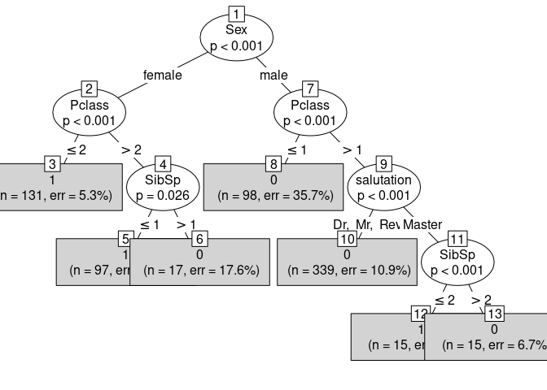
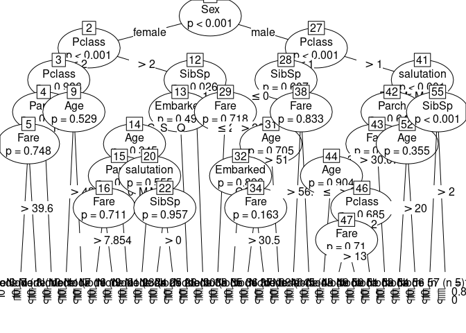
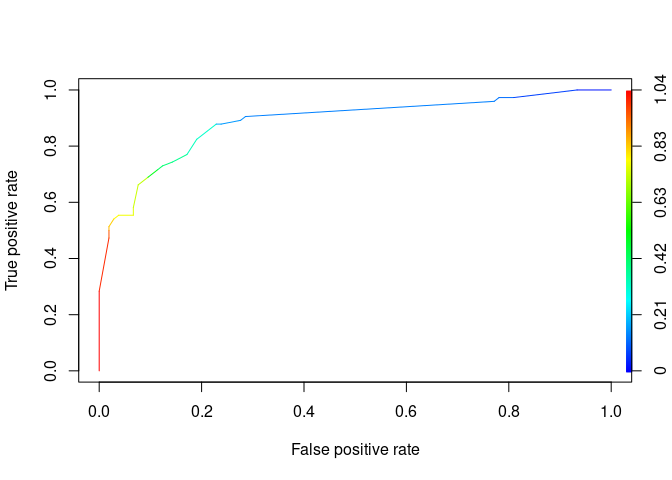

Titanic Prediction Model
================
Teguh Prasetia
24 Agustus 2020

# Load library yang dibutuhkan untuk mengerjakan prediksi

``` r
library(tidyr)
library(dplyr)
```

    ## 
    ## Attaching package: 'dplyr'

    ## The following objects are masked from 'package:stats':
    ## 
    ##     filter, lag

    ## The following objects are masked from 'package:base':
    ## 
    ##     intersect, setdiff, setequal, union

``` r
library(mice)
```

    ## 
    ## Attaching package: 'mice'

    ## The following objects are masked from 'package:base':
    ## 
    ##     cbind, rbind

``` r
library(reshape)
```

    ## 
    ## Attaching package: 'reshape'

    ## The following object is masked from 'package:dplyr':
    ## 
    ##     rename

    ## The following objects are masked from 'package:tidyr':
    ## 
    ##     expand, smiths

``` r
library(partykit)
```

    ## Loading required package: grid

    ## Loading required package: libcoin

    ## Loading required package: mvtnorm

``` r
library(caret)
```

    ## Loading required package: lattice

    ## Loading required package: ggplot2

``` r
library(ROCR)
```

# Load data yang akan digunakan

``` r
titanic <- read.csv("train.csv")
```

# Eksploarsi data dan perapihan data

``` r
summary(titanic)
```

    ##   PassengerId       Survived          Pclass          Name          
    ##  Min.   :  1.0   Min.   :0.0000   Min.   :1.000   Length:891        
    ##  1st Qu.:223.5   1st Qu.:0.0000   1st Qu.:2.000   Class :character  
    ##  Median :446.0   Median :0.0000   Median :3.000   Mode  :character  
    ##  Mean   :446.0   Mean   :0.3838   Mean   :2.309                     
    ##  3rd Qu.:668.5   3rd Qu.:1.0000   3rd Qu.:3.000                     
    ##  Max.   :891.0   Max.   :1.0000   Max.   :3.000                     
    ##                                                                     
    ##      Sex                 Age            SibSp           Parch       
    ##  Length:891         Min.   : 0.42   Min.   :0.000   Min.   :0.0000  
    ##  Class :character   1st Qu.:20.12   1st Qu.:0.000   1st Qu.:0.0000  
    ##  Mode  :character   Median :28.00   Median :0.000   Median :0.0000  
    ##                     Mean   :29.70   Mean   :0.523   Mean   :0.3816  
    ##                     3rd Qu.:38.00   3rd Qu.:1.000   3rd Qu.:0.0000  
    ##                     Max.   :80.00   Max.   :8.000   Max.   :6.0000  
    ##                     NA's   :177                                     
    ##     Ticket               Fare           Cabin             Embarked        
    ##  Length:891         Min.   :  0.00   Length:891         Length:891        
    ##  Class :character   1st Qu.:  7.91   Class :character   Class :character  
    ##  Mode  :character   Median : 14.45   Mode  :character   Mode  :character  
    ##                     Mean   : 32.20                                        
    ##                     3rd Qu.: 31.00                                        
    ##                     Max.   :512.33                                        
    ## 

Berdasarkan summary, diketahui masih terdapat beberapa data yang
memiliki nilai `NA`. Dalam melakukan prediksi, tidak boleh ada data yang
memiliki nilai NA. Oleh karena itu, terdapat beberapa pendekatan yang
bisa dilakukan untuk mengolah data yang `NA` :

1.  Hapus seluruh kolom yang mengandung data `NA` = Cocok untuk kolom
    dengan data `NA` \> 50% baris data.
2.  Hapus baris-baris data yang mengandung data `NA` = Cocok jika jumlah
    `NA` tidak terlalu banyak dan dianggap tidak masalah kehilangan
    informasi dari data yang dihapus tersebut.
3.  Substitusi data `NA` dengan mean/median untuk data numeric,
    substitusi data `NA` dengan modus untuk data factor/karakter.
4.  Substitusi data menggunakan model dari package `mice` (Multivariate
    Imputation by Chained Equation)

Karena data dari kolom `Cabin` memiliki missing value yang sangat
banyak, maka kolom tersebut dihapus. Selain itu, kolom passengerID juga
dihapus karena tidak akan digunakan dalam proses prediksi

``` r
titanic <- titanic [,-c(11,1)]
```

Mengisi data `NA` dari kolom `Age` dengan rata2 dan kolom `Embarked`
dengan modus yang informasinya didapatkan dari summary data di atas.

``` r
titanic$Age <- replace_na(data = titanic$Age,replace = 29.70)
titanic$Embarked <- replace_na(data = titanic$Embarked,replace = "S")
```

Melihat summary data titanic setelah dilakukan substitusi data `NA`

``` r
summary(titanic)
```

    ##     Survived          Pclass          Name               Sex           
    ##  Min.   :0.0000   Min.   :1.000   Length:891         Length:891        
    ##  1st Qu.:0.0000   1st Qu.:2.000   Class :character   Class :character  
    ##  Median :0.0000   Median :3.000   Mode  :character   Mode  :character  
    ##  Mean   :0.3838   Mean   :2.309                                        
    ##  3rd Qu.:1.0000   3rd Qu.:3.000                                        
    ##  Max.   :1.0000   Max.   :3.000                                        
    ##       Age            SibSp           Parch           Ticket         
    ##  Min.   : 0.42   Min.   :0.000   Min.   :0.0000   Length:891        
    ##  1st Qu.:22.00   1st Qu.:0.000   1st Qu.:0.0000   Class :character  
    ##  Median :29.70   Median :0.000   Median :0.0000   Mode  :character  
    ##  Mean   :29.70   Mean   :0.523   Mean   :0.3816                     
    ##  3rd Qu.:35.00   3rd Qu.:1.000   3rd Qu.:0.0000                     
    ##  Max.   :80.00   Max.   :8.000   Max.   :6.0000                     
    ##       Fare          Embarked        
    ##  Min.   :  0.00   Length:891        
    ##  1st Qu.:  7.91   Class :character  
    ##  Median : 14.45   Mode  :character  
    ##  Mean   : 32.20                     
    ##  3rd Qu.: 31.00                     
    ##  Max.   :512.33

Memastikan apakah masih ada data `NA` atau tidak, ternyata seluruh data
sudah terisi.

``` r
anyNA(titanic)
```

    ## [1] FALSE

``` r
head(titanic)
```

    ##   Survived Pclass                                                Name    Sex
    ## 1        0      3                             Braund, Mr. Owen Harris   male
    ## 2        1      1 Cumings, Mrs. John Bradley (Florence Briggs Thayer) female
    ## 3        1      3                              Heikkinen, Miss. Laina female
    ## 4        1      1        Futrelle, Mrs. Jacques Heath (Lily May Peel) female
    ## 5        0      3                            Allen, Mr. William Henry   male
    ## 6        0      3                                    Moran, Mr. James   male
    ##    Age SibSp Parch           Ticket    Fare Embarked
    ## 1 22.0     1     0        A/5 21171  7.2500        S
    ## 2 38.0     1     0         PC 17599 71.2833        C
    ## 3 26.0     0     0 STON/O2. 3101282  7.9250        S
    ## 4 35.0     1     0           113803 53.1000        S
    ## 5 35.0     0     0           373450  8.0500        S
    ## 6 29.7     0     0           330877  8.4583        Q

Terdapat beberapa variabel yang akan digunakan untuk prediksi:

1.  `Pclass` = kelas kamar pada kapal titanic.
2.  Dari data `Name`, bisa diketahui Salutation orang tersebut yang bisa
    menunjukkan gelar orang-orang tersebut. Diduga jika memiliki gelar
    yang tinggi maka mungkin saja lebih prioritas untuk diselamatkan.
3.  `Sex` = Jenis kelamin penumpang
4.  `Age` = Umur penumpang
5.  `SibSp` = jumlah sibling / spouse yang dibawa
6.  `Parch` = jumlah parents / children yang dibawa
7.  `Fare` = harga tiket
8.  `Embarked` = kota embarkasi keberangkatan

Syntax di bawah digunakan untuk memisahkan `salutation` dari kolom nama

``` r
nama<- data.frame(do.call('rbind', strsplit(as.character(titanic$Name),',',fixed=TRUE)))
```

``` r
head(nama)
```

    ##          X1                                          X2
    ## 1    Braund                             Mr. Owen Harris
    ## 2   Cumings  Mrs. John Bradley (Florence Briggs Thayer)
    ## 3 Heikkinen                                 Miss. Laina
    ## 4  Futrelle          Mrs. Jacques Heath (Lily May Peel)
    ## 5     Allen                           Mr. William Henry
    ## 6     Moran                                   Mr. James

``` r
nama.titanic <- data.frame(do.call('rbind', strsplit(as.character(nama$X2),'.',fixed=TRUE)))
```

    ## Warning in base::rbind(...): number of columns of result is not a multiple of
    ## vector length (arg 1)

``` r
head(nama.titanic)
```

    ##      X1                                     X2    X3
    ## 1    Mr                            Owen Harris    Mr
    ## 2   Mrs  John Bradley (Florence Briggs Thayer)   Mrs
    ## 3  Miss                                  Laina  Miss
    ## 4   Mrs          Jacques Heath (Lily May Peel)   Mrs
    ## 5    Mr                          William Henry    Mr
    ## 6    Mr                                  James    Mr

``` r
titanic$salutation <- nama.titanic$X1
```

``` r
head(titanic)
```

    ##   Survived Pclass                                                Name    Sex
    ## 1        0      3                             Braund, Mr. Owen Harris   male
    ## 2        1      1 Cumings, Mrs. John Bradley (Florence Briggs Thayer) female
    ## 3        1      3                              Heikkinen, Miss. Laina female
    ## 4        1      1        Futrelle, Mrs. Jacques Heath (Lily May Peel) female
    ## 5        0      3                            Allen, Mr. William Henry   male
    ## 6        0      3                                    Moran, Mr. James   male
    ##    Age SibSp Parch           Ticket    Fare Embarked salutation
    ## 1 22.0     1     0        A/5 21171  7.2500        S         Mr
    ## 2 38.0     1     0         PC 17599 71.2833        C        Mrs
    ## 3 26.0     0     0 STON/O2. 3101282  7.9250        S       Miss
    ## 4 35.0     1     0           113803 53.1000        S        Mrs
    ## 5 35.0     0     0           373450  8.0500        S         Mr
    ## 6 29.7     0     0           330877  8.4583        Q         Mr

Tampak dari data titanic yang baru, sudah masuk kolom `salutation` yang
akan kita gunakan sebagai variabel untuk memprediksi `survival`

Menghapus kolom yang tidak digunakan untuk prediksi

``` r
titanic.pred <- titanic [,-c(3,8,14)]
```

``` r
head(titanic.pred)
```

    ##   Survived Pclass    Sex  Age SibSp Parch    Fare Embarked salutation
    ## 1        0      3   male 22.0     1     0  7.2500        S         Mr
    ## 2        1      1 female 38.0     1     0 71.2833        C        Mrs
    ## 3        1      3 female 26.0     0     0  7.9250        S       Miss
    ## 4        1      1 female 35.0     1     0 53.1000        S        Mrs
    ## 5        0      3   male 35.0     0     0  8.0500        S         Mr
    ## 6        0      3   male 29.7     0     0  8.4583        Q         Mr

# PERHATIKAN INI YAH GUYS:

``` r
titanic.pred$Survived <- as.factor(titanic.pred$Survived)
titanic.pred$Sex <- as.factor(titanic.pred$Sex)
titanic.pred$Embarked <- as.factor(titanic.pred$Embarked)
titanic.pred$salutation <- as.factor(titanic.pred$salutation)
```

Membuat index untuk random sampling data dan melakukan cross validation

``` r
set.seed(999)
index <- sample(nrow(titanic.pred),nrow(titanic.pred)*0.8)
```

``` r
train <- titanic.pred [index,]
test <- titanic.pred [-index,]
```

Pembuatan model decision tree dari seluruh variabel yang ada

``` r
model <- ctree(formula = Survived~., data = train)
model
```

    ## 
    ## Model formula:
    ## Survived ~ Pclass + Sex + Age + SibSp + Parch + Fare + Embarked + 
    ##     salutation
    ## 
    ## Fitted party:
    ## [1] root
    ## |   [2] Sex in female
    ## |   |   [3] Pclass <= 2: 1 (n = 131, err = 5.3%)
    ## |   |   [4] Pclass > 2
    ## |   |   |   [5] SibSp <= 1: 1 (n = 97, err = 45.4%)
    ## |   |   |   [6] SibSp > 1: 0 (n = 17, err = 17.6%)
    ## |   [7] Sex in male
    ## |   |   [8] Pclass <= 1: 0 (n = 98, err = 35.7%)
    ## |   |   [9] Pclass > 1
    ## |   |   |   [10] salutation in  Dr,  Mr,  Rev: 0 (n = 339, err = 10.9%)
    ## |   |   |   [11] salutation in  Master
    ## |   |   |   |   [12] SibSp <= 2: 1 (n = 15, err = 0.0%)
    ## |   |   |   |   [13] SibSp > 2: 0 (n = 15, err = 6.7%)
    ## 
    ## Number of inner nodes:    6
    ## Number of terminal nodes: 7

``` r
plot(model,type ="simple")
```

<!-- -->

Model fitting

``` r
pred.train <- predict(object = model, newdata = train)
```

Melakukan uji performa model

``` r
confusionMatrix(as.factor(pred.train), as.factor(train$Survived))
```

    ## Confusion Matrix and Statistics
    ## 
    ##           Reference
    ## Prediction   0   1
    ##          0 393  76
    ##          1  51 192
    ##                                           
    ##                Accuracy : 0.8216          
    ##                  95% CI : (0.7915, 0.8491)
    ##     No Information Rate : 0.6236          
    ##     P-Value [Acc > NIR] : <2e-16          
    ##                                           
    ##                   Kappa : 0.6129          
    ##                                           
    ##  Mcnemar's Test P-Value : 0.0332          
    ##                                           
    ##             Sensitivity : 0.8851          
    ##             Specificity : 0.7164          
    ##          Pos Pred Value : 0.8380          
    ##          Neg Pred Value : 0.7901          
    ##              Prevalence : 0.6236          
    ##          Detection Rate : 0.5520          
    ##    Detection Prevalence : 0.6587          
    ##       Balanced Accuracy : 0.8008          
    ##                                           
    ##        'Positive' Class : 0               
    ## 

Melakukan optimasi dengan mengganti threshold pengambilan keputusan

``` r
pred_value <- predict(model, train, type = "prob")
pred_label <- ifelse(pred_value [,2] <=0.45, "0", "1")
```

``` r
head(pred_value)
```

    ##              0         1
    ## 324 0.05343511 0.9465649
    ## 61  0.89085546 0.1091445
    ## 583 0.89085546 0.1091445
    ## 361 0.89085546 0.1091445
    ## 654 0.45360825 0.5463918
    ## 833 0.89085546 0.1091445

``` r
confusionMatrix(as.factor(pred_label), as.factor(train$Survived))
```

    ## Confusion Matrix and Statistics
    ## 
    ##           Reference
    ## Prediction   0   1
    ##          0 393  76
    ##          1  51 192
    ##                                           
    ##                Accuracy : 0.8216          
    ##                  95% CI : (0.7915, 0.8491)
    ##     No Information Rate : 0.6236          
    ##     P-Value [Acc > NIR] : <2e-16          
    ##                                           
    ##                   Kappa : 0.6129          
    ##                                           
    ##  Mcnemar's Test P-Value : 0.0332          
    ##                                           
    ##             Sensitivity : 0.8851          
    ##             Specificity : 0.7164          
    ##          Pos Pred Value : 0.8380          
    ##          Neg Pred Value : 0.7901          
    ##              Prevalence : 0.6236          
    ##          Detection Rate : 0.5520          
    ##    Detection Prevalence : 0.6587          
    ##       Balanced Accuracy : 0.8008          
    ##                                           
    ##        'Positive' Class : 0               
    ## 

Prediksi data test menggunakan model decision tree awal

``` r
pred.test <- predict(object = model, newdata = test)
```

Melihat performa model dalam memprediksi data test

``` r
confusionMatrix(as.factor(pred.test), as.factor(test$Survived))
```

    ## Confusion Matrix and Statistics
    ## 
    ##           Reference
    ## Prediction  0  1
    ##          0 93 21
    ##          1 12 53
    ##                                          
    ##                Accuracy : 0.8156         
    ##                  95% CI : (0.751, 0.8696)
    ##     No Information Rate : 0.5866         
    ##     P-Value [Acc > NIR] : 5.246e-11      
    ##                                          
    ##                   Kappa : 0.6129         
    ##                                          
    ##  Mcnemar's Test P-Value : 0.1637         
    ##                                          
    ##             Sensitivity : 0.8857         
    ##             Specificity : 0.7162         
    ##          Pos Pred Value : 0.8158         
    ##          Neg Pred Value : 0.8154         
    ##              Prevalence : 0.5866         
    ##          Detection Rate : 0.5196         
    ##    Detection Prevalence : 0.6369         
    ##       Balanced Accuracy : 0.8010         
    ##                                          
    ##        'Positive' Class : 0              
    ## 

Optimasi prediksi data test dengan mengganti threshold

``` r
pred_value2 <- predict(model, test, type = "prob")
pred_label2 <- ifelse(pred_value2 [,2] <=0.40, "0", "1")
```

Melihat performa model yang dioptimasi dengan mengganti threshold

``` r
confusionMatrix(as.factor(pred_label2), as.factor(test$Survived))
```

    ## Confusion Matrix and Statistics
    ## 
    ##           Reference
    ## Prediction  0  1
    ##          0 93 21
    ##          1 12 53
    ##                                          
    ##                Accuracy : 0.8156         
    ##                  95% CI : (0.751, 0.8696)
    ##     No Information Rate : 0.5866         
    ##     P-Value [Acc > NIR] : 5.246e-11      
    ##                                          
    ##                   Kappa : 0.6129         
    ##                                          
    ##  Mcnemar's Test P-Value : 0.1637         
    ##                                          
    ##             Sensitivity : 0.8857         
    ##             Specificity : 0.7162         
    ##          Pos Pred Value : 0.8158         
    ##          Neg Pred Value : 0.8154         
    ##              Prevalence : 0.5866         
    ##          Detection Rate : 0.5196         
    ##    Detection Prevalence : 0.6369         
    ##       Balanced Accuracy : 0.8010         
    ##                                          
    ##        'Positive' Class : 0              
    ## 

Cara lain melakukan optimasi model adalah dengan menambahkan parameter
pada decision tree menggunakan fungsi `ctree_control`
Parameter-parameter yang dapat di-adjust antaralain:

`mincriterion`: Nilainya adalah 1 - P-value. Bekerja sebagai “regulator”
untuk kedalaman pohon. Semakin kecil nilainya maka semakin kompleks
pohon yang dihasilkan. Misal mincriterion = 0.8, maka p-value \< 0.2
yang digunakan untuk melakukan split/memecah node.

`minsplit`: Jumlah observasi minimal pada node sebelum melakukan split.
Misal minsplit = 50, maka node tersebut tidak akan dipecah jika
observasi yang terdapat di dalam node \< 50.

`minbucket`: jumlah observasi minimal pada terminal node. Misal
minbucket = 3, maka setiap terminal node yang terbentuk harus mempunyai
minimal 3 observasi.

Melakukan optimasi model dengan mengganti parameter minicriterion

``` r
model2 <- ctree(formula = Survived~., data = train, control = ctree_control(mincriterion = 0.01))
```

``` r
plot(model2)
```

<!-- -->

Fitting data

``` r
pred1 <- predict(object = model2, newdata = train)
```

``` r
confusionMatrix(pred1, train$Survived, positive = "0")
```

    ## Confusion Matrix and Statistics
    ## 
    ##           Reference
    ## Prediction   0   1
    ##          0 418  74
    ##          1  26 194
    ##                                           
    ##                Accuracy : 0.8596          
    ##                  95% CI : (0.8318, 0.8842)
    ##     No Information Rate : 0.6236          
    ##     P-Value [Acc > NIR] : < 2.2e-16       
    ##                                           
    ##                   Kappa : 0.6898          
    ##                                           
    ##  Mcnemar's Test P-Value : 2.602e-06       
    ##                                           
    ##             Sensitivity : 0.9414          
    ##             Specificity : 0.7239          
    ##          Pos Pred Value : 0.8496          
    ##          Neg Pred Value : 0.8818          
    ##              Prevalence : 0.6236          
    ##          Detection Rate : 0.5871          
    ##    Detection Prevalence : 0.6910          
    ##       Balanced Accuracy : 0.8327          
    ##                                           
    ##        'Positive' Class : 0               
    ## 

Pada fitting data menggunakan data train, diperoleh adanya peningkatan
akurasi.

Prediksi model2 menggunakan data test

``` r
pred.test2 <- predict(object = model2, newdata = test)
```

Pengujian performa model pada data test

``` r
confusionMatrix(as.factor(pred.test2), test$Survived, positive = "0")
```

    ## Confusion Matrix and Statistics
    ## 
    ##           Reference
    ## Prediction  0  1
    ##          0 97 25
    ##          1  8 49
    ##                                          
    ##                Accuracy : 0.8156         
    ##                  95% CI : (0.751, 0.8696)
    ##     No Information Rate : 0.5866         
    ##     P-Value [Acc > NIR] : 5.246e-11      
    ##                                          
    ##                   Kappa : 0.6065         
    ##                                          
    ##  Mcnemar's Test P-Value : 0.005349       
    ##                                          
    ##             Sensitivity : 0.9238         
    ##             Specificity : 0.6622         
    ##          Pos Pred Value : 0.7951         
    ##          Neg Pred Value : 0.8596         
    ##              Prevalence : 0.5866         
    ##          Detection Rate : 0.5419         
    ##    Detection Prevalence : 0.6816         
    ##       Balanced Accuracy : 0.7930         
    ##                                          
    ##        'Positive' Class : 0              
    ## 

Optimasi dengan mengganti threshold

``` r
pred_value3 <- predict(model2, test, type = "prob")
pred3 <- prediction(pred_value3[,2], test$Survived)
pred_label3 <- ifelse(pred_value3 [,2] <=0.40, "0", "1")
```

Penentuan performa model

``` r
confusionMatrix(as.factor(pred_label3), test$Survived, positive = "0")
```

    ## Confusion Matrix and Statistics
    ## 
    ##           Reference
    ## Prediction  0  1
    ##          0 93 21
    ##          1 12 53
    ##                                          
    ##                Accuracy : 0.8156         
    ##                  95% CI : (0.751, 0.8696)
    ##     No Information Rate : 0.5866         
    ##     P-Value [Acc > NIR] : 5.246e-11      
    ##                                          
    ##                   Kappa : 0.6129         
    ##                                          
    ##  Mcnemar's Test P-Value : 0.1637         
    ##                                          
    ##             Sensitivity : 0.8857         
    ##             Specificity : 0.7162         
    ##          Pos Pred Value : 0.8158         
    ##          Neg Pred Value : 0.8154         
    ##              Prevalence : 0.5866         
    ##          Detection Rate : 0.5196         
    ##    Detection Prevalence : 0.6369         
    ##       Balanced Accuracy : 0.8010         
    ##                                          
    ##        'Positive' Class : 0              
    ## 

Melihat performa model berdasarkan nilai area under curve

``` r
auc1 <- performance(pred3,measure = "auc")
auc1@y.values
```

    ## [[1]]
    ## [1] 0.8849421

Penjelasan karakter performa model berdasarkan kurva ROC. Kurva ROC
dapat digunakan untuk menjelaskan karakteristik trade off dari model
yang dibuat.

``` r
roc <- performance(pred3, measure = "tpr", x.measure = "fpr")
plot(roc, colorize = T)
```

<!-- -->
