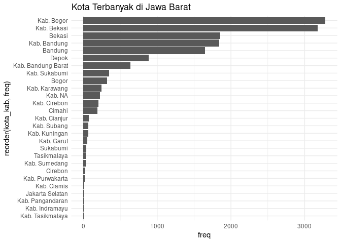

Read Me\!
================

# Review Materi dari `.pdf`

##### *by Ikang*

**R** sangat berguna saat kita berhadapan dengan data dalam bentuk
*unstructured* atau *semi-unstructured*. Data yang sepertinya tidak
mungkin dianalisa bisa saja dianalisa setelah kita lakukan *data
carpentry* atau *data manipulation*.

Sekarang, kita akan mencoba melakukan *data carpentry* menggunakan
prinsip `tidy` dari data yang ada di situs
[BPOM](https://cekbpom.pom.go.id/) untuk kategori **produk pangan**
berikut ini:


Data dari website di atas sudah saya *scrape* pada tanggal `15
September 2020` sore. Scrape dilakukan menggunakan **R** dengan
memanfaatkan `library(rvest)`. Jika teman-teman mau belajar *web
scrape*, berikut *function* yang saya buat untuk *scrape* data dari
situs tersebut:

``` r
# url = 'nama url di sini'
# data = read_html(url) %>% {
#   tibble(
#     ket = html_nodes(.,'td:nth-child(2)') %>% html_text(),
#     md = html_nodes(.,'td:nth-child(1)') %>% html_text(),
#     pt = html_nodes(.,'td~ td+ td') %>% html_text()
#   )
# }
```

Data mentah hasil *scrape* bisa diunduh di *folder* ini, yakni `hasil
scrape BPOM.csv`.

## *Importing data*

Langkah pertama adalah meng-*import* data ke dalam **R** *global
environment*. Berhubung data yang akan di-*import* adalah data `.csv`,
maka tidak diperlukan *library* khusus.

Oh iya, pastikan bahwa *path file* tertulis dengan baik pada saat kita
memanggil data. Teman-teman bisa mempermudah langkah ini dengan menaruh
*file* tersebut di *working directory* agar tidak perlu lagi menuliskan
*full path*.

Mari kita lihat isi dari data tersebut dengan menggunakan perintah
`head(data)`:

| X | ket                                                                                                | md              | pt                                                          |
| -: | :------------------------------------------------------------------------------------------------- | :-------------- | :---------------------------------------------------------- |
| 1 | Makanan Ringan Ekstrudat Rasa KejuMerk: EJHKemasan: Aluminium Foil (14 g, 50 g, 60 g, 180 g)       | ML 673709824060 | PT. INTERFOOD SUKSES JASINDOKota Jakarta Pusat, DKI Jakarta |
| 2 | Gula PasirMerk: -Kemasan: Plastik ( 250 g, 500 g, 1 kg, 2 kg )                                     | MD 251409029038 | PT SURYA UTAMA SENTOSAKota Jakarta Barat, DKI Jakarta       |
| 3 | Air minum dalam kemasan (air mineral)Merk: Q-BicKemasan: Galon Plastik (19 Liter)                  | MD 265217003010 | PT DIFUSI GOLDEN UTAMAKota Balikpapan, Kalimantan Timur     |
| 4 | Air minum dalam kemasan (air mineral)Merk: Q-BicKemasan: Gelas Plastik (240 ml)                    | MD 265217002010 | PT DIFUSI GOLDEN UTAMAKota Balikpapan, Kalimantan Timur     |
| 5 | Daging Ikan, Ayam, Udang, Jamur, dan Sayuran Olahan (Tom Yum)Merk: BernardiKemasan: Plastik (300g) | MD 243213103133 | PT. ELODA MITRAKab. Sidoarjo, Jawa Timur                    |
| 6 | Makanan Ringan Ekstrudat PedasMerk: O-MACKemasan: Plastik (9 g)                                    | MD 273713043011 | PT. RUKUN BERSAMA SENTOSAKab. Kediri, Jawa Timur            |

Coba teman-teman perhatikan dengan baik. Data di atas, walaupun
berbentuk tabel, tapi isi dari masing-masing variabel di dalamnya adalah
teks.

## *Check* Struktur Data

Langkah berikutnya setelah kita meng-*import* data adalah dengan
mengecek struktur dari data tersebut.

``` r
str(data)
```

    ## 'data.frame':    138521 obs. of  4 variables:
    ##  $ X  : int  1 2 3 4 5 6 7 8 9 10 ...
    ##  $ ket: chr  "Makanan Ringan Ekstrudat Rasa KejuMerk: EJHKemasan: Aluminium Foil (14 g, 50 g, 60 g, 180 g)" "Gula PasirMerk: -Kemasan: Plastik ( 250 g, 500 g, 1 kg, 2 kg )" "Air minum dalam kemasan (air mineral)Merk: Q-BicKemasan: Galon Plastik (19 Liter)" "Air minum dalam kemasan (air mineral)Merk: Q-BicKemasan: Gelas Plastik (240 ml)" ...
    ##  $ md : chr  "ML 673709824060" "MD 251409029038" "MD 265217003010" "MD 265217002010" ...
    ##  $ pt : chr  "PT. INTERFOOD SUKSES JASINDOKota Jakarta Pusat, DKI Jakarta" "PT SURYA UTAMA SENTOSAKota Jakarta Barat, DKI Jakarta" "PT DIFUSI GOLDEN UTAMAKota Balikpapan, Kalimantan Timur" "PT DIFUSI GOLDEN UTAMAKota Balikpapan, Kalimantan Timur" ...

Data tersebut memiliki struktur `data.frame` dengan `4` variabel yang
berisi:

  - `X` berupa integer; ini merupakan nomor baris data.
  - `ket` berupa `character`; ini merupakan deskripsi dari produk.
  - `md` berupa `character`; berisi kode merek dagang.
  - `pt` berupa `character`; berisi informasi perusahaan yang
    mendaftarkan produknya.

Dari variabel `ket`, saya bisa mengambil informasi deskripsi produk,
merek, dan jenis kemasan. Dari variabel `pt`, saya bisa mengambil nama
perusahaan, kota atau kabupaten domisili, dan provinsi domisili.

## Panggil *libraries*

Untuk bisa mengekstrak informasi-informasi tersebut, saya memanggil
beberapa *libraries*, yakni:

``` r
library(dplyr)
library(tidyr)
```

## Mengekstrak informasi

Berikut adalah langkah kerja yang akan saya lakukan:


### `separate()` I dan `separate()` II

Saya akan memecah variabel `ket` menjadi `3` variabel, yakni:

  - `deskripsi`
  - `merek`
  - `kemasan`

Caranya adalah dengan memanfaatkan *function* `separate()` dari
`library(tidyr)`. Kita hanya perlu melihat apakah ada pola tertentu dari
data tersebut.

Jika kita perhatikan dengan baik, pemisah antara ketiga variabel
tersebut adalah kata-kata **Merk:** dan **Kemasan:**. Maka:

``` r
data =
  data %>% 
  separate(ket,into=c('deskripsi','lainnya'),sep='Merk: ') %>% 
  separate(lainnya,into=c('merek','kemasan'),sep='Kemasan: ') 
```

Mari kita lihat hasilnya:

| X | deskripsi                                                     | merek    | kemasan                                  | md              | pt                                                          |
| -: | :------------------------------------------------------------ | :------- | :--------------------------------------- | :-------------- | :---------------------------------------------------------- |
| 1 | Makanan Ringan Ekstrudat Rasa Keju                            | EJH      | Aluminium Foil (14 g, 50 g, 60 g, 180 g) | ML 673709824060 | PT. INTERFOOD SUKSES JASINDOKota Jakarta Pusat, DKI Jakarta |
| 2 | Gula Pasir                                                    | \-       | Plastik ( 250 g, 500 g, 1 kg, 2 kg )     | MD 251409029038 | PT SURYA UTAMA SENTOSAKota Jakarta Barat, DKI Jakarta       |
| 3 | Air minum dalam kemasan (air mineral)                         | Q-Bic    | Galon Plastik (19 Liter)                 | MD 265217003010 | PT DIFUSI GOLDEN UTAMAKota Balikpapan, Kalimantan Timur     |
| 4 | Air minum dalam kemasan (air mineral)                         | Q-Bic    | Gelas Plastik (240 ml)                   | MD 265217002010 | PT DIFUSI GOLDEN UTAMAKota Balikpapan, Kalimantan Timur     |
| 5 | Daging Ikan, Ayam, Udang, Jamur, dan Sayuran Olahan (Tom Yum) | Bernardi | Plastik (300g)                           | MD 243213103133 | PT. ELODA MITRAKab. Sidoarjo, Jawa Timur                    |
| 6 | Makanan Ringan Ekstrudat Pedas                                | O-MAC    | Plastik (9 g)                            | MD 273713043011 | PT. RUKUN BERSAMA SENTOSAKab. Kediri, Jawa Timur            |

### `separate()` III dan `separate()` IV

Hal yang sama akan saya lakukan untuk variabel `pt`. Saya akan memecah
variabel tersebut menjadi `3` variabel:

  - `nama_perusahaan`
  - `kota_kab`
  - `provinsi`

Jika kita perhatikan dengan baik, pemisah antara variabel-variabel
tersebut adalah kata-kata **Kota**, **Kab.**, dan **tanda koma**
(**,**).

``` r
data =
  data %>% 
  separate(pt,into=c("pt_lainnya","provinsi"),sep="\\, ") %>% 
  separate(pt_lainnya,into=c('pt_lainnya','kota'),sep="Kota ") %>% 
  separate(pt_lainnya,into=c('nama_perusahaan','kabupaten'),sep="Kab. ")
```

Mari kita lihat hasilnya:

| X | deskripsi                                                     | merek    | kemasan                                  | md              | nama\_perusahaan             | kabupaten | kota          | provinsi         |
| -: | :------------------------------------------------------------ | :------- | :--------------------------------------- | :-------------- | :--------------------------- | :-------- | :------------ | :--------------- |
| 1 | Makanan Ringan Ekstrudat Rasa Keju                            | EJH      | Aluminium Foil (14 g, 50 g, 60 g, 180 g) | ML 673709824060 | PT. INTERFOOD SUKSES JASINDO | NA        | Jakarta Pusat | DKI Jakarta      |
| 2 | Gula Pasir                                                    | \-       | Plastik ( 250 g, 500 g, 1 kg, 2 kg )     | MD 251409029038 | PT SURYA UTAMA SENTOSA       | NA        | Jakarta Barat | DKI Jakarta      |
| 3 | Air minum dalam kemasan (air mineral)                         | Q-Bic    | Galon Plastik (19 Liter)                 | MD 265217003010 | PT DIFUSI GOLDEN UTAMA       | NA        | Balikpapan    | Kalimantan Timur |
| 4 | Air minum dalam kemasan (air mineral)                         | Q-Bic    | Gelas Plastik (240 ml)                   | MD 265217002010 | PT DIFUSI GOLDEN UTAMA       | NA        | Balikpapan    | Kalimantan Timur |
| 5 | Daging Ikan, Ayam, Udang, Jamur, dan Sayuran Olahan (Tom Yum) | Bernardi | Plastik (300g)                           | MD 243213103133 | PT. ELODA MITRA              | Sidoarjo  | NA            | Jawa Timur       |
| 6 | Makanan Ringan Ekstrudat Pedas                                | O-MAC    | Plastik (9 g)                            | MD 273713043011 | PT. RUKUN BERSAMA SENTOSA    | Kediri    | NA            | Jawa Timur       |

-----

## Apakah pekerjaan kita sudah selesai?

Saya masih kurang puas dengan data tersebut, maka saya akan coba
merapikan tata penulisan masing-masing isi variabel lalu mengekstrak
jenis kemasan dan menggabungkan variabel `kota` dan `kabupaten`.

``` r
data = 
  data %>% 
  mutate(deskripsi = trimws(deskripsi),
         merek = trimws(merek),
         kemasan = trimws(kemasan),
         nama_perusahaan = trimws(nama_perusahaan),
         kabupaten = trimws(kabupaten),
         kota = trimws(kota),
         provinsi = trimws(provinsi),
         kota_kab = ifelse(is.na(kota),paste0("Kab. ",kabupaten),kota)
         ) %>% 
  mutate(nama_perusahaan = toupper(nama_perusahaan),
         nama_perusahaan = gsub("[^[:alnum:] ]"," ",nama_perusahaan),
         nama_perusahaan = stringr::str_squish(nama_perusahaan),
         kemasan = tolower(kemasan),
         kemasan = gsub("[^[:alnum:] ]"," ",kemasan),
         kemasan = stringr::str_squish(kemasan),
         jenis_kemasan = stringr::word(kemasan,1)
        ) %>% 
  select(merek,deskripsi,kemasan,jenis_kemasan,nama_perusahaan,kota_kab,provinsi) %>% 
  distinct() 
```

Mari kita lihat hasilnya:

| merek     | deskripsi                                                     | kemasan                                               | jenis\_kemasan | nama\_perusahaan            | kota\_kab     | provinsi         |
| :-------- | :------------------------------------------------------------ | :---------------------------------------------------- | :------------- | :-------------------------- | :------------ | :--------------- |
| EJH       | Makanan Ringan Ekstrudat Rasa Keju                            | aluminium foil 14 g 50 g 60 g 180 g                   | aluminium      | PT INTERFOOD SUKSES JASINDO | Jakarta Pusat | DKI Jakarta      |
| \-        | Gula Pasir                                                    | plastik 250 g 500 g 1 kg 2 kg                         | plastik        | PT SURYA UTAMA SENTOSA      | Jakarta Barat | DKI Jakarta      |
| Q-Bic     | Air minum dalam kemasan (air mineral)                         | galon plastik 19 liter                                | galon          | PT DIFUSI GOLDEN UTAMA      | Balikpapan    | Kalimantan Timur |
| Q-Bic     | Air minum dalam kemasan (air mineral)                         | gelas plastik 240 ml                                  | gelas          | PT DIFUSI GOLDEN UTAMA      | Balikpapan    | Kalimantan Timur |
| Bernardi  | Daging Ikan, Ayam, Udang, Jamur, dan Sayuran Olahan (Tom Yum) | plastik 300g                                          | plastik        | PT ELODA MITRA              | Kab. Sidoarjo | Jawa Timur       |
| O-MAC     | Makanan Ringan Ekstrudat Pedas                                | plastik 9 g                                           | plastik        | PT RUKUN BERSAMA SENTOSA    | Kab. Kediri   | Jawa Timur       |
| Vita.Lite | Margarin Oles                                                 | plastik 10g plastik 60g 6pcs 10g plastik dalam karton | plastik        | PT SUKANDA DJAYA            | Jakarta Utara | DKI Jakarta      |

Data Final Clean

``` r
data %>% 
  group_by(provinsi) %>% 
  summarise(freq = n()) %>% 
  ungroup() %>% 
  arrange(desc(freq))
```

    ## `summarise()` ungrouping output (override with `.groups` argument)

    ## # A tibble: 59 x 2
    ##    provinsi          freq
    ##    <chr>            <int>
    ##  1 DKI Jakarta      50258
    ##  2 Jawa Barat       15078
    ##  3 Jawa Timur       14875
    ##  4 Banten           10988
    ##  5 Jawa Tengah       5738
    ##  6 Sumatera Utara    4279
    ##  7 <NA>              2919
    ##  8 Kepulauan Riau    2591
    ##  9 Bali              2166
    ## 10 Sulawesi Selatan  1261
    ## # … with 49 more rows

``` r
library(ggplot2)
data %>% 
  filter(grepl("jawa barat",provinsi,ignore.case = T)) %>% 
  group_by(kota_kab) %>% 
  summarise(freq = n()) %>% 
  ungroup() %>% 
  arrange(desc(freq)) %>% 
  ggplot(aes(x = reorder(kota_kab,freq),
             y = freq)) +
  geom_col() +
  coord_flip() +
  theme_minimal() +
  labs(title = "Kota Terbanyak di Jawa Barat")
```

    ## `summarise()` ungrouping output (override with `.groups` argument)

<!-- -->
