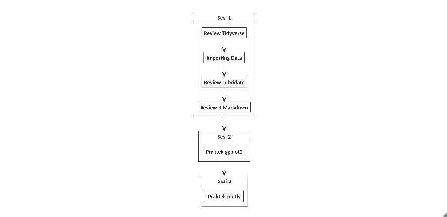

```{r setup, include=FALSE}
knitr::opts_chunk$set(echo = TRUE)
setwd("~/Training-R---Data-Viz")

library(nomnoml)
```

# _Dear Trainees_

## _Preface_

Selamat datang pada _live session_ __training R__ hari ini. Kali ini saya akan memfasilitasi _training_ ini pada tema __Data Visualization__.

Semua materi _training_ dan __R Markdown__ yang dikerjakan saat _live_ ini dapat dipantau juga melalui halaman `github` ini secara _realtime_.

## Materi _Training_

Materi _training_ telah disiapkan oleh `Sigit` dan telah dikerjakan sebagian pada saat sesi di __Nutriversity__. Oleh karena itu, _rundown training_ kali ini:


```{r,echo=FALSE}

```

### Sesi 1

Pada sesi 1 ini, saya akan melakukan _review_ singkat terhadap materi dari _file_ `pdf` yang telah dibaca dan dilakukan. Fokus pada materi tersebut adalah penggunaan `library(tidyverse)` yakni _function pipe_: `%>%`.

Selain itu, konsep dasar _importing_ data dan _setting working directory_ juga akan diingatkan kembali.

Setelah itu kita akan masuk ke materi dari `Sigit` mengenai `library(lubridate)`.

### Sesi 2

Pada sesi ini kita akan melakukan praktek langsung melanjutkan video dari `Sigit`. Diharapkan rekan-rekan _trainee_ telah melakukan _work out_ dan melengkapi _R Markdown_ yang telah diberikan.

> Jika ternyata belum sempat dilengkapi, rekan-rekan bisa mengambilnya di halaman _github_ ini.

Fokus bahasan dari sesi ini adalah melakukan visualisasi data dengan menggunakan `library(ggplot2)` tanpa melupakan keterkaitannya dengan _function pipe_: `%>%`.

#### Data dan _R Markdown_ yang Digunakan

Selama training ini, ada tiga komponen yang harus masuk ke dalam _working directory_:

1. Data `USvideos.csv`.
2. _R Markdown_ `Materi Data Viz Day 1.Rmd` (_file_ `.Rmd` ini akan selalu _update_).
3. _Folder_ `asset`.
 
### Sesi 3
 
Pada sesi ini kita akan membuat visualisasi data interaktif dengan cara mengkonversi _object_ `ggplot` ke dalam `plotly`.

____

## __Ground Rules__

Berkaca dari pengalaman di _training batch_ sebelumnya, maka pada _live session_ kali ini akan ada beberapa peraturan, yakni:

1. _Trainees_ akan dibagi menjadi `3` buah kelompok. Masing-masing kelompok akan dibuatkan grup __QnA__ terpisah dari grup _live session_. Di dalam setiap grup tersebut, akan ada _trainer fasilitator_ yang sudah siap membantu.
1. Jika ada permasalahan terkait _R markdown_, rekan-rekan bisa memanfaatkan grup __QnA__ untuk menyelesaikannya dengan cara bertanya dan mengirimkan _file_ `.Rmd` ke grup masing-masing. _Trainer fasilitator_ akan mengecek file `.Rmd` rekan-rekan dan menginformasikan letak kesalahan yang terjadi.
1. Jangan takut tertinggal materi, _file_ `.Rmd` secara live akan terupdate di halaman _github_ ini.

### Pembagian Kelompok

```{r,echo=FALSE}
kel_1 = data.frame(
  id = c(1:6),
  trainee = c('Evelyn','May','Novita','Albert','Novia','Tikadewi'),
  fasilitator = 'Lenny'
)

knitr::kable(kel_1,'html',caption = 'Kelompok I')

kel_2 = data.frame(
  id = c(1:4),
  trainee = c('Davin','Andrew','Vianna','Luthfan'),
  fasilitator = 'Teguh'
)

knitr::kable(kel_2,'html',caption = 'Kelompok II')

kel_3 = data.frame(
  id = c(1:4),
  trainee = c('Didit','Yulius','Eko','Patricia'),
  fasilitator = 'Fahmi'
)

knitr::kable(kel_3,'html',caption = 'Kelompok III')
```

## Bagaimana cara mengambil _file_ `.Rmd` yang updated di _github_?

Ada tiga cara:

1. [Direct link](https://raw.githubusercontent.com/ikanx101/Training-R---Data-Viz/master/Materi%20Data%20Viz%20Day%201.Rmd) dan melakukan _copy paste_ ke __R Studio__ masing-masing.
2. Melalui halaman ini dan memilih _file_ `Materi Data Viz Day 1.Rmd` dan melakukan _copy paste_ ke __R Studio__ masing-masing.
3. Mengunduh folder zip secara langsung.