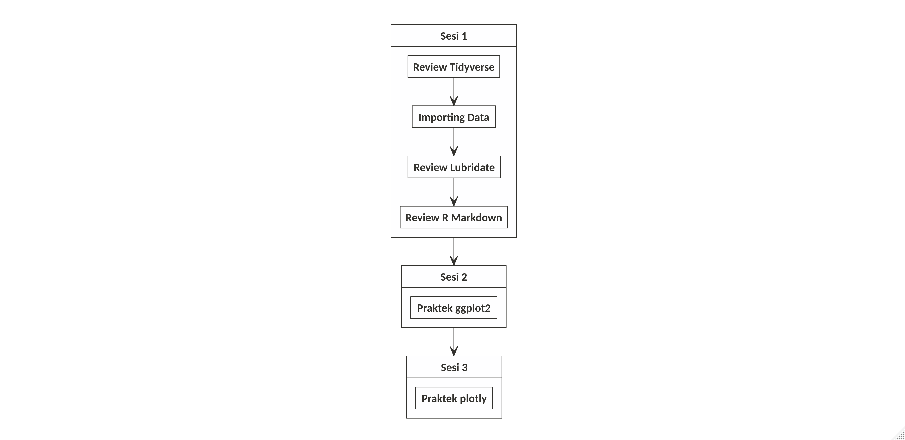

Read Me First
================

# *Dear Trainees*

## *Preface*

Selamat datang pada *live session* **training R** hari ini. Kali ini
saya akan memfasilitasi *training* ini pada tema **Data Visualization**.

Semua materi *training* dan **R Markdown** yang dikerjakan saat *live*
ini dapat dipantau juga melalui halaman `github` ini secara *realtime*.

## Materi *Training*

Materi *training* telah disiapkan oleh `Sigit` dan telah dikerjakan
sebagian pada saat sesi di **Nutriversity**. Oleh karena itu, *rundown
training* kali ini:

### Sesi 1

Pada sesi 1 ini, saya akan melakukan *review* singkat terhadap materi
dari *file* `pdf` yang telah dibaca dan dilakukan. Fokus pada materi
tersebut adalah penggunaan `library(tidyverse)` yakni *function pipe*:
`%>%`.

Selain itu, konsep dasar *importing* data dan *setting working
directory* juga akan diingatkan kembali.

Setelah itu kita akan masuk ke materi dari `Sigit` mengenai
`library(lubridate)`.

### Sesi 2

Pada sesi ini kita akan melakukan praktek langsung melanjutkan video
dari `Sigit`. Diharapkan rekan-rekan *trainee* telah melakukan *work
out* dan melengkapi *R Markdown* yang telah diberikan.

> Jika ternyata belum sempat dilengkapi, rekan-rekan bisa mengambilnya
> di halaman *github* ini.

Fokus bahasan dari sesi ini adalah melakukan visualisasi data dengan
menggunakan `library(ggplot2)` tanpa melupakan keterkaitannya dengan
*function pipe*: `%>%`.

### Sesi 3

Pada sesi ini kita akan membuat visualisasi data interaktif dengan cara
mengkonversi *object* `ggplot` ke dalam `plotly`.

-----

## **Ground Rules**

Berkaca dari pengalaman di *training batch* sebelumnya, maka pada *live
session* kali ini akan ada beberapa peraturan, yakni:

1.  *Trainees* akan dibagi menjadi `3` buah kelompok. Masing-masing
    kelompok akan dibuatkan grup **QnA** terpisah dari grup *live
    session*. Di dalam setiap grup tersebut, akan ada *trainer
    fasilitator* yang sudah siap membantu.
2.  Jika ada permasalahan terkait *R markdown*, rekan-rekan bisa
    memanfaatkan grup **QnA** untuk menyelesaikannya dengan cara
    bertanya dan mengirimkan *file* `.Rmd` ke grup masing-masing.
3.  Jangan takut tertinggal materi, *file* `.Rmd` secara live akan
    terupdate di halaman *github* ini.

### Pembagian Kelompok

| id | trainee  | fasilitator |
| -: | :------- | :---------- |
|  1 | Evelyn   | Lenny       |
|  2 | May      | Lenny       |
|  3 | Novita   | Lenny       |
|  4 | Albert   | Lenny       |
|  5 | Novia    | Lenny       |
|  6 | Tikadewi | Lenny       |

Kelompok I

| id | trainee | fasilitator |
| -: | :------ | :---------- |
|  1 | Davin   | Teguh       |
|  2 | Andrew  | Teguh       |
|  3 | Vianna  | Teguh       |
|  4 | Luthfan | Teguh       |

Kelompok II

| id | trainee  | fasilitator |
| -: | :------- | :---------- |
|  1 | Didit    | Fahmi       |
|  2 | Yulius   | Fahmi       |
|  3 | Eko      | Fahmi       |
|  4 | Patricia | Fahmi       |

Kelompok III
