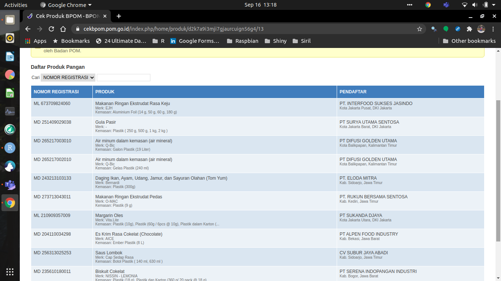

```{r setup, include=FALSE}
rm(list=ls()) # ini berguna untuk menghapus semua data yang ada di global environment
knitr::opts_chunk$set(echo = TRUE)
setwd("~/Documents/Live-Session-Nutrifood-R")
```

# *Dear Trainees*

## *Preface*

Selamat datang pada *live session* **training R**. Pada sesi ini tim _trainer_ akan memfasilitasi *training* ini pada tema **Data Visualization** dan __Prediction__.

Semua materi *training* dan **R Markdown** yang dikerjakan saat *live* ini dapat dipantau juga melalui halaman `github` ini secara *realtime*.

## Materi *Training*

Materi *training* telah disiapkan oleh `Sigit`, `Teguh` dan `Lenny`. Sebagian di antaranya telah dikerjakan pada saat sesi di **Nutriversity**.

Oleh karena itu, _trainee_ yang diperbolehkan mengikuti sesi ini adalah _trainee_ yang telah menyelesaikan minimum _progress_ di __Nutriversity__. 

Berikut adalah *rundown training*:

```{r,echo=FALSE,fig.retina=10}
nomnoml::nomnoml("[Hari I] -> [Hari II]
                  [Hari II] -> [Hari III]
                  [Hari I|
                      [Ikang] -> [Review Importing Data]
                      [Ikang] -> [Review Tidyverse]
                      [Sigit] -> [Review Lubridate]
                      [Sigit] -> [Praktek ggplot2]
                      [Ikang] -> [Review R Markdown]
                      ]
                  [Hari II|
                      [Sigit] -> [Praktek plotly]
                      ]
                  [Hari III|
                      [Lenny] -> [Linear Regression]
                      [Teguh] -> [Decision Tree]
                      ]
                 ")
```


## Hari I

### Sesi 1

Pada sesi 1 ini, saya akan melakukan *review* singkat terhadap materi dari *file* `pdf` yang telah dibaca dan dilakukan. Fokus pada materi tersebut adalah penggunaan `library(tidyverse)` yakni *function pipe*: `%>%` untuk melakukan _data carpentry_ atau _data manipulation_.

Selain itu, konsep dasar *importing* data dan *setting working directory* juga akan diingatkan kembali.


### Sesi 2

Pada sesi ini kita akan melakukan praktek langsung melanjutkan video dari `Sigit`. Diharapkan rekan-rekan *trainee* telah melakukan *workout* dan melengkapi *R Markdown* yang telah diberikan.

> Jika ternyata belum sempat dilengkapi, rekan-rekan bisa mengambilnya di halaman *github* ini.

Selama _training_ _data visualization_, ada tiga komponen yang harus masuk ke dalam *working directory*:

1.  Data `USvideos.csv`.
2.  *R Markdown* `Materi Data Viz Day 1.Rmd` (*file* `.Rmd` ini akan
    selalu *update*).
3.  *Folder* `asset`.

Pastikan juga bahwa _libraries_ sudah dipanggil di awal kita melakukan analisa!

-----

## **Ground Rules**

Berkaca dari pengalaman di *training batch* sebelumnya, maka pada *live session* kali ini akan ada beberapa peraturan, yakni:

1.  *Trainees* akan dibagi menjadi `3` buah kelompok. Masing-masing kelompok akan dibuatkan grup **QnA** terpisah dari grup *live session*. Di dalam setiap grup tersebut, akan ada *trainer fasilitator* yang sudah siap membantu.
2.  Jika ada permasalahan terkait *R markdown*, rekan-rekan bisa memanfaatkan grup **QnA** untuk menyelesaikannya dengan cara bertanya dan mengirimkan *file* `.Rmd` ke grup masing-masing. *Trainer fasilitator* akan mengecek file `.Rmd` rekan-rekan dan menginformasikan letak kesalahan yang terjadi.
3.  Jangan takut tertinggal materi, *file* `.Rmd` secara live akan terupdate di halaman *github* ini.


### Pembagian Kelompok

Berikut adalah pembagian kelompok untuk hari ini:

```{r,include=FALSE,echo=FALSE,message=FALSE,warning=FALSE}
data = data.frame(
  No = c(1:11),
  Trainee = "NA",
  Fasilitator = c(rep("Ikang - Sigit",4),rep("Teguh",4),rep("Lenny",3))
)
knitr::kable(data,"simple",caption = "Kelompok Live Session")
```

----

# PENTING!

Ada banyak cara dalam mengolah data di __R__. Teman-teman bisa menggunakan prinsip `tidyverse`, `data.table`, dan lainnya. Saya akan menggunakan prinsip `tidyverse` menggunakan `%>%` agar lebih mudah dipahami.

## Langkah Pengerjaan di R

Setiap kita bekerja dengan menggunakan __R__, berikut adalah langkah-langkah standar yang biasa dilakukan:

```{r,echo=FALSE}
nomnoml::nomnoml("#direction: down,
                 [Panggil Libraries] -> [Set working directory]
                 [Set working directory] -> [Panggil Data]
                 [Panggil Data] -> [Data Preparation]
                 [Data Preparation] -> [Data Cleaning]
                 [Data Cleaning] -> [Data Processing]
                 [Data Processing] -> [Visualisasi]
                 
                 [Panggil Libraries|
                    [Apakah library terinstall] -> [Ya]
                    [Apakah library terinstall] -> [Tidak]
                    [Tidak] -> [Install dulu!]
                    ]
                 
                 [Set working directory|Emang penting yah?\nIya!\nUntuk memudahkan kita memanggil data\ndan resources lainnya.\n Kalau mencar2 kan males nulis file path-nya]
                 
                 [Panggil Data|
                    [Lihat bentuk datanya] -> [Excel]
                    [Lihat bentuk datanya] -> [csv]
                    [Excel] -> [Pakai library(readxl)]
                    [Pakai library(readxl)] -> [read_excel(nama_file)]
                    [csv] -> [Tak perlu library]
                    [Tak perlu library] -> [read.csv(nama_file)]
                    [Lihat bentuk datanya] -> [.rda]
                    [.rda] -> [Tak perlu library]
                    [Tak perlu library] -> [load(nama_file)]
                    
                    [Lihat bentuk datanya] -> [format lain]
                    [format lain] -> [Gunakan library lain]
                    ]
                    
                 [Data Preparation|
                    [Cek Struktur Data] -> [str()]
                    [Cek Struktur Data] -> [str()]
                    [Cek Tipe Data] -> [str()]
                    [str()] -> [Vector]
                    [str()] -> [Data frame]
                    [str()] -> [Tipe Data]
                    [Tipe Data] -> [Apakah ada yang perlu diubah?]
                    [Apakah ada yang perlu diubah?] -> [Ya]
                    [Apakah ada yang perlu diubah?] -> [Tidak]
                    [Ya] -> [Ubah ke tanggal]
                    [Ya] -> [Ubah ke factor]
                    [Ya] -> [Ubah ke numerik]
                    
                    [Apakah data konsisten?] -> [Ya, konsisten]
                    [Apakah data konsisten?] -> [Tidak konsisten]
                    [Tidak konsisten] -> [Buat konsisten!]
                    ]
                 
                 
                 [Data Cleaning|
                    [Apakah ada kolom NA?] -> [Ya]
                    [Apakah ada kolom NA?] -> [Tidak]
                    [Ya] -> [Hapus baris NA]
                    [Ya] -> [Isi baris NA]
                    [Isi baris NA] -> [Tipe data apa?]
                    [Tipe data apa?] -> [Kualitatif]
                    [Tipe data apa?] -> [Kuantitatif]
                    [Kualitatif] -> [Modus]
                    [Kuantitatif] -> [Modus]
                    [Kuantitatif] -> [Mean]
                    [Kuantitatif] -> [Median]
                    
                    ]
                    
                 [Data Processing|
                    [Menggunakan %>%] -> [dplyr]
                    [Menggunakan %>%] -> [tidyr]
                    [Menggunakan %>%] -> [reshape2]
                    [Menggunakan %>%] -> [tidytext]
                    [dplyr] -> [group_by()]
                    [dplyr] -> [mutate()]
                    [dplyr] -> [filter()]
                    [dplyr] -> [summarise()]
                    [tidyr] -> [separate()]
                    [reshape2] -> [melt()]
                    [tidytext] -> [unnest_tokens()]
                    
                    ]
                    
                 [Visualisasi|
                    [Statis] -> [ggplot2]
                    [ggplot2] -> [Custom themes|dengan ggthemes atau ggpubr]
                    [Dinamis] -> [plotly]
                    [Web app] -> [Shiny]
                    ]
                 ")
```

---

```{r setup, include=FALSE}
rm(list=ls()) # ini berguna untuk menghapus semua data yang ada di global environment
knitr::opts_chunk$set(echo = TRUE)
setwd("~/Documents/Live-Session-Nutrifood-R")
```


# Review Materi dari `.pdf`
##### _by Ikang_

Sekarang, kita akan mencoba melakukan prinsip _data carpentry_ dari data hasil _scrape_ di situs [BPOM](https://cekbpom.pom.go.id/) untuk kategori __produk pangan__ berikut ini:

```{r,echo=FALSE}

```

Data sudah saya _scrape_ pada tanggal 15 September 2020 sore. Data mentah hasil _scrape_ bisa diunduh di sini. 


