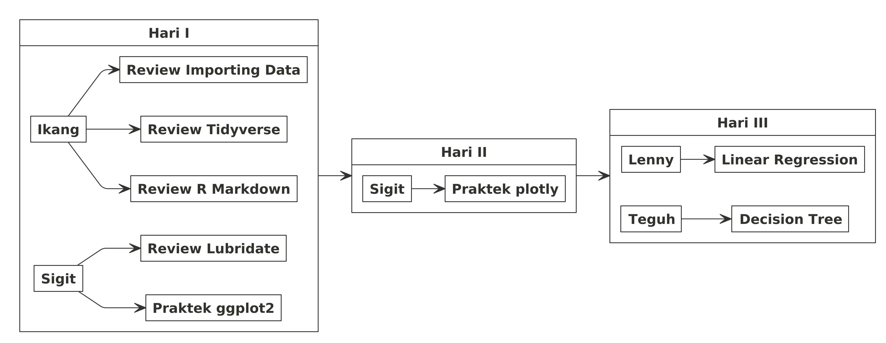
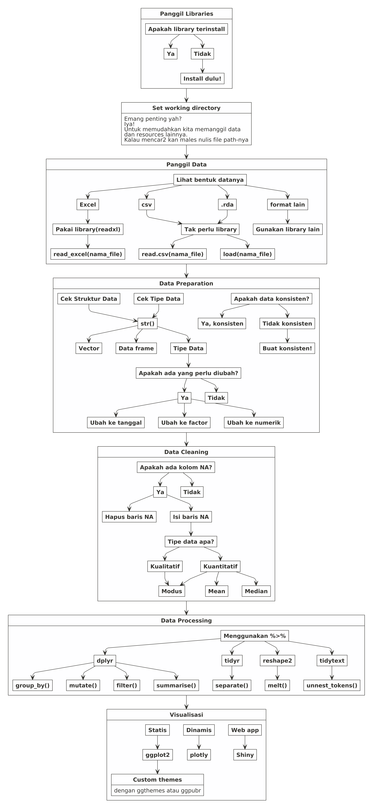

Read Me First
================

# *Dear Trainees*

## *Preface*

Selamat datang pada *live session* **training R**. Pada sesi ini tim
*trainer* akan memfasilitasi *training* ini pada tema **Data
Visualization** dan **Prediction**.

Semua materi *training* dan **R Markdown** yang dikerjakan saat *live*
ini dapat dipantau juga melalui halaman `github` ini secara *realtime*.

## Materi *Training*

Materi *training* telah disiapkan oleh `Sigit`, `Teguh` dan `Lenny`.
Sebagian di antaranya telah dikerjakan pada saat sesi di
**Nutriversity**.

Oleh karena itu, *trainee* yang diperbolehkan mengikuti sesi ini adalah
*trainee* yang telah menyelesaikan minimum *progress* di
**Nutriversity**.

Berikut adalah *rundown training*:

## Hari I

### Sesi 1

Pada sesi 1 ini, saya akan melakukan *review* singkat terhadap materi
dari *file* `pdf` yang telah dibaca dan dilakukan. Fokus pada materi
tersebut adalah penggunaan `library(tidyverse)` yakni *function pipe*:
`%>%` untuk melakukan *data carpentry* atau *data manipulation*.

Selain itu, konsep dasar *importing* data dan *setting working
directory* juga akan diingatkan kembali.

### Sesi 2

Pada sesi ini kita akan melakukan praktek langsung melanjutkan video
dari `Sigit`. Diharapkan rekan-rekan *trainee* telah melakukan *workout*
dan melengkapi *R Markdown* yang telah diberikan.

> Jika ternyata belum sempat dilengkapi, rekan-rekan bisa mengambilnya
> di halaman *github* ini.

Selama *training* *data visualization*, ada tiga komponen yang harus
masuk ke dalam *working directory*:

1.  Data `USvideos.csv`.
2.  *R Markdown* `Materi Data Viz Day 1.Rmd` (*file* `.Rmd` ini akan
    selalu *update*).
3.  *Folder* `asset`.

Pastikan juga bahwa *libraries* sudah dipanggil di awal kita melakukan
analisa\!

-----

## **Ground Rules**

Berkaca dari pengalaman di *training batch* sebelumnya, maka pada *live
session* kali ini akan ada beberapa peraturan, yakni:

1.  *Trainees* akan dibagi menjadi `3` buah kelompok. Masing-masing
    kelompok akan dibuatkan grup **QnA** terpisah dari grup *live
    session*. Di dalam setiap grup tersebut, akan ada *trainer
    fasilitator* yang sudah siap membantu.
2.  Jika ada permasalahan terkait *R markdown*, rekan-rekan bisa
    memanfaatkan grup **QnA** untuk menyelesaikannya dengan cara
    bertanya dan mengirimkan *file* `.Rmd` ke grup masing-masing.
    *Trainer fasilitator* akan mengecek file `.Rmd` rekan-rekan dan
    menginformasikan letak kesalahan yang terjadi.
3.  Jangan takut tertinggal materi, *file* `.Rmd` secara live akan
    terupdate di halaman *github* ini.

### Pembagian Kelompok

Berikut adalah pembagian kelompok untuk hari ini:

-----

# PENTING\!

Ada banyak cara dalam mengolah data di **R**. Teman-teman bisa
menggunakan prinsip `tidyverse`, `data.table`, dan lainnya. Saya akan
menggunakan prinsip `tidyverse` menggunakan `%>%` agar lebih mudah
dipahami.

## Langkah Pengerjaan di R

Setiap kita bekerja dengan menggunakan **R**, berikut adalah
langkah-langkah standar yang biasa dilakukan:

<!-- -->
