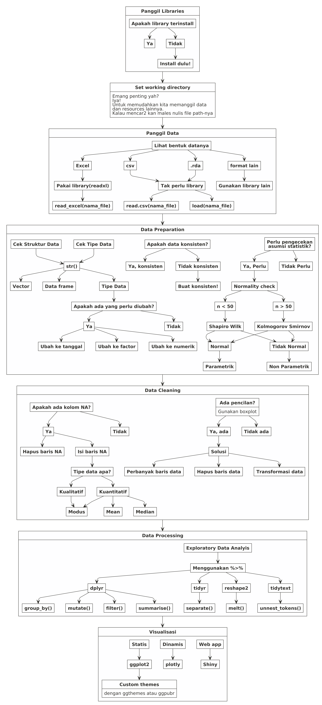

Read Me First
================

# *Dear Trainees*

## *Preface*

Selamat datang pada *live session* **training R** hari ini. Kali ini tim
*trainer* akan memfasilitasi *training* ini pada tema **Data
Visualization**.

Semua materi *training* dan **R Markdown** yang dikerjakan saat *live*
ini dapat dipantau juga melalui halaman `github` ini secara *realtime*.

## Materi *Training*

Materi *training* telah disiapkan oleh `Sigit` dan telah dikerjakan
sebagian pada saat sesi di **Nutriversity**. Oleh karena itu, *rundown
training* kali ini:



### Sesi 1

Pada sesi 1 ini, saya akan melakukan *review* singkat terhadap materi
dari *file* `pdf` yang telah dibaca dan dilakukan. Fokus pada materi
tersebut adalah penggunaan `library(tidyverse)` yakni *function pipe*:
`%>%`.

Selain itu, konsep dasar *importing* data dan *setting working
directory* juga akan diingatkan kembali.

Setelah itu kita akan masuk ke materi dari `Sigit` mengenai
`library(lubridate)`.

### Sesi 2

Pada sesi ini kita akan melakukan praktek langsung melanjutkan video
dari `Sigit`. Diharapkan rekan-rekan *trainee* telah melakukan *workout*
dan melengkapi *R Markdown* yang telah diberikan.

> Jika ternyata belum sempat dilengkapi, rekan-rekan bisa mengambilnya
> di halaman *github* ini.

Fokus bahasan dari sesi ini adalah melakukan visualisasi data dengan
menggunakan `library(ggplot2)` tanpa melupakan keterkaitannya dengan
*function pipe*: `%>%`.

#### Data dan *R Markdown* yang Digunakan

Selama training ini, ada tiga komponen yang harus masuk ke dalam
*working directory*:

1.  Data `USvideos.csv`.
2.  *R Markdown* `Materi Data Viz Day 1.Rmd` (*file* `.Rmd` ini akan
    selalu *update*).
3.  *Folder* `asset`.

### Sesi 3

Pada sesi ini kita akan membuat visualisasi data interaktif dengan cara
mengkonversi *object* `ggplot` ke dalam `plotly`.

-----

## **Ground Rules**

Berkaca dari pengalaman di *training batch* sebelumnya, maka pada *live
session* kali ini akan ada beberapa peraturan, yakni:

1.  *Trainees* akan dibagi menjadi `3` buah kelompok. Masing-masing
    kelompok akan dibuatkan grup **QnA** terpisah dari grup *live
    session*. Di dalam setiap grup tersebut, akan ada *trainer
    fasilitator* yang sudah siap membantu.
2.  Jika ada permasalahan terkait *R markdown*, rekan-rekan bisa
    memanfaatkan grup **QnA** untuk menyelesaikannya dengan cara
    bertanya dan mengirimkan *file* `.Rmd` ke grup masing-masing.
    *Trainer fasilitator* akan mengecek file `.Rmd` rekan-rekan dan
    menginformasikan letak kesalahan yang terjadi.
3.  Jangan takut tertinggal materi, *file* `.Rmd` secara live akan
    terupdate di halaman *github* ini.

### Pembagian Kelompok

Berikut adalah pembagian kelompok untuk hari ini:

| No | Trainee                  | Fasilitator   |
| -: | :----------------------- | :------------ |
|  1 | Andre Kurniawan          | Ikang - Sigit |
|  2 | Dimas Dwi Santoso        | Ikang - Sigit |
|  3 | David Auw                | Ikang - Sigit |
|  4 | Harinto Anggoro          | Ikang - Sigit |
|  5 | Muhammad Rizqi           | Teguh         |
|  6 | Widio Widodo             | Teguh         |
|  7 | Mochammad Miftahul Fahmi | Teguh         |
|  8 | Willianto                | Teguh         |
|  9 | Claireta                 | Lenny         |
| 10 | Rendy                    | Lenny         |
| 11 | Lince                    | Lenny         |

Kelompok Live Session

-----

# Review Sebentar Materi `Tidyverse`

## Review Materi `importing data`

Untuk mengambil data berupa file excel, kita memerlukan
`library(readxl)`. Ingat *yah*, kita bisa memanggil keseluruhan
*library* dengan perintah:

1.  `library(readxl)` atau
2.  `readxl::nama_function`.

<!-- end list -->

``` r
library(readxl)
data = read_excel("DATA LATIHAN.xlsx")
```

Sekarang, kita coba tampilkan 5 data teratas dengan cara:

``` r
head(data,5)
```

    ## # A tibble: 5 x 13
    ##   id_transaksi tanggal               jam sku     qty unit  harga diskon
    ##   <chr>        <dttm>              <dbl> <chr> <dbl> <chr> <dbl>  <dbl>
    ## 1 00001/MANUT… 2020-01-02 00:00:00     8 KOPI…     1 PCS    5400   0   
    ## 2 00001/MANUT… 2020-01-02 00:00:00     8 INDO…     1 PCS    2500   0   
    ## 3 00001/MANUT… 2020-01-02 00:00:00     8 INDO…     1 PCS    3500   0   
    ## 4 00010/MANUT… 2020-01-02 00:00:00     9 212 …     4 DUS   22000   0   
    ## 5 00010/MANUT… 2020-01-02 00:00:00     9 SI P…     4 PCS   64000   3.44
    ## # … with 5 more variables: total_harga <dbl>, id_pelanggan <chr>, hari <chr>,
    ## #   ampm <chr>, bulan <chr>

Mari kita lihat struktur dan tipe data yang kita miliki dengan cara:

``` r
str(data)
```

    ## tibble [33,833 × 13] (S3: tbl_df/tbl/data.frame)
    ##  $ id_transaksi: chr [1:33833] "00001/MANUTD/0120" "00001/MANUTD/0120" "00001/MANUTD/0120" "00010/MANUTD/0120" ...
    ##  $ tanggal     : POSIXct[1:33833], format: "2020-01-02" "2020-01-02" ...
    ##  $ jam         : num [1:33833] 8 8 8 9 9 9 9 9 9 9 ...
    ##  $ sku         : chr [1:33833] "KOPIKO COFFE LATTE 240 ML" "INDOMIE GORENG 85G" "INDOMIE GORENG SPECIAL JUMBO 125 GR" "212 AIR MINERAL 48 X 240 ML" ...
    ##  $ qty         : num [1:33833] 1 1 1 4 4 1 1 1 2 1 ...
    ##  $ unit        : chr [1:33833] "PCS" "PCS" "PCS" "DUS" ...
    ##  $ harga       : num [1:33833] 5400 2500 3500 22000 64000 11200 10600 6700 3700 11300 ...
    ##  $ diskon      : num [1:33833] 0 0 0 0 3.44 ...
    ##  $ total_harga : num [1:33833] 5400 2500 3500 88000 247200 ...
    ##  $ id_pelanggan: chr [1:33833] "umum" "umum" "umum" "member" ...
    ##  $ hari        : chr [1:33833] "4 Kamis" "4 Kamis" "4 Kamis" "4 Kamis" ...
    ##  $ ampm        : chr [1:33833] "1 pagi" "1 pagi" "1 pagi" "1 pagi" ...
    ##  $ bulan       : chr [1:33833] "Jan" "Jan" "Jan" "Jan" ...

## Review Materi *Pipe* `%>%`

Untuk menggunakan *function* *pipe* `%>%`, kita harus memanggil
*library* terlebih dahulu. Ada beberapa *Libraries* yang bisa digunakan
agar *function* *pipe* bisa digunakan:

1.  `library(tidyverse)`
2.  `library(dplyr)`
3.  `library(magrittr)`

Saya akan gunakan `library(dplyr)` saja *ya*.

``` r
library(dplyr)
```

Oh iya, kita akan ubah bulan agar urut yah.

``` r
data = 
  data %>% 
  mutate(bulan = factor(bulan,levels = c("Jan","Feb","Mar","Apr")))
```

Oke sekarang kita akan coba oprek informasi apa saja yang bisa kita
ambil dari data tersebut *yah*.

### Apakah ada perubahan *habit* belanja?

Ingat untuk menghapus `PLAS TIK` dari data belanjaan ini dulu *yah*\!

``` r
data = 
  data %>% 
  filter(sku != "PLAS TIK   ") 
```

Mari kita jawab pertanyaan di atas dengan menghitung:

#### Total belanja konsumen per bulannya:

``` r
belanja_per_bulan = 
  data %>% 
  mutate(omset = qty * total_harga) %>% 
  group_by(bulan) %>% 
  summarise(omset = sum(omset)) %>% 
  ungroup()
```

    ## `summarise()` ungrouping output (override with `.groups` argument)

``` r
belanja_per_bulan
```

    ## # A tibble: 4 x 2
    ##   bulan       omset
    ##   <fct>       <dbl>
    ## 1 Jan    286305187.
    ## 2 Feb    205257406.
    ## 3 Mar    407853288.
    ## 4 Apr   4587878620.


#### Analisa per `id_transaksi`

Kita akan hitung beberapa parameter, yakni:

1.  Berapa banyak *jenis item* yang dibelanjakan konsumen. Berapa banyak
    *item* yang dibelanjakan konsumen.
2.  omset per konsumen.

Semua dihitung per bulan

``` r
analisa_konsumen = 
  data %>% 
  mutate(omset = qty * total_harga) %>% 
  group_by(bulan,id_transaksi) %>% 
  summarise(banyak_jenis_item = n(),
            banyak_item = sum(qty),
            omset = sum(omset)) %>% 
  ungroup()
```

    ## `summarise()` regrouping output by 'bulan' (override with `.groups` argument)

``` r
analisa_konsumen
```

    ## # A tibble: 12,825 x 5
    ##    bulan id_transaksi      banyak_jenis_item banyak_item   omset
    ##    <fct> <chr>                         <int>       <dbl>   <dbl>
    ##  1 Jan   00001/MANUTD/0120                 3           3   11400
    ##  2 Jan   00002/MANUTD/0120                 3           4  110600
    ##  3 Jan   00003/MANUTD/0120                 2           2   37500
    ##  4 Jan   00004/MANUTD/0120                 4          11  115800
    ##  5 Jan   00005/MANUTD/0120                 7          11  181900
    ##  6 Jan   00006/MANUTD/0120                 2           2   15900
    ##  7 Jan   00007/MANUTD/0120                 3           3   66200
    ##  8 Jan   00008/MANUTD/0120                14          18  265200
    ##  9 Jan   00009/MANUTD/0120                 2           2   34000
    ## 10 Jan   00010/MANUTD/0120                11          19 1623500
    ## # … with 12,815 more rows

Dari data di atas, kita akan hitung kembali pada setiap bulannya:

> Ada berapa banyak konsumen yang membeli dan berapa rata-rata item dan
> omsetnya?

``` r
analisa_new = 
  analisa_konsumen %>% 
  group_by(bulan) %>% 
  summarise(banyak_konsumen = n(),
            mean_jenis_item = mean(banyak_jenis_item),
            mean_item = mean(banyak_item),
            mean_omset = mean(omset)) %>% 
  ungroup()
```

    ## `summarise()` ungrouping output (override with `.groups` argument)

``` r
analisa_new
```

    ## # A tibble: 4 x 5
    ##   bulan banyak_konsumen mean_jenis_item mean_item mean_omset
    ##   <fct>           <int>           <dbl>     <dbl>      <dbl>
    ## 1 Jan              3381            2.49      3.37     84681.
    ## 2 Feb              2992            2.45      3.32     68602.
    ## 3 Mar              3521            2.74      4.00    115835.
    ## 4 Apr              2931            2.88      5.74   1565295.
